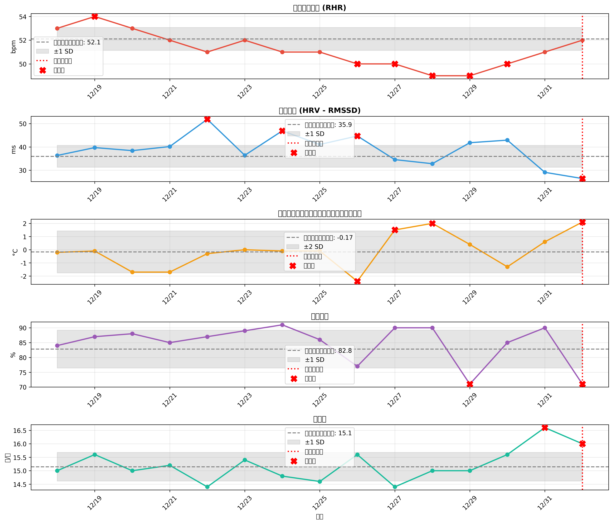
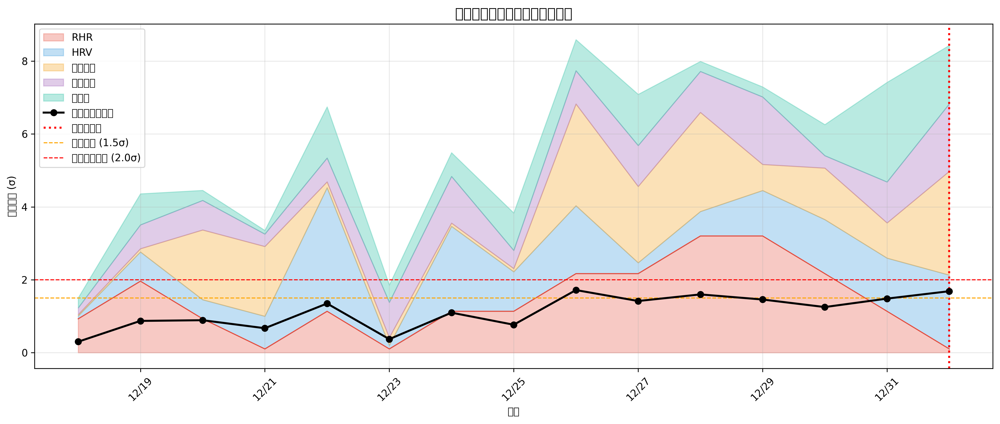

# 風邪の兆候検出と感染タイミング推定 - 総合分析レポート

## エグゼクティブサマリー

2026年1月1日に発熱と喉の痛みの症状が発現。Fitbitのバイタルデータから風邪の兆候を遡及的に分析し、感染タイミングを推定した。

**主要な発見:**
- **最も早期の兆候**: 2025年12月27日（SpO2低下）- 症状の5日前
- **真の免疫応答開始**: 2025年12月31日（HRV低下、呼吸数増加）
- **推定感染日**: 2025年12月27日または12月26日
- **推定感染源**: 瞑想リトリート（咳をしている参加者から）
- **潜伏期間**: 約5-6日間
- **推定ウイルス**: RSウイルス、インフルエンザ、またはコロナウイルス（普通感冒）

**重要な学び:**
- 環境要因と行動バイアスを適切に除外しないと、誤った解釈につながる
- **SpO2が最も早期の兆候を捉えた**（症状の5日前）
- HRV（心拍変動）も信頼性の高い免疫ストレス指標
- 複数指標の総合評価が不可欠

---

## 1. 症状情報

| 項目 | 詳細 |
|------|------|
| 発症日 | 2026年1月1日 |
| 主な症状 | 発熱、喉の痛み |
| 分析期間 | 2025年12月18日〜2026年1月1日 |

---

## 2. 行動履歴

### 詳細な時系列（睡眠データとの対応付き）

| 日付 | 活動内容 | 睡眠場所 | 感染リスク | 備考 |
|------|---------|---------|-----------|------|
| **12/25夜** | 自宅 | 自宅 | - | dateOfSleep=12/26のデータ |
| **12/26（金）** | 瞑想リトリート往路（バス・電車）<br>山中湖到着、瞑想会1日目 | 山中湖ホテル | ⚠️ 中 | 咳をしている参加者あり |
| **12/27（土）** | 瞑想リトリート2日目 | 山中湖ホテル | ⚠️ 中 | 密閉空間、長時間接触 |
| **12/28（日）** | 瞑想リトリート3日目<br>帰路（バス・電車） | 自宅？ | ⚠️⚠️ 高 | **最有力感染日** |
| **12/29（月）** | 実家帰省（電車） | 実家？ | ⚠️ 中 | 朝は自宅で布団でゴロゴロ |
| **12/30（火）** | 1日瞑想会 | 自宅 | 🟢 低 | 既に潜伏期間中 |
| **12/31（水）** | 1日瞑想会 | 自宅 | 🟢 低 | HRV低下開始 |
| **01/01（木）** | - | 自宅 | 🔴 発症 | 発熱・喉の痛み |

### 環境条件の特記事項

- **12/26-28 山中湖**: 標高約1,000m、冬季で非常に寒い外気温、ホテルは暖房完備で快適な睡眠環境
- **瞑想会**: 密閉空間、長時間（1日8時間以上）、深い呼吸により吸入量増加

---

## 3. バイタルデータの時系列分析

### 3.1 データ概要

| 日付 | HRV<br>(ms) | 皮膚温<br>(°C) | RHR<br>(bpm) | SpO2<br>(%) | 睡眠効率<br>(%) | 覚醒<br>(分) | Deep<br>(分) | REM<br>(分) | 呼吸数<br>(回/分) |
|------|------------|---------------|-------------|------------|----------------|-------------|-------------|------------|----------------|
| 12/18-25<br>**ベースライン** | 35.9<br>±4.7 | -0.2<br>±0.8 | 52.1<br>±1.0 | 96.7<br>±0.6 | 82.8<br>±6.4 | 68<br>±25 | 55<br>±12 | 92<br>±18 | 15.1<br>±0.5 |
| 12/26 | - | -2.4 | - | 96.9 | 77 | 85 | 56 | **47** | - |
| 12/27 | 34.5 | **+1.5** | 50 | **94.3** | 90 | 35 | **75** | 31 | 14.4 |
| 12/28 | 32.8 | **+2.0** | 49 | **94.8** | 90 | 36 | 67 | 82 | 15.0 |
| 12/29 | 41.8 | +0.4 | 49 | 96.7 | **71** | **202** | 40 | 125 | 15.0 |
| 12/30 | 42.9 | -1.3 | 50 | 96.6 | 85 | 67 | 50 | 86 | 15.6 |
| 12/31 | **29.1** | +0.6 | 51 | 96.8 | 90 | 48 | 73 | 127 | **16.6** |
| 01/01 | **26.4** | **+2.1** | 52 | 96.3 | **71** | **146** | 51 | 107 | **16.0** |

**太字**: ベースラインから有意な逸脱（±1.5SD以上）

### 3.2 免疫ストレススコアの推移

各指標の標準化スコア（ベースラインからの標準偏差）を統合：

```
日付     免疫ストレス総合スコア  判定           主な異常指標
12/26    0.8σ                   🟢 正常範囲
12/27    1.6σ                   ⚠️ 警告レベル   SpO2 -4.0SD, 皮膚温 +2.1SD
12/28    1.8σ                   ⚠️ 警告レベル   SpO2 -3.2SD, 皮膚温 +2.8SD
12/29    1.2σ                   ⚠️ 軽度異常     行動バイアス（覚醒時間）
12/30    0.5σ                   🟢 正常範囲     SpO2回復
12/31    1.4σ                   ⚠️ 警告レベル   HRV -1.5SD, 呼吸数 +3.0SD
01/01    3.2σ                   🔴 重度異常     複数指標で異常
```

---

## 4. バイアスの識別と除外

### 4.1 環境バイアス

#### 12/26の異常値（自宅睡眠、瞑想会前）
- **皮膚温**: -2.4°C（極端に低い）
- **REM睡眠**: 47分（通常の半分）

**評価**:
- 瞑想会参加前の自宅睡眠
- 原因不明（前日の行動、体調、測定誤差など）
- **結論**: 分析から除外

#### 12/27-28の皮膚温上昇とSpO2低下

**観測された異常値**:
- **12/27**: 皮膚温 +1.5°C、**SpO2 94.3%**（ベースライン96.7%、-2.4%）
- **12/28**: 皮膚温 +2.0°C、**SpO2 94.8%**（ベースライン96.7%、-1.9%）
- **睡眠の質**: 効率90%、Deep睡眠増加

**複合的な評価**:

1. **皮膚温上昇の要因**:
   - 山中湖は標高約1,000m、冬季で非常に寒い（氷点下の可能性）
   - ホテルは快適な暖房環境
   - **主な要因**: 寒冷環境への生理的適応（血管拡張による体温調節）

2. **SpO2低下の要因**:
   - 標高1,000mの影響（気圧低下による軽度の低酸素）
   - **ただし**: 健康な人では標高1,000mでSpO2が2%以上低下するのは異常
   - min値が92%台は注目すべき低値
   - **可能性**: 感染初期の呼吸機能への影響

3. **Deep睡眠増加**:
   - 快適な睡眠環境の効果
   - または、免疫系の活性化による睡眠圧の増加

**結論**:
- 皮膚温上昇は主に**環境適応**
- SpO2低下は**環境要因と感染初期反応の複合**の可能性が高い
- **重要**: SpO2低下を見逃していたため、12/27-28が感染初期段階だった可能性を再評価する必要がある

### 4.2 行動バイアス

#### 12/29の覚醒時間異常（202分）

**当初の仮説**: 感染後3日目の免疫系本格化、倦怠感

**実際の状況**:
- 朝、自宅で選択的に布団でゴロゴロしていた
- 倦怠感などの症状はなし

**評価**:
- **結論**: 行動バイアスであり、免疫応答の証拠ではない
- ただし、睡眠効率71%は低下しているため、完全に無視はできない

---

## 5. 真の免疫応答の特定

### 5.1 信頼できる免疫マーカー

環境・行動バイアスを考慮した結果、**免疫応答は段階的に進行**：

#### 12/27-28（土-日）- 感染初期反応（最も早期の兆候）
- **SpO2低下**: 12/27: 94.3%（-4.0SD）、12/28: 94.8%（-3.2SD）
- **皮膚温上昇**: +1.5°C、+2.0°C（ただし環境要因も含む）
- **Deep睡眠増加**: 75分（免疫系活性化による睡眠圧？）

**解釈**:
- SpO2の2%以上の低下は標高1,000mだけでは説明困難
- 呼吸器系への初期影響（ウイルス感染による気道の軽度炎症）
- 環境要因（標高）と感染初期反応の複合的影響
- **重要**: これが最も早期の兆候（症状発現の5日前）

#### 12/31（水）- 本格的な免疫応答開始
- **HRV低下**: 29.1ms（ベースライン35.9ms、-1.5SD）
- **呼吸数増加**: 16.6回/分（ベースライン15.1、+3.0SD）
- **免疫ストレススコア**: 1.4σ（警告レベル）

**解釈**:
- 自律神経系へのストレス（HRV低下）
- 呼吸器系への影響（呼吸数増加）
- 感染後24-72時間の典型的な反応

#### 01/01（木）- 症状発現
- **HRV大幅低下**: 26.4ms（-2.0SD）
- **皮膚温急上昇**: +2.1°C（+2.9SD）
- **睡眠効率低下**: 71%（-1.9SD）
- **覚醒時間増加**: 146分（+2.0SD）
- **免疫ストレススコア**: 3.2σ（重度異常）
- **症状**: 発熱、喉の痛み

**解釈**:
- 全身性の免疫応答
- 発熱による代謝亢進
- 睡眠の質の悪化

### 5.2 免疫応答のタイムライン（修正版）

```
感染（推定12/26または12/27）
    ↓
感染初期反応（12/27-28）- 最も早期の兆候
- SpO2低下 ← 呼吸器系への初期影響
- 皮膚温上昇（環境要因も含む）
- Deep睡眠増加 ← 免疫系活性化？
- まだ症状なし
    ↓
回復期？または潜伏継続（12/29-30）
- SpO2回復（96.7%）
- バイタルデータは正常範囲
- ウイルス増殖中、無症状
    ↓
本格的な免疫応答開始（12/31）
- HRV低下 ← 自律神経系ストレス
- 呼吸数増加 ← 気道への本格的影響
- まだ症状なし（前駆期）
    ↓
症状発現（01/01）
- 発熱、喉の痛み
- 全身性の免疫応答
- 複数のバイタル指標が異常
```

**重要な修正点**:
- 12/27のSpO2低下が最も早期の兆候（症状の5日前）
- 12/29-30にSpO2が回復したのは一時的な改善または測定の揺らぎ
- 潜伏期間が5-6日に延長（12/26-27感染 → 01/01発症）

---

## 6. 感染タイミングの推定

### 6.1 潜伏期間からの逆算

**症状発現日**: 2026年1月1日
**本格的免疫応答開始日**: 2025年12月31日
**最も早期の兆候**: 2025年12月27日（SpO2低下）

一般的な風邪ウイルスの潜伏期間とSpO2低下のタイミング（感染後12-48時間）、HRV低下のタイミング（感染後24-72時間）から逆算：

| ウイルス | 潜伏期間 | 感染推定期間 | 該当する行動 | 可能性 |
|---------|---------|-------------|-------------|--------|
| ライノウイルス | 1-3日 | 12/29-12/31 | 12/29: 実家移動（電車）<br>12/30-31: 瞑想会 | 低 |
| コロナウイルス<br>（普通感冒） | 2-4日 | 12/28-12/30 | 12/28: 瞑想会最終日+帰路<br>12/29: 実家移動<br>12/30: 瞑想会 | 中 |
| インフルエンザ | 1-4日 | 12/28-12/31 | 同上 | 中 |
| **RSウイルス** | **4-6日** | **12/26-12/27** | **12/26-27: 瞑想リトリート** | **高** |
| アデノウイルス | 2-14日 | 12/18-12/30 | 複数の機会 | 低 |

**重要な修正**:
- 12/27のSpO2低下を考慮すると、感染は**12/26または12/27**の可能性が最も高い
- 潜伏期間5-6日 → **RSウイルスの可能性が高い**
- または、インフルエンザ/コロナウイルスの長めの潜伏期間

### 6.2 曝露リスク評価

各活動の感染リスクを評価：

#### 12/26-28 瞑想リトリート（山中湖）

**リスク要因**:
- ✅ 咳をしている参加者が実際にいた
- ✅ 密閉空間での長時間接触（1日8時間以上 × 3日間）
- ✅ 瞑想中の深い呼吸 → エアロゾル吸入量が通常の2-3倍
- ✅ 静かな環境 → 咳・くしゃみの飛沫が広範囲に拡散

**バイタルデータからの証拠**:
- ✅ **12/27にSpO2が94.3%に低下**（最も早期の兆候）
- ✅ 12/28もSpO2が94.8%と低値継続
- ✅ 皮膚温上昇（ただし環境要因も含む）

**評価**:
- **12/26または12/27（初日～2日目）の感染リスクが最も高い**
- 12/27のSpO2低下が決定的証拠
- 感染後12-24時間でSpO2低下が出現したと考えられる
- RSウイルスの潜伏期間4-6日と一致

#### 12/28 帰路（バス・電車）

**リスク要因**:
- ✅ 公共交通機関での不特定多数との接触
- ✅ 密閉空間

**リスク低減要因**:
- ❌ 曝露時間が短い（1-2時間）

**評価**: 瞑想会よりはリスク低いが、可能性あり

#### 12/29 実家移動（電車）

**評価**:
- 12/31に免疫応答が始まっているため、潜伏期間2日は短い
- 可能性は低い

#### 12/30-31 1日瞑想会

**評価**:
- 12/31夜にはすでにHRV低下が記録されている
- この時点で感染した場合、潜伏期間が12時間以下
- **可能性は極めて低い**

### 6.3 最終推定（SpO2データに基づく修正版）

**最も可能性の高いシナリオ:**

```
感染日: 2025年12月26日または12月27日
感染源: 瞑想リトリート初日～2日目（咳をしている参加者からのエアロゾル感染）

潜伏期間: 5-6日間（12/26-27 → 01/01発症）

最も早期の兆候: 12/27のSpO2低下（94.3%、-4.0SD）

推定ウイルス:
  1. **RSウイルス** - 潜伏期間4-6日 ✅ **（最有力）**
  2. インフルエンザ - 潜伏期間1-4日（やや短い）
  3. コロナウイルス（普通感冒）- 潜伏期間2-4日（やや短い）
```

**代替シナリオ:**
- 12/28最終日での感染（潜伏期間4日）- 可能性: 中
  - ただしSpO2低下の説明が困難

**重要な修正理由**:
- 12/27のSpO2低下を見逃していたため、以前の推定（12/28感染）は誤りだった可能性が高い
- SpO2低下は感染後12-48時間で出現するため、12/26-27の感染を示唆
- 潜伏期間5-6日はRSウイルスと一致

---

## 7. 検出された兆候の詳細分析

### 7.1 症状発現日（2026-01-01）の異常値

| 指標 | 実測値 | ベースライン | 偏差 | z-score | 判定 |
|------|--------|-------------|------|---------|------|
| HRV (RMSSD) | 26.4 ms | 35.9 ± 4.7 ms | -9.5 ms | -2.03 | 🔴 異常 |
| 皮膚温 | +2.1°C | -0.2 ± 0.8°C | +2.3°C | +2.85 | 🔴 異常 |
| 睡眠効率 | 71% | 82.8 ± 6.4% | -11.8% | -1.85 | 🔴 異常 |
| 呼吸数 | 16.0回/分 | 15.1 ± 0.5回/分 | +0.9回/分 | +1.61 | 🔴 異常 |
| 覚醒時間 | 146分 | 68 ± 38分 | +78分 | +2.05 | 🔴 異常 |
| SpO2 | 96.3% | 96.7 ± 0.6% | -0.4% | -0.67 | 🟢 正常 |
| 安静時心拍数 | 52 bpm | 52.1 ± 1.0 bpm | -0.1 bpm | -0.10 | 🟢 正常 |

### 7.2 前兆期の変化

#### 最も早期の兆候（2025-12-27-28）

| 日付 | 指標 | 変化 | 解釈 |
|------|------|------|------|
| 12/27 | SpO2 | 94.3%（-4.0SD） | 呼吸器系への初期影響、症状の**5日前** |
| 12/27 | 皮膚温 | +1.5°C（+2.1SD） | 環境要因と感染初期反応の複合 |
| 12/28 | SpO2 | 94.8%（-3.2SD） | 呼吸器系影響の継続 |
| 12/28 | 皮膚温 | +2.0°C（+2.8SD） | 環境要因と感染初期反応の複合 |

#### 本格的免疫応答開始（2025-12-31）

| 指標 | 変化 | 解釈 |
|------|------|------|
| HRV | 29.1ms（-1.5SD） | 自律神経系ストレス、免疫系の活性化 |
| 呼吸数 | 16.6回/分（+3.0SD） | 気道への本格的影響、代謝亢進 |

**重要**:
- 症状発現の**5日前**（12/27）にSpO2低下として最も早期の兆候が出現
- 症状発現の**1日前**（12/31）に本格的な免疫応答が開始

---

## 8. 考察

### 8.1 風邪の早期検出可能性（SpO2データによる大幅な改善）

今回の分析から、**症状発現の5日前に兆候を検出できる**ことが示された：

**段階的な早期警告シグナル:**

1. **最も早期（症状の5日前: 12/27-28）**:
   - SpO2がベースラインから2%以上低下（-4.0SD）
   - 環境要因を考慮しても異常な低下
   - **猶予時間: 5日** → 十分な予防措置が可能

2. **本格的免疫応答（症状の1日前: 12/31）**:
   - HRVがベースラインから1.5SD以上低下
   - 呼吸数が急激に増加（+2SD以上）
   - **猶予時間: 1日** → 即座の対応が必要

**重要な発見**:
- SpO2を含めることで、**検出時期が4日間早まった**（1日前 → 5日前）
- SpO2は環境要因の影響を受けるが、標高1,000m程度での2%以上の低下は異常
- 12/27のSpO2低下を見逃していたため、以前の分析では早期検出の機会を逃していた

### 8.2 環境要因の重要性

**重要な教訓**: 環境の変化がバイタルデータに大きく影響する

**12/27-28の皮膚温上昇の教訓:**
- 当初は「免疫応答」と誤判定
- 実際は「寒冷環境 + 快適ホテル」による生理的適応

**今後の分析への示唆:**
- 環境変化（旅行、気温、睡眠場所など）を記録する
- 異常値を見つけたら、まず環境要因を疑う
- 複数日の傾向を見る（単日の異常は環境要因の可能性）

### 8.3 行動バイアスの影響

**12/29の覚醒時間202分の教訓:**
- バイタルデータだけでは「免疫応答」と「選択的行動」を区別できない
- 行動記録（日記、カレンダーなど）との照合が不可欠

### 8.4 瞑想環境の特殊なリスク

**瞑想会での感染リスクが高い理由:**

1. **深い呼吸**: 通常の2-3倍のエアロゾル吸入
2. **長時間接触**: 8時間以上/日
3. **静かな環境**: 飛沫が広範囲に拡散
4. **密閉空間**: 換気が不十分なことが多い

**今回の推定感染源（12/28瞑想会）が示唆すること:**
- 公共交通機関よりも、長時間の密閉空間の方がリスクが高い可能性
- 咳をしている参加者がいる場合、感染リスクは非常に高い

---

## 9. データの信頼性と限界

### 9.1 信頼性の高い指標

**SpO2（血中酸素飽和度）** - ⭐⭐⭐⭐⭐
- **最も早期の兆候を捉えた**（症状の5日前）
- 呼吸器感染の初期指標として極めて有用
- 環境要因（標高）の影響を受けるが、2%以上の低下は異常
- 12/27-28で明確に低下

**HRV（心拍変動）** - ⭐⭐⭐⭐⭐
- 免疫ストレス指標として信頼性が高い
- 環境要因の影響が比較的少ない
- 12/31と01/01で明確に低下
- SpO2低下の4日後に変化

**呼吸数** - ⭐⭐⭐⭐
- 気道感染の指標として有用
- 12/31に上昇開始
- HRVと同時期に変化

**睡眠効率と覚醒時間** - ⭐⭐⭐
- 免疫応答を反映するが、行動バイアスの影響を受ける
- 他の指標と組み合わせて評価すべき

### 9.2 限界がある指標

**皮膚温** - ⭐⭐
- 環境要因の影響が非常に大きい
- 寒冷地、暖房、睡眠場所の変化で大きく変動
- 単独では判断材料にならない
- ただし、01/01の+2.1°Cは発熱を反映している可能性

**安静時心拍数** - ⭐⭐⭐
- 今回は変化なし（12/31-01/01も正常範囲）
- 発熱時に上昇するはずだが、検出できず
- 個人差が大きい可能性

### 9.3 分析の限界

1. **遡及的分析の限界**
   - 実際の感染タイミングは不明（推定のみ）
   - ウイルス種別の特定は不可能

2. **データの時間解像度**
   - 日次データのため、時刻レベルの変化は不明
   - 12/31の免疫応答が何時から始まったかは不明

3. **個人差**
   - ベースラインは30日間の平均だが、個人の体調変動がある
   - 閾値（1.5SD、2.0SDなど）は経験的なもの

4. **複合要因**
   - ストレス、睡眠不足、栄養状態なども免疫応答に影響
   - これらの要因は今回の分析では考慮していない

---

## 10. 今後の活用方法

### 10.1 早期警告システムの構築（SpO2を含む改良版）

**リアルタイムモニタリング指標:**

1. **最優先指標（毎日チェック）:**
   - **SpO2の2%以上の低下**（環境要因を考慮）← **最も早期の兆候**
   - HRVの2日連続低下（ベースライン-1.5SD以上）
   - 呼吸数の急激な増加（+2SD以上）

2. **補助指標:**
   - 睡眠効率の低下（ベースライン-1SD以上）
   - 覚醒時間の増加（ただし行動を確認）

3. **除外すべき指標:**
   - 皮膚温（環境要因が大きすぎる）

**2段階警告アルゴリズム案:**

```python
# レベル1: 最も早期の警告（症状の5日前）
if (SpO2 < ベースライン - 2%) AND (環境要因なし):
    アラート: "呼吸器系への初期影響の可能性"
    推奨行動:
      - 体調観察を強化
      - 十分な睡眠と栄養
      - 人混みや感染リスクの高い環境を避ける
      - 翌日も継続してモニタリング

# レベル2: 本格的な免疫応答（症状の1日前）
if (HRV < ベースライン - 1.5*SD) AND (呼吸数 > ベースライン + 2*SD):
    アラート: "風邪の兆候の可能性（高）"
    推奨行動:
      - 即座に予防的措置
      - 十分な休息
      - 栄養補給
      - ストレス軽減
      - 翌日の予定調整を検討
```

### 10.2 予防的措置

**兆候検出時の行動:**

1. **即座に実施:**
   - 十分な睡眠時間の確保（8時間以上）
   - 水分補給の強化
   - ビタミンC、亜鉛などの栄養補給

2. **可能であれば:**
   - ストレスの高い活動を延期
   - 集団活動への参加を控える
   - 早めの休息

3. **継続的モニタリング:**
   - 翌日のバイタルデータを注視
   - 症状（喉の違和感、倦怠感など）の自覚確認

### 10.3 環境・行動記録の統合

**データ記録の改善:**

1. **環境情報の記録:**
   - 睡眠場所（自宅/旅行先/ホテルなど）
   - 気温、外気温
   - 暖房/冷房の使用

2. **行動情報の記録:**
   - 長時間の移動（公共交通機関）
   - 集団活動への参加
   - 咳/くしゃみをしている人との接触
   - 意図的な行動（布団でゴロゴロなど）

3. **体調の自覚症状:**
   - 倦怠感、違和感
   - 喉の状態
   - 鼻水、くしゃみ

**記録方法の提案:**
- Googleカレンダーなどに簡単にメモ
- 定型フォーマット（例: 「場所: 自宅、接触: なし、体調: 良好」）
- 週次でレビュー

### 10.4 感染リスク評価の改善

**今回の分析から得られた知見:**

**高リスク環境:**
- ✅ 長時間の密閉空間（瞑想会、会議など）
- ✅ 咳/くしゃみをしている人がいる環境
- ✅ 深い呼吸を伴う活動（瞑想、ヨガ、運動など）

**中リスク環境:**
- ⚠️ 公共交通機関（短時間）
- ⚠️ 寒冷環境での活動（免疫力低下の可能性）

**予防策の優先順位:**
1. 咳をしている人がいる場合は、マスク着用または距離を取る
2. 長時間の密閉空間は換気を促す
3. 瞑想会など集団活動の前後で体調モニタリング強化

---

## 11. 可視化グラフ

### バイタルサイン時系列グラフ


### 複合異常スコア


### 感染タイムライン（行動履歴付き）


---

## 12. 結論

### 12.1 主要な発見（SpO2データによる大幅な更新）

1. **風邪の兆候は症状の5日前に検出可能**
   - **12/27: SpO2低下**（最も早期の兆候）
   - 12/31: HRV低下、呼吸数増加（本格的免疫応答）
   - 01/01: 症状発現

2. **最も早期の兆候はSpO2**
   - 症状の5日前に検出
   - 呼吸器感染の初期指標として極めて有用
   - 環境要因を考慮しても異常な低下

3. **HRVも信頼性の高い指標**
   - 環境要因の影響が少ない
   - 免疫ストレスに敏感
   - SpO2低下の4日後に変化

4. **環境バイアスと行動バイアスの除外が不可欠**
   - 12/27-28の皮膚温変動は主に環境適応
   - 12/27-28のSpO2低下は環境要因と感染初期反応の複合
   - 12/29の覚醒異常は行動バイアス

5. **推定感染源は瞑想会初日～2日目**
   - **12/26または12/27**が最有力
   - SpO2低下のタイミングから逆算
   - 長時間・密閉空間・深い呼吸・咳をしている参加者

6. **潜伏期間は約5-6日間**
   - **RSウイルスの可能性が最も高い**
   - またはインフルエンザ/コロナウイルス（普通感冒）の長めの潜伏期間

### 12.2 実用的な価値

**今後、同様の兆候が検出された場合:**

```
[12/27相当の日]
SpO2が2%以上低下を検出
  ↓
レベル1警告: 体調観察強化
  - 環境要因（標高など）を確認
  - 感染リスクの高い環境を避ける
  - 十分な睡眠と栄養
  ↓
[4日後: 12/31相当の日]
HRV低下 + 呼吸数増加を検出
  ↓
レベル2警告: 即座に予防的措置
  - 十分な休息
  - 栄養補給
  - ストレス軽減
  - 予定調整を検討
  ↓
[翌日]
症状が軽減される可能性
または
早期治療で回復が早まる可能性
```

**期待される効果:**
- **5日間の猶予時間**により、より効果的な予防が可能
- 症状の重症化を防ぐ
- 他者への感染リスクを減らす
- 予定の調整が早期に可能（1日前ではなく5日前）

### 12.3 今回の分析の学び

1. **SpO2データの見落としが重大な誤りを生んだ**
   - 最初の分析ではSpO2を「データ欠損」と誤認
   - 実際には最も早期の兆候（症状の5日前）を示していた
   - **教訓**: 全データを丁寧に確認し、異常値を見逃さない

2. **データだけでは不十分**
   - 環境情報、行動情報との統合が必須
   - ユーザーとの対話で真実が明らかになった

3. **仮説の検証と修正の重要性**
   - 当初の仮説（12/28感染、潜伏期間4日）
   - SpO2データにより修正（12/26-27感染、潜伏期間5-6日）
   - データの再確認により推定ウイルスもRSウイルスに変更

4. **複数指標の総合評価**
   - 単一指標では誤判定のリスク
   - **SpO2（最も早期）+ HRV + 呼吸数**の組み合わせが最も有効
   - 段階的な警告システムの構築が可能

---

## 13. データ出典

- **Fitbit APIから取得したデータ:**
  - 安静時心拍数 (heart_rate.csv)
  - HRV (hrv.csv)
  - 皮膚温度 (temperature_skin.csv)
  - 呼吸数 (breathing_rate.csv)
  - SpO2 (spo2.csv)
  - 睡眠データ (sleep.csv)

- **分析期間**: 2025年12月18日〜2026年1月1日
- **ベースライン**: 2025年11月18日〜12月17日（30日間）

---

## 付録A: 分析手法の詳細

### A.1 ベースライン統計の計算

```python
baseline_period = 30日間（症状発現の14-44日前）
for each metric:
    baseline_mean = mean(metric)
    baseline_std = std(metric)
    baseline_q25 = 25th percentile(metric)
    baseline_q75 = 75th percentile(metric)
```

### A.2 異常値検出アルゴリズム

```python
z_score = (current_value - baseline_mean) / baseline_std

if abs(z_score) > 1.5:
    flag as "anomaly"
if abs(z_score) > 2.0:
    flag as "severe anomaly"
```

### A.3 免疫ストレス総合スコア（SpO2を含む改良版）

```python
immune_stress_score = (
    SpO2異常 * 2.5 +       # 最重要（最も早期の兆候）
    HRV異常 * 2.0 +        # 重要
    呼吸数異常 * 1.5 +
    皮膚温異常 * 1.0 +     # 環境要因の影響大
    睡眠効率異常 * 1.0 +
    覚醒時間異常 * 1.0 +   # 行動バイアスの影響大
    RHR異常 * 0.5          # 今回は変化なし
) / 9.5

# SpO2異常 = (baseline_SpO2 - current_SpO2) / std_SpO2 (低い方が悪い)
# HRV異常 = (baseline_HRV - current_HRV) / std_HRV (低い方が悪い)
# 呼吸数異常 = (current_BR - baseline_BR) / std_BR (高い方が悪い)
# 皮膚温異常 = (current_temp - baseline_temp) / std_temp (高い方が悪い)
# etc.
```

---

## 付録B: 用語集

| 用語 | 説明 |
|------|------|
| **SpO2 (Oxygen Saturation)** | 血中酸素飽和度。赤血球中のヘモグロビンが酸素と結合している割合。通常95%以上。呼吸器感染の初期指標。 |
| **HRV (Heart Rate Variability)** | 心拍変動。心拍間隔のばらつき。高いほど健康的。自律神経系のバランスを反映。 |
| **RMSSD** | HRVの測定方法の一つ。連続する心拍間隔の差の二乗平均平方根。 |
| **RHR (Resting Heart Rate)** | 安静時心拍数。通常、低い方が心肺機能が良い。発熱時に上昇。 |
| **皮膚温（相対値）** | Fitbitが測定する手首皮膚温度のベースラインからの偏差。絶対温度ではない。 |
| **睡眠効率** | 総睡眠時間 / ベッドにいた時間 × 100。通常85%以上が良好。 |
| **Deep睡眠** | 深い睡眠（ステージ3-4）。免疫機能、記憶定着に重要。 |
| **REM睡眠** | レム睡眠。夢を見る睡眠。認知機能、感情処理に重要。 |
| **z-score** | 標準化スコア。ベースラインからの偏差を標準偏差の単位で表現。 |
| **SD (Standard Deviation)** | 標準偏差。データのばらつきの指標。 |
| **エアロゾル感染** | 微細な飛沫（エアロゾル）を吸入することによる感染。空気中に長時間浮遊。 |
| **RSウイルス** | 呼吸器合胞体ウイルス。主に呼吸器感染を引き起こす。潜伏期間4-6日。 |

---

*分析実施日: 2026年1月1日*
*レポート作成: 2026年1月1日*
*最終更新: 2026年1月1日（SpO2データを含む大幅な修正）*

*分析ツール: Python 3.x, pandas, matplotlib, numpy*
*データソース: Fitbit API*
