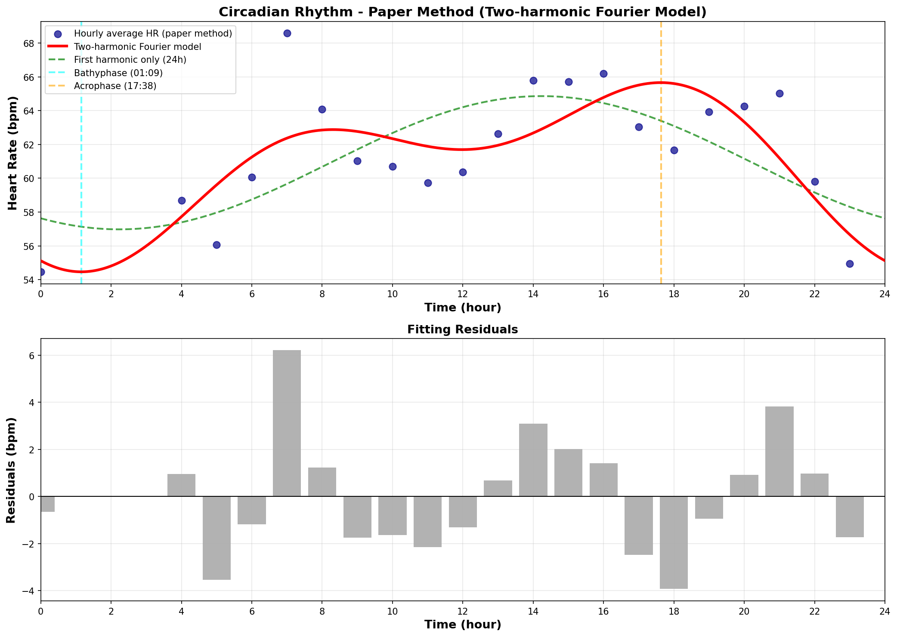

# サーカディアンリズム分析 - 論文手法完全準拠版

**分析日**: 2026-01-07
**データ期間**: 2025-12-09 ~ 2026-01-07（30日間）
**分析手法**: 2調和フーリエモデル（論文完全準拠）

---

## 適用した条件（論文準拠）

1. ✅ activity_logsの運動時間を除外
2. ✅ 歩数0の時間帯のみ（現在・前の1分間にステップなし）
3. ✅ 睡眠中のデータを除外
4. ✅ 30日間のデータから1時間ごとの平均を計算
5. ✅ 2調和フーリエモデルでフィッティング

**参考論文**: Natarajan et al., "Circadian rhythm of heart rate and activity: A cross-sectional study",
Chronobiology International, 42:1, 108-121 (2025)

---

## サーカディアンパラメータ

| パラメータ | あなた | 論文の期待値 | 評価 |
|-----------|--------|------------|------|
| **μ（24時間平均HR）** | 60.92 bpm | - | - |
| **A₁（第1調和の振幅）** | 3.94 bpm | - | 24時間周期 |
| **A₂（第2調和の振幅）** | 2.72 bpm | - | 12時間周期 |
| **A_CR（サーカディアン振幅）** | **4.79 bpm** | 5-10 bpm | 範囲外 |
| **Bathyphase** | **01:09** | 起床の1-3時間前 | - |
| **Acrophase** | **17:38** | 就寝の3-9時間前 | - |
| **R²（決定係数）** | **0.557** | ≥ 0.95 | 要検討 |
| **A₂/A₁ 比率** | 0.691 | 0.31-0.34 | 正常 |
| **第1調和の寄与率** | 50.1% | 約85% | ⚠️ 低い |

---

## 詳細パラメータ

### 基本パラメータ

- **μ（24時間平均心拍数）**: 60.92 bpm
- **A₁（第1調和の振幅、24時間周期）**: -3.94 bpm
- **φ₁（第1調和の位相）**: 0.986 rad
- **A₂（第2調和の振幅、12時間周期）**: 2.72 bpm
- **φ₂（第2調和の位相）**: -1.971 rad

### 導出パラメータ

**A_CR（サーカディアン振幅）**: 4.79 bpm

計算式: √(A₁² + A₂²) = √(-3.94² + 2.72²)

これは1日の中での心拍数の変動幅を表します。
- 論文データ: 男性21-30歳 7.6±2.8 bpm、女性 6.2±2.5 bpm
- あなた: 4.79 bpm (範囲外)

**Bathyphase（心拍数最低時刻）**: 01:09

深い睡眠の時間帯。論文では通常、起床の1-3時間前（中央値: 2.32時間前）です。

**Acrophase（心拍数最高時刻）**: 17:38

1日で最も活動的な時間帯。論文では通常、就寝の3-9時間前（中央値: 5.86時間前）です。

---

## モデルの精度

**決定係数（R²）**: 0.557

モデルは心拍数変動の **55.7%** を説明しています。

- R² ≥ 0.95: 非常に良好（論文の期待値）
- R² ≥ 0.85: 良好
- R² < 0.85: 要検討

**第1調和の寄与率**: 50.1%

24時間周期の成分がどれだけ支配的かを示します。
- 論文では約85%の人が第1調和で説明される
- あなた: 50.1% (低め - より複雑なリズム)

**第2調和の寄与率**: 49.9%

12時間周期の成分が波形の非対称性を補正します。

---

## ウルトラディアンリズム

**A₂/A₁ 比率**: -0.691

この値は12時間周期の成分の強さを示します。

- A₂/A₁ < 0.4: 24時間周期が支配的（正常）
- A₂/A₁ > 1.0: 12時間周期が支配的（ウルトラディアンリズム）

論文では、50%の人で A₂/A₁ > 0.31（男性）または > 0.34（女性）です。

---

## データ品質

- **有効な時間帯**: 21/24時間
- **フィルタリング条件**: 論文と同じ
  - 運動時間除外
  - 歩数0（現在・前1分間）
  - 睡眠中除外

---

## 可視化

**グラフの見方**:
- **青い点**: 30日間の各時間帯の平均心拍数
- **赤い線**: 2調和フーリエモデルのフィッティング曲線
- **緑の破線**: 第1調和のみ（24時間周期のみ）
- **シアン破線**: Bathyphase（心拍数最低時刻）
- **オレンジ破線**: Acrophase（心拍数最高時刻）

---

## 1時間ごとのデータ

| 時刻 | 心拍数 (bpm) |
|------|-------------|
| 00:00 | 54.5 |
| 01:00 | nan |
| 02:00 | nan |
| 03:00 | nan |
| 04:00 | 58.7 |
| 05:00 | 56.1 |
| 06:00 | 60.1 |
| 07:00 | 68.6 |
| 08:00 | 64.1 |
| 09:00 | 61.0 |
| 10:00 | 60.7 |
| 11:00 | 59.7 |
| 12:00 | 60.4 |
| 13:00 | 62.6 |
| 14:00 | 65.8 |
| 15:00 | 65.7 |
| 16:00 | 66.2 |
| 17:00 | 63.0 |
| 18:00 | 61.7 |
| 19:00 | 63.9 |
| 20:00 | 64.2 |
| 21:00 | 65.0 |
| 22:00 | 59.8 |
| 23:00 | 54.9 |

---

## 参考文献

- Natarajan et al., "Circadian rhythm of heart rate and activity: A cross-sectional study",
  Chronobiology International, 42:1, 108-121 (2025)
  [PubMed](https://pubmed.ncbi.nlm.nih.gov/39807770/)

---

**生成日時**: 2026-01-07
**分析ツール**: dailybuild サーカディアンリズム分析モジュール（論文手法完全準拠版）
