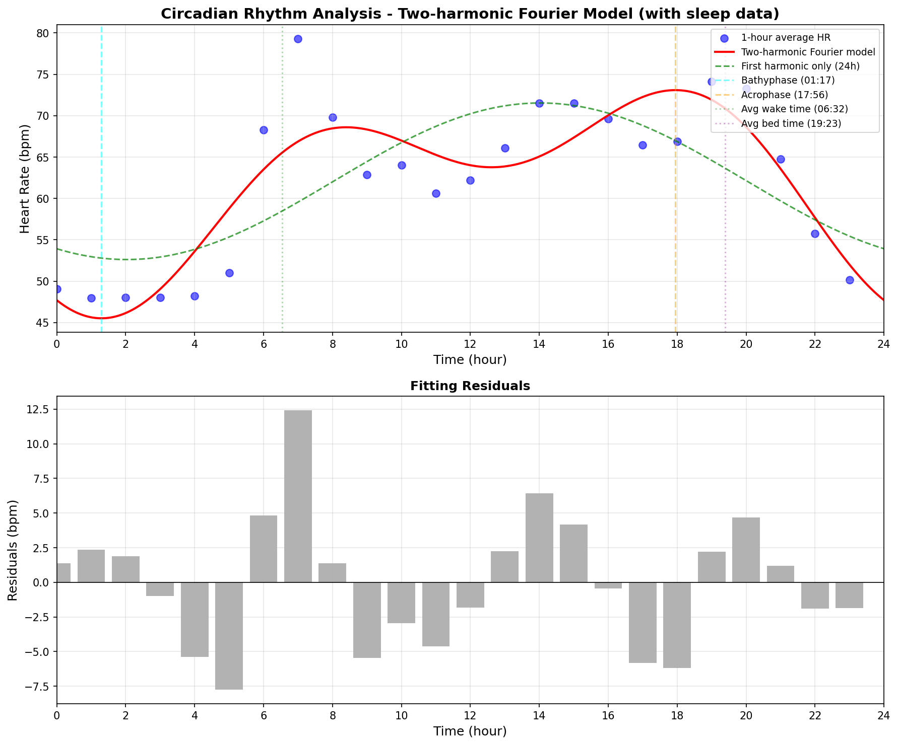

# サーカディアンリズム分析レポート（睡眠中データ含む）

**分析日**: 2026-01-07
**データ期間**: 2025-12-09 ~ 2026-01-07（30日間）
**分析手法**: 2調和フーリエモデル（論文: Circadian rhythm of heart rate and activity, 2025）
**注**: 睡眠中のデータも含めて分析しています

---

## サマリー

| 指標 | 値 | 評価 | 参考値（論文） |
|------|-----|------|---------------|
| **サーカディアン振幅（A_CR）** | **11.96 bpm** | 要確認 | 5-10 bpm |
| **決定係数（R²）** | **0.769** | 要検討 | ≥ 0.95 |
| **Bathyphase（最低時刻）** | **01:17** | - | 起床の1-3時間前 |
| **Acrophase（最高時刻）** | **17:56** | - | 就寝の3-9時間前 |
| **A₂/A₁ 比率** | **-0.775** | 正常 | 0.31-0.34 |

---

## サーカディアンパラメータ詳細

### 基本パラメータ

- **μ（24時間平均心拍数）**: 62.08 bpm
- **A₁（第1調和の振幅、24時間周期）**: -9.46 bpm
- **A₂（第2調和の振幅、12時間周期）**: 7.33 bpm
- **φ₁（第1調和の位相）**: 1.039 rad
- **φ₂（第2調和の位相）**: -2.129 rad

### 導出パラメータ

- **A_CR（サーカディアン振幅）**: 11.96 bpm
  計算式: √(A₁² + A₂²) = √(-9.46² + 7.33²)

- **Bathyphase（心拍数最低時刻）**: 01:17
  起床時刻（平均 06:32）の **5.2時間前**

- **Acrophase（心拍数最高時刻）**: 17:56
  就寝時刻（平均 19:23）の **1.4時間前**

---

## モデルの精度

- **決定係数（R²）**: 0.769
  → モデルは心拍数変動の **76.9%** を説明

- **第1調和の寄与率**: 48.1%
  → 24時間周期の成分の寄与

- **第2調和の寄与率**: 51.9%
  → 12時間周期の成分が波形の非対称性を捕捉

---

## ウルトラディアンリズム

- **A₂/A₁ 比率**: -0.775

24時間周期が支配的で、正常範囲です。

論文によれば、50%の人で A₂/A₁ > 0.31（男性）または > 0.34（女性）です。
A₂/A₁ > 1.0 の場合、ウルトラディアンリズム（12時間周期）が支配的となります。

---

## データ品質

- **有効な時間帯**: 24/24時間
- **データ品質**: 良好
- **総データ件数**: 37,143件

---

## 可視化

**グラフの見方**:
- **青い点**: 30日間の各時間帯の平均心拍数（睡眠中含む）
- **赤い線**: 2調和フーリエモデルのフィッティング曲線
- **緑の破線**: 第1調和のみ（24時間周期のみ）
- **シアン破線**: Bathyphase（心拍数最低時刻）
- **オレンジ破線**: Acrophase（心拍数最高時刻）
- **緑の点線**: 平均起床時刻
- **紫の点線**: 平均就寝時刻

---

## 解釈

### サーカディアン振幅

サーカディアン振幅は **12.0 bpm** です。

論文データでは、男性21-30歳で平均 7.6±2.8 bpm、女性で 6.2±2.5 bpm です。
振幅は年齢とともに減少し、男性の方が女性より大きい傾向があります。

### 位相関係

**Bathyphase（心拍数最低時刻）**: 01:17
- 起床時刻の **5.2時間前**
- 論文の期待値: 起床の1-3時間前（中央値: 2.32時間前）

**Acrophase（心拍数最高時刻）**: 17:56
- 就寝時刻の **1.4時間前**
- 論文の期待値: 就寝の3-9時間前（中央値: 5.86時間前）

### モデルの精度

決定係数（R²）は **0.769** で、要検討です。

論文では R² ≥ 0.95 が期待されます。
第1調和のみでは約85%の分散しか説明できませんが、第2調和を追加することで約98%まで向上します。

---

## 参考文献

- Natarajan et al., "Circadian rhythm of heart rate and activity: A cross-sectional study",
  Chronobiology International, 42:1, 108-121 (2025)
  [PubMed](https://pubmed.ncbi.nlm.nih.gov/39807770/)

---

**生成日時**: 2026-01-07
**分析ツール**: dailybuild サーカディアンリズム分析モジュール
