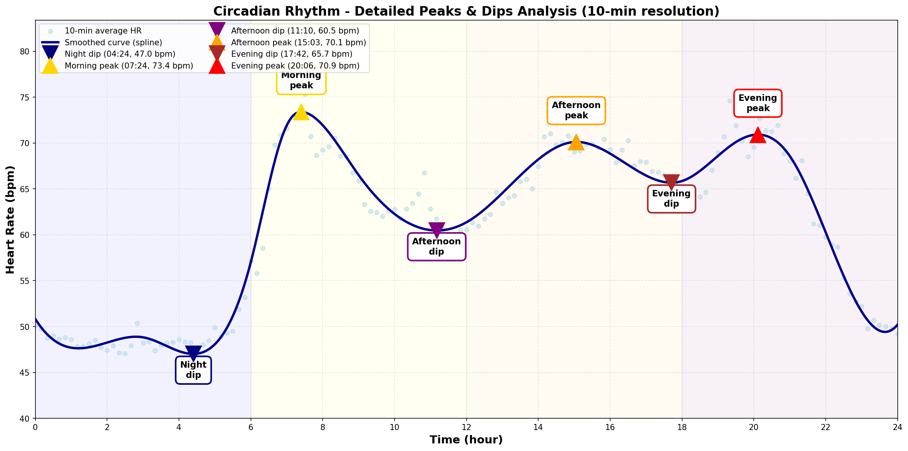

# サーカディアンリズム - ピーク・ディップ分析

**分析日**: 2026-01-07
**データ期間**: 2025-12-09 ~ 2026-01-07（30日間）
**フィルタリング**: activity_logsの運動時間を完全除外
**分析手法**: スプライン補間によるピーク・ディップ検出

---

## 重要

この分析では、**すべての運動・活動時間（自転車、筋トレ、ウォーキングなど）を除外**しています。

除外された活動：
- 🚴 Bike（自転車）
- 🏋️ Weights（筋トレ）
- 🚶 Walk（ウォーキング）
- その他すべての記録された運動

これにより、**サーカディアンリズムによる純粋な心拍数変動**のみを抽出しています。

---

## ピーク・ディップ分析

**グラフの見方**:
- **ライトブルーの点**: 10分ごとの平均心拍数（活動除外後）
- **濃いブルーの線**: スプライン補間による滑らかな曲線
- **三角マーカー**: 検出されたピーク（上向き）とディップ（下向き）
- **色分け**: Navy（夜間）、Gold（朝）、Purple（昼）、Orange（午後）、Red（夕方）

| 時間帯 | タイプ | 時刻・心拍数 | 意味 |
|-------|--------|------------|------|
| 🌙 **夜間** | ディップ | **04:24** (47.0 bpm) | 深い睡眠、最も休息 |
| ☀️ **朝** | ピーク | **07:24** (73.4 bpm) | 自然な覚醒 |
| 😴 **昼** | ディップ | **11:10** (60.5 bpm) | post-lunch dip |
| 📈 **午後** | ピーク | **15:03** (70.1 bpm) | 午後の活性化 |
| 🌅 **夕方** | ディップ | **17:42** (65.7 bpm) | 午後の疲労感 |
| 🌆 **夜** | ピーク | **20:06** (70.9 bpm) | 体温ピーク |

---

## 全ピーク一覧（安静時のみ）

1. **07:24** - 73.4 bpm
2. **15:03** - 70.1 bpm
3. **20:06** - 70.9 bpm

## 全ディップ一覧（安静時のみ）

1. **04:24** - 47.0 bpm
2. **11:10** - 60.5 bpm
3. **17:42** - 65.7 bpm

---

## 参考文献

- Circadian rhythm of heart rate and activity: A cross-sectional study (2025)
- Post-lunch dip: 多くの研究で確認されている生理的現象

---

**生成日時**: 2026-01-07
**分析ツール**: dailybuild サーカディアンリズム分析モジュール（最終版）
