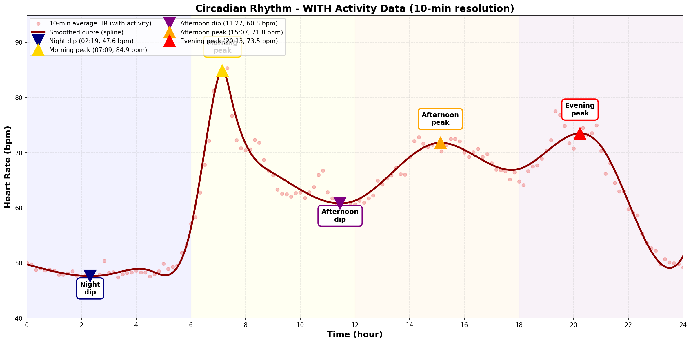

# サーカディアンリズム - 活動データ含む版

**分析日**: 2026-01-07
**データ期間**: 2025-12-09 ~ 2026-01-07（30日間）
**フィルタリング**: なし（運動時間も含む）
**分析手法**: スプライン補間によるピーク・ディップ検出

---

## 重要

この分析では、**運動・活動時間を除外していません**。

含まれる活動：
- 🚴 Bike（自転車）
- 🏋️ Weights（筋トレ）
- 🚶 Walk（ウォーキング）
- その他すべての記録された運動

これにより、**実際の生活における心拍数変動**を観察できます。

---

## ピーク・ディップ分析

**グラフの見方**:
- **ライトコーラルの点**: 10分ごとの平均心拍数（活動含む）
- **ダークレッドの線**: スプライン補間による滑らかな曲線
- **三角マーカー**: 検出されたピーク（上向き）とディップ（下向き）
- **色分け**: Navy（夜間）、Gold（朝）、Purple（昼）、Orange（午後）、Red（夕方）

| 時間帯 | タイプ | 時刻・心拍数 | 意味 |
|-------|--------|------------|------|
| 🌙 **夜間** | ディップ | **02:19** (47.6 bpm) | 深い睡眠 |
| ☀️ **朝** | ピーク | **07:09** (84.9 bpm) | 起床後の活性化 |
| 😴 **昼** | ディップ | **11:27** (60.8 bpm) | post-lunch dip（活動の影響含む） |
| 📈 **午後** | ピーク | **15:07** (71.8 bpm) | 午後の活動ピーク |
| 🌆 **夕方** | ピーク | **20:13** (73.5 bpm) | 夕方の活動ピーク |

---

## 全ピーク一覧（活動含む）

1. **07:09** - 84.9 bpm
2. **15:07** - 71.8 bpm
3. **20:13** - 73.5 bpm

## 全ディップ一覧（活動含む）

1. **02:19** - 47.6 bpm
2. **11:27** - 60.8 bpm
3. **17:43** - 66.8 bpm
4. **23:29** - 49.1 bpm

---

## 参考文献

- Circadian rhythm of heart rate and activity: A cross-sectional study (2025)
- Post-lunch dip: 多くの研究で確認されている生理的現象

---

**生成日時**: 2026-01-07
**分析ツール**: dailybuild サーカディアンリズム分析モジュール（活動データ含む版）
