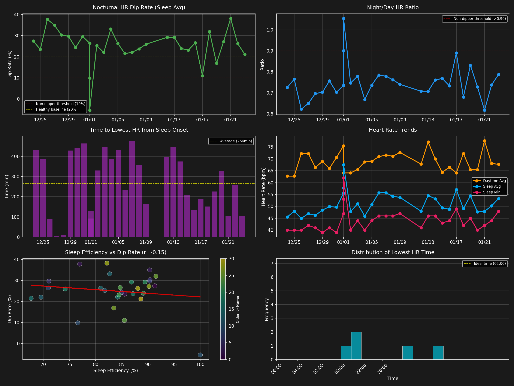

# 睡眠中心拍数の高度な指標分析

**分析期間**: 2025-12-24 ～ 2026-01-23
**対象記録数**: 31日間

## 📊 分析結果サマリー

### 1. 夜間心拍数ディップ率（Nocturnal HR Dip）

健康な人は睡眠中に心拍数が日中の10-20%低下します。この低下が不十分な「非ディッパー」は心血管イベントのリスクが2.4倍に増加します。

- **平均ディップ率**: 25.0%
- **夜/昼心拍数比率**: 0.75
- **非ディッパー日数**: 2/31日
- **基準**: 健康な範囲は10-20%以上、非ディッパーは<10%（比率>0.90）

### 2. 入眠から最低心拍数までの時間

入眠後、副交感神経が活性化し心拍数が低下します。この時間が長すぎる場合、ストレスや交感神経優位の可能性があります。

- **平均到達時間**: 266分
- **中央値**: 258分
- **範囲**: 2～476分
- **基準**: シフトワーク研究では112-174分、健康な範囲は60-180分程度

### 3. 最低心拍数の発生時刻

概日リズムによって、徐波睡眠中の最大副交感神経活動は通常午前2時頃に観察されます。

- **最頻時刻帯**: 04:38
- **基準**: 午前2時前後が理想的

### 4. 睡眠効率との相関

睡眠効率が低い人は夜間心拍数ディップも減少します。

- **平均睡眠効率**: 83.9%
- **相関係数**: -0.15
- **基準**: 85%以上が良好

## 📈 可視化

## 🏥 健康評価

### 検出された状態

- ✅ 夜間心拍数ディップ率が20%以上（良好）  
- ⚠️ 最低心拍数到達に時間がかかる（平均180分超）  
- ⚠️ 睡眠効率が85%未満

### 推奨事項

1. 入眠後の副交感神経活性化が遅い可能性があります。就寝前のリラクゼーションを強化してください。  
2. 睡眠の質改善が必要です。就寝時刻の一貫性と睡眠環境を見直してください。

## 🔬 研究的背景

これらの指標は以下の研究に基づいています：

1. **夜間心拍数ディップ**: 非ディッパーは心血管イベントリスクが2.4倍に増加（Hypertension Research）
2. **副交感神経活性化**: 入眠後1時間以内に副交感神経活動がピークに達する（PMC研究）
3. **概日リズム**: 午前2時頃に最大副交感神経活動が観察される（Circulation）
4. **睡眠効率**: 低効率群は心拍数ディップが21%→12%に減少（American Journal of Physiology）

## 📝 詳細データ

| 日付 | ディップ率(%) | 最低HR到達(分) | 睡眠効率(%) | 夜/昼比率 |
|------|--------------|---------------|-------------|-----------|
| 2026-01-14 | 23.9 | 374 | 89.1 | 0.76 |
| 2026-01-15 | 23.1 | 210 | 84.5 | 0.77 |
| 2026-01-16 | 26.6 | 134 | 84.7 | 0.73 |
| 2026-01-17 | 11.0 | 188 | 85.5 | 0.89 |
| 2026-01-18 | 32.0 | 152 | 91.5 | 0.68 |
| 2026-01-19 | 16.9 | 226 | 83.5 | 0.83 |
| 2026-01-20 | 27.2 | 329 | 90.2 | 0.73 |
| 2026-01-21 | 38.2 | 106 | 82.2 | 0.62 |
| 2026-01-22 | 26.2 | 258 | 88.0 | 0.74 |
| 2026-01-23 | 21.2 | 105 | 88.6 | 0.79 |

---
*Generated: 2026-01-23 19:57:32*
