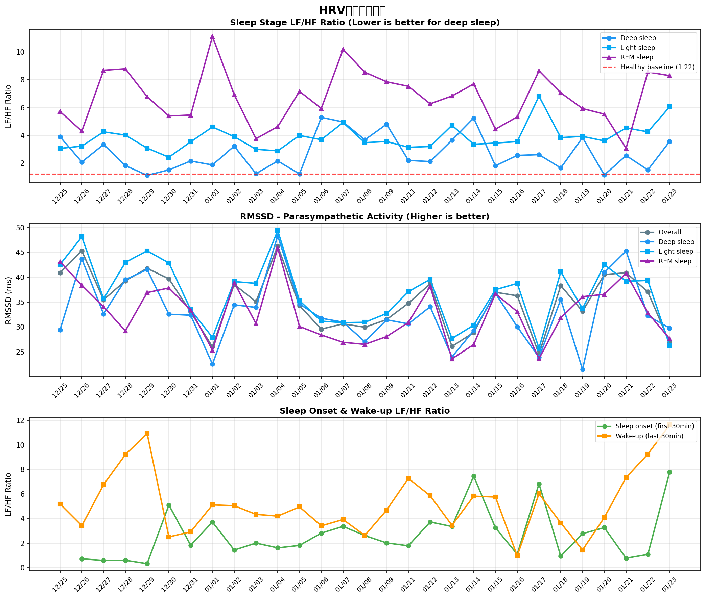

# HRV日別統計レポート

**分析日**: 2026-01-23 20:57:44
**データ期間**: 2025-12-25 ~ 2026-01-23
**分析日数**: 29日

---

## サマリー統計

### 深睡眠LF/HF比（回復の質の指標）

- **平均**: 2.72
- **最小（最良）**: 1.13
- **最大（最悪）**: 5.30
- **健康基準**: 1.22 ± 0.33

- **良好な日数（<2.0）**: 10/29日 (34.5%)

### 最高RMSSD到達時間（副交感神経活性化速度）

- **平均**: 322分
- **最速**: 8分
- **最遅**: 467分
- **健康範囲**: 60-180分

- **健康範囲内の日数**: 1/29日 (3.4%)

## 日別データ

### 睡眠ステージ別LF/HF比

| 日付   |   深睡眠 |   浅睡眠 |   REM |   全体 | 評価   |
|:-------|---------:|---------:|------:|-------:|:-------|
| 12/25  |     3.9  |     3.06 |  5.72 |   4.08 | ❌     |
| 12/26  |     2.08 |     3.23 |  4.31 |   3.13 | ⚠️     |
| 12/27  |     3.35 |     4.26 |  8.69 |   4.28 | ❌     |
| 12/28  |     1.83 |     4.02 |  8.8  |   4.71 | ✅     |
| 12/29  |     1.13 |     3.08 |  6.79 |   4.01 | ✅     |
| 12/30  |     1.52 |     2.43 |  5.4  |   3.2  | ✅     |
| 12/31  |     2.16 |     3.54 |  5.47 |   3.86 | ⚠️     |
| 01/01  |     1.88 |     4.61 | 11.12 |   6.23 | ✅     |
| 01/02  |     3.23 |     3.91 |  6.94 |   4.35 | ❌     |
| 01/03  |     1.24 |     3    |  3.76 |   3.24 | ✅     |
| 01/04  |     2.16 |     2.89 |  4.63 |   3.15 | ⚠️     |
| 01/05  |     1.22 |     4    |  7.17 |   4.34 | ✅     |
| 01/06  |     5.3  |     3.69 |  5.94 |   4.24 | ❌     |
| 01/07  |     4.97 |     4.93 | 10.19 |   5.77 | ❌     |
| 01/08  |     3.68 |     3.48 |  8.55 |   4.86 | ❌     |
| 01/09  |     4.81 |     3.56 |  7.86 |   4.51 | ❌     |
| 01/11  |     2.2  |     3.14 |  7.53 |   3.95 | ⚠️     |
| 01/12  |     2.12 |     3.2  |  6.27 |   3.77 | ⚠️     |
| 01/13  |     3.66 |     4.73 |  6.83 |   5.11 | ❌     |
| 01/14  |     5.25 |     3.36 |  7.71 |   5.39 | ❌     |
| 01/15  |     1.82 |     3.45 |  4.45 |   3.39 | ✅     |
| 01/16  |     2.56 |     3.55 |  5.33 |   3.74 | ⚠️     |
| 01/17  |     2.61 |     6.82 |  8.65 |   6.7  | ⚠️     |
| 01/18  |     1.66 |     3.85 |  7.06 |   4.17 | ✅     |
| 01/19  |     3.85 |     3.93 |  5.93 |   4.34 | ❌     |
| 01/20  |     1.15 |     3.61 |  5.53 |   3.69 | ✅     |
| 01/21  |     2.55 |     4.54 |  3.07 |   3.89 | ⚠️     |
| 01/22  |     1.52 |     4.26 |  8.56 |   4.72 | ✅     |
| 01/23  |     3.57 |     6.06 |  8.3  |   6.59 | ❌     |

**評価基準（深睡眠）**: ✅ <2.0（良好）, ⚠️ 2.0-3.0（やや高い）, ❌ >3.0（要注意）

### 睡眠ステージ別RMSSD（副交感神経活動）

| 日付   |   深睡眠 |   浅睡眠 |   REM |   全体 |
|:-------|---------:|---------:|------:|-------:|
| 12/25  |     29.4 |     42.6 |  43.1 |   40.9 |
| 12/26  |     43.7 |     48.1 |  38.4 |   45.3 |
| 12/27  |     32.6 |     35.7 |  34.1 |   35.5 |
| 12/28  |     39.5 |     43   |  29.2 |   39.3 |
| 12/29  |     41.5 |     45.3 |  36.9 |   41.8 |
| 12/30  |     32.6 |     42.9 |  37.8 |   39.7 |
| 12/31  |     32.4 |     33.5 |  33.4 |   33   |
| 01/01  |     22.5 |     27.9 |  25.4 |   26   |
| 01/02  |     34.5 |     39.1 |  38.9 |   38.6 |
| 01/03  |     33.9 |     38.8 |  30.7 |   35.1 |
| 01/04  |     48.3 |     49.4 |  45.9 |   46.2 |
| 01/05  |     34.6 |     35.3 |  30.1 |   34.3 |
| 01/06  |     31.8 |     31.2 |  28.4 |   29.6 |
| 01/07  |     31   |     30.9 |  26.9 |   30.6 |
| 01/08  |     27   |     30.9 |  26.5 |   29.9 |
| 01/09  |     31.4 |     32.7 |  28.1 |   31.5 |
| 01/11  |     30.6 |     37.1 |  30.9 |   34.8 |
| 01/12  |     34.1 |     39.6 |  38.2 |   38.7 |
| 01/13  |     24   |     27.7 |  23.6 |   26.1 |
| 01/14  |     29.3 |     30.4 |  26.5 |   28.9 |
| 01/15  |     36.7 |     37.5 |  36.7 |   37   |
| 01/16  |     30   |     38.8 |  33.1 |   36.3 |
| 01/17  |     23.9 |     25.7 |  23.6 |   24.6 |
| 01/18  |     35.5 |     41.1 |  31.8 |   38.3 |
| 01/19  |     21.4 |     33.7 |  36.1 |   33.1 |
| 01/20  |     41   |     42.5 |  36.6 |   40.5 |
| 01/21  |     45.3 |     39.2 |  40.8 |   40.9 |
| 01/22  |     32.2 |     39.4 |  32.8 |   37.1 |
| 01/23  |     29.8 |     26.3 |  27.6 |   26.9 |

**単位**: ms（ミリ秒） - 高いほど副交感神経が活発（リラックス）

### 最高RMSSD到達時間（副交感神経活性化速度）

| 日付   | 最高RMSSD   | 到達時刻   | 入眠からの時間   |
|:-------|:------------|:-----------|:-----------------|
| 12/25  | 76.2ms      | 04:45      | 361分            |
| 12/26  | 91.8ms      | 00:30      | 8分              |
| 12/27  | 59.3ms      | 22:40      | 10分             |
| 12/28  | 80.6ms      | 01:45      | 198分            |
| 12/29  | 103.1ms     | 04:00      | 430分            |
| 12/30  | 75.5ms      | 05:30      | 436分            |
| 12/31  | 66.6ms      | 04:50      | 445分            |
| 01/01  | 54.0ms      | 02:25      | 193分            |
| 01/02  | 61.9ms      | 06:35      | 446分            |
| 01/03  | 52.5ms      | 04:55      | 467分            |
| 01/04  | 73.1ms      | 01:20      | 190分            |
| 01/05  | 55.6ms      | 05:10      | 464分            |
| 01/06  | 41.7ms      | 02:50      | 225分            |
| 01/07  | 52.1ms      | 05:25      | 430分            |
| 01/08  | 76.5ms      | 03:40      | 311分            |
| 01/09  | 54.3ms      | 02:45      | 238分            |
| 01/11  | 67.0ms      | 03:30      | 324分            |
| 01/12  | 66.6ms      | 04:00      | 402分            |
| 01/13  | 49.0ms      | 05:10      | 415分            |
| 01/14  | 46.5ms      | 04:55      | 382分            |
| 01/15  | 55.5ms      | 04:35      | 416分            |
| 01/16  | 119.9ms     | 04:55      | 382分            |
| 01/17  | 35.6ms      | 05:10      | 352分            |
| 01/18  | 60.2ms      | 01:25      | 158分            |
| 01/19  | 71.0ms      | 06:45      | 360分            |
| 01/20  | 66.1ms      | 05:05      | 377分            |
| 01/21  | 79.4ms      | 05:00      | 367分            |
| 01/22  | 91.6ms      | 03:05      | 290分            |
| 01/23  | 63.7ms      | 02:45      | 275分            |

**健康範囲**: 60-180分程度（心拍数の最低HR到達時間と同様）

- **平均到達時間**: 322分
- **最速**: 8分
- **最遅**: 467分

- **健康範囲内の日数（60-180分）**: 1/29日 (3.4%)

## トレンドグラフ

---

## 指標の解釈

### LF/HF比（自律神経バランス）
- **低いほど良い**（副交感神経優位、リラックス状態）
- **深睡眠の健康基準**: 1.22 ± 0.33
- **REM睡眠**: 3.0 ± 0.74（交感神経が再活性化するため高いのは正常）

### RMSSD（副交感神経活動）
- **高いほど良い**（回復が良好）
- アスリート: 35-107ms、一般人: 19-48ms

### 最高RMSSD到達時間
- 入眠後、副交感神経活動が最も活発になるまでの時間
- **健康範囲**: 60-180分程度
- 短すぎる（<60分）: 入眠前からすでにリラックス状態
- 長すぎる（>180分）: 副交感神経の活性化が遅い、深いリラクゼーションに時間がかかる
