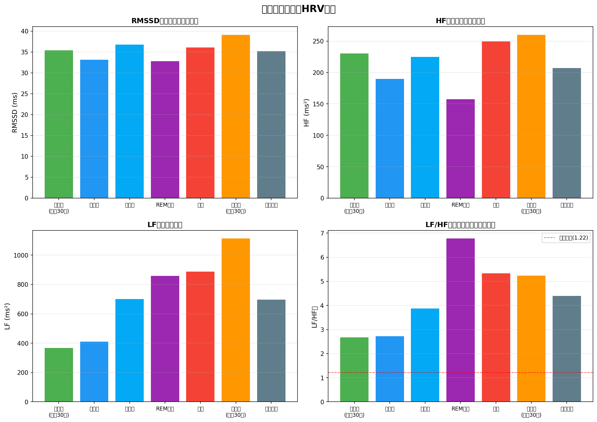

# 睡眠ステージ別HRV分析レポート

**分析日**: 2026-01-23 20:48:18
**データ期間**: 2025-12-25 ~ 2026-01-23
**分析日数**: 29日

---

## サマリー

### 睡眠ステージ別HRV平均値

| ステージ           |   RMSSD (ms) |   HF (ms²) |   LF (ms²) |   LF/HF比 |
|:-------------------|-------------:|-----------:|-----------:|----------:|
| 入眠時（最初30分） |         35.4 |      230.5 |      366.8 |      2.67 |
| 深睡眠             |         33.1 |      190   |      409.1 |      2.72 |
| 浅睡眠             |         36.8 |      225   |      700.2 |      3.87 |
| REM睡眠            |         32.8 |      157.5 |      857.5 |      6.78 |
| 覚醒               |         36.1 |      249.6 |      886.8 |      5.33 |
| 起床時（最後30分） |         39.1 |      260.1 |     1113.4 |      5.24 |
| 全体平均           |         35.2 |      207   |      697.1 |      4.39 |

---

## 研究的知見

### 健康な人の睡眠ステージ別LF/HF比（参考値）

| ステージ | LF/HF比 | 状態 |
|---------|---------|------|
| 覚醒時 | 4.0 ± 1.4 | 交感神経活性 |
| 深睡眠（NREM） | **1.22 ± 0.33** | 副交感神経優位 |
| REM睡眠 | 3.0 ± 0.74 | 交感神経再活性化 |

出典: [Heart Rate Variability During Specific Sleep Stages, Circulation](https://www.ahajournals.org/doi/10.1161/01.cir.91.7.1918)

## 分析結果の解釈

### 深睡眠の回復度

- **深睡眠中の平均LF/HF比**: 2.72
- ❌ **要注意**: 深睡眠中も交感神経活動が高く、回復が不十分な可能性

### REM睡眠の自律神経バランス

- **REM睡眠中の平均LF/HF比**: 6.78
- REM睡眠中は交感神経が再活性化するため、LF/HF比が上昇するのは正常

### 入眠時と起床時の変化

- **入眠時LF/HF比**: 2.67
- **起床時LF/HF比**: 5.24
- 起床時にLF/HF比が上昇し、覚醒への準備が進んだ

---

## HRV指標の説明

### RMSSD（Root Mean Square of Successive Differences）
- 連続する心拍間隔の差の二乗平均平方根
- **副交感神経活動**の指標
- 高いほどリラックス状態、回復が良好

### HF（High Frequency: 0.15-0.4Hz）
- 高周波成分
- **副交感神経活動**の直接的な指標
- 呼吸による心拍変動を反映

### LF（Low Frequency: 0.04-0.15Hz）
- 低周波成分
- 交感神経と副交感神経の**混合指標**
- 血圧調節などを反映

### LF/HF比
- 自律神経バランスの指標
- 低いほど副交感神経優位（リラックス）
- 高いほど交感神経優位（ストレス・活動）
