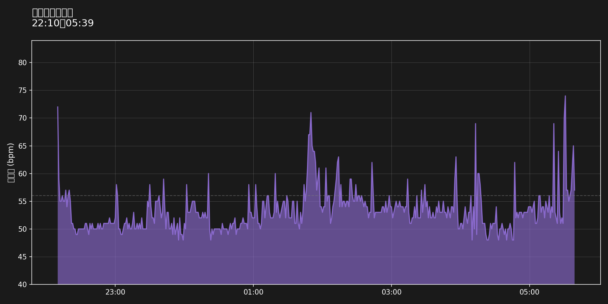

# 睡眠中の心拍数分析

**対象日**: 2026-01-23
**睡眠時間**: 22:10 ～ 05:39

## サマリー

- **平均心拍数**: 53 bpm
- **最小値**: 48 bpm
- **最大値**: 74 bpm
- **安静時心拍数**: 56 bpm

## 心拍数推移

## 安静時の心拍数との比較

睡眠中の心拍数が安静時心拍数（56 bpm）と比較してどのくらい高い/低いかを示します。

- **高い**: 12% (56/450 分)
- **低い**: 88% (394/450 分)

## 解釈

ほとんどの人の場合、睡眠中の心拍数は、起きているときの安静時の心拍数よりも平均して低くなります。
睡眠中の心拍数が安静時心拍数より低い時間が 88% を占めており、良好な睡眠状態と言えます。

---
*Generated: 2026-01-23 19:09:48*
