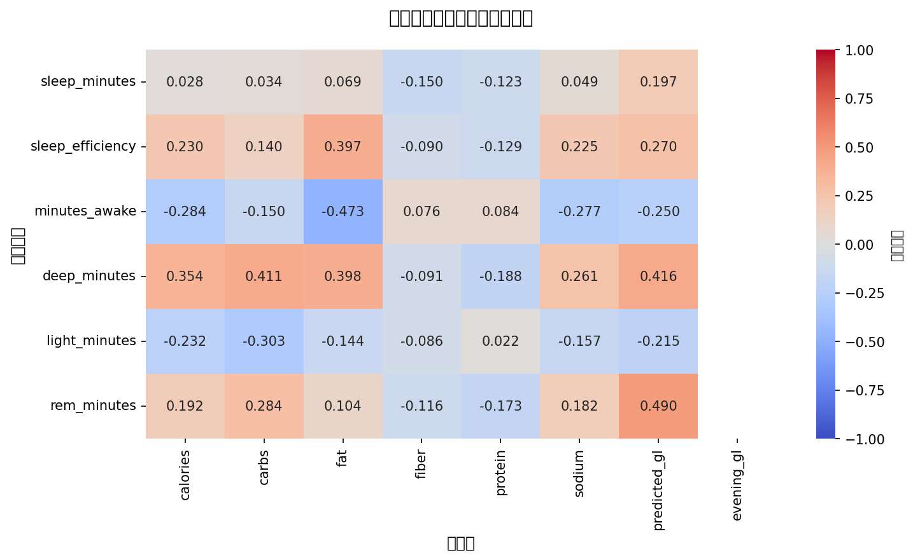
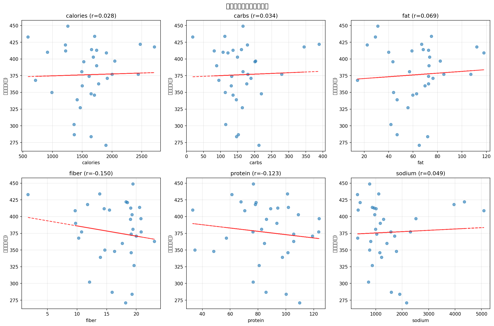

# 食事と睡眠の関係分析レポート

**生成日時**: 2026-02-02 18:38:17

---

## 📊 データサマリー

- **分析対象**: 32日分のデータ
- **期間**: 2025-12-03 ~ 2026-02-01
- **分析内容**: 食事記録の翌日の睡眠データとの相関分析

## 🍽️ 栄養素の基本統計

| 指標 | カロリー(kcal) | 炭水化物(g) | 脂質(g) | 食物繊維(g) | タンパク質(g) | 塩分(mg) |
|------|----------------|-------------|---------|-------------|---------------|----------|
| 平均 | 1602.9 | 162.7 | 63.0 | 16.3 | 86.0 | 1480.5 |
| 中央値 | 1647.0 | 150.7 | 66.0 | 18.2 | 85.9 | 1128.2 |
| 最小 | 587.0 | 18.3 | 14.5 | 1.7 | 33.1 | 307.4 |
| 最大 | 2711.0 | 388.7 | 117.9 | 23.1 | 123.8 | 5086.8 |

## 😴 睡眠の基本統計

| 指標 | 睡眠時間(分) | 睡眠効率(%) | 深い睡眠(分) | REM睡眠(分) |
|------|--------------|-------------|--------------|-------------|
| 平均 | 376.4 (6.3h) | 84.2 | 59.5 | 88.2 |
| 中央値 | 379.0 (6.3h) | 86.0 | 60.0 | 91.0 |
| 最小 | 271.0 (6.3h) | 68.0 | 13.0 | 31.0 |
| 最大 | 449.0 (6.3h) | 92.0 | 95.0 | 135.0 |

## 🔗 栄養素と睡眠の相関分析

### 相関係数マトリックス

相関係数は-1~1の範囲。**絶対値が0.3以上**で中程度、**0.5以上**で強い相関を示します。

| 睡眠指標 | calories | carbs | fat | fiber | protein | sodium |
|---|---|---|---|---|---|---|
| 睡眠時間 | 0.028 | 0.034 | 0.069 | -0.150 | -0.123 | 0.049 | 0.197 | nan |
| 睡眠効率 | 0.230 | 0.140 | **0.397** | -0.090 | -0.129 | 0.225 | 0.270 | nan |
| 覚醒時間 | -0.284 | -0.150 | **-0.473** | 0.076 | 0.084 | -0.277 | -0.250 | nan |
| 深い睡眠 | **0.354** | **0.411** | **0.398** | -0.091 | -0.188 | 0.261 | **0.416** | nan |
| 浅い睡眠 | -0.232 | **-0.303** | -0.144 | -0.086 | 0.022 | -0.157 | -0.215 | nan |
| REM睡眠 | 0.192 | 0.284 | 0.104 | -0.116 | -0.173 | 0.182 | **0.490** | nan |

### 相関ヒートマップ



### 📈 主な発見

- **睡眠時間**: predicted_glと弱い正の相関 (r=0.197)
- **睡眠効率**: fatと中程度の正の相関 (r=0.397)
- **覚醒時間**: fatと中程度の負の相関 (r=-0.473)
- **深い睡眠**: predicted_glと中程度の正の相関 (r=0.416)
- **浅い睡眠**: carbsと中程度の負の相関 (r=-0.303)
- **REM睡眠**: predicted_glと中程度の正の相関 (r=0.490)

### 散布図分析



## 📊 カテゴリ別分析

### カロリー摂取量別の睡眠

| カロリー区分 | データ数 | 平均睡眠時間 | 睡眠効率(%) | 深い睡眠(分) | REM睡眠(分) |
|--------------|----------|--------------|-------------|--------------|-------------|
| 低(~1000) | 4 | 390分 (6.5h) | 86.8 | 60 | 94 |
| 中(1000-1500) | 9 | 364分 (6.1h) | 80.2 | 54 | 77 |
| 高(1500-2000) | 15 | 373分 (6.2h) | 84.9 | 58 | 88 |
| 過多(2000~) | 4 | 404分 (6.7h) | 88.0 | 76 | 110 |

### タンパク質摂取量別の睡眠

| タンパク質区分 | データ数 | 平均睡眠時間 | 睡眠効率(%) | 深い睡眠(分) | REM睡眠(分) |
|----------------|----------|--------------|-------------|--------------|-------------|
| 低(~50g) | 3 | 369分 (6.2h) | 86.7 | 63 | 97 |
| 中(50-80g) | 9 | 400分 (6.7h) | 84.4 | 65 | 98 |
| 高(80-120g) | 18 | 365分 (6.1h) | 83.4 | 57 | 81 |
| 過多(120g~) | 2 | 387分 (6.5h) | 86.5 | 51 | 97 |

### グリセミック負荷（GL）別の睡眠 - 1日全体

GLは血糖値への影響を示す指標。低いほど血糖値が安定し、良好な睡眠が期待される。

| GL区分 | データ数 | 平均睡眠時間 | 睡眠効率(%) | 深い睡眠(分) | REM睡眠(分) |
|--------|----------|--------------|-------------|--------------|-------------|
| 低 | 24 | 372分 (6.2h) | 83.3 | 56 | 83 |
| 中 | 2 | 394分 (6.6h) | 84.0 | 59 | 96 |
| 高 | 6 | 388分 (6.5h) | 87.7 | 73 | 105 |

### グリセミック負荷（GL）別の睡眠 - 夜の食事のみ

夕食と夜の間食のみのGLで分析。睡眠に最も影響する食事タイミングに焦点を当てています。

| GL区分 | データ数 | 平均睡眠時間 | 睡眠効率(%) | 深い睡眠(分) | REM睡眠(分) |
|--------|----------|--------------|-------------|--------------|-------------|
| 中 | 31 | 375分 (6.2h) | 84.1 | 60 | 88 |

## 💡 考察と次のステップ

### 相関から見た傾向

1. **睡眠時間**: predicted_glとの相関が最も強い (r=0.197)
2. **睡眠効率**: fatとの相関が最も強い (r=0.397)
3. **深い睡眠**: predicted_glとの相関が最も強い (r=0.416)

### グリセミック負荷（GL）について

**GLスコアとは**:
- 研究論文で検証された予測式（R² = 0.82）で計算
- 炭水化物の量だけでなく、タンパク質・脂質・食物繊維の効果も考慮
- 低GL → 血糖値が安定 → 良好な睡眠が期待される

**1日全体 vs 夜のみのGL**:
- **1日全体のGL**: 朝・昼・夕食すべてを含む総合的な指標
- **夜のみのGL**: 夕食と夜の間食のみ（睡眠に最も影響する食事タイミング）
- 夜のみのGLの方が、睡眠への直接的な影響を捉えやすい可能性があります
- 高GL → 血糖スパイク → 夜間低血糖 → 覚醒の可能性

**計算式** (Pongutta et al., 2021):
```
GL = 19.27 + (0.39 × 正味炭水化物) - (0.21 × 脂質)
     - (0.01 × タンパク質²) - (0.01 × 食物繊維²)
```

### 今後の分析案

1. **時系列分析**: 栄養摂取パターンと睡眠の長期トレンド
2. **PFCバランス分析**: タンパク質・脂質・炭水化物の比率と睡眠の関係
3. **多変量解析**: 複数の栄養素を組み合わせた睡眠予測モデル
4. **外れ値分析**: 特に睡眠が良好/不良だった日の栄養パターン
5. **食事タイミング**: 夕食時刻と睡眠開始時刻の関係(データ追加が必要)
6. **GL最適化**: 睡眠の質を最大化するGLの範囲を特定

---

*Generated by analyze_sleep_nutrition.py*
