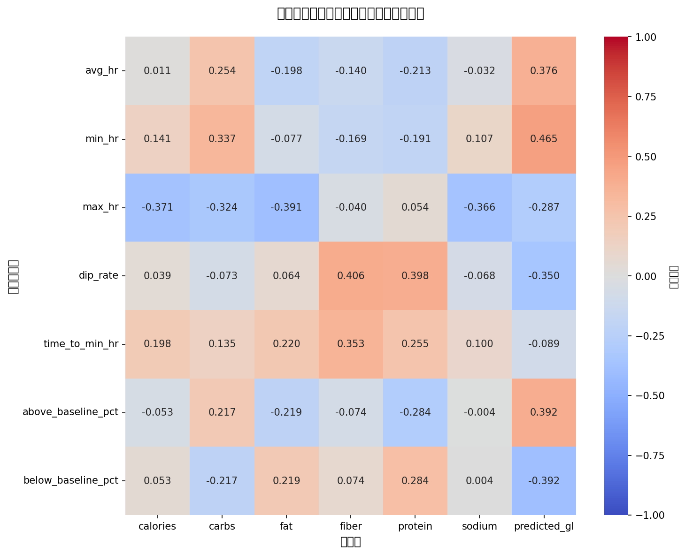
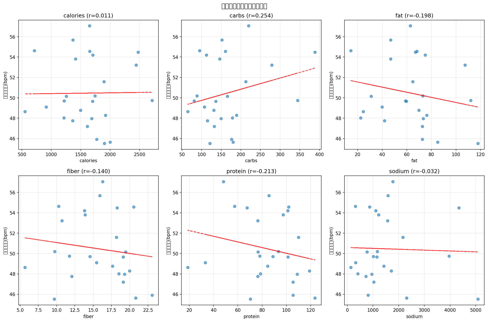
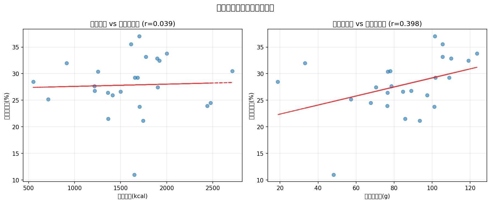

# 睡眠中の心拍数と食事の関係分析レポート

**生成日時**: 2026-02-02 18:19:58

---

## 📊 データサマリー

- **分析対象**: 25日分のデータ
- **期間**: 2025-12-12 ~ 2026-02-01
- **分析内容**: 食事記録の翌日の睡眠中の心拍数データとの相関分析

## ❤️ 睡眠中の心拍数統計

| 指標 | 平均心拍数(bpm) | 最低心拍数(bpm) | 最高心拍数(bpm) | ディップ率(%) | 最低HR到達(分) |
|------|-----------------|-----------------|-----------------|---------------|----------------|
| 平均 | 50.5 | 43.6 | 88.0 | 27.9 | 303.0 |
| 中央値 | 49.7 | 44.0 | 87.0 | 27.7 | 353.0 |
| 最小 | 45.5 | 39.0 | 62.0 | 11.0 | 11.0 |
| 最大 | 57.1 | 49.0 | 109.0 | 37.1 | 549.0 |

### 指標の説明

- **平均心拍数**: 睡眠中の心拍数の平均値
- **最低心拍数**: 睡眠中の最低心拍数（通常は深い睡眠時に記録）
- **ディップ率**: 日中の安静時心拍数から睡眠中にどれだけ心拍数が低下したか
  - 健康的な値: 10-20%の低下
  - 高い値ほど良好な回復を示す
- **最低HR到達時間**: 入眠からどれくらいで最低心拍数に到達したか（分）
  - 早いほど良好な回復を示す

## 🔗 栄養素と心拍数の相関分析

### 相関係数マトリックス

相関係数は-1~1の範囲。**絶対値が0.3以上**で中程度、**0.5以上**で強い相関。

| 心拍数指標 | calories | carbs | fat | fiber | protein | sodium | predicted_gl |
|---|---|---|---|---|---|---|---|
| 平均心拍数 | 0.011 | 0.254 | -0.198 | -0.140 | -0.213 | -0.032 | **0.376** |
| 最低心拍数 | 0.141 | **0.337** | -0.077 | -0.169 | -0.191 | 0.107 | **0.465** |
| 最高心拍数 | **-0.371** | **-0.324** | **-0.391** | -0.040 | 0.054 | **-0.366** | -0.287 |
| ディップ率 | 0.039 | -0.073 | 0.064 | **0.406** | **0.398** | -0.068 | **-0.350** |
| 最低HR到達時間 | 0.198 | 0.135 | 0.220 | **0.353** | 0.255 | 0.100 | -0.089 |
| ベースライン超過% | -0.053 | 0.217 | -0.219 | -0.074 | -0.284 | -0.004 | **0.392** |
| ベースライン未満% | 0.053 | -0.217 | 0.219 | 0.074 | 0.284 | 0.004 | **-0.392** |

### 相関ヒートマップ

### 散布図分析

### ディップ率分析

## 📈 主な発見

- **平均心拍数**: predicted_glと中程度の正の相関 (r=0.376)
- **最低心拍数**: predicted_glと中程度の正の相関 (r=0.465)
- **最高心拍数**: fatと中程度の負の相関 (r=-0.391)
- **ディップ率**: fiberと中程度の正の相関 (r=0.406)
- **最低HR到達時間**: fiberと中程度の正の相関 (r=0.353)
- **ベースライン超過%**: predicted_glと中程度の正の相関 (r=0.392)
- **ベースライン未満%**: predicted_glと中程度の負の相関 (r=-0.392)

## 📊 カテゴリ別分析

### カロリー摂取量別の心拍数

| カロリー区分 | データ数 | 平均心拍数 | 最低心拍数 | ディップ率(%) | 最低HR到達(分) |
|--------------|----------|------------|------------|---------------|----------------|
| 低(~1000) | 3 | 50.8 | 43.7 | 28.6 | 182 |
| 中(1000-1500) | 7 | 50.6 | 43.4 | 26.5 | 292 |
| 高(1500-2000) | 12 | 49.8 | 43.1 | 28.9 | 336 |
| 過多(2000~) | 3 | 52.5 | 46.3 | 26.3 | 317 |

### タンパク質摂取量別の心拍数

| タンパク質区分 | データ数 | 平均心拍数 | 最低心拍数 | ディップ率(%) | 最低HR到達(分) |
|----------------|----------|------------|------------|---------------|----------------|
| 低(~50g) | 3 | 51.6 | 44.0 | 23.8 | 240 |
| 中(50-80g) | 8 | 50.4 | 43.9 | 27.0 | 320 |
| 高(80-120g) | 13 | 50.6 | 43.8 | 28.9 | 303 |
| 過多(120g~) | 1 | 45.6 | 39.0 | 33.8 | 364 |

### グリセミック負荷（GL）別の心拍数

GLと心拍数の関係から、消化負担や回復状態を評価できる。

| GL区分 | データ数 | 平均心拍数 | 最低心拍数 | ディップ率(%) | 最低HR到達(分) |
|--------|----------|------------|------------|---------------|----------------|
| 低 | 17 | 49.8 | 43.1 | 29.0 | 320 |
| 中 | 2 | 51.3 | 44.0 | 26.4 | 236 |
| 高 | 6 | 52.0 | 45.2 | 25.1 | 279 |

## 💡 考察と解釈

### 心拍数指標の意味

1. **ディップ率が高い** = 良い回復
   - 日中から睡眠中の心拍数の低下が大きい
   - 副交感神経が優位で、体がリラックスしている

2. **最低心拍数が低い** = 深いリラクゼーション
   - 体が深く休息している状態
   - 心臓への負担が少ない

3. **最低HR到達時間が早い** = 速やかな回復
   - 入眠後すぐに体が回復モードに入っている
   - 睡眠の質が高い可能性

### 栄養と心拍数の関係

- 高カロリー食や高脂肪食は心拍数を上昇させる可能性がある
- 炭水化物は副交感神経を活性化し、心拍数を低下させる可能性がある
- タンパク質は代謝を上げるため、心拍数に影響する可能性がある

### グリセミック負荷（GL）と心拍数

**GLと心拍数の関係から分かること**:

1. **最低心拍数**: 低いほど深いリラクゼーション状態
   - 高GL（高炭水化物）で上昇 → 消化の負担？
   - 低GL（低炭水化物）で低下 → 深い休息？

2. **最低HR到達時間**: 早いほど速やかな回復
   - 高GL（高炭水化物）で遅延 → 消化に時間がかかる？
   - 低GL（低炭水化物）で早い → 速やかな回復？

3. **ディップ率**: 高いほど良好な回復
   - GL区分別の違いから、最適な炭水化物量を推定

---

*Generated by analyze_sleep_hr_nutrition.py*
