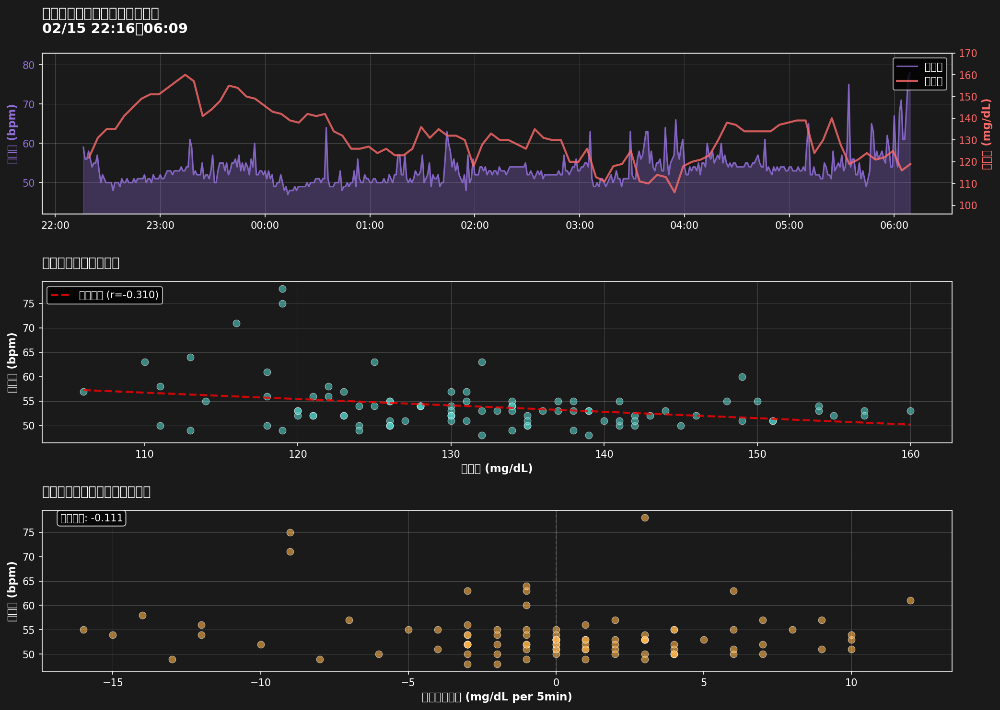

# 睡眠中の心拍数と血糖値の関係分析

**対象日**: 2026-02-16
**睡眠時間**: 2026-02-15 22:16 ～ 2026-02-16 06:09
**睡眠時間**: 425分 (7.1時間)

## サマリー

### 心拍数
- **平均**: 53.4 ± 3.9 bpm
- **範囲**: 47 - 78 bpm

### 血糖値
- **平均**: 131.7 ± 11.9 mg/dL
- **範囲**: 106 - 160 mg/dL

### 相関分析
- **相関係数**: -0.310
- **統計的有意性**: 有意 (p < 0.05) (p = 0.0022)
- **回帰式**: 心拍数 = -0.131 × 血糖値 + 71.145

## 分析結果

### グラフの見方

1. **上段**: 時系列グラフ
   - 紫: 心拍数（左軸）
   - 赤: 血糖値（右軸）
   - 睡眠中の心拍数と血糖値の同時推移を表示

2. **中段**: 散布図と相関
   - 各点: 同時刻の心拍数と血糖値のペア
   - 赤破線: 回帰直線
   - 相関係数 r = -0.310

3. **下段**: 血糖値変化率との関係
   - 血糖値が5分間でどれだけ変化したか（横軸）と心拍数（縦軸）の関係
   - 血糖値の急激な変動が心拍数に影響を与えているかを確認

## 解釈

### 相関の強さ
中程度の負の相関が観察されました（r = -0.310）。

- 血糖値が高いほど心拍数が低くなる傾向があります
- この逆相関は興味深い観察結果です

### 統計的有意性
観察された相関は統計的に有意です（p = 0.0022 < 0.05）。
これは偶然では説明できない関係性を示唆しています。

## データ詳細

- **心拍データポイント数**: 474件（1分間隔）
- **血糖データポイント数**: 95件（5分間隔）
- **マージ後データ数**: 95件

## 参考情報

### 正常範囲
- **血糖値**:
  - 空腹時: 70-100 mg/dL
  - 睡眠中: 概ね100-140 mg/dL
- **睡眠中の心拍数**:
  - 通常、覚醒時の安静時心拍数より低い
  - 個人差が大きい

### 今後の分析の可能性
- より長期間のデータでパターンを確認
- 睡眠ステージ（深睡眠、REM等）との関連分析
- 食事内容・タイミングとの関連分析
- 血糖値スパイク時の心拍反応の詳細分析

---
*Generated: 2026-02-16 17:44:29*
*Script: analyze_sleep_cgm_hr.py*
