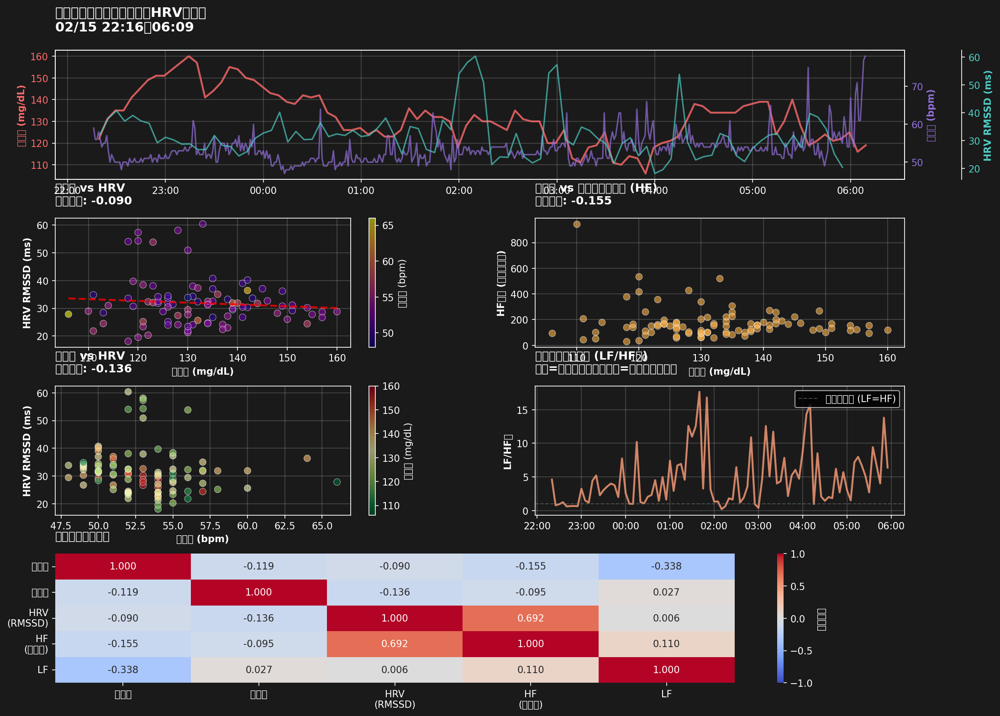

# 睡眠中の血糖値・心拍数・HRVの包括的関係分析

**対象日**: 2026-02-16
**睡眠時間**: 2026-02-15 22:16 ～ 2026-02-16 06:09
**睡眠時間**: 425分 (7.1時間)

## サマリー

### 平均値
- **心拍数**: 53.2 bpm
- **血糖値**: 132.1 mg/dL
- **HRV (RMSSD)**: 31.9 ms（副交感神経活動の指標）
- **HF成分**: 173.3（副交感神経優位度）
- **LF/HF比**: 4.76（自律神経バランス、低いほど副交感神経優位）

### 相関分析

| 関係 | 相関係数 | p値 | 有意性 | 解釈 |
|------|----------|-----|--------|------|
| **血糖値 vs 心拍数** | -0.119 | 0.2568 | ❌ 非有意 | 相関弱い |
| **血糖値 vs HRV** | -0.090 | 0.3945 | ❌ 非有意 | 相関弱い |
| **血糖値 vs HF** | -0.155 | 0.1392 | ❌ 非有意 | 相関弱い |
| **心拍数 vs HRV** | -0.136 | - | - | 負の相関：心拍数↑→HRV↓（生理学的に正常） |

## 分析結果

### グラフの見方

1. **上段**: 時系列グラフ（3軸同時表示）
   - 赤: 血糖値（左軸）
   - 紫: 心拍数（中軸）
   - 水色: HRV RMSSD（右軸）

2. **中段左**: 血糖値 vs HRV
   - 色: 心拍数を示す
   - 先行研究では血糖値↑→HRV↓の負の相関が報告されている

3. **中段右**: 血糖値 vs HF成分（副交感神経活動）
   - HF成分が高いほど副交感神経が優位（リラックス状態）

4. **下段左**: 心拍数 vs HRV
   - 色: 血糖値を示す
   - 通常、心拍数が高いとHRVは低下する

5. **下段中**: LF/HF比の時系列
   - LF/HF比が1.0より低い: 副交感神経優位（睡眠中の正常状態）
   - LF/HF比が1.0より高い: 交感神経優位（ストレス・覚醒状態）

6. **下段**: 相関マトリックス
   - 全指標間の相関係数を一覧表示

## 先行研究との比較

### 期待される関係性（先行研究より）

1. **血糖値 ↑ → HRV ↓**（負の相関）
   - 高血糖は自律神経機能を抑制し、特に副交感神経（迷走神経）を障害する
   - 2023年の研究では相関係数 r = -0.453 が報告されている

2. **血糖値 ↑ → HF成分 ↓**（副交感神経抑制）
   - 高血糖により副交感神経活動が低下
   - 糖化最終産物（AGEs）蓄積や微小血管障害が原因

3. **心拍数とHRVの逆相関**
   - 生理学的に正常な関係
   - 心拍数が高い時はHRVが低く、自律神経の柔軟性が失われている

### 今回の発見

❓ **血糖値とHRVの相関が弱い**（r = -0.090）結果となりました。
   - サンプルサイズが小さい（1晩のみ）
   - 他の要因（睡眠ステージ、食事内容等）の影響が大きい可能性

## HRV指標の解説

### RMSSD (Root Mean Square of Successive Differences)
- **副交感神経活動の指標**として最も信頼性が高い
- 連続する心拍間隔の差の二乗平均平方根
- 高い値 = 副交感神経が活発（リラックス、回復状態）
- 低い値 = 副交感神経が抑制（ストレス、疲労状態）

### HF成分 (High Frequency)
- **周波数0.15-0.4 Hzの成分**で、主に副交感神経活動を反映
- 呼吸と同期した心拍変動
- 睡眠中は通常高い値を示す

### LF/HF比 (Low Frequency / High Frequency Ratio)
- **自律神経のバランス**を示す指標
- LF/HF < 1.0: 副交感神経優位（睡眠中の正常状態）
- LF/HF > 1.0: 交感神経優位（覚醒、ストレス状態）
- ただし解釈には議論があり、LF成分は交感神経と副交感神経の両方を含む

## 臨床的意義

### 血糖値管理の重要性
高血糖は自律神経機能に悪影響を与え、特に：
- 副交感神経（迷走神経）の障害が先に現れる
- 睡眠中の回復機能が低下する
- 長期的には心血管リスクが上昇する

### 睡眠の質への影響
- 自律神経の乱れは睡眠の質を低下させる
- 血糖値スパイクは夜間の交感神経活動を亢進させる
- 良好な血糖コントロールが質の高い睡眠につながる

## 推奨される追加分析

1. **長期追跡**: 複数日/週のデータで再現性を確認
2. **睡眠ステージ別分析**: 深睡眠・REM・浅睡眠ごとの関係性
3. **食事内容との関連**: 夕食の糖質量・GL値とHRVの関係
4. **時系列ラグ分析**: 血糖値変化の何分後にHRVが反応するか
5. **血糖値変動幅とHRV**: 平均値だけでなく変動の大きさとの関係

## データ詳細

- **心拍データポイント数**: 474件（1分間隔）
- **HRVデータポイント数**: 92件（5分間隔）
- **血糖データポイント数**: 95件（5分間隔）
- **マージ後データ数**: 92件

## 参考文献

### 先行研究
- Correlation analysis of heart rate variations and glucose fluctuations during sleep (2023)
  - 睡眠中の血糖値とHRVに中程度の負の相関（r = -0.453）を報告
- Heart rate variability in different sleep stages and glycemic control in T2DM (2023)
  - 睡眠ステージ別のHRV分析と血糖コントロールの関連
- Dynamic Sleep-Derived HR/HRV Features Associated with Glucose Metabolism (2026)
  - ウェアラブルデバイスによる睡眠中のHRV特徴と糖代謝状態の関連

---
*Generated: 2026-02-16 18:00:52*
*Script: analyze_sleep_cgm_hr_hrv.py*
