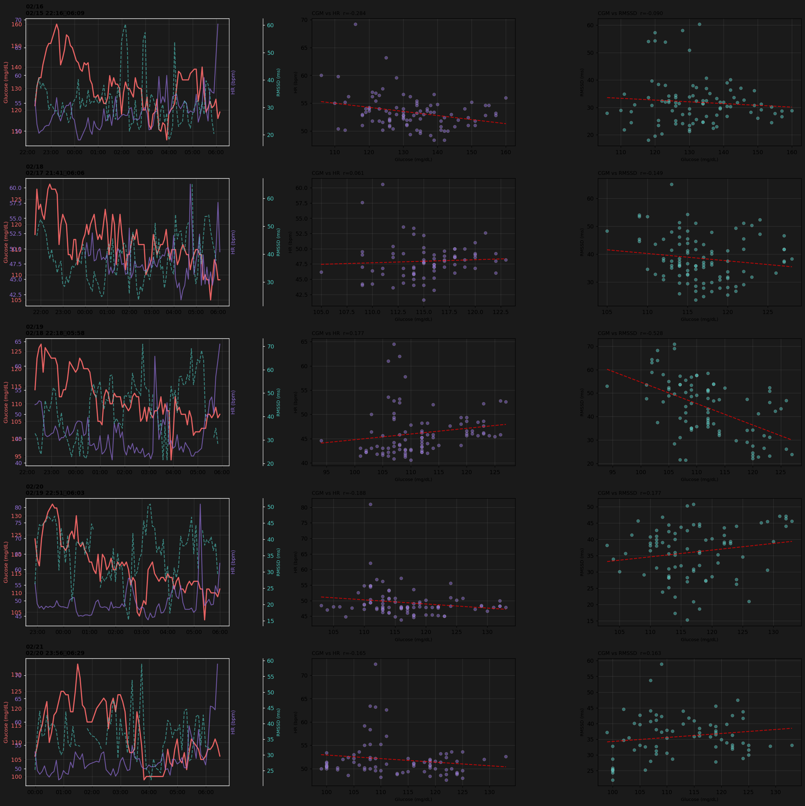
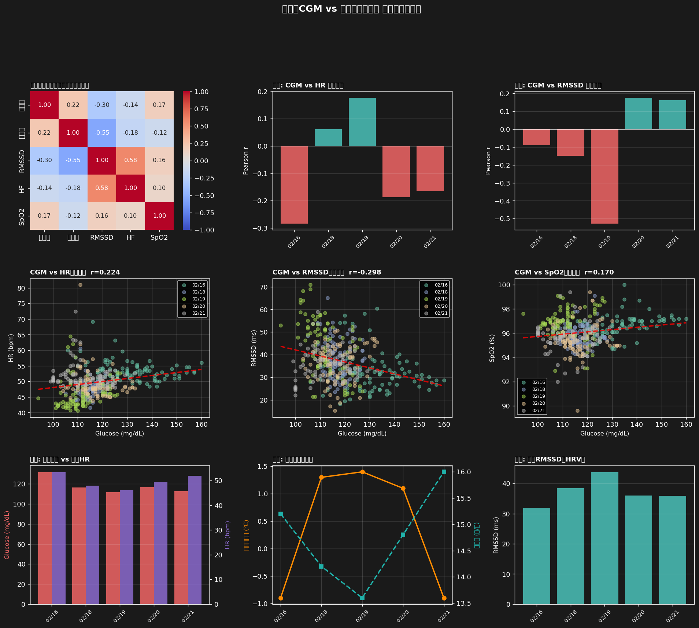

# 睡眠中CGM vs バイタルサイン 多日間分析

**分析期間**: 2026-02-14 ～ 2026-02-21
**対象夜数**: 5夜
**総データポイント数**: 453件（マージ後）

## サマリー

### データ利用状況

| データ | 状況 |
|--------|------|
| Dexcom CGM | ✅ 利用（5分間隔）|
| HR intraday | ✅ 利用（1分 → 5分リサンプリング）|
| HRV intraday | ✅ 利用（5分間隔） |
| SpO2 intraday | ✅ 利用 |
| 皮膚温 | 夜別サマリーに含む |
| BR intraday | 夜別サマリーに含む |

---

## 全夜プール相関分析

N=453点の全夜統合データでのPearson相関:

| ペア | 結果 |
|------|------|
| **CGM vs HR** | r=0.224, p=0.0000, n=424 [✅ 有意(p<0.05)] |
| **CGM vs HRV (RMSSD)** | r=-0.298, p=0.0000, n=430 [✅ 有意(p<0.05)] |
| **CGM vs SpO2** | r=0.170, p=0.0004, n=435 [✅ 有意(p<0.05)] |
| **HR vs RMSSD** | r=-0.551, p=0.0000, n=404 [✅ 有意(p<0.05)] |

---

## 夜別分析

| 夜 | 平均血糖 | 平均HR | 平均RMSSD | r(CGM-HR) | r(CGM-RMSSD) | r(CGM-SpO2) | n |
|----|----------|--------|-----------|-----------|--------------|-------------|---|
| 02/16 | 131.7 | 53.4 | 31.9 | -0.284 | -0.090 | 0.380 | 95 |
| 02/18 | 116.6 | 48.0 | 38.4 | 0.061 | -0.149 | 0.042 | 101 |
| 02/19 | 111.6 | 46.1 | 43.8 | 0.177 | -0.528 | 0.020 | 92 |
| 02/20 | 116.8 | 49.3 | 36.0 | -0.188 | 0.177 | 0.127 | 86 |
| 02/21 | 112.8 | 51.9 | 35.9 | -0.165 | 0.163 | 0.047 | 79 |

*N=6のため夜別相関の統計的有意性判定は参考値のみ*

---

## 可視化

### Figure 1: 各夜の時系列・散布図

### Figure 2: 統合分析

---

## 考察

### 全夜プール相関の解釈

- **CGM ↑ → HR ↑（正の相関 r=0.224）**: 高血糖時に交感神経活性化が示唆される。
- **CGM ↑ → RMSSD ↓（負の相関 r=-0.298）**: 先行研究と一致。高血糖時に副交感神経活動が抑制される。

### 限界と次のステップ

1. **HRVデータギャップ**: 2/17以降のHRV intradayデータがない場合、相関分析の網羅性が低下
   - `python scripts/fetch_intraday.py --hrv-only --start-date 2026-02-17 --end-date 2026-02-21` で補完
2. **SpO2未取得**: SpO2データがあれば低酸素状態と血糖変動の関係を検証できる
   - `python scripts/fetch_intraday.py --spo2-only --start-date 2026-02-14 --end-date 2026-02-21` で取得
3. **N=6の限界**: 夜別サマリーレベルでの統計的検定は不適切（記述統計のみ有効）
4. **個人内変動**: 単一被験者のデータのため外部妥当性に注意

---

## 出力ファイル

- `ANALYSIS_MULTINIGHT.md` — このレポート
- `multinight_nightly.png` — 各夜の時系列・散布図
- `multinight_aggregate.png` — 統合分析図
- `merged_multinight_data.csv` — マージ済みデータ

---
*Generated: 2026-02-21 16:30:12*
*Script: analyze_multinight_cgm_vitals.py*
