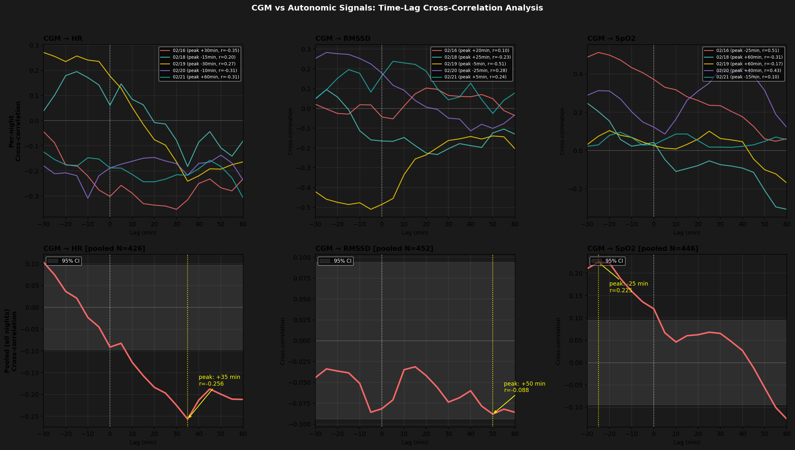

# CGM vs HR/HRV 時間ラグ分析

**Generated**: 2026-02-21 16:38:48

## 分析概要

血糖変化の何分後に自律神経（HR・HRV・SpO2）が反応するかを
cross-correlation（交差相関）で定量化した。
- ラグ範囲: -30分 〜 60分
- 正のラグ: 血糖変化 → 後から自律神経が反応（血糖が先行）
- 負のラグ: 自律神経変化 → 後から血糖が変化（心拍が先行）

---

## 全夜プール Cross-Correlation ピーク

| ペア | ピークラグ | ピーク相関 | 解釈 |
|------|-----------|-----------|------|
| CGM → HR | +35 分 | r=-0.256（負の相関） | 血糖変化の約35分後にheart_rateが反応 |
| CGM → RMSSD | +50 分 | r=-0.088（負の相関） | 血糖変化の約50分後にrmssdが反応 |
| CGM → SpO2 | -25 分 | r=0.225（正の相関） | spo2変化の約25分後に血糖が変化 |

---

## 夜別ピークラグ一覧

| 夜 | CGM→HR peak | CGM→RMSSD peak | CGM→SpO2 peak |
|----|-------------|----------------|----------------|
| 02/16 | +30分 (r=-0.35) | +20分 (r=0.10) | -25分 (r=0.51) |
| 02/18 | -15分 (r=0.20) | +25分 (r=-0.23) | +60分 (r=-0.31) |
| 02/19 | -30分 (r=0.27) | -5分 (r=-0.51) | +60分 (r=-0.17) |
| 02/20 | -10分 (r=-0.31) | -25分 (r=0.28) | +40分 (r=0.43) |
| 02/21 | +60分 (r=-0.31) | +5分 (r=0.24) | -15分 (r=0.10) |

---

## 可視化

---

## 生理学的解釈

### CGM → HR
- ピークラグ +35分: 血糖上昇から35分後にheart_rateが変化
  - 遅延応答。睡眠ステージ変化などの交絡因子の影響が大きい可能性

### CGM → RMSSD
- ピークラグ +50分: 血糖上昇から50分後にrmssdが変化
  - 遅延応答。睡眠ステージ変化などの交絡因子の影響が大きい可能性

### CGM → SpO2
- ピークラグ -25分: spo2が血糖より先に変化
  - 交感神経先行→血糖応答、またはデータの非対称性による可能性

---

## 注意事項

- N=5夜、各夜80〜100点の短時間時系列のため解釈は暫定的
- 睡眠ステージの影響（Deep→REM転換時の自律神経変化）が交絡している可能性あり
- cross-correlationはlinear関係のみを捉える（非線形応答は見逃す）
