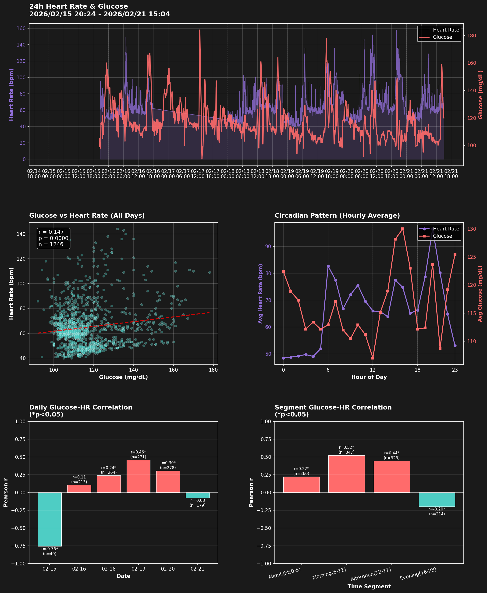

# 24時間CGM血糖値と心拍数の相関分析

**分析期間**: 2026-02-15 20:24 ～ 2026-02-21 15:04（約6日間）
**データポイント**: CGM 1665件, 心拍 6141件, マージ後 1246件

## 全期間サマリー

### 心拍数
- **平均**: 64.8 ± 17.6 bpm
- **範囲**: 40 - 144 bpm

### 血糖値
- **平均**: 116.3 ± 13.4 mg/dL
- **範囲**: 92 - 178 mg/dL
- **TIR (70-180 mg/dL)**: 100.0%

### 相関分析（全期間）
- **相関係数**: 0.147（弱い正の相関）
- **統計的有意性**: 有意 (p < 0.05) (p = 0.0000)
- **回帰式**: 心拍数 = 0.192 × 血糖値 + 42.371

## 日別分析

| 日付 | n | 相関係数 | p値 | 有意 | 平均血糖値 | 平均心拍数 |
|------|---|----------|-----|------|------------|------------|
| 02-15 | 40 | -0.759 | 0.0000 | * | 130.1 | 62.3 |
| 02-16 | 213 | 0.105 | 0.1260 | - | 123.4 | 64.2 |
| 02-18 | 264 | 0.238 | 0.0001 | * | 118.6 | 59.8 |
| 02-19 | 271 | 0.457 | 0.0000 | * | 114.5 | 65.2 |
| 02-20 | 278 | 0.304 | 0.0000 | * | 111.5 | 72.0 |
| 02-21 | 179 | -0.077 | 0.3038 | - | 111.8 | 61.4 |

## 時間帯別分析

| 時間帯 | n | 相関係数 | p値 | 有意 | 平均血糖値 | 平均心拍数 |
|--------|---|----------|-----|------|------------|------------|
| Midnight(0-5) | 360 | 0.224 | 0.0000 | * | 116.1 | 49.6 |
| Morning(6-11) | 347 | 0.521 | 0.0000 | * | 112.7 | 73.7 |
| Afternoon(12-17) | 325 | 0.442 | 0.0000 | * | 119.7 | 68.4 |
| Evening(18-23) | 214 | -0.198 | 0.0037 | * | 117.6 | 70.2 |

## 分析結果

### グラフの見方

1. **上段（フル時系列）**: 約6日間の心拍数（紫・左軸）と血糖値（赤・右軸）の推移。点線は日付境界。
2. **中左（散布図）**: 全データ点の血糖値 vs 心拍数。赤破線は回帰直線。
3. **中右（サーカディアンパターン）**: 時間帯別の平均値。食事・活動・睡眠のリズムを反映。
4. **下左（日別相関）**: 日ごとの相関係数。赤=正の相関、ティール=負の相関、*=p<0.05。
5. **下右（時間帯別相関）**: 深夜/朝/午後/夜の4区分での相関係数。

## 解釈

### 全体的な傾向
弱い正の相関（r = 0.147）が統計的に有意に観察されました。
24時間の活動・食事・自律神経の変化が両指標に影響していると考えられます。

### 睡眠時との比較（Issue 008）
- 睡眠中（2/16 1夜分）: r = -0.310（中程度の負の相関、p < 0.05）
- 24時間全期間（約6日間）: r = 0.147（有意 (p < 0.05)）
- 睡眠中と覚醒中では心拍数-血糖値の関係が異なる可能性があります。

### 時間帯別の特徴
活動量・食事タイミングによって、各時間帯で血糖値と心拍数の関係が異なります。
サーカディアンリズムの影響（早朝覚醒後のコルチゾール分泌による血糖上昇など）も考慮が必要です。

---
*Generated: 2026-02-21 16:17:38*
*Script: analyze_cgm_hr_24h.py*
