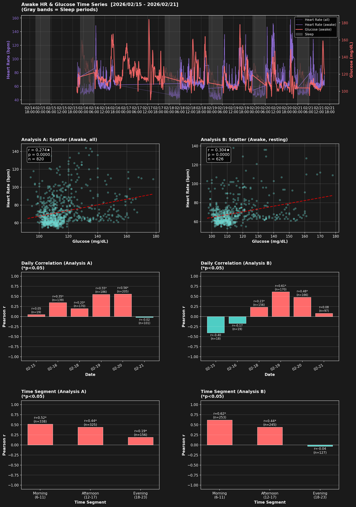

# 覚醒時CGM血糖値と心拍数の相関分析

**分析期間**: 2026-02-15 20:24 ～ 2026-02-21 15:04
**前提**: 睡眠中（Issue 008: r=-0.310）・24時間（Issue 009: r=0.147）の結果を踏まえ、覚醒時に絞って分析

---

## 分析方法

| | Analysis A | Analysis B |
|---|---|---|
| **対象** | 全覚醒時間 | 安静覚醒時のみ |
| **処理** | 睡眠除外 | 睡眠除外 + 歩数フィルタ |
| **歩数条件** | - | 現在・前1分ともにsteps=0 |
| **データ数** | 820件 | 626件 |

---

## Analysis A: 全覚醒時（睡眠除外のみ）

### 基本統計

| 指標 | 値 |
|------|-----|
| 心拍数 | 72.5 ± 16.7 bpm (54-144) |
| 血糖値 | 115.5 ± 14.4 mg/dL (92-178) |
| TIR (70-180) | 100.0% |

### 相関分析

- **相関係数**: r = 0.274（弱い正の相関）
- **統計的有意性**: 有意 (p < 0.05) (p = 0.0000)
- **回帰式**: 心拍数 = 0.3170 × 血糖値 + 35.873

### 日別相関

| 日付 | n | 相関係数 | p値 | 有意 | 平均血糖値 | 平均心拍数 |
|------|---|----------|-----|------|------------|------------|
| 02-15 | 19 | 0.047 | 0.8475 | - | 111.9 | 72.5 |
| 02-16 | 139 | 0.348 | 0.0000 | * | 121.1 | 69.5 |
| 02-18 | 170 | 0.197 | 0.0099 | * | 119.9 | 66.6 |
| 02-19 | 186 | 0.551 | 0.0000 | * | 115.7 | 73.8 |
| 02-20 | 205 | 0.560 | 0.0000 | * | 110.3 | 80.0 |
| 02-21 | 101 | -0.023 | 0.8219 | - | 111.0 | 68.7 |

### 時間帯別相関

| 時間帯 | n | 相関係数 | p値 | 有意 | 平均血糖値 | 平均心拍数 |
|--------|---|----------|-----|------|------------|------------|
| Morning (6-11) | 338 | 0.519 | 0.0000 | * | 112.8 | 74.0 |
| Afternoon (12-17) | 325 | 0.442 | 0.0000 | * | 119.7 | 68.4 |
| Evening (18-23) | 156 | 0.189 | 0.0181 | * | 112.6 | 77.8 |

---

## Analysis B: 安静覚醒時（歩数フィルタ適用）

### 基本統計

| 指標 | 値 |
|------|-----|
| 心拍数 | 68.7 ± 13.2 bpm (53-138) |
| 血糖値 | 114.1 ± 13.6 mg/dL (97-178) |
| TIR (70-180) | 100.0% |

### 相関分析

- **相関係数**: r = 0.304（中程度の正の相関）
- **統計的有意性**: 有意 (p < 0.05) (p = 0.0000)
- **回帰式**: 心拍数 = 0.2959 × 血糖値 + 34.961

### 日別相関

| 日付 | n | 相関係数 | p値 | 有意 | 平均血糖値 | 平均心拍数 |
|------|---|----------|-----|------|------------|------------|
| 02-15 | 18 | -0.405 | 0.0956 | - | 111.7 | 71.2 |
| 02-16 | 19 | -0.170 | 0.4870 | - | 120.4 | 78.7 |
| 02-18 | 156 | 0.230 | 0.0038 | * | 119.8 | 63.1 |
| 02-19 | 170 | 0.613 | 0.0000 | * | 115.6 | 71.6 |
| 02-20 | 166 | 0.477 | 0.0000 | * | 108.6 | 71.6 |
| 02-21 | 97 | 0.080 | 0.4365 | - | 111.1 | 65.4 |

### 時間帯別相関

| 時間帯 | n | 相関係数 | p値 | 有意 | 平均血糖値 | 平均心拍数 |
|--------|---|----------|-----|------|------------|------------|
| Morning (6-11) | 253 | 0.621 | 0.0000 | * | 111.8 | 67.8 |
| Afternoon (12-17) | 245 | 0.440 | 0.0000 | * | 118.0 | 67.7 |
| Evening (18-23) | 127 | -0.036 | 0.6852 | - | 111.3 | 72.7 |

---

## A vs B 比較サマリー

| 項目 | Analysis A (全覚醒) | Analysis B (安静覚醒) | 差 |
|------|---------------------|----------------------|-----|
| データ数 | 820 | 626 | 194 |
| 相関係数 r | 0.274 | 0.304 | +0.031 |
| p値 | 0.0000 | 0.0000 | - |
| 有意性 | 有意 | 有意 | - |
| 平均心拍数 | 72.5 bpm | 68.7 bpm | -3.7 |
| 平均血糖値 | 115.5 mg/dL | 114.1 mg/dL | -1.4 |
| TIR | 100.0% | 100.0% | +0.0% |

---

## Issue シリーズ相関係数まとめ

| Issue | 対象期間 | 相関係数 | 備考 |
|-------|---------|----------|------|
| 008 | 睡眠中のみ | r = -0.310 | 負の相関（中程度）|
| 009 | 24時間全体 | r = 0.147 | 正の相関（弱い）|
| 010 (A) | 覚醒時全体 | r = 0.274 | 弱い正の相関 |
| 010 (B) | 安静覚醒時 | r = 0.304 | 中程度の正の相関 |

---

## 可視化

### グラフの見方

1. **上段（時系列）**: 覚醒時のHR（紫）と血糖値（赤）。グレー帯=睡眠時間。
2. **中上左（散布図A）**: Analysis Aの全覚醒データの散布図と回帰直線。
3. **中上右（散布図B）**: Analysis Bの安静覚醒データの散布図と回帰直線。
4. **中下左（日別相関A）**: Analysis Aの日別相関係数棒グラフ（赤=正、ティール=負、*=p<0.05）。
5. **中下右（日別相関B）**: Analysis Bの日別相関係数棒グラフ。
6. **下左（時間帯別A）**: Analysis Aの朝・午後・夜別相関。
7. **下右（時間帯別B）**: Analysis Bの朝・午後・夜別相関。

---

*Generated: 2026-02-21 16:36:20*
*Script: analyze_cgm_hr_awake.py*
