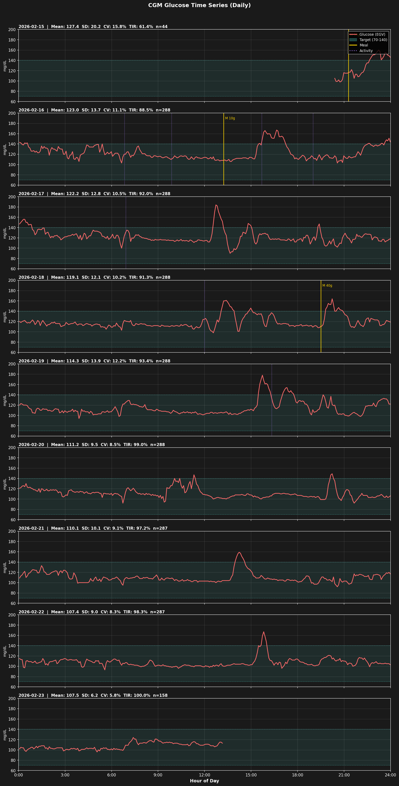
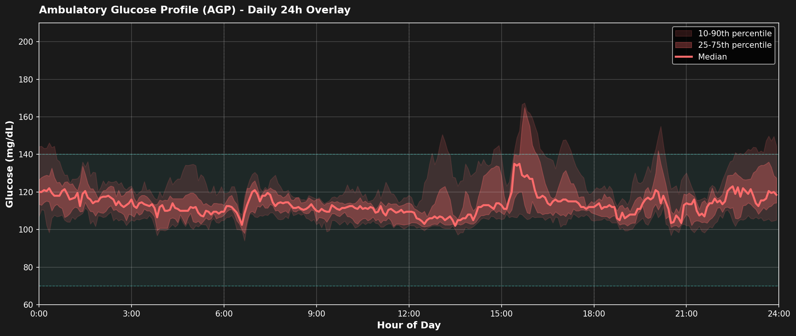
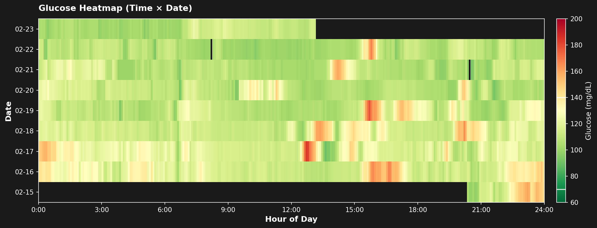
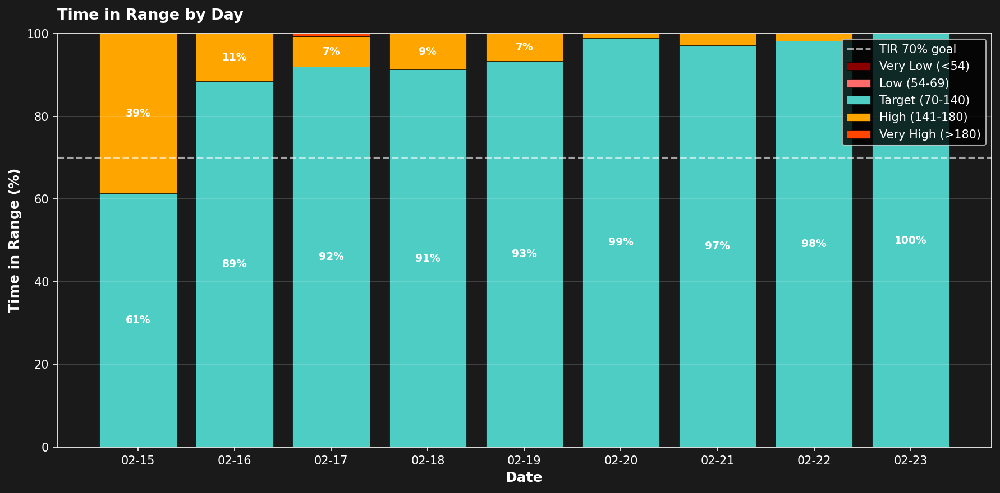
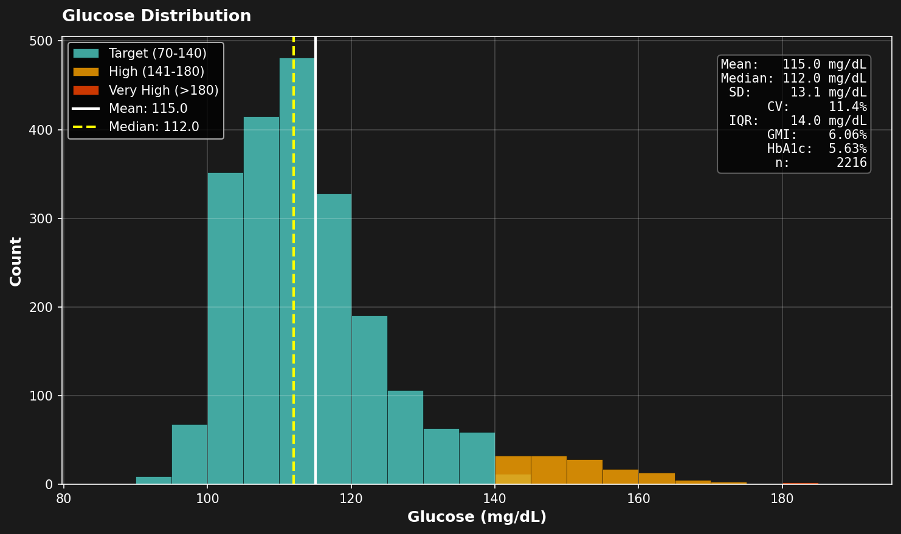

# CGM基本統計分析

**分析期間**: 2026-02-15 20:24 ～ 2026-02-21 15:04（約5.8日間）
**デバイス**: Dexcom G7
**データポイント**: EGV 1665件（5分間隔）

---

## 全体サマリー

### 基本統計

| 指標 | 値 |
|------|-----|
| 平均血糖値 | 117.5 mg/dL |
| 中央値 | 114.0 mg/dL |
| 標準偏差 (SD) | 13.6 mg/dL |
| 変動係数 (CV) | 11.5% ✅ 安定 (<36%) |
| 最小値 | 90 mg/dL |
| 最大値 | 184 mg/dL |
| IQR | 15.0 mg/dL |
| GMI | 6.12% |
| 推定HbA1c | 5.72% |

### TIR (Time in Range)

| 範囲 | 閾値 | 割合 |
|------|------|------|
| 非常に低い | <54 mg/dL | 0.0% |
| 低い | 54-69 mg/dL | 0.0% |
| **目標** | **70-140 mg/dL** | **92.3%** ✅ 良好 (≥70%) |
| 高い | 141-180 mg/dL | 7.6% |
| 非常に高い | >180 mg/dL | 0.1% |

---

## 日別統計

| 日付 | 平均 | 中央値 | 最小 | 最大 | SD | CV(%) | TIR(%) | n |
|------|------|--------|------|------|----|-------|--------|---|
| 02-15 | 127.4 | 119.5 | 98 | 160 | 20.2 | 15.8 | 61.4 | 44 |
| 02-16 | 123.0 | 118.0 | 103 | 167 | 13.7 | 11.1 | 88.5 | 288 |
| 02-17 | 122.2 | 120.0 | 90 | 184 | 12.8 | 10.5 | 92.0 | 288 |
| 02-18 | 119.1 | 115.0 | 98 | 164 | 12.1 | 10.2 | 91.3 | 288 |
| 02-19 | 114.3 | 109.5 | 94 | 178 | 13.9 | 12.2 | 93.4 | 288 |
| 02-20 | 111.2 | 109.0 | 92 | 149 | 9.5 | 8.5 | 99.0 | 288 |
| 02-21 | 111.7 | 108.0 | 95 | 159 | 11.6 | 10.3 | 95.6 | 181 |

---

## 可視化

### 1. 血糖値時系列

全期間の血糖値推移。ティール帯=目標範囲(70-140)、金色縦線=食事イベント、紫縦線=活動イベント。

### 2. AGP日内プロファイル

24時間軸に全日オーバーレイ。赤線=中央値、濃い帯=25-75パーセンタイル、薄い帯=10-90パーセンタイル。

### 3. 血糖値ヒートマップ

X軸=時刻、Y軸=日付、色=血糖値（赤=高、黄=中、緑=低）。カラーバーの白線=目標範囲境界(70/140)。

### 4. TIR日別グラフ

日ごとの各範囲の割合積み上げ棒グラフ。白破線=TIR 70%推奨ライン。

### 5. 血糖値分布

範囲別に色分けしたヒストグラム。右上テキストボックスに統計サマリー。

---

## 解釈

### 血糖コントロール評価

- **CV 11.5%**: 血糖変動が安定している（36%未満が推奨）
- **GMI 6.12%**: CGMデータから推定したHbA1c相当値（長期平均血糖の指標）
- **TIR(70-140) 92.3%**: 目標範囲内の時間が十分（70%以上が推奨）

### 注意事項

- 分析期間は約5.8日間（短期間）のため、長期的なトレンドとは異なる可能性がある
- センサー装着開始直後（2/15夕方）のデータを含むため、精度に影響がある場合がある
- 食事・活動ログは手動入力のため、実際のタイミングと若干のズレがある可能性がある

---

*Generated: 2026-02-21 17:27:15*
*Script: analyze_cgm_basic.py*
