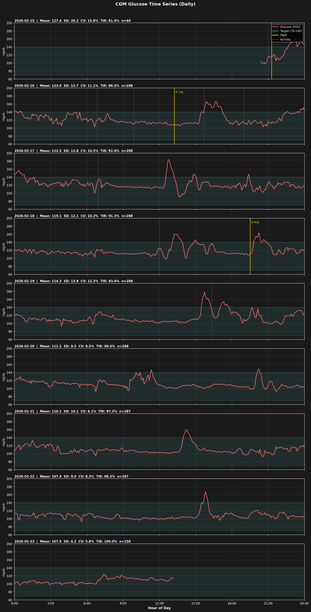
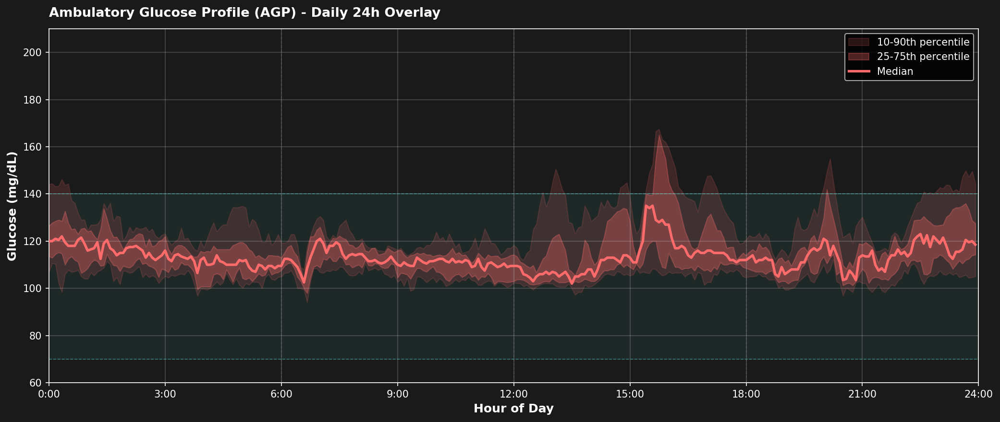
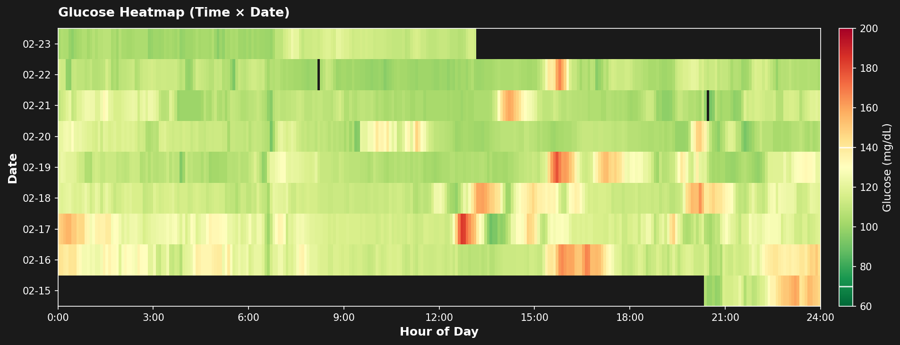
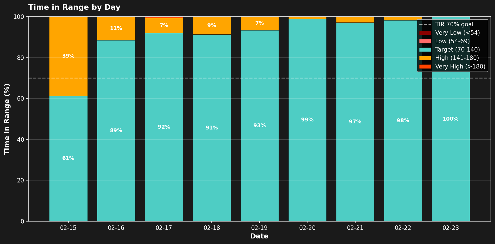
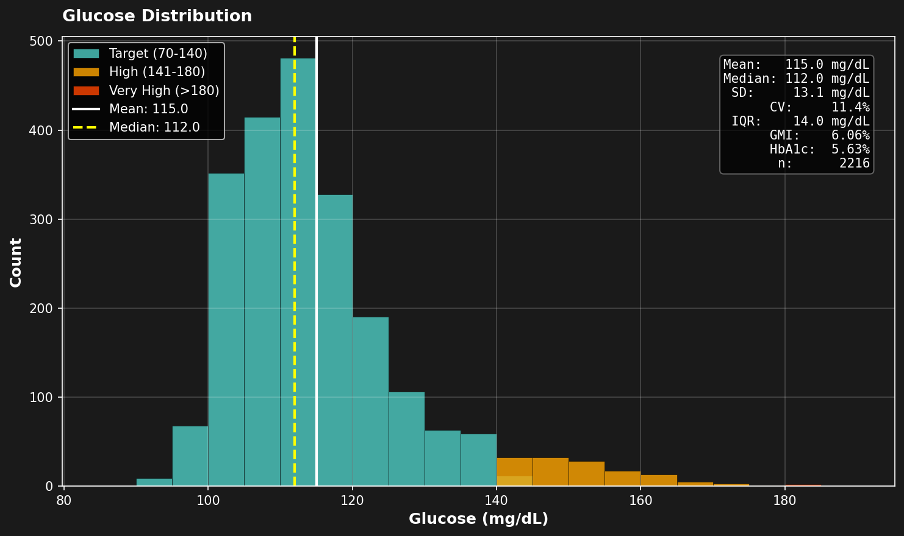

# CGM基本統計分析

**分析期間**: 2026-02-15 20:24 ～ 2026-02-23 13:09（約7.7日間）
**デバイス**: Dexcom G7
**データポイント**: EGV 2216件（5分間隔）

---

## 全体サマリー

### 基本統計

| 指標 | 値 |
|------|-----|
| 平均血糖値 | 115.0 mg/dL |
| 中央値 | 112.0 mg/dL |
| 標準偏差 (SD) | 13.1 mg/dL |
| 変動係数 (CV) | 11.4% ✅ 安定 (<36%) |
| 最小値 | 90 mg/dL |
| 最大値 | 184 mg/dL |
| IQR | 14.0 mg/dL |
| GMI | 6.06% |
| 推定HbA1c | 5.63% |
| **起床時血糖（平均）** | **107.9 mg/dL** |

### TIR (Time in Range)

| 範囲 | 閾値 | 割合 |
|------|------|------|
| 非常に低い | <54 mg/dL | 0.0% |
| 低い | 54-69 mg/dL | 0.0% |
| **目標** | **70-140 mg/dL** | **94.0%** ✅ 良好 (≥70%) |
| 高い | 141-180 mg/dL | 5.9% |
| 非常に高い | >180 mg/dL | 0.1% |

---

## 起床時血糖（空腹時血糖）

Fitbit睡眠データの起床時刻（endTime）に対応するCGM読み取り値を起床時血糖として算出。起床時刻±15分以内の最近接データポイントを使用。

| 日付 | 起床時刻 | 起床時血糖 | ±15分平均 | 日平均 | 差分 |
|------|---------|-----------|----------|-------|------|
| 02/16 | 06:09 | 119 mg/dL | 121.0 mg/dL | 123.0 | -4.0 |
| 02/18 | 06:06 | 109 mg/dL | 111.7 mg/dL | 119.1 | -10.1 |
| 02/19 | 05:58 | 107 mg/dL | 108.7 mg/dL | 114.3 | -7.3 |
| 02/20 | 06:03 | 107 mg/dL | 109.7 mg/dL | 111.2 | -4.2 |
| 02/21 | 06:29 | 106 mg/dL | 103.8 mg/dL | 110.1 | -4.1 |
| 02/22 | 05:37 | 106 mg/dL | 103.8 mg/dL | 107.4 | -1.4 |
| 02/23 | 06:30 | 101 mg/dL | 100.5 mg/dL | 107.5 | -6.5 |

| 指標 | 値 |
|------|-----|
| 起床時血糖（平均） | 107.9 mg/dL |
| 起床時血糖（範囲） | 101-119 mg/dL |
| 全体平均との差 | -7.2 mg/dL |

起床時血糖は日平均より一貫して低く（-1〜-10 mg/dL）、一晩の絶食でベースラインに戻っていることを示す。2/17は睡眠記録なしのため欠損。

> **参考**: 空腹時血糖の一般的基準は 正常 <100 mg/dL、正常高値 100-125 mg/dL。CGMは間質液を測定するため静脈血検査と10-15 mg/dL程度の差異がある。

---

## 日別統計

| 日付 | 平均 | 中央値 | 最小 | 最大 | SD | CV(%) | TIR(%) | n |
|------|------|--------|------|------|----|-------|--------|---|
| 02-15 | 127.4 | 119.5 | 98 | 160 | 20.2 | 15.8 | 61.4 | 44 |
| 02-16 | 123.0 | 118.0 | 103 | 167 | 13.7 | 11.1 | 88.5 | 288 |
| 02-17 | 122.2 | 120.0 | 90 | 184 | 12.8 | 10.5 | 92.0 | 288 |
| 02-18 | 119.1 | 115.0 | 98 | 164 | 12.1 | 10.2 | 91.3 | 288 |
| 02-19 | 114.3 | 109.5 | 94 | 178 | 13.9 | 12.2 | 93.4 | 288 |
| 02-20 | 111.2 | 109.0 | 92 | 149 | 9.5 | 8.5 | 99.0 | 288 |
| 02-21 | 110.1 | 108.0 | 92 | 159 | 10.1 | 9.1 | 97.2 | 287 |
| 02-22 | 107.4 | 106.0 | 93 | 167 | 9.0 | 8.3 | 98.3 | 287 |
| 02-23 | 107.5 | 107.0 | 96 | 124 | 6.2 | 5.8 | 100.0 | 158 |

---

## 可視化

### 1. 血糖値時系列

全期間の血糖値推移。ティール帯=目標範囲(70-140)、金色縦線=食事イベント、紫縦線=活動イベント。

### 2. AGP日内プロファイル

24時間軸に全日オーバーレイ。赤線=中央値、濃い帯=25-75パーセンタイル、薄い帯=10-90パーセンタイル。

### 3. 血糖値ヒートマップ

X軸=時刻、Y軸=日付、色=血糖値（赤=高、黄=中、緑=低）。カラーバーの白線=目標範囲境界(70/140)。

### 4. TIR日別グラフ

日ごとの各範囲の割合積み上げ棒グラフ。白破線=TIR 70%推奨ライン。

### 5. 血糖値分布

範囲別に色分けしたヒストグラム。右上テキストボックスに統計サマリー。

---

## 解釈

### 全体評価

約1週間のCGMデータから、血糖コントロールは**非常に良好**と評価できる。

- **TIR 94.0%**: 国際コンセンサス推奨の70%を大きく上回る
- **CV 11.4%**: 血糖変動が極めて安定（推奨閾値36%の約1/3）
- **低血糖ゼロ**: 最小値90 mg/dLで、低血糖エピソードが一切ない
- **GMI 6.06%** / **推定HbA1c 5.63%**: 正常範囲内

### 日別トレンド：週を通じた改善

日別データに明確な改善傾向が見られる:

| 期間 | 平均血糖 | TIR | SD | 傾向 |
|------|---------|-----|-----|------|
| 前半（2/15-18） | 119-127 mg/dL | 61-92% | 12-20 | センサー馴染み期間 |
| 後半（2/19-23） | 107-114 mg/dL | 93-100% | 6-14 | 安定期 |

- **平均血糖**: 127.4 → 107.5 mg/dL（約20 mg/dL低下）
- **TIR**: 61.4% → 100%（2/20以降は97%超を維持）
- **SD**: 20.2 → 6.2（変動幅が1/3以下に縮小）

2/20以降の4日間は平均107-111 mg/dL、TIR 97-100%で極めて安定しており、食事・活動パターンが血糖管理に効果的に働いていると考えられる。

### 起床時血糖の推移

起床時血糖にも日別統計と同様の改善傾向が見られる。前半の119 mg/dLから後半は101-107 mg/dLへと安定的に低下しており、食事・活動パターンの改善がベースライン血糖にも反映されている。

### 高血糖パターン

高血糖帯（>140 mg/dL）は全体の5.9%で、主に食後スパイクと推測される。最大値184 mg/dLも2/17の1回のみで、後半は最大値159以下に収まっている。

### 注意事項

- 2/15はセンサー装着初日（夕方開始、n=44）のため参考値
- 2/23は午前中までのデータ（n=158）で日内変動の全体像は不完全
- 食事・活動ログは手動入力のため、タイミングに若干のズレがある可能性がある
- 約1週間のデータのため、長期的な傾向の確認には継続的なモニタリングが必要

---

*Generated: 2026-02-23*
*Script: analyze_cgm_basic.py*
*起床時血糖: Fitbit睡眠endTime × Dexcom CGMマッチング*
