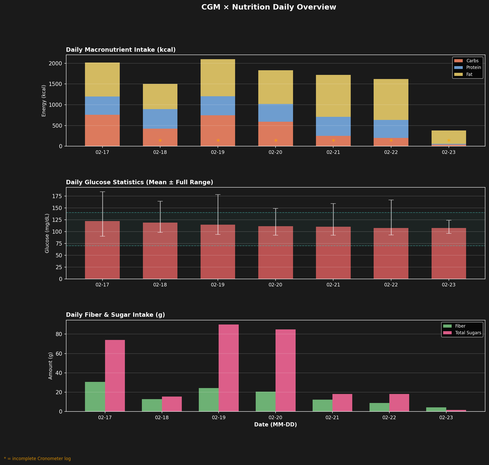
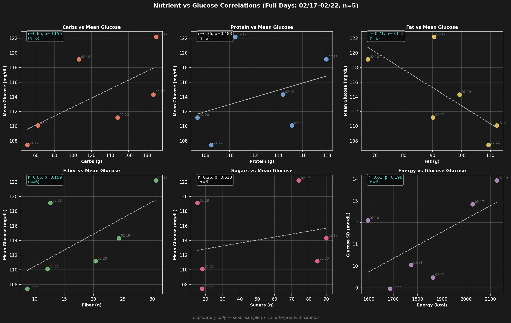
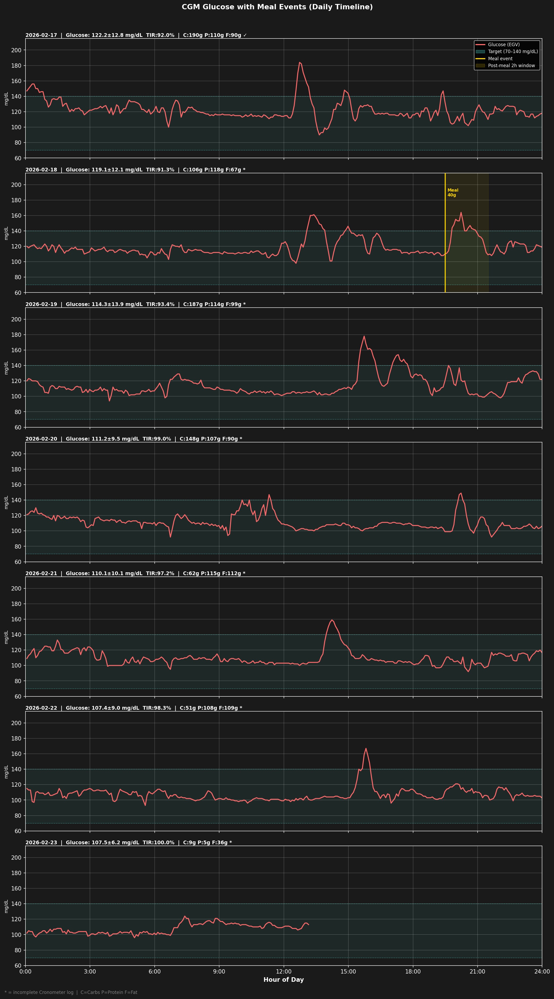
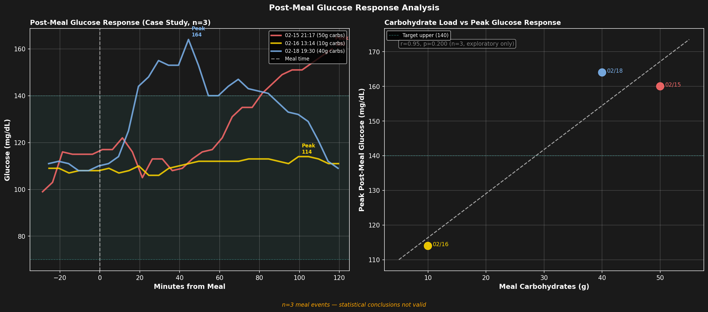
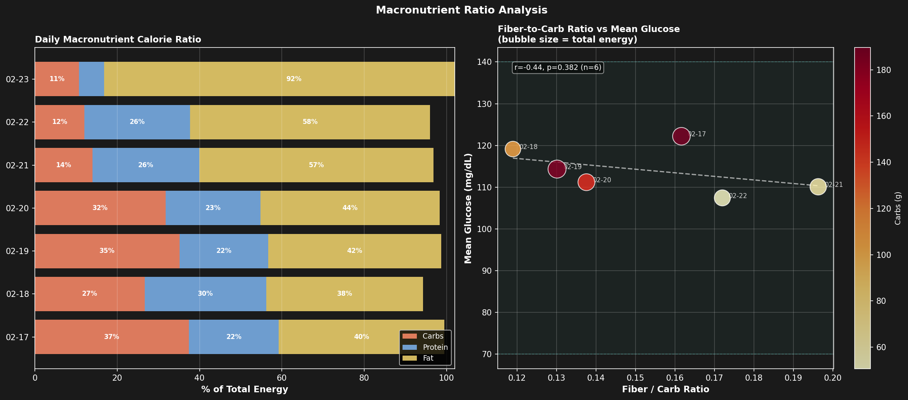

# CGM × 栄養素分析

**分析日**: 2026-02-21
**期間**: 2026-02-15 〜 2026-02-21（CGM + Cronometer 重複期間）
**CGMデバイス**: Dexcom G7
**栄養ログ**: Cronometer

---

## データ概要

| 項目 | 内容 |
|------|------|
| CGMデータ | EGV 1665件（5分間隔） |
| 食事イベント（Dexcom記録） | 3件 |
| 栄養ログ日数（重複期間） | 7日 |
| 完全日（散布図・相関分析用） | 5日間（02/16〜02/20、CGM + 栄養ログ完備） |

**注意事項:**
- 部分的CGM日（02/15 センサー装着開始、02/21 部分記録）: 日次概要チャートに含めるが、散布図・相関分析からは除外
- Cronometer 未完了ログ（*）: チャートには含めるが、テーブルにフラグ表示
- 相関分析は n=5 のため探索的。統計的結論は得られない

---

## 日次栄養素サマリー

| 日付 | エネルギー (kcal) | 炭水化物 (g) | タンパク質 (g) | 脂質 (g) | 食物繊維 (g) | 糖質 (g) |
|------|------------------|-------------|----------------|---------|------------|---------|
| 02-15 * | 2521 | 349.0 | 129.5 | 70.2 | 71.2 | 123.6 |
| 02-16 ✓ | 2882 | 360.9 | 138.6 | 106.5 | 75.1 | 150.3 |
| 02-17 ✓ | 2027 | 189.7 | 110.5 | 90.5 | 30.7 | 74.0 |
| 02-18 * | 1595 | 106.3 | 117.9 | 67.5 | 12.7 | 15.3 |
| 02-19 * | 2125 | 186.7 | 114.4 | 99.3 | 24.3 | 90.1 |
| 02-20 * | 1863 | 148.0 | 107.4 | 90.1 | 20.4 | 84.9 |
| 02-21 * | 621 | 10.2 | 27.2 | 54.6 | 3.1 | 3.6 |

*✓ = 記録完了、* = 未完了ログ*

---

## 日次血糖値サマリー

| 日付 | 平均 | SD | CV (%) | TIR (%) | 最小 | 最大 | n |
|------|------|-----|--------|---------|------|------|---|
| 02-15 | 127.4 | 20.2 | 15.8 | 61.4 | 98 | 160 | 44 |
| 02-16 | 123.0 | 13.7 | 11.1 | 88.5 | 103 | 167 | 288 |
| 02-17 | 122.2 | 12.8 | 10.5 | 92.0 | 90 | 184 | 288 |
| 02-18 | 119.1 | 12.1 | 10.2 | 91.3 | 98 | 164 | 288 |
| 02-19 | 114.3 | 13.9 | 12.2 | 93.4 | 94 | 178 | 288 |
| 02-20 | 111.2 | 9.5 | 8.5 | 99.0 | 92 | 149 | 288 |
| 02-21 | 111.7 | 11.6 | 10.3 | 95.6 | 95 | 159 | 181 |

*TIR = 目標範囲内時間（70〜140 mg/dL）*

---

## チャート

### 1. 日次概要

3パネル構成: 上=マクロ栄養素摂取量（kcal積み上げ棒）、中=日次血糖値統計（mean ± 全範囲）、下=食物繊維・糖質摂取量。

### 2. 栄養素 × 血糖値 散布図

6散布図（回帰線・Pearson r付き）。完全日のみ（02/16〜02/20、n=5）。ティール色のr値は |r| ≥ 0.5 を示す。

### 3. 食事タイムライン

日別血糖値カーブにDexcom記録の食事イベントマーカー（金色縦線）と食後2時間ウィンドウを重ねて表示。

### 4. 食後血糖応答

左: 食事前30分〜食事後120分の血糖値応答曲線（n=3件のケーススタディ）。右: 炭水化物量 vs ピーク血糖値。

### 5. 相関ヒートマップ

栄養素7項目 × 血糖指標5項目のPearson r ヒートマップ（RdBu_r: 赤=正、青=負）。完全日のみ（n=5）。

### 6. マクロ栄養素比率分析

左: 日次マクロ栄養素カロリー比率（積み上げ横棒）。右: 食物繊維/炭水化物比 vs 平均血糖値（バブルサイズ=総エネルギー、色=炭水化物量）。

---

## 主要知見

### 相関分析（探索的、n=5）
- **Protein ↔ TIR (%)**: r=-0.79（負の相関）
- **Protein ↔ High (%)**: r=0.79（正の相関）
- **Protein ↔ Mean Glucose**: r=0.62（正の相関）
- **Fiber ↔ TIR (%)**: r=-0.61（負の相関）
- **Fiber ↔ High (%)**: r=0.61（正の相関）
- **Fiber ↔ Mean Glucose**: r=0.59（正の相関）

### 食後血糖応答（3件）

| # | 食事時刻 | 炭水化物 (g) | ピーク血糖 (mg/dL) | ピークまでの分数 |
|---|---------|-------------|------------------|----------------|
| 1 | 02/15 21:17 | 50 | 160 | 116 |
| 2 | 02/16 13:14 | 10 | 114 | 100 |
| 3 | 02/18 19:30 | 40 | 164 | 44 |

---

## 制限事項

1. **サンプル数が少ない**: 相関分析はn=5日間のみ — 統計的結論は得られない
2. **食事イベントが3件のみ**: Dexcomに記録された食事が少なく、食後分析はケーススタディとして提示
3. **Cronometer未完了ログ**（Completed=false）: 実際の摂取量を過小評価している可能性がある
4. **部分的CGM日の除外**: 02/15（センサー装着開始）・02/21（部分記録）は散布図・相関から除外
5. **Cronometer日次集計に食事時刻がない**: 3件のDexcom食事ログを除き、特定の食事とCGMスパイクの紐付けが困難
6. **交絡因子の未制御**: 運動・ストレス・睡眠の質・センサー較正誤差等が血糖値に影響する

---

*生成日時: 2026-02-21 17:55:30*
*スクリプト: analyze_cgm_food.py*
