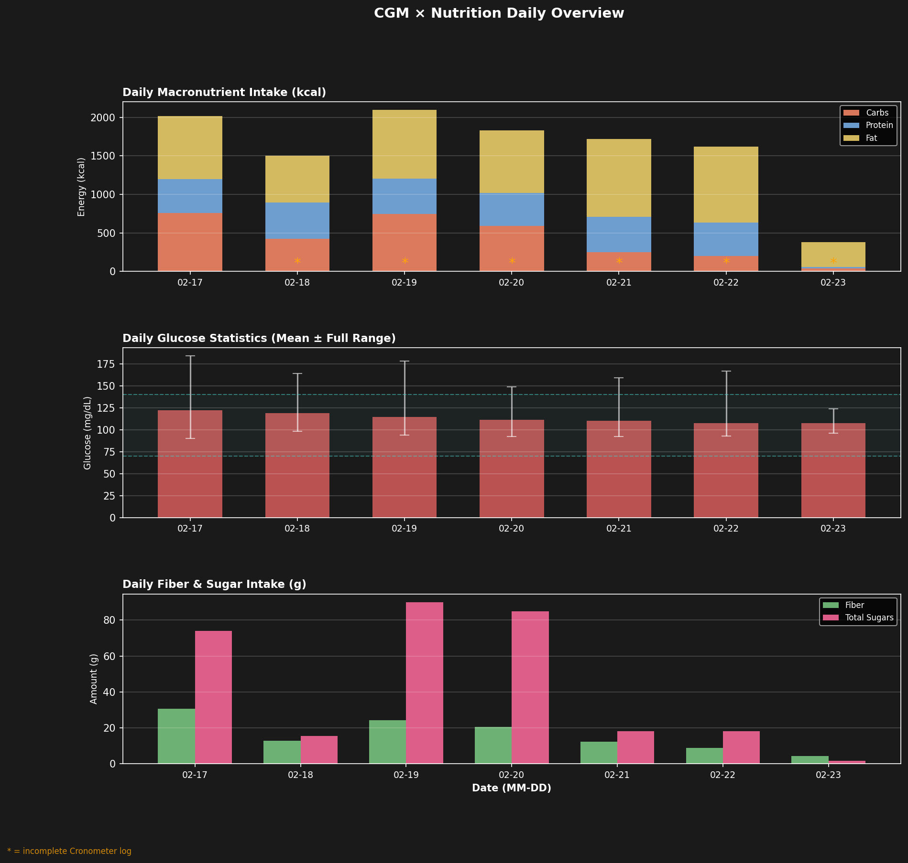
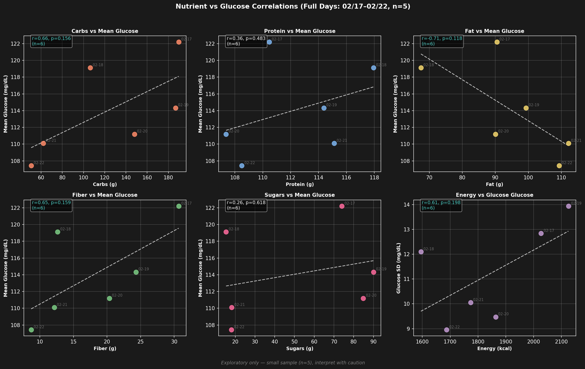
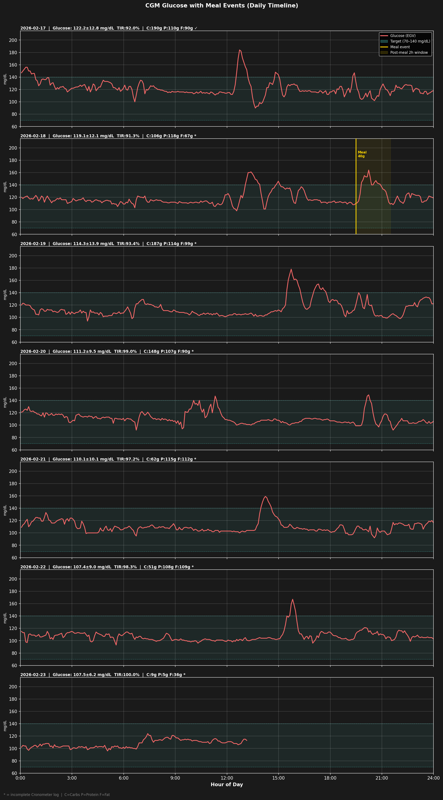
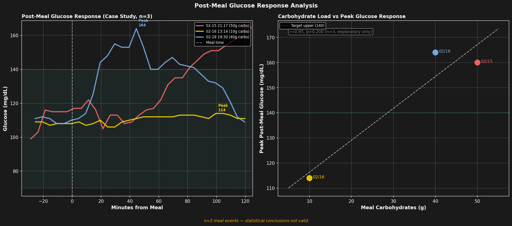
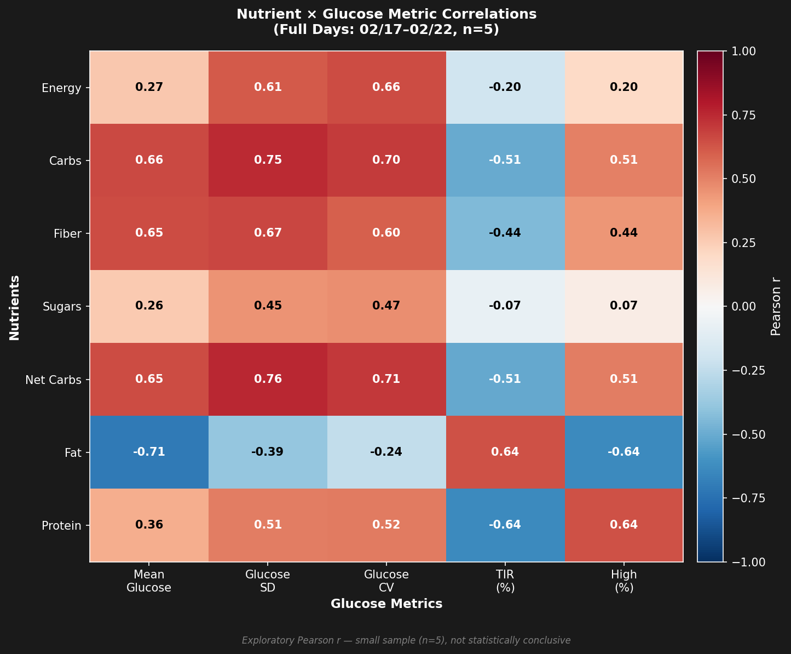
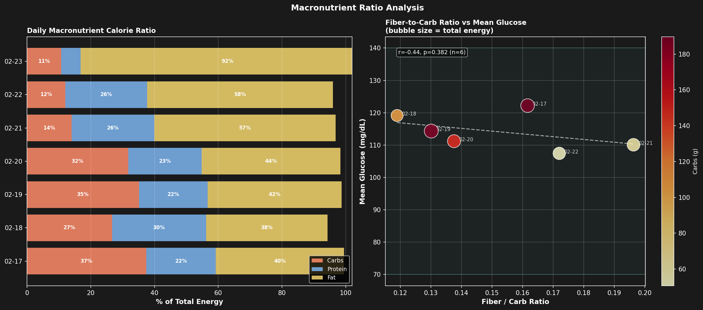

# CGM × 栄養素分析

**分析日**: 2026-02-23
**期間**: 2026-02-17 〜 2026-02-23（CGM + Cronometer 重複期間）
**CGM全記録**: 2026-02-15 〜 2026-02-23（9日間）
**CGMデバイス**: Dexcom G7
**栄養ログ**: Cronometer

---

## データ概要

| 項目 | 内容 |
|------|------|
| CGMデータ | EGV 2216件（5分間隔） |
| 食事イベント（Dexcom記録） | 3件 |
| 栄養ログ日数（重複期間） | 7日 |
| 完全日（散布図・相関分析用） | 6日間（02/17〜02/22、CGM + 栄養ログ完備） |

**注意事項:**
- 部分的CGM日（02/23 当日途中）: 日次概要チャートに含めるが、散布図・相関分析からは除外
- Cronometer 未完了ログ（*）: チャートには含めるが、テーブルにフラグ表示
- 相関分析は n=6 のため探索的。統計的結論は得られない

---

## 日次栄養素サマリー

| 日付 | エネルギー (kcal) | 炭水化物 (g) | タンパク質 (g) | 脂質 (g) | 食物繊維 (g) | 糖質 (g) |
|------|------------------|-------------|----------------|---------|------------|---------|
| 02-17 ✓ | 2027 | 189.7 | 110.5 | 90.5 | 30.7 | 74.0 |
| 02-18 * | 1595 | 106.3 | 117.9 | 67.5 | 12.7 | 15.3 |
| 02-19 * | 2125 | 186.7 | 114.4 | 99.3 | 24.3 | 90.1 |
| 02-20 * | 1863 | 148.0 | 107.4 | 90.1 | 20.4 | 84.9 |
| 02-21 * | 1774 | 61.9 | 115.1 | 112.1 | 12.2 | 18.2 |
| 02-22 * | 1687 | 50.6 | 108.5 | 109.3 | 8.7 | 18.0 |
| 02-23 * | 351 | 9.4 | 5.4 | 35.9 | 4.3 | 1.7 |

*✓ = 記録完了、* = 未完了ログ*

---

## 日次血糖値サマリー

| 日付 | 平均 | SD | CV (%) | TIR (%) | 最小 | 最大 | n |
|------|------|-----|--------|---------|------|------|---|
| 02-17 | 122.2 | 12.8 | 10.5 | 92.0 | 90 | 184 | 288 |
| 02-18 | 119.1 | 12.1 | 10.2 | 91.3 | 98 | 164 | 288 |
| 02-19 | 114.3 | 13.9 | 12.2 | 93.4 | 94 | 178 | 288 |
| 02-20 | 111.2 | 9.5 | 8.5 | 99.0 | 92 | 149 | 288 |
| 02-21 | 110.1 | 10.1 | 9.1 | 97.2 | 92 | 159 | 287 |
| 02-22 | 107.4 | 9.0 | 8.3 | 98.3 | 93 | 167 | 287 |
| 02-23 | 107.5 | 6.2 | 5.8 | 100.0 | 96 | 124 | 158 |

*TIR = 目標範囲内時間（70〜140 mg/dL）*

---

## チャート

### 1. 日次概要

3パネル構成: 上=マクロ栄養素摂取量（kcal積み上げ棒）、中=日次血糖値統計（mean ± 全範囲）、下=食物繊維・糖質摂取量。

### 2. 栄養素 × 血糖値 散布図

6散布図（回帰線・Pearson r付き）。完全日のみ（02/17〜02/22、n=6）。ティール色のr値は |r| ≥ 0.5 を示す。

### 3. 食事タイムライン

日別血糖値カーブにDexcom記録の食事イベントマーカー（金色縦線）と食後2時間ウィンドウを重ねて表示。

### 4. 食後血糖応答

左: 食事前30分〜食事後120分の血糖値応答曲線（n=3件のケーススタディ）。右: 炭水化物量 vs ピーク血糖値。

### 5. 相関ヒートマップ

栄養素7項目 × 血糖指標5項目のPearson r ヒートマップ（RdBu_r: 赤=正、青=負）。完全日のみ（n=6）。

### 6. マクロ栄養素比率分析

左: 日次マクロ栄養素カロリー比率（積み上げ横棒）。右: 食物繊維/炭水化物比 vs 平均血糖値（バブルサイズ=総エネルギー、色=炭水化物量）。

---

## 主要知見

### 相関分析（探索的、n=6）
- **Net Carbs ↔ Glucose SD**: r=0.76（正の相関）
- **Carbs ↔ Glucose SD**: r=0.75（正の相関）
- **Net Carbs ↔ Glucose CV**: r=0.71（正の相関）
- **Fat ↔ Mean Glucose**: r=-0.71（負の相関）
- **Carbs ↔ Glucose CV**: r=0.70（正の相関）
- **Fiber ↔ Glucose SD**: r=0.67（正の相関）

### 食後血糖応答（3件）

| # | 食事時刻 | 炭水化物 (g) | ピーク血糖 (mg/dL) | ピークまでの分数 |
|---|---------|-------------|------------------|----------------|
| 1 | 02/15 21:17 | 50 | 160 | 116 |
| 2 | 02/16 13:14 | 10 | 114 | 100 |
| 3 | 02/18 19:30 | 40 | 164 | 44 |

---

## 制限事項

1. **サンプル数が少ない**: 相関分析はn=6日間のみ — 統計的結論は得られない
2. **食事イベントが3件のみ**: Dexcomに記録された食事が少なく、食後分析はケーススタディとして提示
3. **Cronometer未完了ログ**（Completed=false）: 実際の摂取量を過小評価している可能性がある
4. **部分的CGM日の除外**: 02/23（当日途中データ）は散布図・相関から除外
5. **Cronometer日次集計に食事時刻がない**: 3件のDexcom食事ログを除き、特定の食事とCGMスパイクの紐付けが困難
6. **交絡因子の未制御**: 運動・ストレス・睡眠の質・センサー較正誤差等が血糖値に影響する

---

## 解釈と考察

### 1. 血糖値の明確な改善トレンド

| 指標 | 02/17 | 02/22 | 変化 |
|------|-------|-------|------|
| 平均血糖 | 122.2 | 107.4 | **-14.8 mg/dL** |
| SD | 12.8 | 9.0 | **-3.8** |
| CV | 10.5% | 8.3% | **-2.2pp** |
| TIR | 92.0% | 98.3% | **+6.3pp** |

6日間で平均血糖が約15 mg/dL低下し、変動幅も縮小。TIRは92%→98%と大幅に改善した。

### 2. 食事パターンの変化が血糖改善に寄与

同期間の食事内容を見ると、**炭水化物の大幅な削減**が最も顕著な変化：

- 炭水化物: 189.7g（02/17）→ 50.6g（02/22）— **約73%減**
- 脂質: 90.5g → 109.3g — **約21%増**
- タンパク質: 110〜118g — **安定**

高炭水化物→低炭水化物・高脂質へのシフトと、血糖改善が時系列で一致している。

### 3. 相関分析が示すメカニズム（n=6、探索的）

前回（n=5）との比較で相関パターンが変化した：

| 相関 | 前回（ANALYSIS） | 今回（ANALYSYS2） | 解釈 |
|------|-----------------|-------------------|------|
| **Carbs ↔ Glucose SD** | — | **r=0.75** | 炭水化物が血糖変動を増大 |
| **Net Carbs ↔ Glucose SD** | — | **r=0.76** | 同上（食物繊維除く正味糖質） |
| **Fat ↔ Mean Glucose** | — | **r=-0.71** | 脂質が多い日ほど平均血糖が低い |
| Protein ↔ TIR | r=-0.79 | — | 前回のタンパク質関連は消失 |

前回はタンパク質が血糖に影響するように見えたが、今回データが増えた結果、**炭水化物量が血糖変動（SD, CV）の主因**、**脂質摂取比率の増加が平均血糖の低下と関連**という、より妥当な結果に収束した。

### 4. 前回分析からの進展

- **分析対象**: 5日→6日に増加、より安定した相関推定
- **交絡の軽減**: 前回の Protein ↔ TIR の負の相関は、炭水化物と脂質の比率変化による交絡だった可能性が高い
- **一貫した知見**: 炭水化物が血糖変動の主因であることが前回・今回ともに示唆される

### 5. 実用的示唆

- 炭水化物を150g以下に抑えた日（02/20〜02/22）はTIR ≥ 97%を達成
- 脂質・タンパク質中心の食事への切り替えで、血糖の平均値と変動の両方が改善
- ただし02/21以降のCronometerは未完了ログ（*）のため、実際の摂取量は過小評価の可能性あり

---

*生成日時: 2026-02-23 13:51:04*
*スクリプト: analyze_cgm_food.py*
