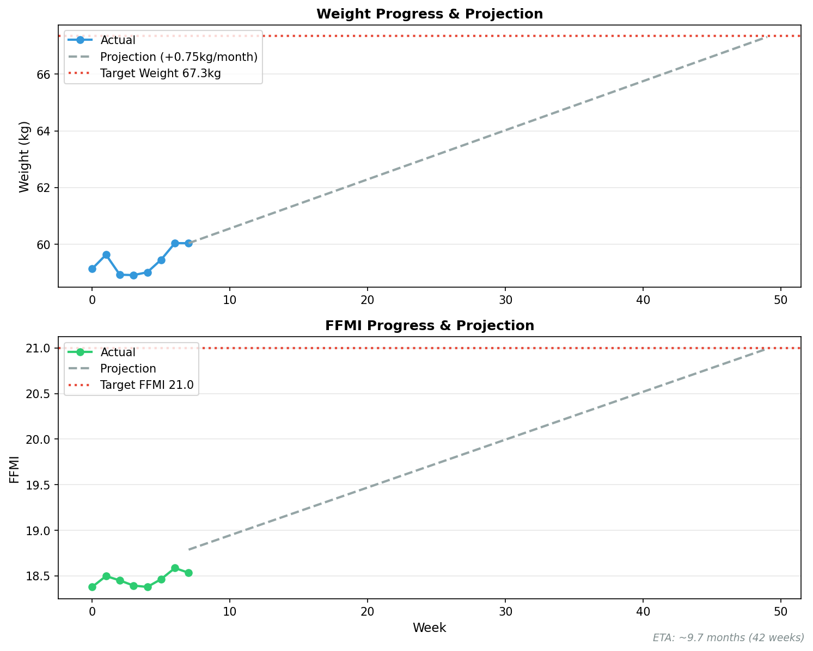

# 💪 筋トレ週次レポート

7日間平均値の推移。前週比でトレンドを確認。

---

## 🎯 目標進捗

**目標**: FFMI 21.0 (体重 67.3kg)
**予測到達**: 約11.3ヶ月後 (48週後)
**増量ペース**: +0.75kg/月

---

## 📊 週次データ

| 週 | 体重 | 筋肉量 | 体脂肪率 | FFMI |
|---|---|---|---|---|
| **2026-W04** | 58.90 (**-0.01**) | 48.64 (-0.07) | 13.0% (+0.20%) | 18.3 (-0.04) |
| **2026-W03** | 58.91 (**-0.01**) | 48.71 (-0.17) | 12.8% (+0.26%) | 18.4 (-0.06) |
| **2026-W02** | 58.93 (**-0.70**) | 48.89 (-0.08) | 12.5% (**-0.80%**) | 18.5 (-0.05) |
| **2026-W01** | 59.63 (+0.49) | 48.97 (**+0.29**) | 13.3% (+0.14%) | 18.5 (**+0.12**) |
| **2025-W52** | 59.14 (**-0.59**) | 48.68 (-0.58) | 13.2% (+0.19%) | 18.4 (-0.21) |
| **2025-W51** | 59.73 (+1.03) | 49.26 (**+0.36**) | 13.0% (+0.87%) | 18.6 (**+0.13**) |
| **2025-W50** | 58.70 (+0.23) | 48.90 (**+0.33**) | 12.1% (**-0.27%**) | 18.5 (**+0.12**) |
| **2025-W49** | 58.47 (+0.71) | 48.57 (**+0.29**) | 12.4% (+0.51%) | 18.3 (**+0.11**) |
