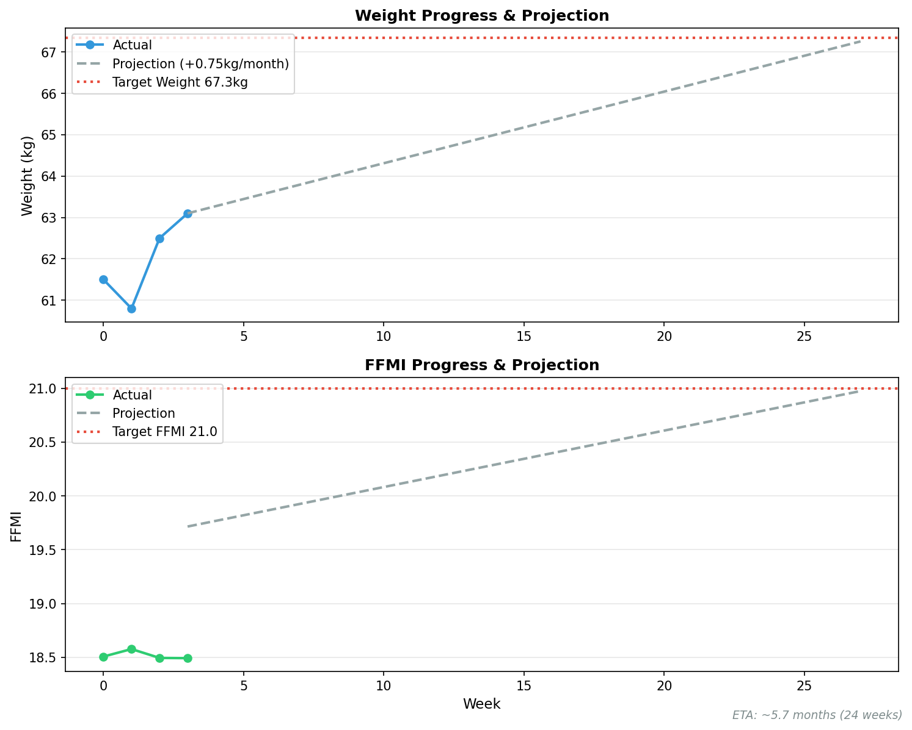

# 💪 筋トレ週次レポート

7日間平均値の推移。前週比でトレンドを確認。

---

## 🎯 目標進捗

**目標**: FFMI 21.0 (体重 67.3kg)
**予測到達**: 約11.9ヶ月後 (51週後)
**増量ペース**: +0.75kg/月

---

## 📊 週次データ

| 週 | 体重 | 筋肉量 | 体脂肪率 | FFMI |
|---|---|---|---|---|
| **2026-W18** | 58.43 (**-0.72**) | 48.47 (**+0.47**) | 12.4% (**-1.94%**) | 18.3 (**+0.18**) |
| **2026-W17** | 59.15 (+0.05) | 48.00 (-0.30) | 14.4% (+0.57%) | 18.1 (-0.10) |
| **2026-W16** | 59.10 (**-1.20**) | 48.30 (-0.40) | 13.8% (**-1.05%**) | 18.2 (-0.14) |
| **2026-W15** | 60.30 (+0.88) | 48.70 (-0.14) | 14.9% (+1.57%) | 18.4 (-0.06) |
| **2026-W14** | 59.42 (**-0.25**) | 48.84 (-0.01) | 13.3% (**-0.35%**) | 18.4 (**+0.00**) |
| **2026-W13** | 59.67 (+0.02) | 48.85 (-0.48) | 13.6% (+0.86%) | 18.4 (-0.17) |
| **2026-W12** | 59.65 (+0.68) | 49.33 (**+0.51**) | 12.8% (+0.12%) | 18.6 (**+0.18**) |
| **2026-W11** | 58.97 (+0.02) | 48.81 (-0.07) | 12.7% (+0.22%) | 18.4 (-0.04) |
