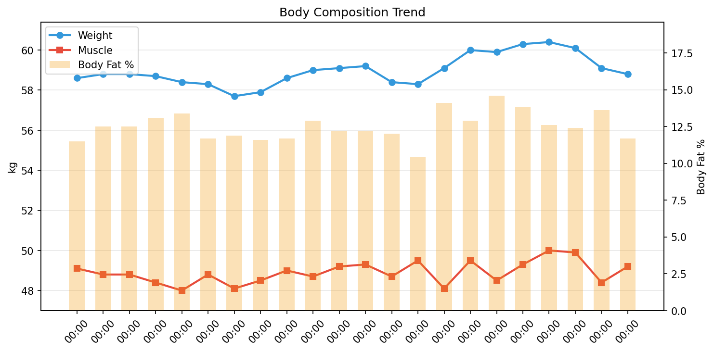

# 体組成レポート

**期間**: 2025-12-01 〜 2025-12-16（15日間）

---

## サマリー

| 指標 | 開始 | 終了 | 変化 |
|------|------|------|------|
| 体重 | 58.60kg | 59.10kg | **+0.50kg** |
| 筋肉量 | 49.10kg | 48.10kg | **-1.00kg** |
| 体脂肪率 | 11.5% | 14.1% | **+2.60%** |
| 除脂肪体重 | 51.86kg | 50.77kg | **-1.09kg** |
| FFMI | 18.6 | 18.2 | **-0.38** |

> 除脂肪体重 = 体重 − 体脂肪量

---

## 回復

### 睡眠

> 筋肉の回復には質の良い睡眠が不可欠。深い睡眠中に成長ホルモンが分泌される。

| 指標 | 値 | 推奨 |
|------|-----|------|
| 平均睡眠時間 | 6.2時間 | 7-9時間 |
| 平均効率 | 82% | 85%以上 |
| 深い睡眠 | 48分 (13%) | 13-23% |
| レム睡眠 | 93分 (25%) | 20-25% |

### HRVとコンディション

> HRVは自律神経のバランスを反映。心拍数と組み合わせて回復状態を評価。

| 指標 | 値 | 変化 |
|------|-----|------|
| 平均RMSSD | 37.0ms | -1.77ms |
| 平均安静時心拍数 | 51.9bpm | +2.00bpm |

> HRV上昇 & 心拍数低下 = 回復良好、HRV低下 & 心拍数上昇 = 疲労

---

## トレーニング

#### トレーニング負荷

> HRVの変動パターンから負荷を推定。

| 指標 | 値 |
|------|-----|
| HRV変動幅 | 4.3ms |
| 回復サイクル | 1回 |
| 平均乖離率 | -1.8% |

> 変動幅が大きい = 負荷がかかっている、サイクル数が多い = 回復できている

#### 有酸素運動

> 歩数と活動強度の記録。EAT（運動活動熱産生）は個別の運動による消費カロリー。

**サマリー**

| 指標 | 平均 | 合計 |
|------|------|------|
| 歩数 | 6,192 歩 | 99,064 歩 |
| とても活発 | 18 分/日 | - |
| やや活発 | 21 分/日 | - |
| **EAT (運動)** | **315 kcal/日** | **4089 kcal** |

**日別データ**

| 日付 | 歩数 | とても活発 | やや活発 |
|------|------|------------|----------|
| 12-01 | 6,540 | 41 | 35 |
| 12-02 | 6,232 | 12 | 10 |
| 12-03 | 6,799 | 20 | 4 |
| 12-04 | 5,392 | 14 | 34 |
| 12-05 | 6,747 | 18 | 5 |
| 12-06 | 4,935 | 11 | 6 |
| 12-07 | 6,654 | 15 | 31 |
| 12-08 | 7,101 | 15 | 18 |
| 12-09 | 6,297 | 33 | 11 |
| 12-10 | 6,376 | 20 | 20 |
| 12-11 | 5,842 | 11 | 9 |
| 12-12 | 7,400 | 15 | 9 |
| 12-13 | 5,214 | 16 | 48 |
| 12-14 | 7,027 | 13 | 20 |
| 12-15 | 5,549 | 18 | 45 |
| 12-16 | 4,959 | 17 | 25 |

#### 筋トレ

> トレーニングログは [Hevy](https://hevy.com/profile) を参照

---

## 栄養

> PFCバランスとマクロ栄養素の記録。

| 日付 | カロリー | タンパク質 | 脂質 | 炭水化物 | 食物繊維 | P | F | C |
|------|----------|------------|------|----------|----------|---|---|---|
| 12-03 | 587 | 61.1 | 29.1 | 18.3 | 1.7 | 42 | 45 | 12 |
| 12-04 | - | - | - | - | - | - | - | - |
| 12-05 | - | - | - | - | - | - | - | - |
| 12-06 | - | - | - | - | - | - | - | - |
| 12-07 | - | - | - | - | - | - | - | - |
| 12-08 | - | - | - | - | - | - | - | - |
| 12-09 | - | - | - | - | - | - | - | - |
| 12-10 | - | - | - | - | - | - | - | - |
| 12-11 | - | - | - | - | - | - | - | - |
| 12-12 | 1,361 | 76.5 | 41.8 | 114.8 | 12.1 | 22 | 28 | 34 |
| 12-13 | 1,702 | 101.4 | 59.7 | 136.2 | 19.1 | 24 | 32 | 32 |
| 12-14 | 1,255 | 76.7 | 31.1 | 165.7 | 19.4 | 24 | 22 | 53 |
| 12-15 | 1,920 | 119.0 | 76.3 | 188.7 | 20.0 | 25 | 36 | 39 |
| 12-16 | 497 | 19.4 | 30.9 | 32.3 | 3.7 | 16 | 56 | 26 |

---

## カロリー分析

> **TDEE（総消費エネルギー量）の内訳**: Out ≈ BMR + NEAT + TEF + EAT
>
> - **Balance**: カロリー収支（In - Out）
> - **In**: 摂取カロリー
> - **Out**: 消費カロリー（TDEE）
> - **BMR**: 基礎代謝
> - **NEAT**: 非運動性活動熱産生（日常活動による消費）
> - **TEF**: 食事誘発性熱産生（消化による消費、摂取カロリーの約10%）
> - **EAT**: 運動活動熱産生（意図的な運動による消費）

| 日付 | 体重 | Balance | In | Out | BMR | NEAT | TEF | EAT |
|------|------|------|------|------|------|------|------|------|
| 12-01 | 58.6 | - | - | 2255 | 1416 | 926 | 0 | 0 |
| 12-02 | 58.8 | - | - | 2035 | 1408 | 684 | 0 | 0 |
| 12-03 | 58.8 | -1483 | 587 | 2070 | 1408 | 399 | 59 | 322 |
| 12-04 | 58.7 | -2063 | 0 | 2063 | 1396 | 445 | 0 | 252 |
| 12-05 | 58.4 | -2177 | 0 | 2177 | 1383 | 570 | 0 | 270 |
| 12-06 | 58.3 | -2026 | 0 | 2026 | 1406 | 374 | 0 | 259 |
| 12-07 | 57.7 | -2211 | 0 | 2211 | 1386 | 343 | 0 | 555 |
| 12-08 | 57.9 | -2082 | 0 | 2082 | 1396 | 538 | 0 | 202 |
| 12-09 | 58.6 | -2062 | 0 | 2062 | 1413 | 432 | 0 | 277 |
| 12-10 | 59.0 | -2048 | 0 | 2048 | 1405 | 419 | 0 | 342 |
| 12-11 | 59.1 | -2029 | 0 | 2029 | 1419 | 424 | 0 | 252 |
| 12-12 | 59.2 | -834 | 1361 | 2195 | 1421 | 593 | 136 | 282 |
| 12-14 | 58.4 | -957 | 1255 | 2212 | 1403 | 603 | 126 | 266 |
| 12-15 | 58.3 | -292 | 1920 | 2212 | 1426 | 533 | 192 | 353 |
| 12-16 | 59.1 | -979 | 497 | 1476 | 1388 | 477 | 50 | 0 |

---

## 詳細データ

### 推移

### 体組成データ

| 日付 | 体重 | 筋肉量 | 体脂肪率 | 内臓脂肪 | 体水分率 |
|------|------|------|------|------|------|
| 12-01 | 58.6 | 49.1 | 11.5 | 3.0 | 61.7 |
| 12-02 | 58.8 | 48.8 | 12.5 | 4.0 | 60.5 |
| 12-03 | 58.8 | 48.8 | 12.5 | 4.0 | 60.5 |
| 12-04 | 58.7 | 48.4 | 13.1 | 4.5 | 59.6 |
| 12-05 | 58.4 | 48.0 | 13.4 | 4.5 | 58.9 |
| 12-06 | 58.3 | 48.8 | 11.7 | 3.0 | 60.8 |
| 12-07 | 57.7 | 48.1 | 11.9 | 3.0 | 59.9 |
| 12-08 | 57.9 | 48.5 | 11.6 | 3.0 | 60.5 |
| 12-09 | 58.6 | 49.0 | 11.7 | 3.5 | 61.3 |
| 12-10 | 59.0 | 48.7 | 12.9 | 4.5 | 60.0 |
| 12-11 | 59.1 | 49.2 | 12.2 | 4.0 | 61.1 |
| 12-12 | 59.2 | 49.3 | 12.2 | 4.0 | 60.8 |
| 12-14 | 58.4 | 48.7 | 12.0 | 3.5 | 60.1 |
| 12-15 | 58.3 | 49.5 | 10.4 | 2.0 | 61.6 |
| 12-16 | 59.1 | 48.1 | 14.1 | 5.0 | 58.5 |
