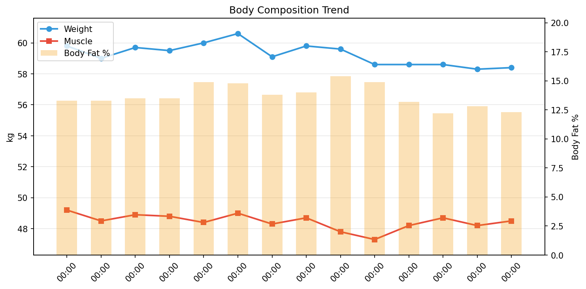

# 💪 筋トレデイリーレポート

**期間**: 2026-04-01 〜 2026-04-30（14日間）

---

## 📊 サマリー

| 指標 | 開始 | 終了 | 変化 |
|------|------|------|------|
| 体重 | 59.80kg | 58.40kg | **-1.40kg** |
| 筋肉量 | 49.20kg | 48.50kg | **-0.70kg** |
| 体脂肪率 | 13.3% | 12.3% | **-1.00%** |
| FFMI | 18.6 | 18.3 | **-0.22** |

## 🧬 体組成

| 日付 | 体重 | 筋肉 | 脂肪 | 骨 | LBM | 体脂肪率 | 体水分率 |
|------|------|------|------|-----|-----|----------|----------|
| 04-01 | 59.8 | 49.2 | 7.95 | 2.7 | 51.8 | 13.3% | 59.9% |
| 04-02 | 59.0 | 48.5 | 7.85 | 2.7 | 51.2 | 13.3% | 59.3% |
| 04-04 | 59.7 | 48.9 | 8.06 | 2.7 | 51.6 | 13.5% | 59.7% |
| 04-05 | 59.5 | 48.8 | 8.03 | 2.7 | 51.5 | 13.5% | 59.3% |
| 04-09 | 60.0 | 48.4 | 8.94 | 2.7 | 51.1 | 14.9% | 57.8% |
| 04-12 | 60.6 | 49.0 | 8.97 | 2.7 | 51.6 | 14.8% | 58.2% |
| 04-16 | 59.1 | 48.3 | 8.16 | 2.7 | 50.9 | 13.8% | 58.5% |
| 04-22 | 59.8 | 48.7 | 8.37 | 2.7 | 51.4 | 14.0% | 59.1% |
| 04-23 | 59.6 | 47.8 | 9.18 | 2.6 | 50.4 | 15.4% | 57.1% |
| 04-24 | 58.6 | 47.3 | 8.73 | 2.6 | 49.9 | 14.9% | 57.0% |
| 04-26 | 58.6 | 48.2 | 7.74 | 2.7 | 50.9 | 13.2% | 58.8% |
| 04-28 | 58.6 | 48.7 | 7.15 | 2.7 | 51.5 | 12.2% | 60.9% |
| 04-29 | 58.3 | 48.2 | 7.46 | 2.7 | 50.8 | 12.8% | 59.1% |
| 04-30 | 58.4 | 48.5 | 7.18 | 2.7 | 51.2 | 12.3% | 59.9% |

## 🍽️ 栄養

> PFCバランスとマクロ栄養素の記録。

| 日付 | カロリー | タンパク質 | 脂質 | 炭水化物 | 食物繊維 | P | F | C |
|------|----------|------------|------|----------|----------|---|---|---|
| 04-01 | - | - | - | - | - | - | - | - |
| 04-04 | - | - | - | - | - | - | - | - |
| 04-05 | - | - | - | - | - | - | - | - |
| 04-06 | - | - | - | - | - | - | - | - |
| 04-07 | - | - | - | - | - | - | - | - |
| 04-08 | - | - | - | - | - | - | - | - |
| 04-09 | - | - | - | - | - | - | - | - |
| 04-10 | - | - | - | - | - | - | - | - |
| 04-11 | - | - | - | - | - | - | - | - |
| 04-12 | - | - | - | - | - | - | - | - |
| 04-13 | - | - | - | - | - | - | - | - |
| 04-14 | - | - | - | - | - | - | - | - |
| 04-15 | - | - | - | - | - | - | - | - |
| 04-16 | - | - | - | - | - | - | - | - |
| 04-17 | - | - | - | - | - | - | - | - |
| 04-18 | - | - | - | - | - | - | - | - |
| 04-20 | - | - | - | - | - | - | - | - |
| 04-21 | - | - | - | - | - | - | - | - |
| 04-22 | - | - | - | - | - | - | - | - |
| 04-23 | - | - | - | - | - | - | - | - |
| 04-24 | - | - | - | - | - | - | - | - |
| 04-25 | - | - | - | - | - | - | - | - |
| 04-26 | - | - | - | - | - | - | - | - |
| 04-27 | - | - | - | - | - | - | - | - |
| 04-28 | 1816 | 129.3 | 95.3 | 122.3 | 23.1 | 28 | 47 | 27 |
| 04-29 | 2023 | 139.6 | 103.2 | 148.5 | 26.9 | 28 | 46 | 29 |
| 04-30 | - | - | - | - | - | - | - | - |

## 🔥 カロリー分析

> **TDEE（総消費エネルギー量）の内訳**: Out ≈ BMR + NEAT + TEF + EAT
>
> - **Balance**: カロリー収支（In - Out）
> - **In**: 摂取カロリー
> - **Out**: 消費カロリー（TDEE）
> - **BMR**: 基礎代謝
> - **NEAT**: 非運動性活動熱産生（日常活動による消費）
> - **TEF**: 食事誘発性熱産生（消化による消費、摂取カロリーの約10%）
> - **EAT**: 運動活動熱産生（意図的な運動による消費）

| 日付 | 体重 | Balance | In | Out | BMR | NEAT | TEF | EAT |
|------|------|------|------|------|------|------|------|------|
| 04-01 | 59.8 | -578 | 0 | 578 | 1420 | 51 | 0 | 88 |
| 04-02 | 59.0 | - | - | - | 1399 | - | 0 | 0 |
| 04-04 | 59.7 | -2093 | 0 | 2093 | 1413 | 480 | 0 | 252 |
| 04-05 | 59.5 | -1973 | 0 | 1973 | 1408 | 316 | 0 | 264 |
| 04-09 | 60.0 | -2046 | 0 | 2046 | 1399 | 421 | 0 | 251 |
| 04-12 | 60.6 | -2034 | 0 | 2034 | 1416 | 527 | 0 | 165 |
| 04-16 | 59.1 | -431 | 0 | 431 | 1393 | 64 | 0 | 0 |
| 04-22 | 59.8 | -2460 | 0 | 2460 | 1407 | 1050 | 0 | 315 |
| 04-23 | 59.6 | -1807 | 0 | 1807 | 1382 | 288 | 0 | 78 |
| 04-24 | 58.6 | -1895 | 0 | 1895 | 1364 | 293 | 0 | 276 |
| 04-26 | 58.6 | -2657 | 0 | 2657 | 1391 | 921 | 0 | 601 |
| 04-28 | 58.6 | -353 | 1816 | 2169 | 1405 | 563 | 182 | 347 |
| 04-29 | 58.3 | 111 | 2023 | 1912 | 1390 | 493 | 202 | 45 |
| 04-30 | 58.4 | -473 | 0 | 473 | 1399 | 19 | 0 | 0 |

## 🛌 回復

> 睡眠とHRVで回復状態を評価。HRV上昇 & HR低下 = 回復良好

| 日付 | 睡眠(h) | 深い(m) | HRV(ms) | HR(bpm) |
|------|---------|---------|---------|---------|
| 04-01 | 6.4 | 89 | 36 | 54 |
| 04-02 | - | - | - | - |
| 04-03 | - | - | - | - |
| 04-04 | 6.2 | 77 | 35 | 54 |
| 04-05 | 5.8 | 46 | 46 | 53 |
| 04-06 | 5.5 | 72 | 38 | 52 |
| 04-07 | 5.8 | 52 | 32 | 54 |
| 04-08 | 6.2 | 48 | 33 | 55 |
| 04-09 | 6.2 | 60 | 34 | 54 |
| 04-10 | 5.3 | 78 | 31 | 54 |
| 04-11 | 5.7 | 61 | 26 | 56 |
| 04-12 | 5.4 | 54 | 28 | 57 |
| 04-13 | 4.8 | 62 | 34 | 55 |
| 04-14 | 5.9 | 97 | 33 | 54 |
| 04-15 | 5.1 | 93 | 28 | 53 |
| 04-16 | 5.3 | 64 | 42 | 52 |
| 04-17 | 6.9 | 89 | 41 | 52 |
| 04-18 | 5.5 | 93 | 31 | 54 |
| 04-19 | - | - | - | - |
| 04-20 | 3.3 | 32 | 34 | 52 |
| 04-21 | 5.3 | 60 | 31 | 55 |
| 04-22 | 7.6 | 95 | 36 | 54 |
| 04-23 | 8.4 | 78 | 42 | 53 |
| 04-24 | 8.3 | 79 | 52 | 52 |
| 04-25 | 8.3 | 86 | 43 | 50 |
| 04-26 | 6.2 | 81 | 47 | 50 |
| 04-27 | 7.9 | 94 | 48 | 49 |
| 04-28 | 6.8 | 57 | 40 | 49 |
| 04-29 | 7.9 | 89 | 52 | 49 |
| 04-30 | 8.2 | 82 | 37 | 49 |

### 💪 筋トレ判断（HRVベース）

> **Kiviniemiアルゴリズム**: 7日移動平均 ± 0.5SD で判定
> - 🟢 通常トレーニングOK：HRV > 平均 + 0.5SD
> - 🟢 中強度（70%）：正常範囲内
> - 🟡 軽め（50%）または休養：HRV < 平均 - 0.5SD

| 日付 | HRV | 7日平均 | 範囲 | 判定 |
|------|-----|---------|------|------|
| 04-01 | 36.1 | 32.4 | 28.7 - 36.1 | 🟢 通常トレーニングOK |
| 04-02 | - | - | - - - | ⚪ データなし |
| 04-03 | - | - | - - - | ⚪ データなし |
| 04-04 | 35.5 | 34.0 | 30.8 - 37.2 | 🟢 中強度トレーニング（70%） |
| 04-05 | 46.2 | 36.8 | 33.3 - 40.2 | 🟢 通常トレーニングOK |
| 04-06 | 38.5 | 37.9 | 34.7 - 41.1 | 🟢 中強度トレーニング（70%） |
| 04-07 | 31.8 | 38.1 | 35.1 - 41.2 | 🟡 休養または軽め（50%） |
| 04-08 | 32.6 | 36.1 | 33.6 - 38.7 | 🟡 休養または軽め（50%） |
| 04-09 | 33.8 | 36.3 | 33.9 - 38.8 | 🟡 休養または軽め（50%） |
| 04-10 | 30.8 | 35.6 | 32.9 - 38.3 | 🟡 休養または軽め（50%） |
| 04-11 | 25.9 | 34.2 | 31.0 - 37.5 | 🟡 休養または軽め（50%） |
| 04-12 | 27.7 | 31.6 | 29.5 - 33.6 | 🟡 休養または軽め（50%） |
| 04-13 | 34.2 | 31.0 | 29.4 - 32.5 | 🟢 通常トレーニングOK |
| 04-14 | 32.9 | 31.1 | 29.5 - 32.7 | 🟢 通常トレーニングOK |
| 04-15 | 28.2 | 30.5 | 28.9 - 32.1 | 🟡 休養または軽め（50%） |
| 04-16 | 42.3 | 31.7 | 29.0 - 34.5 | 🟢 通常トレーニングOK |
| 04-17 | 40.8 | 33.2 | 29.9 - 36.4 | 🟢 通常トレーニングOK |
| 04-18 | 31.2 | 33.9 | 31.0 - 36.8 | 🟢 中強度トレーニング（70%） |
| 04-19 | - | - | - - - | ⚪ データなし |
| 04-20 | 34.2 | 34.8 | 32.3 - 37.4 | 🟢 中強度トレーニング（70%） |
| 04-21 | 31.3 | 34.4 | 31.8 - 37.0 | 🟡 休養または軽め（50%） |
| 04-22 | 35.8 | 34.8 | 32.2 - 37.4 | 🟢 中強度トレーニング（70%） |
| 04-23 | 42.4 | 36.9 | 34.4 - 39.3 | 🟢 通常トレーニングOK |
| 04-24 | 51.8 | 38.2 | 34.5 - 41.9 | 🟢 中強度まで（睡眠不足） |
| 04-25 | 43.2 | 38.6 | 34.8 - 42.4 | 🟢 通常トレーニングOK |
| 04-26 | 47.5 | 40.9 | 37.2 - 44.6 | 🟢 通常トレーニングOK |
| 04-27 | 48.5 | 42.9 | 39.3 - 46.5 | 🟢 通常トレーニングOK |
| 04-28 | 39.5 | 44.1 | 41.3 - 46.8 | 🟡 休養または軽め（50%） |
| 04-29 | 52.4 | 46.5 | 44.0 - 48.9 | 🟢 通常トレーニングOK |
| 04-30 | 37.0 | 45.7 | 42.7 - 48.7 | 🟡 休養または軽め（50%） |

---

## 📈 詳細データ

### 📉 推移

### 📋 日別総合データ

| 日付 | 体重 | 筋肉量 | 体脂肪率 | FFMI | カロリー収支 | プロテイン | 睡眠 |
|------|------|------|------|------|------|------|------|
| 04-01 | 59.8 | 49.2 | 13.3 | 18.6 | -578 | 0.0 | 6.4 |
| 04-02 | 59.0 | 48.5 | 13.3 | 18.3 | - | - | - |
| 04-04 | 59.7 | 48.9 | 13.5 | 18.5 | -2093 | 0.0 | 6.2 |
| 04-05 | 59.5 | 48.8 | 13.5 | 18.4 | -1973 | 0.0 | 5.8 |
| 04-09 | 60.0 | 48.4 | 14.9 | 18.3 | -2046 | 0.0 | 6.2 |
| 04-12 | 60.6 | 49.0 | 14.8 | 18.5 | -2034 | 0.0 | 5.4 |
| 04-16 | 59.1 | 48.3 | 13.8 | 18.2 | -431 | 0.0 | 5.3 |
| 04-22 | 59.8 | 48.7 | 14.0 | 18.4 | -2460 | 0.0 | 7.6 |
| 04-23 | 59.6 | 47.8 | 15.4 | 18.1 | -1807 | 0.0 | 8.4 |
| 04-24 | 58.6 | 47.3 | 14.9 | 17.9 | -1895 | 0.0 | 8.3 |
| 04-26 | 58.6 | 48.2 | 13.2 | 18.2 | -2657 | 0.0 | 6.2 |
| 04-28 | 58.6 | 48.7 | 12.2 | 18.4 | -353 | 129.3 | 6.8 |
| 04-29 | 58.3 | 48.2 | 12.8 | 18.2 | 111 | 139.6 | 7.9 |
| 04-30 | 58.4 | 48.5 | 12.3 | 18.3 | -473 | 0.0 | 8.2 |