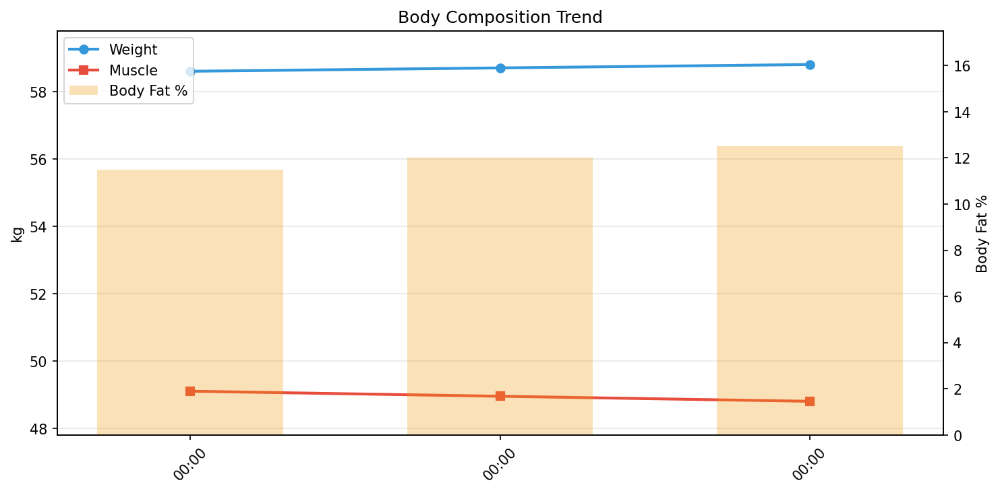

# 週次体組成レポート

**期間**: 2025-12-01 〜 2025-12-03（3日間）

---

## サマリー

| 指標 | 開始 | 終了 | 変化 |
|------|------|------|------|
| 体重 | 58.60kg | 58.80kg | **+0.20kg** |
| 筋肉量 | 49.10kg | 48.80kg | **-0.30kg** |
| 体脂肪率 | 11.5% | 12.5% | **+1.00%** |
| 除脂肪体重 | 51.86kg | 51.45kg | **-0.41kg** |

> 除脂肪体重 = 体重 − 体脂肪量

---

## 推移

---

## 日別データ

| 日付 | 体重 | 筋肉量 | 体脂肪率 | 体脂肪量 | 除脂肪 | 内臓脂肪 | 基礎代謝 | 骨量 | 体内年齢 | 体水分率 | 筋質点数 |
|------|------|--------|----------|----------|--------|----------|----------|------|----------|----------|----------|
| 12-01 | 58.6 | 49.1 | 11.5 | 6.74 | 51.9 | 3.0 | 1416 | 2.7 | 26 | 61.7 | 70 |
| 12-02 | 58.7 | 49.0 | 12.0 | 7.04 | 51.7 | 3.5 | 1412 | 2.7 | 26 | 61.1 | 70 |
| 12-03 | 58.8 | 48.8 | 12.5 | 7.35 | 51.4 | 4.0 | 1408 | 2.7 | 27 | 60.5 | 69 |
