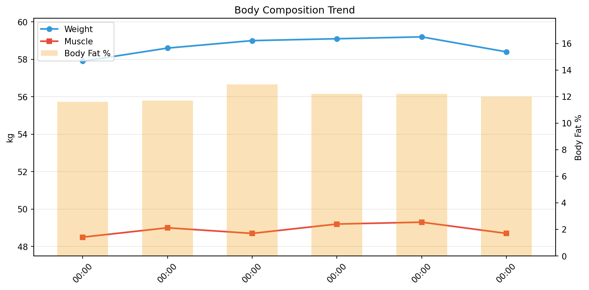

# 💪 筋トレデイリーレポート

**期間**: 2025-12-08 〜 2025-12-14（6日間）

---

## 📊 サマリー

| 指標 | 開始 | 終了 | 変化 |
|------|------|------|------|
| 体重 | 57.90kg | 58.40kg | **+0.50kg** |
| 筋肉量 | 48.50kg | 48.70kg | **+0.20kg** |
| 体脂肪率 | 11.6% | 12.0% | **+0.40%** |
| 除脂肪体重 | 51.18kg | 51.39kg | **+0.21kg** |
| FFMI | 18.3 | 18.4 | **+0.07** |

> 除脂肪体重 = 体重 − 体脂肪量

---

## 🛌 回復

### 😴 睡眠

> 筋肉の回復には質の良い睡眠が不可欠。深い睡眠中に成長ホルモンが分泌される。

| 指標 | 値 | 推奨 |
|------|-----|------|
| 平均睡眠時間 | 6.0時間 | 7-9時間 |
| 平均効率 | 81% | 85%以上 |
| 深い睡眠 | 41分 (11%) | 13-23% |
| レム睡眠 | 94分 (26%) | 20-25% |

### ❤️ HRVとコンディション

> HRVは自律神経のバランスを反映。心拍数と組み合わせて回復状態を評価。

| 指標 | 値 | 変化 |
|------|-----|------|
| 平均RMSSD | 36.0ms | -0.85ms |
| 平均安静時心拍数 | 51.7bpm | ±0bpm |

> HRV上昇 & 心拍数低下 = 回復良好、HRV低下 & 心拍数上昇 = 疲労

---

## 🏋️ トレーニング

#### ⚡ トレーニング負荷

> HRVの変動パターンから負荷を推定。

| 指標 | 値 |
|------|-----|
| HRV変動幅 | 4.6ms |
| 回復サイクル | 0回 |
| 平均乖離率 | 4.2% |

> 変動幅が大きい = 負荷がかかっている、サイクル数が多い = 回復できている

#### 🏃 有酸素運動

> 歩数と活動強度の記録。EAT（運動活動熱産生）は個別の運動による消費カロリー。

**サマリー**

| 指標 | 平均 | 合計 |
|------|------|------|
| 歩数 | 6,465 歩 | 45,257 歩 |
| とても活発 | 18 分/日 | - |
| やや活発 | 19 分/日 | - |
| **EAT (運動)** | **302 kcal/日** | **1812 kcal** |

**日別データ**

| 日付 | 歩数 | とても活発 | やや活発 |
|------|------|------------|----------|
| 12-08 | 7,101 | 15 | 18 |
| 12-09 | 6,297 | 33 | 11 |
| 12-10 | 6,376 | 20 | 20 |
| 12-11 | 5,842 | 11 | 9 |
| 12-12 | 7,400 | 15 | 9 |
| 12-13 | 5,214 | 16 | 48 |
| 12-14 | 7,027 | 13 | 20 |

#### 💪 筋トレ

> トレーニングログは [Hevy](https://hevy.com/profile) を参照

---

## 🍽️ 栄養

> PFCバランスとマクロ栄養素の記録。

| 日付 | カロリー | タンパク質 | 脂質 | 炭水化物 | 食物繊維 | P | F | C |
|------|----------|------------|------|----------|----------|---|---|---|
| 12-08 | - | - | - | - | - | - | - | - |
| 12-09 | - | - | - | - | - | - | - | - |
| 12-10 | - | - | - | - | - | - | - | - |
| 12-11 | - | - | - | - | - | - | - | - |
| 12-12 | 1,361 | 76.5 | 41.8 | 114.8 | 12.1 | 22 | 28 | 34 |
| 12-13 | 1,702 | 101.4 | 59.7 | 136.2 | 19.1 | 24 | 32 | 32 |
| 12-14 | 1,255 | 76.7 | 31.1 | 165.7 | 19.4 | 24 | 22 | 53 |

---

## 🔥 カロリー分析

> **TDEE（総消費エネルギー量）の内訳**: Out ≈ BMR + NEAT + TEF + EAT
>
> - **Balance**: カロリー収支（In - Out）
> - **In**: 摂取カロリー
> - **Out**: 消費カロリー（TDEE）
> - **BMR**: 基礎代謝
> - **NEAT**: 非運動性活動熱産生（日常活動による消費）
> - **TEF**: 食事誘発性熱産生（消化による消費、摂取カロリーの約10%）
> - **EAT**: 運動活動熱産生（意図的な運動による消費）

| 日付 | 体重 | Balance | In | Out | BMR | NEAT | TEF | EAT |
|------|------|------|------|------|------|------|------|------|
| 12-08 | 57.9 | -2082 | 0 | 2082 | 1396 | 538 | 0 | 202 |
| 12-09 | 58.6 | -2062 | 0 | 2062 | 1413 | 432 | 0 | 277 |
| 12-10 | 59.0 | -2048 | 0 | 2048 | 1405 | 419 | 0 | 342 |
| 12-11 | 59.1 | -2029 | 0 | 2029 | 1419 | 424 | 0 | 252 |
| 12-12 | 59.2 | -834 | 1361 | 2195 | 1421 | 593 | 136 | 282 |
| 12-14 | 58.4 | -957 | 1255 | 2212 | 1403 | 869 | 126 | 0 |

---

## 📈 詳細データ

### 📉 推移

### 📋 体組成データ

| 日付 | 体重 | 筋肉量 | 体脂肪率 | カロリー収支 | プロテイン | 睡眠 | 体水分率 |
|------|------|------|------|------|------|------|------|
| 12-08 | 57.9 | 48.5 | 11.6 | -2082 | 0.0 | 6.2 | 60.5 |
| 12-09 | 58.6 | 49.0 | 11.7 | -2062 | 0.0 | 5.7 | 61.3 |
| 12-10 | 59.0 | 48.7 | 12.9 | -2048 | 0.0 | 7.3 | 60.0 |
| 12-11 | 59.1 | 49.2 | 12.2 | -2029 | 0.0 | 6.4 | 61.1 |
| 12-12 | 59.2 | 49.3 | 12.2 | -834 | 76.5 | 5.5 | 60.8 |
| 12-14 | 58.4 | 48.7 | 12.0 | -957 | 76.7 | 5.8 | 60.1 |
