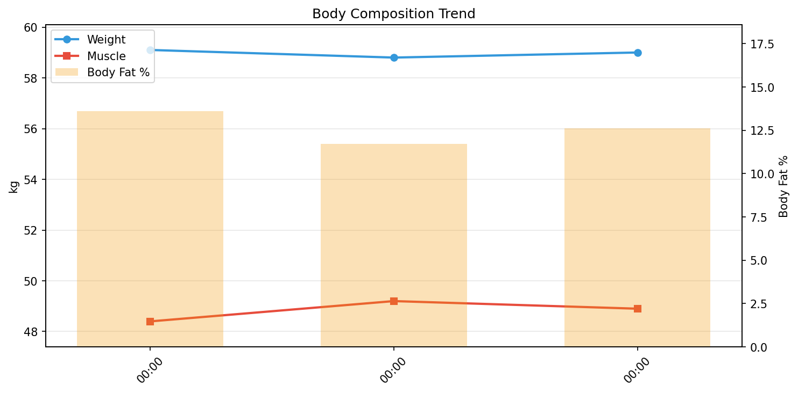

# 💪 筋トレデイリーレポート

**期間**: 2025-12-22 〜 2025-12-24（3日間）

---

## 📊 サマリー

| 指標 | 開始 | 終了 | 変化 |
|------|------|------|------|
| 体重 | 59.10kg | 59.00kg | **-0.10kg** |
| 筋肉量 | 48.40kg | 48.90kg | ****+0.50kg**** |
| 体脂肪率 | 13.6% | 12.6% | **-1.00%** |
| FFMI | 18.3 | 18.5 | ****+0.17**** |

## 🧬 体組成

| 日付 | 体重 | 筋肉 | 脂肪 | 骨 | LBM | 体脂肪率 | 体水分率 |
|------|------|------|------|-----|-----|----------|----------|
| 12-22 | 59.1 | 48.4 | 8.04 | 2.7 | 51.1 | 13.6% | 59.3% |
| 12-23 | 58.8 | 49.2 | 6.88 | 2.7 | 51.9 | 11.7% | 61.4% |
| 12-24 | 59.0 | 48.9 | 7.43 | 2.7 | 51.6 | 12.6% | 60.2% |

## 🍽️ 栄養

> PFCバランスとマクロ栄養素の記録。

| 日付 | カロリー | タンパク質 | 脂質 | 炭水化物 | 食物繊維 | P | F | C |
|------|----------|------------|------|----------|----------|---|---|---|
| 12-22 | 2711 | 78.0 | 112.1 | 344.5 | 11.7 | 12 | 37 | 51 |
| 12-23 | 1903 | 70.4 | 117.9 | 121.1 | 9.7 | 15 | 56 | 25 |
| 12-24 | - | - | - | - | - | - | - | - |

## 🔥 カロリー分析

> **TDEE（総消費エネルギー量）の内訳**: Out ≈ BMR + NEAT + TEF + EAT
>
> - **Balance**: カロリー収支（In - Out）
> - **In**: 摂取カロリー
> - **Out**: 消費カロリー（TDEE）
> - **BMR**: 基礎代謝
> - **NEAT**: 非運動性活動熱産生（日常活動による消費）
> - **TEF**: 食事誘発性熱産生（消化による消費、摂取カロリーの約10%）
> - **EAT**: 運動活動熱産生（意図的な運動による消費）

| 日付 | 体重 | Balance | In | Out | BMR | NEAT | TEF | EAT |
|------|------|------|------|------|------|------|------|------|
| 12-22 | 59.1 | 20 | 2711 | 2691 | 1398 | 1012 | 271 | 490 |
| 12-23 | 58.8 | -236 | 1903 | 2139 | 1419 | 534 | 190 | 280 |
| 12-24 | 59.0 | -650 | 0 | 650 | 1409 | 166 | 0 | 0 |

## 🛌 回復

> 睡眠とHRVで回復状態を評価。HRV上昇 & HR低下 = 回復良好

| 日付 | 睡眠(h) | 深い(m) | HRV(ms) | HR(bpm) |
|------|---------|---------|---------|---------|
| 12-22 | 6.3 | 47 | 52 | 51 |
| 12-23 | 7.0 | 95 | 36 | 52 |
| 12-24 | 6.8 | 69 | 47 | 51 |

---

## 📈 詳細データ

### 📉 推移

### 📋 日別総合データ

| 日付 | 体重 | 筋肉量 | 体脂肪率 | FFMI | カロリー収支 | プロテイン | 睡眠 |
|------|------|------|------|------|------|------|------|
| 12-22 | 59.1 | 48.4 | 13.6 | 18.3 | 20 | 78.0 | 6.3 |
| 12-23 | 58.8 | 49.2 | 11.7 | 18.6 | -236 | 70.4 | 7.0 |
| 12-24 | 59.0 | 48.9 | 12.6 | 18.5 | -650 | 0.0 | 6.8 |