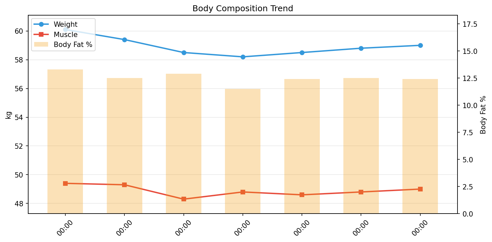

# 💪 筋トレデイリーレポート

**期間**: 2026-01-05 〜 2026-01-11（7日間）

---

## 📊 サマリー

| 指標 | 開始 | 終了 | 変化 |
|------|------|------|------|
| 体重 | 60.10kg | 59.00kg | **-1.10kg** |
| 筋肉量 | 49.40kg | 49.00kg | **-0.40kg** |
| 体脂肪率 | 13.3% | 12.4% | **-0.90%** |
| FFMI | 18.6 | 18.5 | **-0.15** |

## 🧬 体組成

| 日付 | 体重 | 筋肉 | 脂肪 | 骨 | LBM | 体脂肪率 | 体水分率 |
|------|------|------|------|-----|-----|----------|----------|
| 01-05 | 60.1 | 49.4 | 7.99 | 2.7 | 52.1 | 13.3% | 60.0% |
| 01-06 | 59.4 | 49.3 | 7.42 | 2.7 | 52.0 | 12.5% | 60.5% |
| 01-07 | 58.5 | 48.3 | 7.55 | 2.7 | 51.0 | 12.9% | 59.5% |
| 01-08 | 58.2 | 48.8 | 6.69 | 2.7 | 51.5 | 11.5% | 60.7% |
| 01-09 | 58.5 | 48.6 | 7.25 | 2.7 | 51.2 | 12.4% | 59.9% |
| 01-10 | 58.8 | 48.8 | 7.35 | 2.7 | 51.4 | 12.5% | 60.2% |
| 01-11 | 59.0 | 49.0 | 7.32 | 2.7 | 51.7 | 12.4% | 60.8% |

## 🍽️ 栄養

> PFCバランスとマクロ栄養素の記録。

| 日付 | カロリー | タンパク質 | 脂質 | 炭水化物 | 食物繊維 | P | F | C |
|------|----------|------------|------|----------|----------|---|---|---|
| 01-05 | 1365 | 85.7 | 46.9 | 151.9 | 15.9 | 25 | 31 | 45 |
| 01-06 | - | - | - | - | - | - | - | - |
| 01-07 | 1705 | 101.1 | 74.9 | 112.3 | 13.8 | 24 | 40 | 26 |
| 01-08 | 1411 | 97.4 | 46.8 | 146.2 | 13.9 | 28 | 30 | 41 |
| 01-09 | - | - | - | - | - | - | - | - |
| 01-11 | 1685 | 108.9 | 73.4 | 149.4 | 19.3 | 26 | 39 | 35 |

## 🔥 カロリー分析

> **TDEE（総消費エネルギー量）の内訳**: Out ≈ BMR + NEAT + TEF + EAT
>
> - **Balance**: カロリー収支（In - Out）
> - **In**: 摂取カロリー
> - **Out**: 消費カロリー（TDEE）
> - **BMR**: 基礎代謝
> - **NEAT**: 非運動性活動熱産生（日常活動による消費）
> - **TEF**: 食事誘発性熱産生（消化による消費、摂取カロリーの約10%）
> - **EAT**: 運動活動熱産生（意図的な運動による消費）

| 日付 | 体重 | Balance | In | Out | BMR | NEAT | TEF | EAT |
|------|------|------|------|------|------|------|------|------|
| 01-05 | 60.1 | -832 | 1365 | 2197 | 1426 | 575 | 136 | 290 |
| 01-06 | 59.4 | -2113 | 0 | 2113 | 1422 | 464 | 0 | 287 |
| 01-07 | 58.5 | -407 | 1705 | 2112 | 1392 | 497 | 170 | 287 |
| 01-08 | 58.2 | -693 | 1411 | 2104 | 1405 | 447 | 141 | 309 |
| 01-09 | 58.5 | -726 | 0 | 726 | 1400 | 117 | 0 | 133 |
| 01-10 | 58.8 | - | - | - | 1407 | - | 0 | 0 |
| 01-11 | 59.0 | -242 | 1685 | 1927 | 1413 | 560 | 168 | 0 |

## 🛌 回復

> 睡眠とHRVで回復状態を評価。HRV上昇 & HR低下 = 回復良好

| 日付 | 睡眠(h) | 深い(m) | HRV(ms) | HR(bpm) |
|------|---------|---------|---------|---------|
| 01-05 | 6.6 | 62 | 34 | 54 |
| 01-06 | 4.8 | 13 | 29 | 56 |
| 01-07 | 7.0 | 43 | 29 | 57 |
| 01-08 | 7.2 | 51 | 29 | 58 |
| 01-09 | 5.7 | 57 | 32 | 58 |
| 01-10 | - | - | - | - |
| 01-11 | 6.1 | 52 | 33 | 56 |

### 💪 筋トレ判断（HRVベース）

> **Kiviniemiアルゴリズム**: 7日移動平均 ± 0.5SD で判定
> - 🟢 通常トレーニングOK：HRV > 平均 + 0.5SD
> - 🟢 中強度（70%）：正常範囲内
> - 🟡 軽め（50%）または休養：HRV < 平均 - 0.5SD

| 日付 | HRV | 7日平均 | 範囲 | 判定 |
|------|-----|---------|------|------|
| 01-05 | 34.2 | 36.2 | 32.6 - 39.7 | 🟢 中強度トレーニング（70%） |
| 01-06 | 29.3 | 34.2 | 30.8 - 37.7 | 🟡 休養または軽め（50%） |
| 01-07 | 29.2 | 34.2 | 30.8 - 37.7 | 🟡 休養または軽め（50%） |
| 01-08 | 28.8 | 34.6 | 31.4 - 37.8 | 🟡 休養または軽め（50%） |
| 01-09 | 32.5 | 34.0 | 30.8 - 37.2 | 🟢 中強度トレーニング（70%） |
| 01-10 | - | - | - - - | ⚪ データなし |
| 01-11 | 33.0 | 33.4 | 30.3 - 36.5 | 🟢 中強度トレーニング（70%） |

---

## 📈 詳細データ

### 📉 推移

### 📋 日別総合データ

| 日付 | 体重 | 筋肉量 | 体脂肪率 | FFMI | カロリー収支 | プロテイン | 睡眠 |
|------|------|------|------|------|------|------|------|
| 01-05 | 60.1 | 49.4 | 13.3 | 18.6 | -832 | 85.7 | 6.6 |
| 01-06 | 59.4 | 49.3 | 12.5 | 18.6 | -2113 | 0.0 | 4.8 |
| 01-07 | 58.5 | 48.3 | 12.9 | 18.2 | -407 | 101.1 | 7.0 |
| 01-08 | 58.2 | 48.8 | 11.5 | 18.4 | -693 | 97.4 | 7.2 |
| 01-09 | 58.5 | 48.6 | 12.4 | 18.3 | -726 | 0.0 | 5.7 |
| 01-10 | 58.8 | 48.8 | 12.5 | 18.4 | - | - | - |
| 01-11 | 59.0 | 49.0 | 12.4 | 18.5 | -242 | 108.9 | 6.1 |