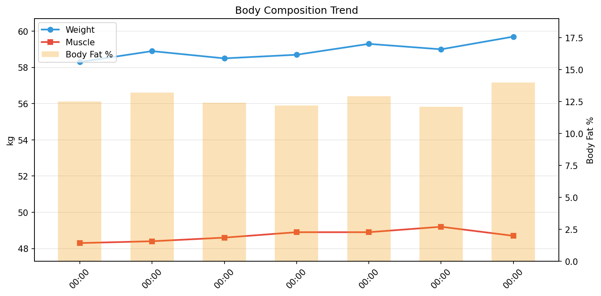

# 💪 筋トレデイリーレポート

**期間**: 2026-01-12 〜 2026-01-18（7日間）

---

## 📊 サマリー

| 指標 | 開始 | 終了 | 変化 |
|------|------|------|------|
| 体重 | 58.30kg | 59.70kg | ****+1.40kg**** |
| 筋肉量 | 48.30kg | 48.70kg | ****+0.40kg**** |
| 体脂肪率 | 12.5% | 14.0% | ****+1.50%**** |
| FFMI | 18.3 | 18.4 | ****+0.11**** |

## 🧬 体組成

| 日付 | 体重 | 筋肉 | 脂肪 | 骨 | LBM | 体脂肪率 | 体水分率 |
|------|------|------|------|-----|-----|----------|----------|
| 01-12 | 58.3 | 48.3 | 7.29 | 2.7 | 51.0 | 12.5% | 59.7% |
| 01-13 | 58.9 | 48.4 | 7.77 | 2.7 | 51.1 | 13.2% | 59.4% |
| 01-14 | 58.5 | 48.6 | 7.25 | 2.7 | 51.2 | 12.4% | 60.3% |
| 01-15 | 58.7 | 48.9 | 7.16 | 2.7 | 51.5 | 12.2% | 60.7% |
| 01-16 | 59.3 | 48.9 | 7.65 | 2.7 | 51.7 | 12.9% | 60.1% |
| 01-17 | 59.0 | 49.2 | 7.14 | 2.7 | 51.9 | 12.1% | 61.1% |
| 01-18 | 59.7 | 48.7 | 8.36 | 2.7 | 51.3 | 14.0% | 59.1% |

## 🍽️ 栄養

> PFCバランスとマクロ栄養素の記録。

| 日付 | カロリー | タンパク質 | 脂質 | 炭水化物 | 食物繊維 | P | F | C |
|------|----------|------------|------|----------|----------|---|---|---|
| 01-12 | 1653 | 101.8 | 68.3 | 160.8 | 20.6 | 25 | 37 | 39 |
| 01-13 | 2439 | 76.3 | 107.3 | 278.9 | 10.7 | 13 | 40 | 46 |
| 01-14 | - | - | - | - | - | - | - | - |
| 01-15 | 1498 | 84.6 | 69.8 | 131.2 | 17.6 | 23 | 42 | 35 |
| 01-16 | 1648 | 48.2 | 62.8 | 219.6 | 16.3 | 12 | 34 | 53 |
| 01-17 | 913 | 33.1 | 40.0 | 106.9 | 15.5 | 15 | 39 | 47 |
| 01-18 | - | - | - | - | - | - | - | - |

## 🔥 カロリー分析

> **TDEE（総消費エネルギー量）の内訳**: Out ≈ BMR + NEAT + TEF + EAT
>
> - **Balance**: カロリー収支（In - Out）
> - **In**: 摂取カロリー
> - **Out**: 消費カロリー（TDEE）
> - **BMR**: 基礎代謝
> - **NEAT**: 非運動性活動熱産生（日常活動による消費）
> - **TEF**: 食事誘発性熱産生（消化による消費、摂取カロリーの約10%）
> - **EAT**: 運動活動熱産生（意図的な運動による消費）

| 日付 | 体重 | Balance | In | Out | BMR | NEAT | TEF | EAT |
|------|------|------|------|------|------|------|------|------|
| 01-12 | 58.3 | 114 | 1653 | 1539 | 1393 | 62 | 165 | 0 |
| 01-13 | 58.9 | 99 | 2439 | 2340 | 1396 | 0 | 244 | 1041 |
| 01-14 | 58.5 | -2051 | 0 | 2051 | 1400 | 541 | 0 | 174 |
| 01-15 | 58.7 | -621 | 1498 | 2119 | 1408 | 468 | 150 | 329 |
| 01-16 | 59.3 | -543 | 1648 | 2191 | 1412 | 457 | 165 | 426 |
| 01-17 | 59.0 | -1345 | 913 | 2258 | 1418 | 554 | 91 | 429 |
| 01-18 | 59.7 | -4424 | 0 | 4424 | 1406 | 3458 | 0 | 0 |

## 🛌 回復

> 睡眠とHRVで回復状態を評価。HRV上昇 & HR低下 = 回復良好

| 日付 | 睡眠(h) | 深い(m) | HRV(ms) | HR(bpm) |
|------|---------|---------|---------|---------|
| 01-12 | 6.7 | 64 | 41 | 54 |
| 01-13 | 6.9 | 60 | 27 | 56 |
| 01-14 | 6.3 | 89 | 30 | 56 |
| 01-15 | 7.0 | 95 | 36 | 55 |
| 01-16 | 6.0 | 52 | 35 | 54 |
| 01-17 | 5.8 | 69 | 24 | 57 |
| 01-18 | 6.8 | 58 | 38 | 55 |

### 💪 筋トレ判断（HRVベース）

> **Kiviniemiアルゴリズム**: 7日移動平均 ± 0.5SD で判定
> - 🟢 通常トレーニングOK：HRV > 平均 + 0.5SD
> - 🟢 中強度（70%）：正常範囲内
> - 🟡 軽め（50%）または休養：HRV < 平均 - 0.5SD

| 日付 | HRV | 7日平均 | 範囲 | 判定 |
|------|-----|---------|------|------|
| 01-12 | 41.2 | 32.6 | 30.4 - 34.8 | 🟢 通常トレーニングOK |
| 01-13 | 26.6 | 31.5 | 29.1 - 33.9 | 🟡 休養または軽め（50%） |
| 01-14 | 29.8 | 31.6 | 29.2 - 34.0 | 🟢 中強度トレーニング（70%） |
| 01-15 | 36.3 | 32.6 | 30.1 - 35.1 | 🟢 通常トレーニングOK |
| 01-16 | 34.8 | 33.5 | 31.1 - 35.8 | 🟢 中強度トレーニング（70%） |
| 01-17 | 24.2 | 32.3 | 29.3 - 35.2 | 🟡 休養または軽め（50%） |
| 01-18 | 38.2 | 33.0 | 29.9 - 36.2 | 🟢 通常トレーニングOK |

---

## 📈 詳細データ

### 📉 推移

### 📋 日別総合データ

| 日付 | 体重 | 筋肉量 | 体脂肪率 | FFMI | カロリー収支 | プロテイン | 睡眠 |
|------|------|------|------|------|------|------|------|
| 01-12 | 58.3 | 48.3 | 12.5 | 18.3 | 114 | 101.8 | 6.7 |
| 01-13 | 58.9 | 48.4 | 13.2 | 18.3 | 99 | 76.3 | 6.9 |
| 01-14 | 58.5 | 48.6 | 12.4 | 18.3 | -2051 | 0.0 | 6.3 |
| 01-15 | 58.7 | 48.9 | 12.2 | 18.4 | -621 | 84.6 | 7.0 |
| 01-16 | 59.3 | 48.9 | 12.9 | 18.5 | -543 | 48.2 | 6.0 |
| 01-17 | 59.0 | 49.2 | 12.1 | 18.6 | -1345 | 33.1 | 5.8 |
| 01-18 | 59.7 | 48.7 | 14.0 | 18.4 | -4424 | 0.0 | 6.8 |