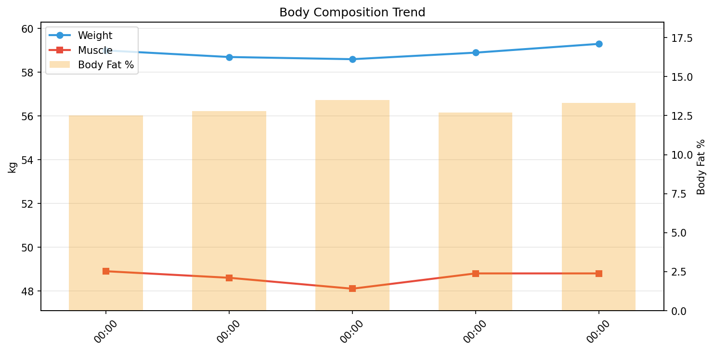

# 💪 筋トレデイリーレポート

**期間**: 2026-01-19 〜 2026-01-23（5日間）

---

## 📊 サマリー

| 指標 | 開始 | 終了 | 変化 |
|------|------|------|------|
| 体重 | 59.00kg | 59.30kg | ****+0.30kg**** |
| 筋肉量 | 48.90kg | 48.80kg | **-0.10kg** |
| 体脂肪率 | 12.5% | 13.3% | ****+0.80%**** |
| FFMI | 18.5 | 18.4 | **-0.07** |

## 🧬 体組成

| 日付 | 体重 | 筋肉 | 脂肪 | 骨 | LBM | 体脂肪率 | 体水分率 |
|------|------|------|------|-----|-----|----------|----------|
| 01-19 | 59.0 | 48.9 | 7.38 | 2.7 | 51.6 | 12.5% | 60.5% |
| 01-20 | 58.7 | 48.6 | 7.51 | 2.7 | 51.2 | 12.8% | 60.1% |
| 01-21 | 58.6 | 48.1 | 7.91 | 2.6 | 50.7 | 13.5% | 59.0% |
| 01-22 | 58.9 | 48.8 | 7.48 | 2.7 | 51.4 | 12.7% | 60.1% |
| 01-23 | 59.3 | 48.8 | 7.89 | 2.7 | 51.4 | 13.3% | 59.8% |

## 🔥 カロリー分析

> **TDEE（総消費エネルギー量）の内訳**: Out ≈ BMR + NEAT + TEF + EAT
>
> - **Balance**: カロリー収支（In - Out）
> - **In**: 摂取カロリー
> - **Out**: 消費カロリー（TDEE）
> - **BMR**: 基礎代謝
> - **NEAT**: 非運動性活動熱産生（日常活動による消費）
> - **TEF**: 食事誘発性熱産生（消化による消費、摂取カロリーの約10%）
> - **EAT**: 運動活動熱産生（意図的な運動による消費）

| 日付 | 体重 | Out | BMR | NEAT | TEF | EAT |
|------|------|------|------|------|------|------|
| 01-19 | 59.0 | 2063 | 1410 | 535 | 0 | 199 |
| 01-20 | 58.7 | 737 | 1401 | 173 | 0 | 109 |
| 01-21 | 58.6 | 2115 | 1387 | 489 | 0 | 291 |
| 01-22 | 58.9 | 2250 | 1406 | 593 | 0 | 360 |
| 01-23 | 59.3 | 739 | 1407 | 292 | 0 | 0 |

## 🛌 回復

> 睡眠とHRVで回復状態を評価。HRV上昇 & HR低下 = 回復良好

| 日付 | 睡眠(h) | 深い(m) | HRV(ms) | HR(bpm) |
|------|---------|---------|---------|---------|
| 01-19 | 5.3 | 82 | 32 | 56 |
| 01-20 | 6.3 | 76 | 38 | 53 |
| 01-21 | 5.8 | 63 | 37 | 53 |
| 01-22 | 6.8 | 44 | 37 | 54 |
| 01-23 | 6.6 | 53 | 25 | 56 |

### 💪 筋トレ判断（HRVベース）

> **Kiviniemiアルゴリズム**: 7日移動平均 ± 0.5SD で判定
> - 🟢 通常トレーニングOK：HRV > 平均 + 0.5SD
> - 🟢 中強度（70%）：正常範囲内
> - 🟡 軽め（50%）または休養：HRV < 平均 - 0.5SD

| 日付 | HRV | 7日平均 | 範囲 | 判定 |
|------|-----|---------|------|------|
| 01-19 | 32.3 | 31.8 | 29.2 - 34.3 | 🟢 中強度トレーニング（70%） |
| 01-20 | 37.7 | 33.3 | 30.8 - 35.9 | 🟢 通常トレーニングOK |
| 01-21 | 37.1 | 34.4 | 31.9 - 36.8 | 🟢 通常トレーニングOK |
| 01-22 | 37.1 | 34.5 | 32.0 - 37.0 | 🟢 通常トレーニングOK |
| 01-23 | 24.9 | 33.1 | 30.0 - 36.2 | 🟡 休養または軽め（50%） |

---

## 📈 詳細データ

### 📉 推移

### 📋 日別総合データ

| 日付 | 体重 | 筋肉量 | 体脂肪率 | FFMI | 睡眠 |
|------|------|------|------|------|------|
| 01-19 | 59.0 | 48.9 | 12.5 | 18.5 | 5.3 |
| 01-20 | 58.7 | 48.6 | 12.8 | 18.3 | 6.3 |
| 01-21 | 58.6 | 48.1 | 13.5 | 18.1 | 5.8 |
| 01-22 | 58.9 | 48.8 | 12.7 | 18.4 | 6.8 |
| 01-23 | 59.3 | 48.8 | 13.3 | 18.4 | 6.6 |