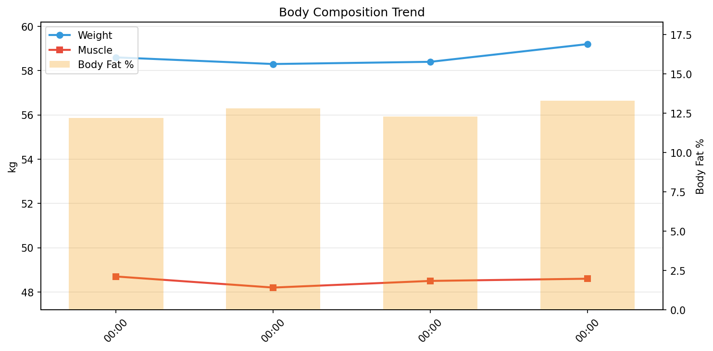

# 💪 筋トレデイリーレポート

**期間**: 2026-04-28 〜 2026-05-01（4日間）

---

## 📊 サマリー

| 指標 | 開始 | 終了 | 変化 |
|------|------|------|------|
| 体重 | 58.60kg | 59.20kg | ****+0.60kg**** |
| 筋肉量 | 48.70kg | 48.60kg | **-0.10kg** |
| 体脂肪率 | 12.2% | 13.3% | ****+1.10%**** |
| FFMI | 18.4 | 18.4 | **-0.04** |

## 🧬 体組成

| 日付 | 体重 | 筋肉 | 脂肪 | 骨 | LBM | 体脂肪率 | 体水分率 |
|------|------|------|------|-----|-----|----------|----------|
| 04-28 | 58.6 | 48.7 | 7.15 | 2.7 | 51.5 | 12.2% | 60.9% |
| 04-29 | 58.3 | 48.2 | 7.46 | 2.7 | 50.8 | 12.8% | 59.1% |
| 04-30 | 58.4 | 48.5 | 7.18 | 2.7 | 51.2 | 12.3% | 59.9% |
| 05-01 | 59.2 | 48.6 | 7.87 | 2.7 | 51.3 | 13.3% | 59.5% |

## 🍽️ 栄養

> PFCバランスとマクロ栄養素の記録。

| 日付 | カロリー | タンパク質 | 脂質 | 炭水化物 | 食物繊維 | P | F | C |
|------|----------|------------|------|----------|----------|---|---|---|
| 04-28 | 1816 | 129.3 | 95.3 | 122.3 | 23.1 | 28 | 47 | 27 |
| 04-29 | 2023 | 139.6 | 103.2 | 148.5 | 26.9 | 28 | 46 | 29 |
| 04-30 | - | - | - | - | - | - | - | - |
| 05-01 | - | - | - | - | - | - | - | - |

## 🔥 カロリー分析

> **TDEE（総消費エネルギー量）の内訳**: Out ≈ BMR + NEAT + TEF + EAT
>
> - **Balance**: カロリー収支（In - Out）
> - **In**: 摂取カロリー
> - **Out**: 消費カロリー（TDEE）
> - **BMR**: 基礎代謝
> - **NEAT**: 非運動性活動熱産生（日常活動による消費）
> - **TEF**: 食事誘発性熱産生（消化による消費、摂取カロリーの約10%）
> - **EAT**: 運動活動熱産生（意図的な運動による消費）

| 日付 | 体重 | Balance | In | Out | BMR | NEAT | TEF | EAT |
|------|------|------|------|------|------|------|------|------|
| 04-28 | 58.6 | -353 | 1816 | 2169 | 1405 | 563 | 182 | 347 |
| 04-29 | 58.3 | 111 | 2023 | 1912 | 1390 | 493 | 202 | 45 |
| 04-30 | 58.4 | -2115 | 0 | 2115 | 1399 | 574 | 0 | 259 |
| 05-01 | 59.2 | -2709 | 0 | 2709 | 1403 | 1608 | 0 | 0 |

## 🛌 回復

> 睡眠とHRVで回復状態を評価。HRV上昇 & HR低下 = 回復良好

| 日付 | 睡眠(h) | 深い(m) | HRV(ms) | HR(bpm) |
|------|---------|---------|---------|---------|
| 04-28 | 6.8 | 57 | 40 | 49 |
| 04-29 | 7.9 | 89 | 52 | 49 |
| 04-30 | 8.2 | 82 | 37 | 49 |
| 05-01 | 6.7 | 67 | 39 | 50 |

### 💪 筋トレ判断（HRVベース）

> **Kiviniemiアルゴリズム**: 7日移動平均 ± 0.5SD で判定
> - 🟢 通常トレーニングOK：HRV > 平均 + 0.5SD
> - 🟢 中強度（70%）：正常範囲内
> - 🟡 軽め（50%）または休養：HRV < 平均 - 0.5SD

| 日付 | HRV | 7日平均 | 範囲 | 判定 |
|------|-----|---------|------|------|
| 04-28 | 39.5 | 44.1 | 41.3 - 46.8 | 🟡 休養または軽め（50%） |
| 04-29 | 52.4 | 46.5 | 44.0 - 48.9 | 🟢 通常トレーニングOK |
| 04-30 | 37.0 | 45.7 | 42.7 - 48.7 | 🟡 休養または軽め（50%） |
| 05-01 | 38.5 | 43.8 | 40.9 - 46.7 | 🟡 休養または軽め（50%） |

---

## 📈 詳細データ

### 📉 推移

### 📋 日別総合データ

| 日付 | 体重 | 筋肉量 | 体脂肪率 | FFMI | カロリー収支 | プロテイン | 睡眠 |
|------|------|------|------|------|------|------|------|
| 04-28 | 58.6 | 48.7 | 12.2 | 18.4 | -353 | 129.3 | 6.8 |
| 04-29 | 58.3 | 48.2 | 12.8 | 18.2 | 111 | 139.6 | 7.9 |
| 04-30 | 58.4 | 48.5 | 12.3 | 18.3 | -2115 | 0.0 | 8.2 |
| 05-01 | 59.2 | 48.6 | 13.3 | 18.4 | -2709 | 0.0 | 6.7 |