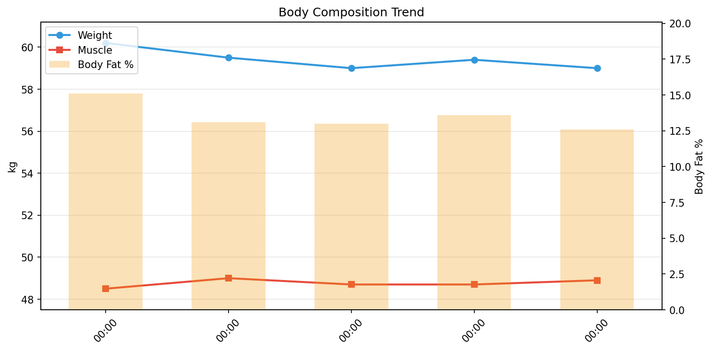

# フィットネスデイリーレポート

**期間**: 2026-05-12 〜 2026-05-17（5日間）

---

## 📊 サマリー

| 指標 | 開始 | 終了 | 変化 |
|------|------|------|------|
| 体重 | 60.20kg | 59.00kg | **-1.20kg** |
| 筋肉量 | 48.50kg | 48.90kg | ****+0.40kg**** |
| 体脂肪率 | 15.1% | 12.6% | **-2.50%** |
| FFMI | 18.3 | 18.5 | ****+0.16**** |

## 🧬 体組成

| 日付 | 体重 | 筋肉 | 脂肪 | 骨 | LBM | 体脂肪率 | 体水分率 |
|------|------|------|------|-----|-----|----------|----------|
| 05-12 | 60.2 | 48.5 | 9.09 | 2.7 | 51.1 | 15.1% | 57.7% |
| 05-13 | 59.5 | 49.0 | 7.79 | 2.7 | 51.7 | 13.1% | 59.9% |
| 05-14 | 59.0 | 48.7 | 7.67 | 2.7 | 51.3 | 13.0% | 59.8% |
| 05-15 | 59.4 | 48.7 | 8.08 | 2.7 | 51.3 | 13.6% | 59.4% |
| 05-17 | 59.0 | 48.9 | 7.43 | 2.7 | 51.6 | 12.6% | 60.0% |

## 🏋️ トレーニング

> 歩数と活動強度の記録。心拍ゾーン（%HRR カルボーネン法, maxHR=Tanaka181/RHR50）: Z1回復 Z2有酸素 Z3テンポ Z4閾値 Z5VO2max
> 境界(bpm): Z1≥116 / Z2≥129 / Z3≥142 / Z4≥155 / Z5≥168
> **Zone2**(いわゆる有酸素ベース/LT1直下): LT1=141bpm（maf=180-39・暫定/低体力者は過大傾向）, Zone2帯=[126, 141) bpm。Talk Test実測値で config の manual_bpm 上書き較正可

| 日付 | 歩数 | Zone合計 | Z1 | Z2 | Z3 | Z4 | Z5 | Zone2 | VO2 Max |
|------|------|----------|----|----|----|----|-----|-------|---------|
| 05-12 | 5803 | 1 | 1 | 0 | 0 | 0 | 0 | 0 | 63 |
| 05-13 | 5900 | 75 | 49 | 19 | 6 | 1 | 0 | 30 | 63 |
| 05-14 | 6244 | 38 | 27 | 4 | 4 | 3 | 0 | 7 | 63 |
| 05-15 | 5002 | 24 | 17 | 5 | 2 | 0 | 0 | 5 | 63 |
| 05-16 | 7867 | 74 | 62 | 12 | 0 | 0 | 0 | 17 | 63 |
| 05-17 | 5582 | 67 | 53 | 11 | 3 | 0 | 0 | 22 | 63 |

### 💪 筋トレ

> 現在記録なし。トレーニングログは [Hevy](https://hevy.com/profile) を参照

### 🚴 サイクリング

| 日付 | 回数 | 時間(分) | 距離(km) | 平均HR | kcal |
|------|------|----------|----------|--------|------|
| 05-12 | 4 | 138 | 16.6 | 94 | 698 |
| 05-13 | 5 | 193 | 12.1 | 108 | 1193 |
| 05-14 | 4 | 139 | 1.3 | 92 | 577 |
| 05-15 | 6 | 194 | 20.7 | 97 | 1369 |
| 05-16 | 4 | 132 | 1.8 | 97 | 607 |
| 05-17 | 4 | 176 | 35.3 | 107 | 1063 |

## 🍽️ 栄養

> PFCバランスとマクロ栄養素の記録。

| 日付 | カロリー | タンパク質 | 脂質 | 炭水化物 | 食物繊維 | P | F | C |
|------|----------|------------|------|----------|----------|---|---|---|
| 05-12 | - | - | - | - | - | - | - | - |
| 05-13 | - | - | - | - | - | - | - | - |
| 05-14 | - | - | - | - | - | - | - | - |
| 05-15 | 2297 | 176.7 | 124.9 | 132.8 | 24.4 | 31 | 49 | 23 |
| 05-16 | - | - | - | - | - | - | - | - |
| 05-17 | - | - | - | - | - | - | - | - |

## 🔥 カロリー分析

> **TDEE（総消費エネルギー量）の内訳**: Out ≈ BMR + NEAT + TEF + EAT
>
> - **Balance**: カロリー収支（In - Out）
> - **In**: 摂取カロリー
> - **Out**: 消費カロリー（TDEE）
> - **BMR**: 基礎代謝
> - **NEAT**: 非運動性活動熱産生（日常活動による消費）
> - **TEF**: 食事誘発性熱産生（消化による消費、摂取カロリーの約10%）
> - **EAT**: 運動活動熱産生（意図的な運動による消費）

| 日付 | 体重 | Balance | In | Out | BMR | NEAT | TEF | EAT |
|------|------|------|------|------|------|------|------|------|
| 05-12 | 60.2 | -2359 | 0 | 2359 | 1401 | 500 | 0 | 698 |
| 05-13 | 59.5 | -2777 | 0 | 2777 | 1415 | 528 | 0 | 1193 |
| 05-14 | 59.0 | -2537 | 0 | 2537 | 1404 | 854 | 0 | 577 |
| 05-15 | 59.4 | -196 | 2297 | 2493 | 1405 | 0 | 230 | 1369 |
| 05-17 | 59.0 | -2480 | 0 | 2480 | 1410 | 1783 | 0 | 0 |

## 🛌 回復

> 睡眠とHRVで回復状態を評価。HRV上昇 & HR低下 = 回復良好

| 日付 | 睡眠(h) | 深い(m) | HRV(ms) | HR(bpm) | 判定 |
|------|---------|---------|---------|---------|------|
| 05-12 | 7.0 | 77 | 49 | 50 | 🟢 通常トレーニングOK |
| 05-13 | 6.3 | 84 | 40 | 49 | 🟡 休養または軽め（50%） |
| 05-14 | 5.7 | 64 | 54 | 48 | 🟢 通常トレーニングOK |
| 05-15 | 5.8 | 47 | 44 | 48 | 🟢 中強度トレーニング（70%） |
| 05-16 | 5.2 | 76 | 37 | 48 | 🟡 休養または軽め（50%） |
| 05-17 | 6.5 | 58 | 53 | 47 | 🟢 通常トレーニングOK |

---

## 📈 詳細データ

### 📉 推移

### 📋 日別総合データ

| 日付 | 体重 | 筋肉量 | 体脂肪率 | FFMI | カロリー収支 | プロテイン | 睡眠 |
|------|------|------|------|------|------|------|------|
| 05-12 | 60.2 | 48.5 | 15.1 | 18.3 | -2359 | 0.0 | 7.0 |
| 05-13 | 59.5 | 49.0 | 13.1 | 18.5 | -2777 | 0.0 | 6.3 |
| 05-14 | 59.0 | 48.7 | 13.0 | 18.4 | -2537 | 0.0 | 5.7 |
| 05-15 | 59.4 | 48.7 | 13.6 | 18.4 | -196 | 176.7 | 5.8 |
| 05-17 | 59.0 | 48.9 | 12.6 | 18.5 | -2480 | 0.0 | 6.5 |