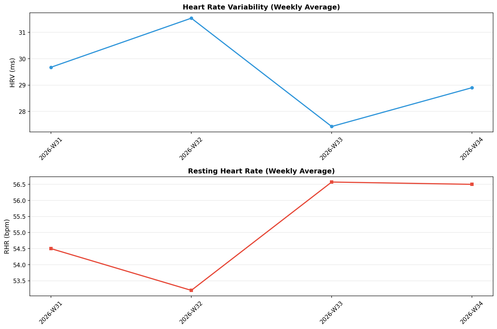

# 🧠 メンタル週次レポート

7日間平均値の推移。前週比でトレンドを確認。

- **生成日時**: 2026-08-18 10:07:09

---

## 📊 週次データ

### 自律神経系

| 週 | HRV | RHR | 呼吸数 | SpO2 |
|---|---|---|---|---|
| **2026-W34** | 28.9ms (**+1.48ms**) | 56.5bpm (**-0.07bpm**) | 16.0/min (**-0.03/min**) | 96.0% (-0.22%) |
| **2026-W33** | 27.4ms (-4.12ms) | 56.6bpm (+3.37bpm) | 16.0/min (**-0.33/min**) | 96.2% (-0.03%) |
| **2026-W32** | 31.5ms (**+1.87ms**) | 53.2bpm (**-1.30bpm**) | 16.4/min (+0.19/min) | 96.2% (-0.13%) |
| **2026-W31** | 29.7ms (-3.20ms) | 54.5bpm (+1.50bpm) | 16.2/min (**-0.13/min**) | 96.3% (**+0.23%**) |

> - **HRV**: 週平均RMSSD（高い方が良好）
> - **RHR**: 週平均安静時心拍数（低い方が良好）
> - **呼吸数**: 週平均呼吸数（安定が良好）
> - **SpO2**: 週平均SpO2（96%以上が良好）
> - カッコ内は前週比（**太字**は改善方向）
---

## 📈 トレンドグラフ

