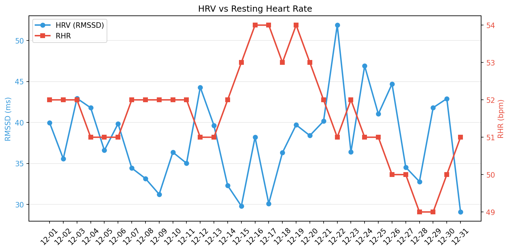
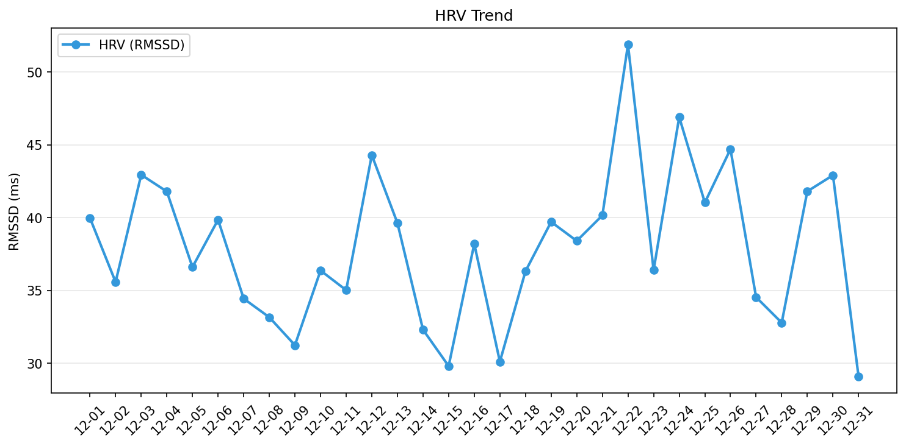

# 🧠 メンタルレポート

**期間**: 2025-12-01 〜 2025-12-23 (23日間)

---

## 🧘 反応性

自律神経系の反応性と回復力を評価

| 日付 | HRV Daily | HRV Deep | 安静時HR | 呼吸数 | SpO2 | 皮膚温変動 |
|------|-----------|----------|----------|--------|------|-----------|
| 12-01 | 40.0 | 30.4 | 52 | - | - | 0.50 |
| 12-02 | 35.6 | 40.7 | 52 | - | - | -0.70 |
| 12-03 | 42.9 | 35.3 | 52 | 15.6 | 95.9/97.3 | -0.90 |
| 12-04 | 41.8 | 35.0 | 51 | 14.8 | 96.5/97.8 | -0.40 |
| 12-05 | 36.6 | 46.2 | 51 | 14.2 | 95.9/97.2 | -0.20 |
| 12-06 | 39.9 | 42.5 | 51 | 15.2 | 97.0/97.6 | - |
| 12-07 | 34.4 | 36.5 | 52 | 14.6 | 93.7/96.2 | 0.30 |
| 12-08 | 33.2 | 29.8 | 52 | 15.2 | 94.5/96.4 | 0.20 |
| 12-09 | 31.2 | 23.9 | 52 | 16.6 | 94.2/96.7 | -0.80 |
| 12-10 | 36.4 | 35.2 | 52 | 14.6 | 94.3/96.0 | 0.20 |
| 12-11 | 35.0 | 32.0 | 52 | 15.2 | 94.9/96.5 | 0.30 |
| 12-12 | 44.3 | 50.5 | 51 | 15.2 | 95.5/97.1 | 0.40 |
| 12-13 | 39.6 | 36.5 | 51 | 15.2 | 94.2/96.1 | 0.20 |
| 12-14 | 32.3 | 36.0 | 52 | 15.2 | 95.3/96.5 | - |
| 12-15 | 29.8 | 30.2 | 53 | 15.2 | 91.9/95.4 | 0.80 |
| 12-16 | 38.2 | 29.9 | 54 | 15.2 | 95.6/97.0 | 0.20 |
| 12-17 | 30.1 | 34.9 | 54 | 15.2 | 95.2/96.5 | -2.60 |
| 12-18 | 36.3 | 34.7 | 53 | 15.0 | 95.5/97.4 | -0.20 |
| 12-19 | 39.7 | 37.1 | 54 | 15.6 | 94.4/96.2 | -0.10 |
| 12-20 | 38.4 | 36.2 | 53 | 15.0 | 94.3/96.9 | -1.70 |
| 12-21 | 40.2 | 35.7 | 52 | 15.2 | 95.4/97.1 | -1.70 |
| 12-22 | 51.9 | 51.9 | 51 | 14.4 | 94.7/96.5 | -0.30 |
| 12-23 | 36.4 | 41.2 | 52 | 15.4 | 95.0/96.5 | - |

**解釈**:
- HRVが高く、安静時心拍数が低いほど、自律神経の回復が良好
- Daily HRV: 日中全体のHRV、Deep HRV: 深睡眠時のHRV
- 呼吸数は12-20回/分が正常範囲
- SpO2は95%以上が正常範囲（min/ave表示）

---
## 🏃 運動バランス

身体活動レベルとバランスを評価

| 日付 | 歩数 | AZM合計 |
|------|------|---------|
| 12-01 | 6540 | - |
| 12-02 | 6232 | - |
| 12-03 | 6799 | 38 |
| 12-04 | 5392 | 31 |
| 12-05 | 6747 | 35 |
| 12-06 | 4935 | 35 |
| 12-07 | 6654 | 31 |
| 12-08 | 7101 | 43 |
| 12-09 | 6297 | 37 |
| 12-10 | 6376 | 32 |
| 12-11 | 5842 | 17 |
| 12-12 | 7400 | 27 |
| 12-13 | 5214 | 91 |
| 12-14 | 7027 | 27 |
| 12-15 | 5549 | 56 |
| 12-16 | 6862 | 10 |
| 12-17 | 7213 | 54 |
| 12-18 | 7371 | 28 |
| 12-19 | 6816 | 11 |
| 12-20 | 2298 | 10 |
| 12-21 | 6442 | 29 |
| 12-22 | 12340 | 58 |
| 12-23 | 2981 | 5 |

**解釈**:
- 週150分以上のアクティブゾーン分が推奨される
- 1日8,000歩以上が健康的な目標

---
## 😴 睡眠パターン

睡眠の量と質を評価

| 日付 | 就寝時刻 | 起床時刻 | 睡眠時間 | 効率 | 中途覚醒回数 |
|------|----------|----------|----------|------|--------------|
| 12-01 | 23:48 | 06:36 | 5.3h | 78.0% | 21 |
| 12-02 | 22:33 | 06:33 | 5.8h | 73.0% | 22 |
| 12-03 | 22:46 | 06:25 | 6.7h | 88.0% | 18 |
| 12-04 | 22:11 | 06:33 | 7.2h | 86.0% | 22 |
| 12-05 | 22:46 | 06:25 | 6.8h | 89.0% | 27 |
| 12-06 | 23:01 | 05:30 | 5.7h | 88.0% | 13 |
| 12-07 | 22:15 | 05:22 | 6.3h | 88.0% | 26 |
| 12-08 | 23:42 | 06:30 | 6.2h | 91.0% | 16 |
| 12-09 | 22:25 | 06:12 | 5.7h | 74.0% | 18 |
| 12-10 | 22:10 | 06:23 | 7.3h | 89.0% | 20 |
| 12-11 | 22:48 | 06:25 | 6.4h | 84.0% | 22 |
| 12-12 | 23:28 | 06:36 | 5.5h | 76.0% | 24 |
| 12-13 | 23:13 | 06:26 | 5.0h | 70.0% | 21 |
| 12-14 | 23:14 | 06:27 | 5.8h | 80.0% | 29 |
| 12-15 | 21:45 | 07:16 | 7.5h | 79.0% | 29 |
| 12-16 | 22:46 | 06:11 | 6.2h | 83.0% | 33 |
| 12-17 | 23:12 | 06:33 | 6.5h | 88.0% | 25 |
| 12-18 | 22:58 | 06:22 | 6.2h | 84.0% | 29 |
| 12-19 | 22:12 | 06:08 | 6.9h | 87.0% | 25 |
| 12-20 | 22:36 | 05:50 | 6.3h | 88.0% | 21 |
| 12-21 | 21:41 | 05:46 | 6.9h | 85.0% | 29 |
| 12-22 | 22:45 | 05:57 | 6.3h | 87.0% | 23 |
| 12-23 | 22:22 | 06:10 | 7.0h | 89.0% | 22 |

**解釈**:
- 7-9時間の睡眠が最適
- 睡眠効率85%以上が良好
- 中途覚醒回数が少ないほど睡眠の質が高い
- 就寝・起床時刻の規則性も重要

---
## 📊 推移グラフ

### HRV vs 心拍数

### HRV推移

