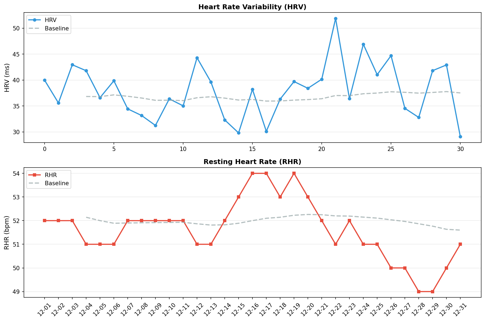

# 🧠 メンタルレポート

**期間**: 2025-12-01 〜 2025-12-31 (31日間)

---

## 🧘 反応性

自律神経系の反応性と回復力を評価

### 📊 期間サマリー


| 指標 | 期間平均 | ベースライン | 変化 |
|------|----------|-------------|------|
| HRV | 38.0 ms | 36.8 ms | 3.3% |
| RHR | 51.6 bpm | 52.0 bpm | -0.7% |
| BR | 15.2 /min | - | - |
| SpO2 | 96.5% | - | - |

### 📅 日別データ

| 日付 | HRV | RHR | BR | SpO2 | 体温Δ |
|------|-----|-----|----|----|------|
| 12-01 | 40.0 | 52 | - | - | 0.50 |
| 12-02 | 35.6 | 52 | - | - | -0.70 |
| 12-03 | 42.9 | 52 | 15.6 | 95.9/97.3 | -0.90 |
| 12-04 | 41.8 | 51 | 14.8 | 96.5/97.8 | -0.40 |
| 12-05 | 36.6 | 51 | 14.2 | 95.9/97.2 | -0.20 |
| 12-06 | 39.9 | 51 | 15.2 | 97.0/97.6 | - |
| 12-07 | 34.4 | 52 | 14.6 | 93.7/96.2 | 0.30 |
| 12-08 | 33.2 | 52 | 15.2 | 94.5/96.4 | 0.20 |
| 12-09 | 31.2 | 52 | 16.6 | 94.2/96.7 | -0.80 |
| 12-10 | 36.4 | 52 | 14.6 | 94.3/96.0 | 0.20 |
| 12-11 | 35.0 | 52 | 15.2 | 94.9/96.5 | 0.30 |
| 12-12 | 44.3 | 51 | 15.2 | 95.5/97.1 | 0.40 |
| 12-13 | 39.6 | 51 | 15.2 | 94.2/96.1 | 0.20 |
| 12-14 | 32.3 | 52 | 15.2 | 95.3/96.5 | - |
| 12-15 | 29.8 | 53 | 15.2 | 91.9/95.4 | 0.80 |
| 12-16 | 38.2 | 54 | 15.2 | 95.6/97.0 | 0.20 |
| 12-17 | 30.1 | 54 | 15.2 | 95.2/96.5 | -2.60 |
| 12-18 | 36.3 | 53 | 15.0 | 95.5/97.4 | -0.20 |
| 12-19 | 39.7 | 54 | 15.6 | 94.4/96.2 | -0.10 |
| 12-20 | 38.4 | 53 | 15.0 | 94.3/96.9 | -1.70 |
| 12-21 | 40.2 | 52 | 15.2 | 95.4/97.1 | -1.70 |
| 12-22 | 51.9 | 51 | 14.4 | 94.7/96.5 | -0.30 |
| 12-23 | 36.4 | 52 | 15.4 | 95.0/96.5 | - |
| 12-24 | 46.9 | 51 | 14.8 | 92.2/95.7 | -0.10 |
| 12-25 | 41.0 | 51 | 14.6 | 89.8/96.7 | -0.10 |
| 12-26 | 44.7 | 50 | 15.6 | 94.5/96.9 | -2.40 |
| 12-27 | 34.5 | 50 | 14.4 | 92.6/94.3 | 1.50 |
| 12-28 | 32.8 | 49 | 15.0 | 92.4/94.8 | 2.00 |
| 12-29 | 41.8 | 49 | 15.0 | 95.6/96.7 | 0.40 |
| 12-30 | 42.9 | 50 | 15.6 | 95.4/96.6 | -1.30 |
| 12-31 | 29.1 | 51 | 16.6 | 95.0/96.8 | 0.60 |

**凡例**:
- **HRV**: 心拍変動（RMSSD, ms） / **RHR**: 安静時心拍数（bpm） / **BR**: 呼吸数（回/分）
- **SpO2**: 血中酸素飽和度（最小/平均%、95%以上が正常）
- **体温Δ**: 皮膚温変動（℃）

---
## 🏃 運動バランス

身体活動レベルとバランスを評価

| 日付 | 歩数 | AZM合計 |
|------|------|---------|
| 12-01 | 6540 | - |
| 12-02 | 6232 | - |
| 12-03 | 6799 | 38 |
| 12-04 | 5392 | 31 |
| 12-05 | 6747 | 35 |
| 12-06 | 4935 | 35 |
| 12-07 | 6654 | 31 |
| 12-08 | 7101 | 43 |
| 12-09 | 6297 | 37 |
| 12-10 | 6376 | 32 |
| 12-11 | 5842 | 17 |
| 12-12 | 7400 | 27 |
| 12-13 | 5214 | 91 |
| 12-14 | 7027 | 27 |
| 12-15 | 5549 | 56 |
| 12-16 | 6862 | 10 |
| 12-17 | 7213 | 54 |
| 12-18 | 7371 | 28 |
| 12-19 | 6816 | 11 |
| 12-20 | 2298 | 10 |
| 12-21 | 6442 | 29 |
| 12-22 | 12340 | 58 |
| 12-23 | 9141 | 6 |
| 12-24 | 2005 | - |
| 12-25 | 5256 | 32 |
| 12-26 | 9415 | 19 |
| 12-27 | 8568 | 12 |
| 12-28 | 8893 | 9 |
| 12-29 | 4196 | 2 |
| 12-30 | 5932 | 2 |
| 12-31 | 5546 | - |

**解釈**:
- 週150分以上のアクティブゾーン分が推奨される
- 1日8,000歩以上が健康的な目標

---
## 😴 睡眠パターン

睡眠の量と質を評価

| 日付 | 就寝時刻 | 起床時刻 | 睡眠時間 | 効率 | 入眠 | 起後 | 中途覚醒回数 |
|------|----------|----------|----------|------|------|------|--------------|
| 12-01 | 23:48 | 06:36 | 5.3h | 78.0% | -分 | -分 | 21 |
| 12-02 | 22:33 | 06:33 | 5.8h | 73.0% | -分 | -分 | 22 |
| 12-03 | 22:46 | 06:25 | 6.7h | 88.0% | -分 | -分 | 18 |
| 12-04 | 22:11 | 06:33 | 7.2h | 86.0% | -分 | -分 | 22 |
| 12-05 | 22:46 | 06:25 | 6.8h | 89.0% | -分 | -分 | 27 |
| 12-06 | 23:01 | 05:30 | 5.7h | 88.0% | -分 | -分 | 13 |
| 12-07 | 22:15 | 05:22 | 6.3h | 88.0% | -分 | -分 | 26 |
| 12-08 | 23:42 | 06:30 | 6.2h | 91.0% | -分 | -分 | 16 |
| 12-09 | 22:25 | 06:12 | 5.7h | 74.0% | -分 | -分 | 18 |
| 12-10 | 22:10 | 06:23 | 7.3h | 89.0% | -分 | -分 | 20 |
| 12-11 | 22:48 | 06:25 | 6.4h | 84.0% | -分 | -分 | 22 |
| 12-12 | 23:28 | 06:36 | 5.5h | 76.0% | -分 | -分 | 24 |
| 12-13 | 23:13 | 06:26 | 5.0h | 70.0% | -分 | -分 | 21 |
| 12-14 | 23:14 | 06:27 | 5.8h | 80.0% | -分 | -分 | 29 |
| 12-15 | 21:45 | 07:16 | 7.5h | 79.0% | -分 | -分 | 29 |
| 12-16 | 22:46 | 06:11 | 6.2h | 83.0% | -分 | -分 | 33 |
| 12-17 | 23:12 | 06:33 | 6.5h | 88.0% | -分 | -分 | 25 |
| 12-18 | 22:58 | 06:22 | 6.2h | 84.0% | -分 | -分 | 29 |
| 12-19 | 22:12 | 06:08 | 6.9h | 87.0% | -分 | -分 | 25 |
| 12-20 | 22:36 | 05:50 | 6.3h | 88.0% | -分 | -分 | 21 |
| 12-21 | 21:41 | 05:46 | 6.9h | 85.0% | -分 | -分 | 29 |
| 12-22 | 22:45 | 05:57 | 6.3h | 87.0% | -分 | -分 | 23 |
| 12-23 | 22:22 | 06:10 | 7.0h | 89.0% | -分 | -分 | 22 |
| 12-24 | 22:36 | 06:05 | 6.8h | 91.0% | -分 | -分 | 28 |
| 12-25 | 22:44 | 06:28 | 6.6h | 86.0% | -分 | -分 | 22 |
| 12-26 | 00:21 | 06:30 | 4.7h | 77.0% | -分 | -分 | 18 |
| 12-27 | 22:29 | 04:32 | 5.5h | 90.0% | -分 | -分 | 24 |
| 12-28 | 22:27 | 04:52 | 5.8h | 90.0% | -分 | -分 | 20 |
| 12-29 | 20:50 | 08:32 | 8.3h | 71.0% | -分 | -分 | 46 |
| 12-30 | 22:14 | 05:47 | 6.4h | 85.0% | -分 | -分 | 23 |
| 12-31 | 21:25 | 05:40 | 7.5h | 90.0% | -分 | -分 | 29 |

**解釈**:
- 7-9時間の睡眠が最適
- 睡眠効率85%以上が良好
- 入眠潜時（入眠）は15分以内が理想的
- 起床後（起後）のベッド滞在時間は短いほうが良い
- 中途覚醒回数が少ないほど睡眠の質が高い
- 就寝・起床時刻の規則性も重要

---
## ⚠️ 体調アラート

異常値を**太字**で表示（ベースラインから±1.5SD以上乖離）

### 3.1 データ概要

| 日付 | HRV<br>(ms) | 皮膚温<br>(°C) | RHR<br>(bpm) | SpO2<br>(%) | 睡眠効率<br>(%) | 免疫ストレス<br>スコア |
|------|------------|---------------|-------------|------------|----------------|-------------------|
| 12/01-12/31<br>**ベースライン** | 36.8<br>±5.0 | -0.2<br>±0.8 | 52.0<br>±1.0 | 96.7<br>±0.7 | - | - |
| 12/01 | 40.0 | 0.5 | 52 | - | **78** | 0.0σ |
| 12/02 | 35.6 | -0.7 | 52 | - | **73** | 0.1σ |
| 12/03 | 42.9 | -0.9 | 52 | 97.3 | 88 | 0.1σ |
| 12/04 | 41.8 | -0.4 | 51 | 97.8 | 86 | 0.0σ |
| 12/05 | 36.6 | -0.2 | 51 | 97.2 | 89 | 0.0σ |
| 12/06 | 39.9 | 0.0 | 51 | 97.6 | 88 | 0.0σ |
| 12/07 | 34.4 | 0.3 | 52 | 96.2 | 88 | 0.2σ |
| 12/08 | 33.2 | 0.2 | 52 | 96.4 | 91 | 0.2σ |
| 12/09 | 31.2 | -0.8 | 52 | 96.7 | **74** | 0.8σ |
| 12/10 | 36.4 | 0.2 | 52 | 96.0 | 89 | 0.4σ |
| 12/11 | 35.0 | 0.3 | 52 | 96.5 | 84 | 0.3σ |
| 12/12 | **44.3** | 0.4 | 51 | 97.1 | **76** | 0.2σ |
| 12/13 | 39.6 | 0.2 | 51 | 96.1 | **70** | 0.5σ |
| 12/14 | 32.3 | 0.0 | 52 | 96.5 | 80 | 0.4σ |
| 12/15 | 29.8 | 0.8 | 53 | **95.4** | **79** | 1.0σ |
| 12/16 | 38.2 | 0.2 | **54** | 97.0 | 83 | 0.2σ |
| 12/17 | 30.1 | **-2.6** | **54** | 96.5 | 88 | 0.8σ |
| 12/18 | 36.3 | -0.2 | 53 | 97.4 | 84 | 0.1σ |
| 12/19 | 39.7 | -0.1 | **54** | 96.2 | 87 | 0.4σ |
| 12/20 | 38.4 | **-1.7** | 53 | 96.9 | 88 | 0.2σ |
| 12/21 | 40.2 | **-1.7** | 52 | 97.1 | 85 | 0.2σ |
| 12/22 | **51.9** | -0.3 | 51 | 96.5 | 87 | 0.1σ |
| 12/23 | 36.4 | 0.0 | 52 | 96.5 | 89 | 0.2σ |
| 12/24 | **46.9** | -0.1 | 51 | **95.7** | 91 | 0.4σ |
| 12/25 | 41.0 | -0.1 | 51 | 96.7 | 86 | 0.0σ |
| 12/26 | 44.7 | **-2.4** | **50** | 96.9 | **77** | 0.4σ |
| 12/27 | 34.5 | **1.5** | **50** | **94.3** | 90 | 1.1σ |
| 12/28 | 32.8 | **2.0** | **49** | **94.8** | 90 | 1.0σ |
| 12/29 | 41.8 | 0.4 | **49** | 96.7 | **71** | 0.2σ |
| 12/30 | 42.9 | -1.3 | 50 | 96.6 | 85 | 0.3σ |
| 12/31 | **29.1** | 0.6 | 51 | 96.8 | 90 | 0.8σ |

**太字**: ベースラインから有意な逸脱（±1.5SD以上）

### 3.2 免疫ストレススコアの推移

各指標の標準化スコア（ベースラインからの標準偏差）を統合：

```
日付     免疫ストレス総合スコア  判定           主な異常指標
12/01    0.0σ                   🟢 正常範囲     睡眠効率低下
12/02    0.1σ                   🟢 正常範囲     睡眠効率低下
12/03    0.1σ                   🟢 正常範囲     -
12/04    0.0σ                   🟢 正常範囲     -
12/05    0.0σ                   🟢 正常範囲     -
12/06    0.0σ                   🟢 正常範囲     -
12/07    0.2σ                   🟢 正常範囲     -
12/08    0.2σ                   🟢 正常範囲     -
12/09    0.8σ                   🟢 正常範囲     呼吸数 1.8SD, 睡眠効率低下
12/10    0.4σ                   🟢 正常範囲     -
12/11    0.3σ                   🟢 正常範囲     -
12/12    0.2σ                   🟢 正常範囲     HRV 1.6SD, 睡眠効率低下
12/13    0.5σ                   🟢 正常範囲     睡眠効率低下
12/14    0.4σ                   🟢 正常範囲     -
12/15    1.0σ                   ⚠️ 軽度異常     SpO2 -1.8SD, 睡眠効率低下
12/16    0.2σ                   🟢 正常範囲     -
12/17    0.8σ                   🟢 正常範囲     皮膚温 -3.0SD
12/18    0.1σ                   🟢 正常範囲     -
12/19    0.4σ                   🟢 正常範囲     -
12/20    0.2σ                   🟢 正常範囲     皮膚温 -1.8SD
12/21    0.2σ                   🟢 正常範囲     皮膚温 -1.7SD
12/22    0.1σ                   🟢 正常範囲     HRV 2.8SD
12/23    0.2σ                   🟢 正常範囲     -
12/24    0.4σ                   🟢 正常範囲     SpO2 -1.6SD, HRV 1.7SD
12/25    0.0σ                   🟢 正常範囲     -
12/26    0.4σ                   🟢 正常範囲     皮膚温 -2.4SD, 睡眠効率低下
12/27    1.1σ                   ⚠️ 軽度異常     SpO2 -3.1SD, 皮膚温 1.9SD
12/28    1.0σ                   🟢 正常範囲     SpO2 -2.1SD, 皮膚温 2.2SD
12/29    0.2σ                   🟢 正常範囲     睡眠効率低下
12/30    0.3σ                   🟢 正常範囲     -
12/31    0.8σ                   🟢 正常範囲     HRV -1.5SD, 呼吸数 2.6SD
```

---
## 📊 推移グラフ

HRV・RHRのベースラインからの乖離を視覚化



**見方**:
- **実線**: 実際の値
- **点線**: 個人のベースライン（HRV: 過去60日平均、RHR: 過去30日平均）
- **HRV**: ベースラインより高いほど良好（疲労回復できている）
- **RHR**: ベースラインより低いほど良好（心臓の負担が少ない）

---