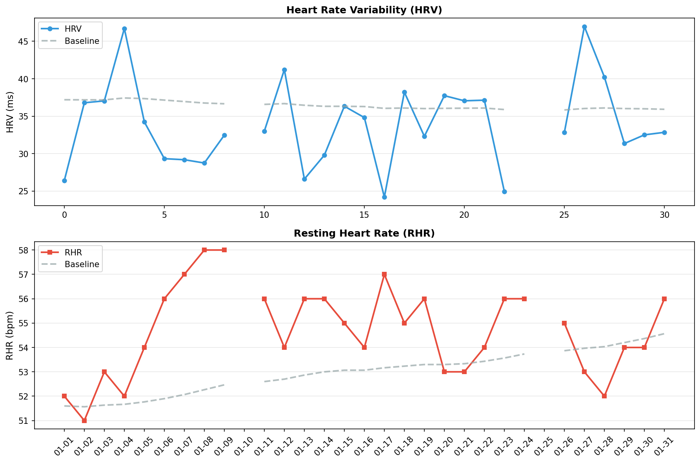

# 🧠 メンタルレポート

**期間**: 2026-01-01 〜 2026-01-31 (31日間)

---

## 🧘 反応性

自律神経系の反応性と回復力を評価

### 📊 期間サマリー


| 指標 | 期間平均 | ベースライン | 変化 |
|------|----------|-------------|------|
| HRV | 34.0 ms | 36.5 ms | -6.8% |
| RHR | 54.7 bpm | 53.0 bpm | 3.2% |
| BR | 14.6 /min | - | - |
| SpO2 | 96.4% | - | - |

### 📅 日別データ

| 日付 | HRV | RHR | BR | SpO2 | 体温Δ |
|------|-----|-----|----|----|------|
| 01-01 | 26.4 | 52 | 16.0 | 94.9/96.3 | 2.10 |
| 01-02 | 36.8 | 51 | 14.8 | 95.4/97.2 | -0.10 |
| 01-03 | 37.0 | 53 | 14.8 | 95.1/97.0 | -0.40 |
| 01-04 | 46.7 | 52 | 14.0 | 95.6/96.7 | -1.10 |
| 01-05 | 34.2 | 54 | 14.0 | 95.1/96.9 | -0.40 |
| 01-06 | 29.3 | 56 | 14.0 | 94.6/96.1 | - |
| 01-07 | 29.2 | 57 | 14.8 | 95.2/96.6 | 0.70 |
| 01-08 | 28.8 | 58 | 12.2 | 94.2/96.7 | -0.80 |
| 01-09 | 32.5 | 58 | 14.4 | 95.1/96.3 | -1.00 |
| 01-10 | - | - | - | - | - |
| 01-11 | 33.0 | 56 | 15.0 | 94.5/96.7 | -0.30 |
| 01-12 | 41.2 | 54 | 14.6 | 94.4/96.0 | 0.40 |
| 01-13 | 26.6 | 56 | 15.2 | 95.0/96.2 | 0.90 |
| 01-14 | 29.8 | 56 | 14.2 | 92.8/96.6 | -0.50 |
| 01-15 | 36.3 | 55 | 14.4 | 93.1/95.7 | - |
| 01-16 | 34.8 | 54 | 15.0 | 95.0/96.0 | 0.20 |
| 01-17 | 24.2 | 57 | 14.6 | 96.3/97.3 | -1.20 |
| 01-18 | 38.2 | 55 | 15.0 | 94.8/96.4 | 0.40 |
| 01-19 | 32.3 | 56 | 15.8 | 95.5/96.7 | 0.10 |
| 01-20 | 37.7 | 53 | 14.6 | 95.0/95.9 | 0.60 |
| 01-21 | 37.1 | 53 | 14.4 | 95.5/96.7 | 0.90 |
| 01-22 | 37.1 | 54 | 14.8 | 93.4/95.9 | -0.80 |
| 01-23 | 24.9 | 56 | 14.6 | 93.7/95.9 | 1.20 |
| 01-24 | - | 56 | - | 94.9/95.5 | -0.10 |
| 01-25 | - | - | - | - | - |
| 01-26 | 32.8 | 55 | 14.0 | 92.8/96.4 | -1.30 |
| 01-27 | 47.0 | 53 | 14.8 | 95.0/96.5 | -0.40 |
| 01-28 | 40.2 | 52 | 14.8 | 95.1/97.1 | 0.20 |
| 01-29 | 31.4 | 54 | 14.6 | 94.7/96.3 | - |
| 01-30 | 32.5 | 54 | 14.8 | 94.7/95.9 | 1.00 |
| 01-31 | 32.8 | 56 | 14.4 | 95.0/96.2 | -0.20 |

**凡例**:
- **HRV**: 心拍変動（RMSSD, ms） / **RHR**: 安静時心拍数（bpm） / **BR**: 呼吸数（回/分）
- **SpO2**: 血中酸素飽和度（最小/平均%、95%以上が正常）
- **体温Δ**: 皮膚温変動（℃）

---
## 🏃 運動バランス

身体活動レベルとバランスを評価

| 日付 | 歩数 | AZM合計 |
|------|------|---------|
| 01-01 | 400 | - |
| 01-02 | 5109 | 1 |
| 01-03 | 5196 | - |
| 01-04 | 6442 | 17 |
| 01-05 | 6139 | 35 |
| 01-06 | 6601 | 18 |
| 01-07 | 6222 | 18 |
| 01-08 | 5376 | 32 |
| 01-09 | 1537 | 13 |
| 01-10 | - | - |
| 01-11 | 3614 | 16 |
| 01-12 | 280 | - |
| 01-13 | 7677 | 27 |
| 01-14 | 6597 | 6 |
| 01-15 | 5712 | 16 |
| 01-16 | 6210 | 6 |
| 01-17 | 6558 | 18 |
| 01-18 | 45213 | 305 |
| 01-19 | 7171 | 13 |
| 01-20 | 2399 | 19 |
| 01-21 | 6240 | 16 |
| 01-22 | 7360 | 20 |
| 01-23 | 6343 | 5 |
| 01-24 | 1583 | 9 |
| 01-25 | - | - |
| 01-26 | 5637 | 7 |
| 01-27 | 1351 | 31 |
| 01-28 | 8409 | 45 |
| 01-29 | 8962 | 58 |
| 01-30 | 6994 | 22 |
| 01-31 | 7270 | 24 |

**解釈**:
- 週150分以上のアクティブゾーン分が推奨される
- 1日8,000歩以上が健康的な目標

---
## 😴 睡眠パターン

睡眠の量と質を評価

| 日付 | 就寝時刻 | 起床時刻 | 睡眠時間 | 効率 | 入眠 | 起後 | 中途覚醒回数 |
|------|----------|----------|----------|------|------|------|--------------|
| 01-01 | 23:12 | 07:35 | 6.0h | 71.0% | 16分 | 0分 | 43 |
| 01-02 | 23:09 | 07:23 | 6.7h | 82.0% | 16分 | 4分 | 36 |
| 01-03 | 21:08 | 06:20 | 6.4h | 70.0% | 15分 | 40分 | 26 |
| 01-04 | 22:09 | 05:28 | 6.0h | 83.0% | 57分 | 0分 | 12 |
| 01-05 | 21:26 | 05:35 | 6.6h | 81.0% | 16分 | 12分 | 25 |
| 01-06 | 23:05 | 06:09 | 4.8h | 68.0% | 66分 | 24分 | 20 |
| 01-07 | 22:15 | 06:35 | 7.0h | 84.0% | 6分 | 22分 | 28 |
| 01-08 | 22:29 | 06:47 | 7.2h | 87.0% | 12分 | 12分 | 21 |
| 01-09 | 22:46 | 06:23 | 5.7h | 74.0% | 16分 | 10分 | 27 |
| 01-10 | - | - | -h | -% | -分 | -分 | - |
| 01-11 | 22:06 | 05:34 | 6.1h | 82.0% | 29分 | 8分 | 22 |
| 01-12 | 21:17 | 05:01 | 6.7h | 87.0% | 6分 | 8分 | 23 |
| 01-13 | 22:15 | 05:58 | 6.9h | 89.0% | 9分 | 10分 | 22 |
| 01-14 | 22:33 | 05:36 | 6.3h | 89.0% | 10分 | 0分 | 20 |
| 01-15 | 21:38 | 05:54 | 7.0h | 84.0% | 17分 | 0分 | 30 |
| 01-16 | 22:33 | 05:38 | 6.0h | 85.0% | 8分 | 25分 | 21 |
| 01-17 | 23:18 | 06:05 | 5.8h | 86.0% | 14分 | 10分 | 25 |
| 01-18 | 22:47 | 06:15 | 6.8h | 92.0% | 0分 | 15分 | 14 |
| 01-19 | 00:45 | 07:06 | 5.3h | 83.0% | 0分 | 30分 | 15 |
| 01-20 | 22:48 | 05:46 | 6.3h | 90.0% | 12分 | 0分 | 20 |
| 01-21 | 22:53 | 05:59 | 5.8h | 82.0% | 0分 | 13分 | 34 |
| 01-22 | 22:15 | 05:55 | 6.8h | 88.0% | 6分 | 10分 | 27 |
| 01-23 | 22:10 | 05:39 | 6.6h | 89.0% | 12分 | 0分 | 30 |
| 01-24 | 00:06 | 05:26 | 4.5h | 85.0% | 15分 | 11分 | 12 |
| 01-25 | - | - | -h | -% | -分 | -分 | - |
| 01-26 | 23:44 | 06:59 | 5.5h | 76.0% | 28分 | 0分 | 21 |
| 01-27 | 21:20 | 06:02 | 7.0h | 81.0% | 58分 | 12分 | 24 |
| 01-28 | 22:04 | 05:15 | 5.9h | 82.0% | 10分 | 42分 | 15 |
| 01-29 | 22:04 | 05:25 | 6.6h | 90.0% | 18分 | 14分 | 15 |
| 01-30 | 22:24 | 05:51 | 6.6h | 89.0% | 16分 | 10分 | 17 |
| 01-31 | 12:15 | 12:30 | 0.1h | 20.0% | 7分 | 0分 | - |

**解釈**:
- 7-9時間の睡眠が最適
- 睡眠効率85%以上が良好
- 入眠潜時（入眠）は15分以内が理想的
- 起床後（起後）のベッド滞在時間は短いほうが良い
- 中途覚醒回数が少ないほど睡眠の質が高い
- 就寝・起床時刻の規則性も重要

---
## ⚠️ 免疫アラート

異常値を**太字**で表示（ベースラインから±1.5SD以上乖離）

### 3.1 データ概要

| 日付 | HRV<br>(ms) | 皮膚温<br>(°C) | RHR<br>(bpm) | SpO2<br>(%) | 睡眠効率<br>(%) | 免疫ストレス<br>スコア |
|------|------------|---------------|-------------|------------|----------------|-------------------|
| 01/01-01/31<br>**ベースライン** | 36.5<br>±5.8 | -0.1<br>±1.0 | 53.0<br>±2.3 | 96.4<br>±0.6 | - | - |
| 01/01 | **26.4** | **2.1** | 52 | 96.3 | **71** | 2.2σ |
| 01/02 | 36.8 | -0.1 | 51 | 97.2 | 82 | 0.0σ |
| 01/03 | 37.0 | -0.4 | 53 | 97.0 | **70** | 0.8σ |
| 01/04 | **46.7** | -1.1 | 52 | 96.7 | 83 | 0.2σ |
| 01/05 | 34.2 | -0.4 | **54** | 96.9 | 81 | 0.4σ |
| 01/06 | 29.3 | 0.0 | **56** | 96.1 | **68** | 1.5σ |
| 01/07 | 29.2 | 0.7 | **57** | 96.6 | 84 | 1.0σ |
| 01/08 | 28.8 | -0.8 | **58** | 96.7 | 87 | 0.9σ |
| 01/09 | 32.5 | -1.0 | **58** | 96.3 | **74** | 1.0σ |
| 01/10 | - | - | - | - | - | -σ |
| 01/11 | 33.0 | -0.3 | 56 | 96.7 | 82 | 0.4σ |
| 01/12 | 41.2 | 0.4 | 54 | 96.0 | 87 | 0.4σ |
| 01/13 | **26.6** | 0.9 | 56 | 96.2 | 89 | 1.3σ |
| 01/14 | 29.8 | -0.5 | 56 | 96.6 | 89 | 0.6σ |
| 01/15 | 36.3 | 0.0 | 55 | 95.7 | 84 | 0.6σ |
| 01/16 | 34.8 | 0.2 | 54 | 96.0 | 85 | 0.5σ |
| 01/17 | **24.2** | -1.2 | 57 | 97.3 | 86 | 1.1σ |
| 01/18 | 38.2 | 0.4 | 55 | 96.4 | 92 | 0.3σ |
| 01/19 | 32.3 | 0.1 | 56 | 96.7 | 83 | 0.8σ |
| 01/20 | 37.7 | 0.6 | 53 | 95.9 | 90 | 0.4σ |
| 01/21 | 37.1 | 0.9 | 53 | 96.7 | 82 | 0.2σ |
| 01/22 | 37.1 | -0.8 | 54 | 95.9 | 88 | 0.5σ |
| 01/23 | **24.9** | 1.2 | 56 | 95.9 | 89 | 1.3σ |
| 01/24 | - | -0.1 | 56 | 95.5 | 85 | 0.6σ |
| 01/25 | - | - | - | - | - | -σ |
| 01/26 | 32.8 | -1.3 | 55 | 96.4 | **76** | 0.7σ |
| 01/27 | **47.0** | -0.4 | 53 | 96.5 | 81 | 0.2σ |
| 01/28 | 40.2 | 0.2 | 52 | 97.1 | 82 | 0.1σ |
| 01/29 | 31.4 | 0.0 | 54 | 96.3 | 90 | 0.5σ |
| 01/30 | 32.5 | 1.0 | 54 | 95.9 | 89 | 1.0σ |
| 01/31 | 32.8 | -0.2 | 56 | 96.2 | **20** | 1.7σ |

**太字**: ベースラインから有意な逸脱（±1.5SD以上）

### 3.2 免疫ストレススコアの推移

各指標の標準化スコア（ベースラインからの標準偏差）を統合：

```
日付     免疫ストレス総合スコア  判定           主な異常指標
01/01    2.2σ                   🔴 重度異常     HRV -1.9SD, 皮膚温 2.1SD, 睡眠効率低下
01/02    0.0σ                   🟢 正常範囲     -
01/03    0.8σ                   🟢 正常範囲     睡眠効率低下
01/04    0.2σ                   🟢 正常範囲     HRV 1.6SD, 呼吸数 -2.0SD
01/05    0.4σ                   🟢 正常範囲     呼吸数 -1.8SD
01/06    1.5σ                   ⚠️ 警告レベル     呼吸数 -1.7SD, 睡眠効率低下
01/07    1.0σ                   🟢 正常範囲     -
01/08    0.9σ                   🟢 正常範囲     呼吸数 -3.6SD
01/09    1.0σ                   ⚠️ 軽度異常     睡眠効率低下
01/10    0.0σ                   🟢 正常範囲     -
01/11    0.4σ                   🟢 正常範囲     -
01/12    0.4σ                   🟢 正常範囲     -
01/13    1.3σ                   ⚠️ 軽度異常     HRV -1.7SD
01/14    0.6σ                   🟢 正常範囲     -
01/15    0.6σ                   🟢 正常範囲     -
01/16    0.5σ                   🟢 正常範囲     -
01/17    1.1σ                   ⚠️ 軽度異常     HRV -2.0SD
01/18    0.3σ                   🟢 正常範囲     -
01/19    0.8σ                   🟢 正常範囲     -
01/20    0.4σ                   🟢 正常範囲     -
01/21    0.2σ                   🟢 正常範囲     -
01/22    0.5σ                   🟢 正常範囲     -
01/23    1.3σ                   ⚠️ 軽度異常     HRV -1.9SD
01/24    0.6σ                   🟢 正常範囲     -
01/25    0.0σ                   🟢 正常範囲     -
01/26    0.7σ                   🟢 正常範囲     睡眠効率低下
01/27    0.2σ                   🟢 正常範囲     HRV 1.8SD
01/28    0.1σ                   🟢 正常範囲     -
01/29    0.5σ                   🟢 正常範囲     -
01/30    1.0σ                   🟢 正常範囲     -
01/31    1.7σ                   ⚠️ 警告レベル     睡眠効率低下
```

---
## 📊 推移グラフ

HRV・RHRのベースラインからの乖離を視覚化



**見方**:
- **実線**: 実際の値
- **点線**: 個人のベースライン（HRV: 過去60日平均、RHR: 過去30日平均）
- **HRV**: ベースラインより高いほど良好（疲労回復できている）
- **RHR**: ベースラインより低いほど良好（心臓の負担が少ない）

---