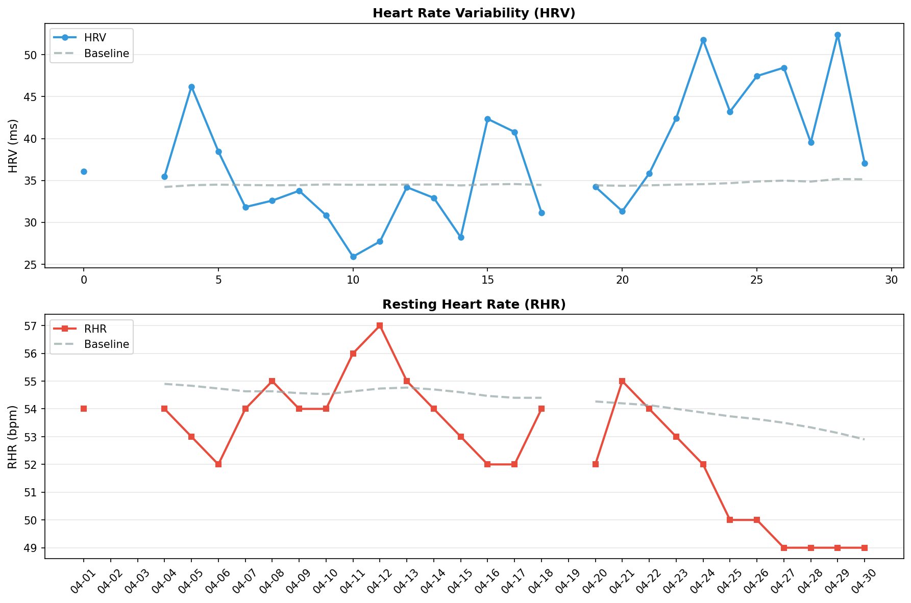

# 🧠 メンタルレポート

**期間**: 2026-04-01 〜 2026-04-30 (30日間)

---

## 🧘 反応性

自律神経系の反応性と回復力を評価

### 📊 期間サマリー


| 指標 | 期間平均 | ベースライン | 変化 |
|------|----------|-------------|------|
| HRV | 37.5 ms | 34.6 ms | 8.5% |
| RHR | 52.8 bpm | 54.3 bpm | -2.7% |
| BR | 14.9 /min | - | - |
| SpO2 | 96.4% | - | - |

### 📅 日別データ

| 日付 | HRV | RHR | BR | SpO2 | 体温Δ |
|------|-----|-----|----|----|------|
| 04-01 | 36.1 | 54 | 15.6 | 94.8/96.2 | -2.00 |
| 04-02 | - | - | - | - | - |
| 04-03 | - | - | - | - | - |
| 04-04 | 35.5 | 54 | 15.2 | 95.3/96.5 | 0.20 |
| 04-05 | 46.2 | 53 | 14.2 | 94.2/95.7 | 0.20 |
| 04-06 | 38.5 | 52 | 15.0 | 94.0/95.6 | -0.20 |
| 04-07 | 31.8 | 54 | 14.6 | 95.4/96.6 | -0.60 |
| 04-08 | 32.6 | 55 | 15.0 | 95.6/96.8 | -0.10 |
| 04-09 | 33.8 | 54 | 15.4 | 94.9/96.6 | 0.10 |
| 04-10 | 30.8 | 54 | 15.4 | 94.6/96.7 | -0.20 |
| 04-11 | 25.9 | 56 | 15.8 | 95.7/97.4 | -0.50 |
| 04-12 | 27.7 | 57 | 15.4 | 93.3/95.5 | 0.90 |
| 04-13 | 34.2 | 55 | 15.8 | 95.5/96.2 | 0.90 |
| 04-14 | 32.9 | 54 | 14.0 | 94.9/96.7 | 0.80 |
| 04-15 | 28.2 | 53 | 14.6 | 92.6/96.2 | -0.60 |
| 04-16 | 42.3 | 52 | - | 92.5/95.8 | 0.50 |
| 04-17 | 40.8 | 52 | 14.6 | 94.7/95.9 | 0.30 |
| 04-18 | 31.2 | 54 | 13.2 | 91.3/96.1 | 0.90 |
| 04-19 | - | - | - | - | - |
| 04-20 | 34.2 | 52 | 14.6 | 95.6/96.5 | 1.00 |
| 04-21 | 31.3 | 55 | 14.6 | 94.1/96.8 | 0.30 |
| 04-22 | 35.8 | 54 | 15.6 | 93.0/96.1 | 1.60 |
| 04-23 | 42.4 | 53 | 14.0 | 93.4/96.3 | 0.80 |
| 04-24 | 51.8 | 52 | 15.2 | 92.0/96.0 | - |
| 04-25 | 43.2 | 50 | 14.6 | 95.9/97.2 | - |
| 04-26 | 47.5 | 50 | 14.6 | 96.0/97.1 | - |
| 04-27 | 48.5 | 49 | 14.8 | 94.3/96.0 | -0.40 |
| 04-28 | 39.5 | 49 | 15.0 | 94.3/96.1 | 1.40 |
| 04-29 | 52.4 | 49 | 15.8 | 95.4/97.3 | -1.30 |
| 04-30 | 37.0 | 49 | 15.0 | - | 1.40 |

**凡例**:
- **HRV**: 心拍変動（RMSSD, ms） / **RHR**: 安静時心拍数（bpm） / **BR**: 呼吸数（回/分）
- **SpO2**: 血中酸素飽和度（最小/平均%、95%以上が正常）
- **体温Δ**: 皮膚温変動（℃）

---
## 🏃 運動バランス

身体活動レベルとバランスを評価

| 日付 | 歩数 | AZM合計 |
|------|------|---------|
| 04-01 | 1236 | 9 |
| 04-02 | - | - |
| 04-03 | - | - |
| 04-04 | 4596 | 52 |
| 04-05 | 3676 | 13 |
| 04-06 | 7148 | 10 |
| 04-07 | 5086 | 11 |
| 04-08 | 5073 | 5 |
| 04-09 | 5356 | 6 |
| 04-10 | 4108 | 6 |
| 04-11 | 4186 | 5 |
| 04-12 | 6689 | 10 |
| 04-13 | 7405 | 16 |
| 04-14 | 5899 | 19 |
| 04-15 | 7444 | 13 |
| 04-16 | 316 | - |
| 04-17 | 8713 | 9 |
| 04-18 | 2974 | 20 |
| 04-19 | - | - |
| 04-20 | 16870 | 396 |
| 04-21 | 10140 | 5 |
| 04-22 | 10590 | 14 |
| 04-23 | 2193 | - |
| 04-24 | 4391 | 8 |
| 04-25 | 5844 | 146 |
| 04-26 | 13187 | 56 |
| 04-27 | 6256 | 5 |
| 04-28 | 5043 | 50 |
| 04-29 | 3480 | 1 |
| 04-30 | 75 | - |

**解釈**:
- 週150分以上のアクティブゾーン分が推奨される
- 1日8,000歩以上が健康的な目標

---
## 😴 睡眠パターン

睡眠の量と質を評価

| 日付 | 就寝時刻 | 起床時刻 | 睡眠時間 | 効率 | 入眠 | 起後 | 中途覚醒回数 |
|------|----------|----------|----------|------|------|------|--------------|
| 04-01 | 22:59 | 06:20 | 6.4h | 87.0% | 16分 | 14分 | 22 |
| 04-02 | - | - | -h | -% | -分 | -分 | - |
| 04-03 | - | - | -h | -% | -分 | -分 | - |
| 04-04 | 23:09 | 06:01 | 6.2h | 91.0% | 4分 | 15分 | 16 |
| 04-05 | 22:29 | 05:19 | 5.8h | 84.0% | 16分 | 26分 | 18 |
| 04-06 | 22:57 | 05:03 | 5.5h | 90.0% | 11分 | 10分 | 13 |
| 04-07 | 22:49 | 05:03 | 5.8h | 93.0% | 0分 | 8分 | 12 |
| 04-08 | 22:14 | 05:12 | 6.2h | 89.0% | 8分 | 8分 | 21 |
| 04-09 | 22:05 | 05:26 | 6.2h | 85.0% | 16分 | 34分 | 17 |
| 04-10 | 22:56 | 05:12 | 5.3h | 84.0% | 14分 | 19分 | 19 |
| 04-11 | 22:54 | 05:11 | 5.7h | 91.0% | 11分 | 9分 | 15 |
| 04-12 | 22:55 | 05:20 | 5.4h | 84.0% | 8分 | 42分 | 10 |
| 04-13 | 23:05 | 04:43 | 4.8h | 85.0% | 13分 | 0分 | 11 |
| 04-14 | 23:03 | 05:12 | 5.9h | 96.0% | 4分 | 0分 | 10 |
| 04-15 | 23:20 | 04:50 | 5.1h | 92.0% | 8分 | 8分 | 11 |
| 04-16 | 22:41 | 04:24 | 5.3h | 93.0% | 7分 | 0分 | 15 |
| 04-17 | 22:40 | 06:00 | 6.9h | 95.0% | 4分 | 0分 | 16 |
| 04-18 | 23:41 | 06:18 | 5.5h | 84.0% | 6分 | 0分 | 33 |
| 04-19 | - | - | -h | -% | -分 | -分 | - |
| 04-20 | 23:29 | 05:49 | 3.3h | 52.0% | 116分 | 18分 | 20 |
| 04-21 | 23:30 | 05:36 | 5.3h | 86.0% | 12分 | 10分 | 26 |
| 04-22 | 21:55 | 06:24 | 7.6h | 90.0% | 10分 | 24分 | 17 |
| 04-23 | 20:49 | 06:16 | 8.4h | 89.0% | 4分 | 17分 | 25 |
| 04-24 | 20:31 | 07:07 | 8.3h | 79.0% | 6分 | 71分 | 34 |
| 04-25 | 20:46 | 06:29 | 8.3h | 86.0% | 6分 | 55分 | 24 |
| 04-26 | 22:52 | 05:22 | 6.2h | 95.0% | 6分 | 0分 | 11 |
| 04-27 | 21:53 | 06:20 | 7.9h | 93.0% | 4分 | 0分 | 24 |
| 04-28 | 22:02 | 06:45 | 6.8h | 78.0% | 5分 | 12分 | 15 |
| 04-29 | 21:44 | 06:22 | 7.9h | 91.0% | 12分 | 7分 | 16 |
| 04-30 | 21:32 | 06:14 | 8.2h | 94.0% | 18分 | 0分 | 12 |

**解釈**:
- 7-9時間の睡眠が最適
- 睡眠効率85%以上が良好
- 入眠潜時（入眠）は15分以内が理想的
- 起床後（起後）のベッド滞在時間は短いほうが良い
- 中途覚醒回数が少ないほど睡眠の質が高い
- 就寝・起床時刻の規則性も重要

---
## ⚠️ 免疫アラート

異常値を**太字**で表示（ベースラインから±1.5SD以上乖離）

### 3.1 データ概要

| 日付 | HRV<br>(ms) | 皮膚温<br>(°C) | RHR<br>(bpm) | SpO2<br>(%) | 睡眠効率<br>(%) | 免疫ストレス<br>スコア |
|------|------------|---------------|-------------|------------|----------------|-------------------|
| 04/01-04/30<br>**ベースライン** | 34.6<br>±6.1 | -0.2<br>±0.9 | 54.3<br>±1.5 | 96.2<br>±0.6 | - | - |
| 04/01 | 36.1 | **-2.0** | 54 | 96.2 | 87 | 0.7σ |
| 04/02 | - | - | - | - | - | -σ |
| 04/03 | - | - | - | - | - | -σ |
| 04/04 | 35.5 | 0.2 | 54 | 96.5 | 91 | 0.3σ |
| 04/05 | **46.2** | 0.2 | 53 | 95.7 | 84 | 0.4σ |
| 04/06 | 38.5 | -0.2 | **52** | 95.6 | 90 | 0.5σ |
| 04/07 | 31.8 | -0.6 | 54 | 96.6 | 93 | 0.2σ |
| 04/08 | 32.6 | -0.1 | 55 | 96.8 | 89 | 0.3σ |
| 04/09 | 33.8 | 0.1 | 54 | 96.6 | 85 | 0.4σ |
| 04/10 | 30.8 | -0.2 | 54 | 96.7 | 84 | 0.6σ |
| 04/11 | 25.9 | -0.5 | 56 | **97.4** | 91 | 1.2σ |
| 04/12 | 27.7 | 0.9 | **57** | 95.5 | 84 | 1.6σ |
| 04/13 | 34.2 | 0.9 | 55 | 96.2 | 85 | 0.8σ |
| 04/14 | 32.9 | 0.8 | 54 | 96.7 | 96 | 0.3σ |
| 04/15 | 28.2 | -0.6 | 53 | 96.2 | 92 | 0.5σ |
| 04/16 | 42.3 | 0.5 | **52** | 95.8 | 93 | 0.5σ |
| 04/17 | 40.8 | 0.3 | **52** | 95.9 | 95 | 0.3σ |
| 04/18 | 31.2 | 0.9 | 54 | 96.1 | 84 | 0.6σ |
| 04/19 | - | - | - | - | - | -σ |
| 04/20 | 34.2 | 1.0 | 52 | 96.5 | **52** | 1.3σ |
| 04/21 | 31.3 | 0.3 | 55 | 96.8 | 86 | 0.3σ |
| 04/22 | 35.8 | **1.6** | 54 | 96.1 | 90 | 0.8σ |
| 04/23 | 42.4 | 0.8 | 53 | 96.3 | 89 | 0.2σ |
| 04/24 | **51.8** | 0.0 | 52 | 96.0 | **79** | 0.6σ |
| 04/25 | 43.2 | 0.0 | **50** | **97.2** | 86 | 0.0σ |
| 04/26 | **47.5** | 0.0 | **50** | **97.1** | 95 | 0.0σ |
| 04/27 | **48.5** | -0.4 | **49** | 96.0 | 93 | 0.4σ |
| 04/28 | 39.5 | **1.4** | **49** | 96.1 | **78** | 0.7σ |
| 04/29 | **52.4** | **-1.3** | **49** | **97.3** | 91 | 0.8σ |
| 04/30 | 37.0 | 1.4 | **49** | - | 94 | 0.3σ |

**太字**: ベースラインから有意な逸脱（±1.5SD以上）

### 3.2 免疫ストレススコアの推移

各指標の標準化スコア（ベースラインからの標準偏差）を統合：

```
日付     免疫ストレス総合スコア  判定           主な異常指標
04/01    0.7σ                   🟢 正常範囲     皮膚温 -1.6SD
04/02    0.0σ                   🟢 正常範囲     -
04/03    0.0σ                   🟢 正常範囲     -
04/04    0.3σ                   🟢 正常範囲     -
04/05    0.4σ                   🟢 正常範囲     HRV 2.0SD
04/06    0.5σ                   🟢 正常範囲     -
04/07    0.2σ                   🟢 正常範囲     -
04/08    0.3σ                   🟢 正常範囲     -
04/09    0.4σ                   🟢 正常範囲     -
04/10    0.6σ                   🟢 正常範囲     -
04/11    1.2σ                   ⚠️ 軽度異常     SpO2 1.9SD, 呼吸数 1.8SD
04/12    1.6σ                   ⚠️ 警告レベル     -
04/13    0.8σ                   🟢 正常範囲     呼吸数 1.6SD
04/14    0.3σ                   🟢 正常範囲     呼吸数 -2.0SD
04/15    0.5σ                   🟢 正常範囲     -
04/16    0.5σ                   🟢 正常範囲     -
04/17    0.3σ                   🟢 正常範囲     -
04/18    0.6σ                   🟢 正常範囲     呼吸数 -2.9SD
04/19    0.0σ                   🟢 正常範囲     -
04/20    1.3σ                   ⚠️ 軽度異常     睡眠効率低下
04/21    0.3σ                   🟢 正常範囲     -
04/22    0.8σ                   🟢 正常範囲     皮膚温 1.7SD
04/23    0.2σ                   🟢 正常範囲     -
04/24    0.6σ                   🟢 正常範囲     HRV 2.8SD, 睡眠効率低下
04/25    0.0σ                   🟢 正常範囲     SpO2 1.8SD
04/26    0.0σ                   🟢 正常範囲     SpO2 1.6SD, HRV 1.9SD
04/27    0.4σ                   🟢 正常範囲     HRV 2.0SD
04/28    0.7σ                   🟢 正常範囲     皮膚温 1.5SD, 睡眠効率低下
04/29    0.8σ                   🟢 正常範囲     SpO2 1.9SD, HRV 2.5SD, 皮膚温 -1.8SD
04/30    0.3σ                   🟢 正常範囲     -
```

---
## 📊 推移グラフ

HRV・RHRのベースラインからの乖離を視覚化



**見方**:
- **実線**: 実際の値
- **点線**: 個人のベースライン（HRV: 過去60日平均、RHR: 過去30日平均）
- **HRV**: ベースラインより高いほど良好（疲労回復できている）
- **RHR**: ベースラインより低いほど良好（心臓の負担が少ない）

---