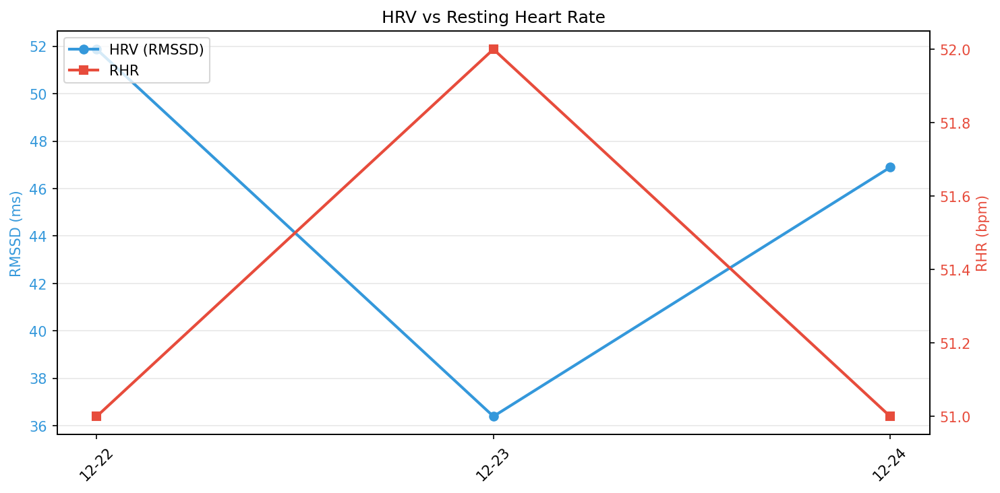
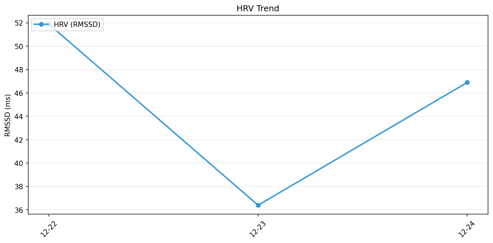

# メンタルコンディションレポート

**期間**: 2025-12-22 〜 2025-12-23（2日間）

---

## サマリー

| 指標 | 平均 | 変化 | トレンド |
|------|------|------|----------|
| HRV (RMSSD) | 44.1ms | -15.5ms | ↘ 下降 |
| 安静時心拍数 | 51.5bpm | +1.0bpm | → 安定 |
| 睡眠時間 | 6.6時間 | - | - |
| 睡眠効率 | 88% | - | - |

---

## 自律神経バランス

> HRVは副交感神経活動の指標。高いほどリラックス・回復状態。

### HRV (心拍変動)

| 指標 | 値 |
|------|-----|
| 平均RMSSD | 44.1ms |
| 変動幅 (SD) | 10.9ms |
| 範囲 | 36.4 〜 51.9ms |
| 開始→終了 | 51.9 → 36.4ms (-15.5ms) |

### 安静時心拍数

| 指標 | 値 |
|------|-----|
| 平均RHR | 51.5bpm |
| 範囲 | 51 〜 52bpm |
| 開始→終了 | 51 → 52bpm (+1.0bpm) |

> HRV上昇 & RHR低下 = 回復良好、HRV低下 & RHR上昇 = ストレス/疲労

---

## 睡眠

| 指標 | 値 | 推奨 |
|------|-----|------|
| 平均睡眠時間 | 6.6時間 | 7-9時間 |
| 平均効率 | 88% | 85%以上 |
| 深い睡眠 | 71分 (18%) | 13-23% |
| レム睡眠 | 99分 (25%) | 20-25% |

---

## 生理的指標

### 呼吸数

| 指標 | 値 | 正常範囲 |
|------|-----|----------|
| 平均 | 14.9回/分 | 12-20回/分 |
| 範囲 | 14.4 〜 15.4回/分 | - |

### 血中酸素濃度 (SpO2)

| 指標 | 値 | 正常範囲 |
|------|-----|----------|
| 平均 | 96.5% | 95-100% |
| 範囲 | 96.5 〜 96.5% | - |

### 心肺スコア (VO2 Max)

| 指標 | 値 |
|------|-----|
| 最新 | 62.0 ml/kg/min |
| 平均 | 62.0 ml/kg/min |
| 範囲 | 62.0 〜 62.0 ml/kg/min |

### 皮膚温変動（睡眠中）

| 指標 | 値 |
|------|-----|
| 平均変動 | -0.15°C |
| 範囲 | -0.30 〜 0.00°C |
| 変動幅 (SD) | 0.21°C |

> 基礎体温からの差分。一貫性が高い（変動幅が小さい）ほど安定した睡眠状態

---

## 日別データ

| 日付 | HRV (ms) | RHR (bpm) | 睡眠 | 効率 |
|------|----------|-----------|------|------|
| 12-22 | 51.9 | 51 | 6.3h | 87% |
| 12-23 | 36.4 | 52 | 7.0h | 89% |

---

## 推移グラフ

### HRV vs 心拍数

### HRV推移

