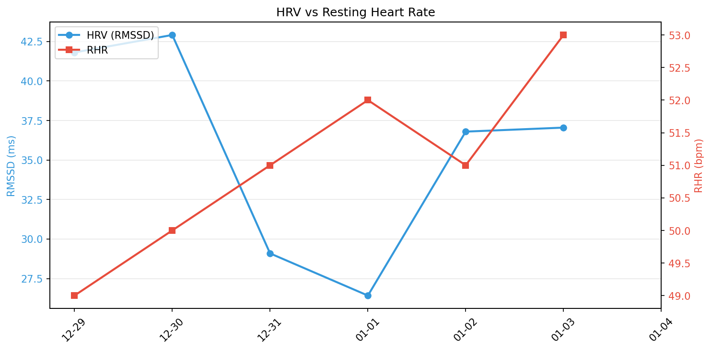
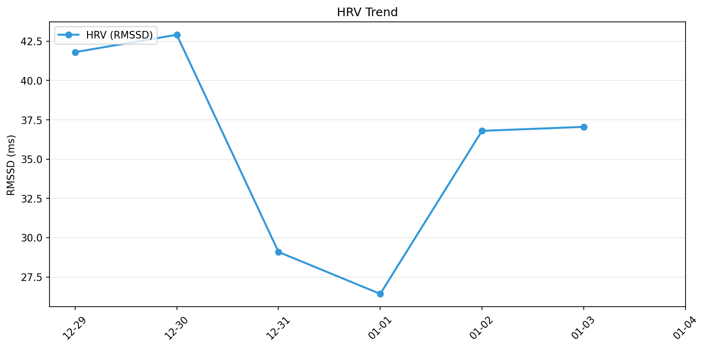

# 🧠 メンタルレポート

**期間**: 2025-12-29 〜 2026-01-04 (7日間)

---

## 🧘 反応性

自律神経系の反応性と回復力を評価

| 日付 | HRV | Δ% | RHR | Δ% | BR | SpO2 |
|------|-----|-----|-----|-----|----|----|
| 12-29 | 41.8 | **+11.2%** | 49 | **-5.3%** | 15.0 | 95.6/96.7 |
| 12-30 | 42.9 | **+13.6%** | 50 | -3.2% | 15.6 | 95.4/96.6 |
| 12-31 | 29.1 | ⚠️-22.5% | 51 | -1.2% | 16.6 | 95.0/96.8 |
| 01-01 | 26.4 | ⚠️-29.0% | 52 | 0.8% | 16.0 | 94.9/96.3 |
| 01-02 | 36.8 | -1.1% | 51 | -1.1% | 14.8 | 95.4/97.2 |
| 01-03 | 37.0 | -0.4% | 53 | 2.6% | 14.8 | 95.1/97.0 |
| 01-04 | - | - | - | - | - | - |

**凡例**:
- **HRV**: 心拍変動（RMSSD, ms） / **RHR**: 安静時心拍数（bpm） / **BR**: 呼吸数（回/分）
- **Δ%**: ベースライン乖離率（過去60日平均との差）
  - HRV: +10%以上で**良好**、-10%以下で⚠️要注意（疲労・ストレス）
  - RHR: +5%以上で⚠️要注意（疲労・体調不良）、-5%以下で**良好**
- **SpO2**: 血中酸素飽和度（最小/平均、95%以上が正常）

---
## 🏃 運動バランス

身体活動レベルとバランスを評価

| 日付 | 歩数 | AZM合計 |
|------|------|---------|
| 12-29 | 4196 | 2 |
| 12-30 | 5932 | 2 |
| 12-31 | 5546 | - |
| 01-01 | 400 | - |
| 01-02 | 5109 | 1 |
| 01-03 | 1280 | - |
| 01-04 | - | - |

**解釈**:
- 週150分以上のアクティブゾーン分が推奨される
- 1日8,000歩以上が健康的な目標

---
## 😴 睡眠パターン

睡眠の量と質を評価

| 日付 | 就寝時刻 | 起床時刻 | 睡眠時間 | 効率 | 中途覚醒回数 |
|------|----------|----------|----------|------|--------------|
| 12-29 | 20:50 | 08:32 | 8.3h | 71.0% | 46 |
| 12-30 | 22:14 | 05:47 | 6.4h | 85.0% | 23 |
| 12-31 | 21:25 | 05:40 | 7.5h | 90.0% | 29 |
| 01-01 | 23:12 | 07:35 | 6.0h | 71.0% | 43 |
| 01-02 | 23:09 | 07:23 | 6.7h | 82.0% | 36 |
| 01-03 | 21:08 | 06:20 | 6.4h | 70.0% | 26 |
| 01-04 | - | - | -h | -% | - |

**解釈**:
- 7-9時間の睡眠が最適
- 睡眠効率85%以上が良好
- 中途覚醒回数が少ないほど睡眠の質が高い
- 就寝・起床時刻の規則性も重要

---
## 📊 推移グラフ

### HRV vs 心拍数

### HRV推移

