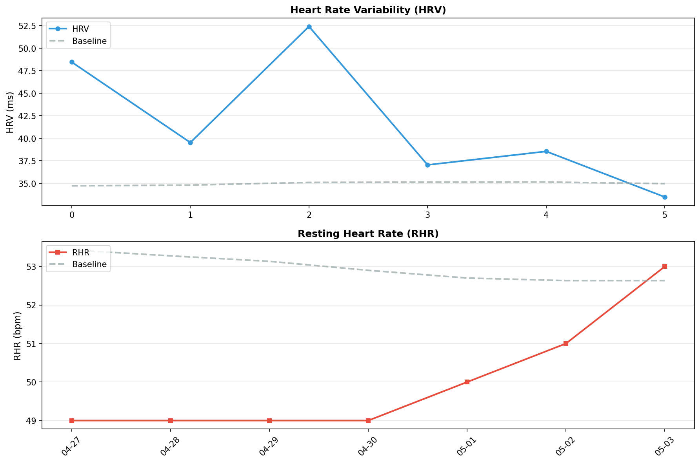

# 🧠 メンタルレポート

**期間**: 2026-04-27 〜 2026-05-03 (7日間)

---

## 🧘 反応性

自律神経系の反応性と回復力を評価

### 📊 期間サマリー


| 指標 | 期間平均 | ベースライン | 変化 |
|------|----------|-------------|------|
| HRV | 41.6 ms | 35.0 ms | **18.9%** |
| RHR | 50.0 bpm | 53.0 bpm | **-5.6%** |
| BR | 15.3 /min | - | - |
| SpO2 | 96.4% | - | - |

### 📅 日別データ

| 日付 | HRV | RHR | BR | SpO2 | 体温Δ |
|------|-----|-----|----|----|------|
| 04-27 | 48.5 | 49 | 14.8 | 94.3/96.0 | -0.40 |
| 04-28 | 39.5 | 49 | 15.0 | 94.3/96.1 | 1.40 |
| 04-29 | 52.4 | 49 | 15.8 | 95.4/97.3 | -1.30 |
| 04-30 | 37.0 | 49 | 15.0 | 95.0/96.4 | 1.40 |
| 05-01 | 38.5 | 50 | 15.8 | 94.5/96.1 | 0.80 |
| 05-02 | 33.5 | 51 | 15.4 | 93.0/96.4 | -1.10 |
| 05-03 | - | 53 | - | - | 0.80 |

**凡例**:
- **HRV**: 心拍変動（RMSSD, ms） / **RHR**: 安静時心拍数（bpm） / **BR**: 呼吸数（回/分）
- **SpO2**: 血中酸素飽和度（最小/平均%、95%以上が正常）
- **体温Δ**: 皮膚温変動（℃）

---
## 🏃 運動バランス

身体活動レベルとバランスを評価

| 日付 | 歩数 | AZM合計 |
|------|------|---------|
| 04-27 | 6256 | 5 |
| 04-28 | 5043 | 50 |
| 04-29 | 3480 | 1 |
| 04-30 | 7616 | 3 |
| 05-01 | 8416 | 193 |
| 05-02 | 2140 | - |
| 05-03 | 107 | - |

**解釈**:
- 週150分以上のアクティブゾーン分が推奨される
- 1日8,000歩以上が健康的な目標

---
## 😴 睡眠パターン

睡眠の量と質を評価

| 日付 | 就寝時刻 | 起床時刻 | 睡眠時間 | 効率 | 入眠 | 起後 | 中途覚醒回数 |
|------|----------|----------|----------|------|------|------|--------------|
| 04-27 | 21:53 | 06:20 | 7.9h | 93.0% | 4分 | 0分 | 24 |
| 04-28 | 22:02 | 06:45 | 6.8h | 78.0% | 5分 | 12分 | 15 |
| 04-29 | 21:44 | 06:22 | 7.9h | 91.0% | 12分 | 7分 | 16 |
| 04-30 | 21:32 | 06:14 | 8.2h | 94.0% | 18分 | 0分 | 12 |
| 05-01 | 23:39 | 06:48 | 6.7h | 93.0% | 6分 | 0分 | 18 |
| 05-02 | 21:24 | 07:07 | 9.1h | 94.0% | 6分 | 0分 | 21 |
| 05-03 | 21:43 | 04:36 | 4.2h | 61.0% | 70分 | 61分 | 16 |

**解釈**:
- 7-9時間の睡眠が最適
- 睡眠効率85%以上が良好
- 入眠潜時（入眠）は15分以内が理想的
- 起床後（起後）のベッド滞在時間は短いほうが良い
- 中途覚醒回数が少ないほど睡眠の質が高い
- 就寝・起床時刻の規則性も重要

---
## ⚠️ 免疫アラート

異常値を**太字**で表示（ベースラインから±1.5SD以上乖離）

### 3.1 データ概要

| 日付 | HRV<br>(ms) | 皮膚温<br>(°C) | RHR<br>(bpm) | SpO2<br>(%) | 睡眠効率<br>(%) | 免疫ストレス<br>スコア |
|------|------------|---------------|-------------|------------|----------------|-------------------|
| 04/27-05/03<br>**ベースライン** | 35.0<br>±6.9 | 0.2<br>±0.8 | 53.0<br>±2.1 | 96.4<br>±0.5 | - | - |
| 04/27 | **48.5** | -0.4 | **49** | 96.0 | 93 | 0.4σ |
| 04/28 | 39.5 | **1.4** | **49** | 96.1 | **78** | 0.7σ |
| 04/29 | **52.4** | **-1.3** | **49** | **97.3** | 91 | 0.8σ |
| 04/30 | 37.0 | 1.4 | **49** | 96.4 | 94 | 0.3σ |
| 05/01 | 38.5 | 0.8 | 50 | 96.1 | 93 | 0.8σ |
| 05/02 | 33.5 | **-1.1** | 51 | 96.4 | 94 | 0.6σ |
| 05/03 | - | 0.8 | 53 | - | **61** | 0.9σ |

**太字**: ベースラインから有意な逸脱（±1.5SD以上）

### 3.2 免疫ストレススコアの推移

各指標の標準化スコア（ベースラインからの標準偏差）を統合：

```
日付     免疫ストレス総合スコア  判定           主な異常指標
04/27    0.4σ                   🟢 正常範囲     HRV 2.0SD
04/28    0.7σ                   🟢 正常範囲     皮膚温 1.5SD, 睡眠効率低下
04/29    0.8σ                   🟢 正常範囲     SpO2 1.9SD, HRV 2.5SD, 皮膚温 -1.8SD
04/30    0.3σ                   🟢 正常範囲     -
05/01    0.8σ                   🟢 正常範囲     -
05/02    0.6σ                   🟢 正常範囲     皮膚温 -1.6SD
05/03    0.9σ                   🟢 正常範囲     睡眠効率低下
```

---
## 📊 推移グラフ

HRV・RHRのベースラインからの乖離を視覚化



**見方**:
- **実線**: 実際の値
- **点線**: 個人のベースライン（HRV: 過去60日平均、RHR: 過去30日平均）
- **HRV**: ベースラインより高いほど良好（疲労回復できている）
- **RHR**: ベースラインより低いほど良好（心臓の負担が少ない）

---