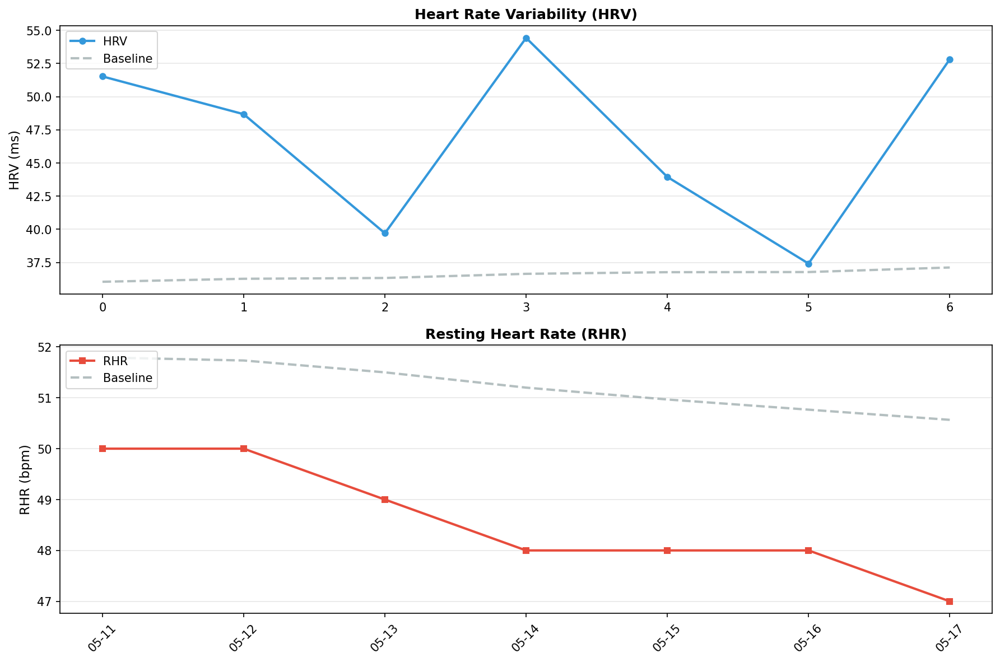

# 🧠 メンタルレポート

**期間**: 2026-05-11 〜 2026-05-17 (7日間)

---

## 🧘 反応性

自律神経系の反応性と回復力を評価

### 📊 期間サマリー


| 指標 | 期間平均 | ベースライン | 変化 |
|------|----------|-------------|------|
| HRV | 46.9 ms | 36.6 ms | **28.4%** |
| RHR | 48.6 bpm | 51.2 bpm | **-5.2%** |
| BR | 14.7 /min | - | - |
| SpO2 | 96.7% | - | - |

### 📅 日別データ

| 日付 | HRV | RHR | BR | SpO2 | 体温Δ |
|------|-----|-----|----|----|------|
| 05-11 | 51.5 | 50 | 15.2 | 95.9/97.0 | 0.30 |
| 05-12 | 48.7 | 50 | 16.2 | 95.2/96.3 | -0.50 |
| 05-13 | 39.7 | 49 | 14.8 | 94.7/96.4 | 0.70 |
| 05-14 | 54.4 | 48 | 14.6 | 94.5/96.3 | -0.40 |
| 05-15 | 44.0 | 48 | 14.0 | 91.6/96.1 | -1.10 |
| 05-16 | 37.4 | 48 | 14.2 | 94.5/97.1 | -1.50 |
| 05-17 | 52.8 | 47 | 13.8 | 96.0/97.7 | -0.10 |

**凡例**:
- **HRV**: 心拍変動（RMSSD, ms） / **RHR**: 安静時心拍数（bpm） / **BR**: 呼吸数（回/分）
- **SpO2**: 血中酸素飽和度（最小/平均%、95%以上が正常）
- **体温Δ**: 皮膚温変動（℃）

---
## 🏃 運動バランス

身体活動レベルとバランスを評価

| 日付 | 歩数 | AZM合計 |
|------|------|---------|
| 05-11 | 4793 | 7 |
| 05-12 | 5803 | 47 |
| 05-13 | 5900 | 175 |
| 05-14 | 6244 | 122 |
| 05-15 | 5002 | 117 |
| 05-16 | 7867 | 151 |
| 05-17 | 1023 | - |

**解釈**:
- 週150分以上のアクティブゾーン分が推奨される
- 1日8,000歩以上が健康的な目標

---
## 😴 睡眠パターン

睡眠の量と質を評価

| 日付 | 就寝時刻 | 起床時刻 | 睡眠時間 | 効率 | 入眠 | 起後 | 中途覚醒回数 |
|------|----------|----------|----------|------|------|------|--------------|
| 05-11 | 23:26 | 05:08 | 5.3h | 93.0% | 5分 | 0分 | 12 |
| 05-12 | 21:54 | 05:05 | 7.0h | 97.0% | 5分 | 0分 | 10 |
| 05-13 | 22:38 | 05:26 | 6.3h | 93.0% | 8分 | 0分 | 16 |
| 05-14 | 22:30 | 05:13 | 5.7h | 84.0% | 8分 | 0分 | 17 |
| 05-15 | 22:25 | 04:54 | 5.8h | 89.0% | 30分 | 0分 | 14 |
| 05-16 | 23:19 | 05:00 | 5.2h | 91.0% | 7分 | 0分 | 15 |
| 05-17 | 22:14 | 05:12 | 6.5h | 93.0% | 11分 | 0分 | 14 |

**解釈**:
- 7-9時間の睡眠が最適
- 睡眠効率85%以上が良好
- 入眠潜時（入眠）は15分以内が理想的
- 起床後（起後）のベッド滞在時間は短いほうが良い
- 中途覚醒回数が少ないほど睡眠の質が高い
- 就寝・起床時刻の規則性も重要

---
## ⚠️ 免疫アラート

異常値を**太字**で表示（ベースラインから±1.5SD以上乖離）

### 3.1 データ概要

| 日付 | HRV<br>(ms) | 皮膚温<br>(°C) | RHR<br>(bpm) | SpO2<br>(%) | 睡眠効率<br>(%) | 免疫ストレス<br>スコア |
|------|------------|---------------|-------------|------------|----------------|-------------------|
| 05/11-05/17<br>**ベースライン** | 36.6<br>±7.7 | 0.2<br>±0.8 | 51.2<br>±2.0 | 96.4<br>±0.5 | - | - |
| 05/11 | **51.5** | 0.3 | 50 | 97.0 | 93 | 0.1σ |
| 05/12 | **48.7** | -0.5 | 50 | 96.3 | 97 | 0.8σ |
| 05/13 | 39.7 | 0.7 | 49 | 96.4 | 93 | 0.1σ |
| 05/14 | **54.4** | -0.4 | **48** | 96.3 | 84 | 0.2σ |
| 05/15 | 44.0 | **-1.1** | **48** | 96.1 | 89 | 0.5σ |
| 05/16 | 37.4 | **-1.5** | 48 | 97.1 | 91 | 0.4σ |
| 05/17 | **52.8** | -0.1 | **47** | **97.7** | 93 | 0.1σ |

**太字**: ベースラインから有意な逸脱（±1.5SD以上）

### 3.2 免疫ストレススコアの推移

各指標の標準化スコア（ベースラインからの標準偏差）を統合：

```
日付     免疫ストレス総合スコア  判定           主な異常指標
05/11    0.1σ                   🟢 正常範囲     HRV 2.1SD
05/12    0.8σ                   🟢 正常範囲     HRV 1.6SD, 呼吸数 1.8SD
05/13    0.1σ                   🟢 正常範囲     -
05/14    0.2σ                   🟢 正常範囲     HRV 2.3SD
05/15    0.5σ                   🟢 正常範囲     皮膚温 -1.6SD
05/16    0.4σ                   🟢 正常範囲     皮膚温 -1.9SD
05/17    0.1σ                   🟢 正常範囲     SpO2 2.3SD, HRV 2.0SD, 呼吸数 -1.6SD
```

---
## 📊 推移グラフ

HRV・RHRのベースラインからの乖離を視覚化



**見方**:
- **実線**: 実際の値
- **点線**: 個人のベースライン（HRV: 過去60日平均、RHR: 過去30日平均）
- **HRV**: ベースラインより高いほど良好（疲労回復できている）
- **RHR**: ベースラインより低いほど良好（心臓の負担が少ない）

---