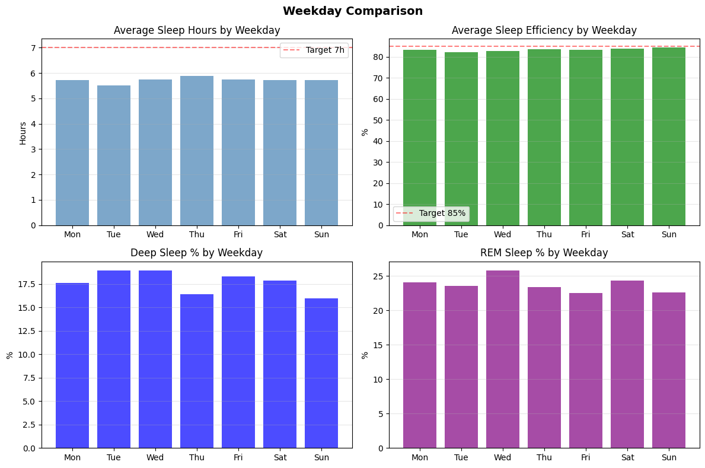
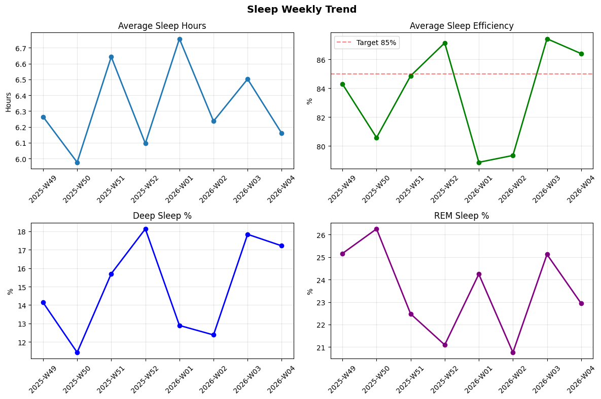
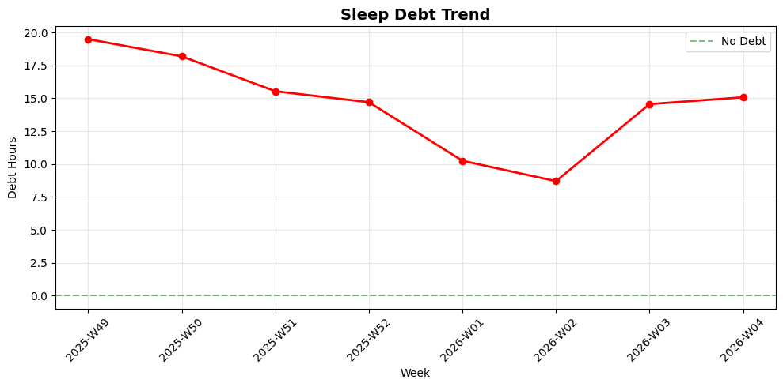

# 😴 睡眠週次レポート

7日間平均値の推移。前週比でトレンドを確認。

- **生成日時**: 2026-01-23 19:05:11

---

## 📊 週次データ

| 週 | 睡眠時間 | 効率 | 深い% | REM% | 負債 | 就寝ばらつき | 起床ばらつき |
|---|---|---|---|---|---|---|---|
| **2026-W04** | 6.2h (-0.34h) | 86% (-1.03%) | 17.2% (-0.62%) | 22.9% (-2.18%) | 15.1h (+0.52h) | 63分 | 35分 |
| **2026-W03** | 6.5h (**+0.27h**) | 87% (**+8.10%**) | 17.8% (**+5.45%**) | 25.1% (**+4.36%**) | 14.6h (+5.85h) | 41分 | 24分 |
| **2026-W02** | 6.2h (-0.52h) | 79% (**+0.48%**) | 12.4% (-0.51%) | 20.8% (-3.49%) | 8.7h (**-1.55h**) | 34分 | 31分 |
| **2026-W01** | 6.8h (**+0.66h**) | 79% (-8.29%) | 12.9% (-5.23%) | 24.2% (**+3.15%**) | 10.3h (**-4.45h**) | 56分 | 70分 |
| **2025-W52** | 6.1h (-0.55h) | 87% (**+2.29%**) | 18.1% (**+2.43%**) | 21.1% (-1.38%) | 14.7h (**-0.83h**) | 41分 | 47分 |
| **2025-W51** | 6.6h (**+0.67h**) | 85% (**+4.29%**) | 15.7% (**+4.26%**) | 22.5% (-3.78%) | 15.5h (**-2.65h**) | 35分 | 30分 |
| **2025-W50** | 6.0h (-0.29h) | 81% (-3.71%) | 11.4% (-2.70%) | 26.3% (**+1.09%**) | 18.2h (**-1.31h**) | 34分 | 7分 |
| **2025-W49** | 6.3h (**+0.51h**) | 84% (**+0.79%**) | 14.1% (-1.95%) | 25.2% (-1.55%) | 19.5h (**-3.88h**) | 33分 | 32分 |

> - **睡眠時間**: 週平均睡眠時間（主睡眠のみ）
> - **効率**: Time in Bed に対する睡眠時間の割合（85%以上が良好）
> - **深い%/REM%**: Total Sleep Time に占める各ステージの割合
> - **負債**: 週末時点の推定累積睡眠負債（過去14日分）
> - **ばらつき**: 就寝・起床時刻の標準偏差（小さいほど規則的）
> - カッコ内は前週比（**太字**は改善方向）
---

## 📅 曜日別分析

### 平日 vs 週末

| 指標 | 平日 | 週末 | 差分 |
|------|------|------|------|
| 睡眠時間 | 5.7h | 5.7h | -0.0h |
| 睡眠効率 | 83% | 84% | +1.0% |
| 深い睡眠 | 18.0% | 16.9% | -1.1% |
| レム睡眠 | 23.9% | 23.5% | -0.4% |

### 曜日ごとの傾向

| 曜日 | データ数 | 睡眠時間 | 効率 | 深い% | REM% |
|------|----------|----------|------|-------|------|
| 月 | 37日 | 5.7h | 83% | 17.6% | 24.0% |
| 火 | 38日 | 5.5h | 82% | 18.9% | 23.5% |
| 水 | 42日 | 5.7h | 83% | 19.0% | 25.8% |
| 木 | 42日 | 5.9h | 84% | 16.4% | 23.4% |
| 金 | 41日 | 5.7h | 83% | 18.3% | 22.5% |
| 土 | 37日 | 5.7h | 84% | 17.8% | 24.3% |
| 日 | 36日 | 5.7h | 84% | 16.0% | 22.6% |

> - 平日の睡眠パターンと週末の回復パターンを確認
> - 特定の曜日に睡眠時間が短い場合、その前日の生活習慣を見直す
> - 週の後半（木〜金）に睡眠不足が蓄積しやすい傾向がある場合は要注意

---

## 📈 トレンドグラフ

