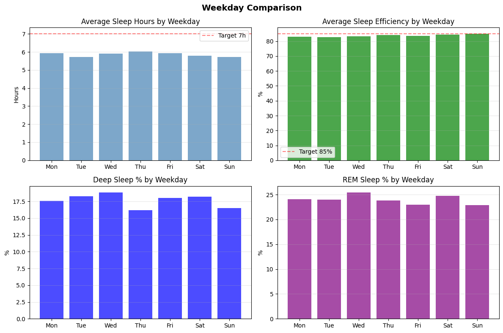
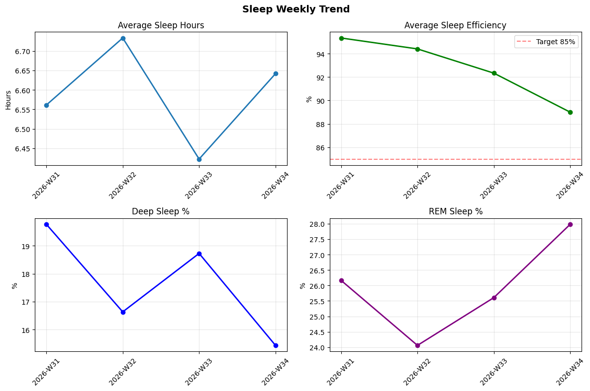
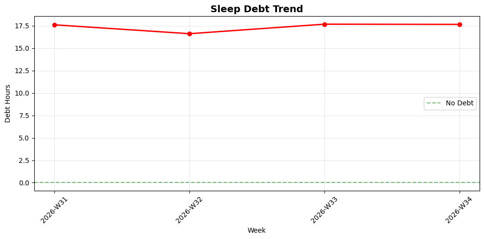

# 😴 睡眠週次レポート

7日間平均値の推移。前週比でトレンドを確認。

- **生成日時**: 2026-08-18 10:07:14

---

## 📊 週次データ

| 週 | 睡眠時間 | 効率 | 深い% | REM% | 負債 | 就寝ばらつき | 起床ばらつき |
|---|---|---|---|---|---|---|---|
| **2026-W34** | 6.6h (**+0.22h**) | 89% (-3.33%) | 15.4% (-3.30%) | 28.0% (**+2.37%**) | 17.7h (**-0.02h**) | 30分 | 60分 |
| **2026-W33** | 6.4h (-0.31h) | 92% (-2.07%) | 18.7% (**+2.09%**) | 25.6% (**+1.55%**) | 17.7h (+1.06h) | 29分 | 23分 |
| **2026-W32** | 6.7h (**+0.17h**) | 94% (-0.93%) | 16.6% (-3.14%) | 24.1% (-2.10%) | 16.6h (**-0.99h**) | 30分 | 14分 |
| **2026-W31** | 6.6h (-0.03h) | 95% (-1.17%) | 19.8% (-0.96%) | 26.2% (-3.17%) | 17.6h (**-6.68h**) | 48分 | 36分 |

> - **睡眠時間**: 週平均睡眠時間（主睡眠のみ）
> - **効率**: Time in Bed に対する睡眠時間の割合（85%以上が良好）
> - **深い%/REM%**: Total Sleep Time に占める各ステージの割合
> - **負債**: 週末時点の推定累積睡眠負債（過去14日分）
> - **ばらつき**: 就寝・起床時刻の標準偏差（小さいほど規則的）
> - カッコ内は前週比（**太字**は改善方向）
---

## 📅 曜日別分析

### 平日 vs 週末

| 指標 | 平日 | 週末 | 差分 |
|------|------|------|------|
| 睡眠時間 | 6.0h | 5.9h | -0.1h |
| 睡眠効率 | 85% | 86% | +1.4% |
| 深い睡眠 | 18.0% | 17.7% | -0.3% |
| レム睡眠 | 24.3% | 24.2% | -0.2% |

### 曜日ごとの傾向

| 曜日 | データ数 | 睡眠時間 | 効率 | 深い% | REM% |
|------|----------|----------|------|-------|------|
| 月 | 64日 | 6.0h | 85% | 17.8% | 24.7% |
| 火 | 62日 | 5.8h | 84% | 18.1% | 24.4% |
| 水 | 65日 | 6.0h | 85% | 19.1% | 25.4% |
| 木 | 67日 | 6.0h | 85% | 16.8% | 23.7% |
| 金 | 65日 | 6.1h | 85% | 18.2% | 23.6% |
| 土 | 63日 | 5.9h | 86% | 18.3% | 24.9% |
| 日 | 60日 | 5.9h | 86% | 17.0% | 23.4% |

> - 平日の睡眠パターンと週末の回復パターンを確認
> - 特定の曜日に睡眠時間が短い場合、その前日の生活習慣を見直す
> - 週の後半（木〜金）に睡眠不足が蓄積しやすい傾向がある場合は要注意

---

## 📈 トレンドグラフ

