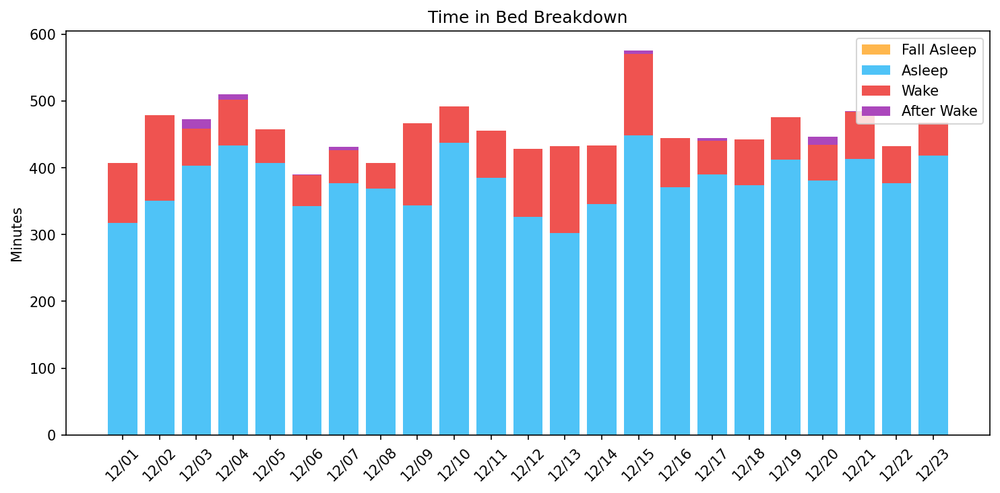
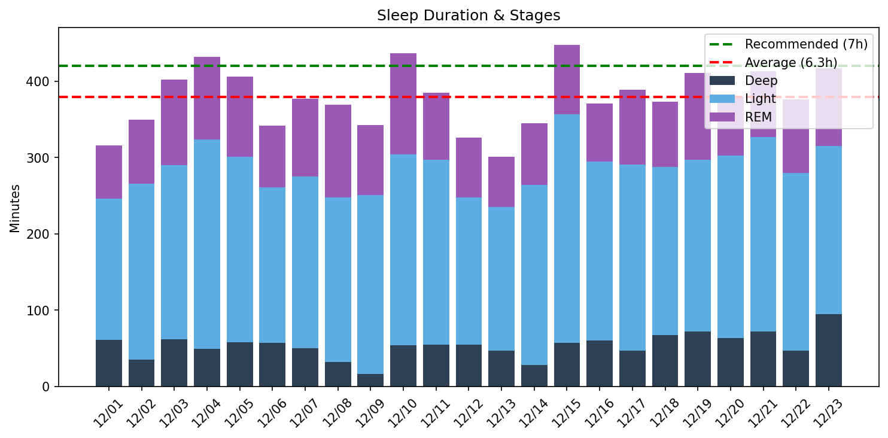
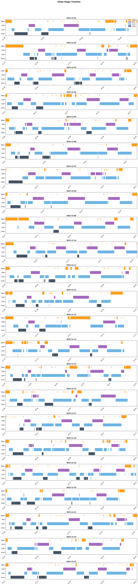

# 日次睡眠レポート

- **生成日時**: 2025-12-23 16:08:22
- **対象期間**: 2025-12-01 ～ 2025-12-23
- **データ日数**: 23日分

---

## サマリー

| 指標 | 値 |
|------|-----|
| ベッド時間合計 | 173.9時間 |
| 睡眠時間合計 | 145.4時間 |
| 睡眠負債 | **-15.6時間（不足）** |
| 目標達成 | 3/23日（7時間以上） |

> 睡眠負債は推奨7時間との差の累積です。
---

## Time in Bed分析

> ベッド時間の使い方を分析。効率 = 睡眠 / ベッド × 100。85%以上が良好。

| 指標 | 値 |
|------|-----|
| 平均効率 | **83.7%** |
| 最低〜最高 | 70% 〜 91% |
| 平均入眠 | 16分 |
| 平均起床後 | 12分 |

| 日付   | 効率   | 睡眠   | ベッド   | 入眠   | 起後   | 覚醒   | 回数   |
|:-------|:-------|:-------|:---------|:-------|:-------|:-------|:-------|
| 12/01  | 78%    | 5.3h   | 6.8h     | 18分   | 18分   | 90分   | 21回   |
| 12/02  | 73%    | 5.8h   | 8.0h     | 64分   | 25分   | 128分  | 22回   |
| 12/03  | 88%    | 6.7h   | 7.7h     | 6分    | 18分   | 56分   | 18回   |
| 12/04  | 86%    | 7.2h   | 8.4h     | 6分    | 12分   | 69分   | 22回   |
| 12/05  | 89%    | 6.8h   | 7.6h     | 12分   | 10分   | 51分   | 27回   |
| 12/06  | 88%    | 5.7h   | 6.5h     | 16分   | 16分   | 46分   | 13回   |
| 12/07  | 88%    | 6.3h   | 7.1h     | 0分    | 14分   | 49分   | 26回   |
| 12/08  | 91%    | 6.2h   | 6.8h     | 6分    | 15分   | 38分   | 16回   |
| 12/09  | 74%    | 5.7h   | 7.8h     | 44分   | 12分   | 123分  | 18回   |
| 12/10  | 89%    | 7.3h   | 8.2h     | 30分   | 0分    | 55分   | 20回   |
| 12/11  | 84%    | 6.4h   | 7.6h     | 14分   | 6分    | 71分   | 22回   |
| 12/12  | 76%    | 5.5h   | 7.1h     | 11分   | 45分   | 101分  | 24回   |
| 12/13  | 70%    | 5.0h   | 7.2h     | 28分   | 0分    | 130分  | 21回   |
| 12/14  | 80%    | 5.8h   | 7.2h     | 25分   | 0分    | 87分   | 29回   |
| 12/15  | 79%    | 7.5h   | 9.5h     | 21分   | 23分   | 122分  | 29回   |
| 12/16  | 83%    | 6.2h   | 7.4h     | 15分   | 0分    | 74分   | 33回   |
| 12/17  | 88%    | 6.5h   | 7.3h     | 0分    | 18分   | 51分   | 25回   |
| 12/18  | 84%    | 6.2h   | 7.4h     | 12分   | 6分    | 69分   | 29回   |
| 12/19  | 87%    | 6.9h   | 7.9h     | 10分   | 0分    | 64分   | 25回   |
| 12/20  | 88%    | 6.3h   | 7.2h     | 5分    | 18分   | 53分   | 21回   |
| 12/21  | 85%    | 6.9h   | 8.1h     | 12分   | 14分   | 71分   | 29回   |
| 12/22  | 87%    | 6.3h   | 7.2h     | 7分    | 10分   | 55分   | 23回   |
| 12/23  | 89%    | 7.0h   | 7.8h     | 10分   | 4分    | 50分   | 22回   |
---

## Total Sleep Time分析

> 睡眠時間の質を分析。各ステージのバランスを確認。

### 睡眠時間

| 指標 | 値 |
|------|-----|
| 平均 | **6.3時間** (379分) |
| 最短〜最長 | 5.0 〜 7.5時間 |
| 標準偏差 | 0.7時間 |

### 睡眠ステージ（平均）

| ステージ | 時間 | 割合 | 回数 | 推奨範囲 |
|----------|------|------|------|----------|
| 深い睡眠 | 54分 | 14.2% | 6回 | 13-23% |
| 浅い睡眠 | 231分 | 61.0% | 29回 | 45-55% |
| レム睡眠 | 93分 | 24.6% | 10回 | 20-25% |
| 覚醒 | 74分 | - | - | - |

| 日付   | 睡眠   | 深い   | 浅い   | レム   |
|:-------|:-------|:-------|:-------|:-------|
| 12/01  | 5.3h   | 61分   | 185分  | 70分   |
| 12/02  | 5.8h   | 35分   | 231分  | 84分   |
| 12/03  | 6.7h   | 62分   | 228分  | 112分  |
| 12/04  | 7.2h   | 49分   | 275分  | 108分  |
| 12/05  | 6.8h   | 58分   | 243分  | 105分  |
| 12/06  | 5.7h   | 57分   | 204分  | 81分   |
| 12/07  | 6.3h   | 50分   | 225分  | 102分  |
| 12/08  | 6.2h   | 32分   | 216分  | 121分  |
| 12/09  | 5.7h   | 16分   | 235分  | 92分   |
| 12/10  | 7.3h   | 54分   | 250分  | 133分  |
| 12/11  | 6.4h   | 55分   | 242分  | 88分   |
| 12/12  | 5.5h   | 55分   | 193分  | 78分   |
| 12/13  | 5.0h   | 47分   | 188分  | 66分   |
| 12/14  | 5.8h   | 28分   | 236分  | 81分   |
| 12/15  | 7.5h   | 57分   | 300分  | 91分   |
| 12/16  | 6.2h   | 60分   | 235分  | 76分   |
| 12/17  | 6.5h   | 47分   | 244分  | 98分   |
| 12/18  | 6.2h   | 67分   | 221分  | 85分   |
| 12/19  | 6.9h   | 72分   | 225分  | 114分  |
| 12/20  | 6.3h   | 63分   | 240分  | 77分   |
| 12/21  | 6.9h   | 72分   | 255分  | 86分   |
| 12/22  | 6.3h   | 47分   | 233分  | 96分   |
| 12/23  | 7.0h   | 95分   | 220分  | 102分  |

### 睡眠ステージ タイムライン

- 🟠 覚醒 / 🟣 レム / 🔵 浅い / 🔷 深い
---

## 就寝・起床時刻

> 睡眠リズムの規則性を分析。ばらつきが大きいと社会的時差ボケの原因に。

| 指標 | 就寝 | 入眠 | 起床 | 離床 |
|------|------|------|------|------|
| 平均 | **22:43** | **23:01** | **06:00** | **06:17** |
| 最早 | 21:41 | 21:53 | 05:08 | 05:22 |
| 最遅 | 23:48 | 00:07 | 06:53 | 07:16 |
| ばらつき | ±34分 | ±35分 | ±25分 | ±24分 |

| 日付   | 就寝   | 入眠   | 起床   | 離床   |
|:-------|:-------|:-------|:-------|:-------|
| 12/01  | 23:48  | 00:07  | 06:17  | 06:36  |
| 12/02  | 22:33  | 23:38  | 06:08  | 06:33  |
| 12/03  | 22:46  | 22:52  | 06:08  | 06:25  |
| 12/04  | 22:11  | 22:16  | 06:21  | 06:33  |
| 12/05  | 22:46  | 22:59  | 06:14  | 06:25  |
| 12/06  | 23:01  | 23:16  | 05:14  | 05:30  |
| 12/07  | 22:15  | -      | 05:08  | 05:22  |
| 12/08  | 23:42  | 23:48  | 06:15  | 06:30  |
| 12/09  | 22:25  | 23:09  | 06:00  | 06:12  |
| 12/10  | 22:10  | 22:40  | -      | 06:23  |
| 12/11  | 22:48  | 23:03  | 06:19  | 06:25  |
| 12/12  | 23:28  | 23:39  | 05:51  | 06:36  |
| 12/13  | 23:13  | 23:41  | -      | 06:26  |
| 12/14  | 23:14  | 23:39  | -      | 06:27  |
| 12/15  | 21:45  | 22:06  | 06:53  | 07:16  |
| 12/16  | 22:46  | 23:01  | -      | 06:11  |
| 12/17  | 23:12  | -      | 06:15  | 06:33  |
| 12/18  | 22:58  | 23:10  | 06:16  | 06:22  |
| 12/19  | 22:12  | 22:22  | -      | 06:08  |
| 12/20  | 22:36  | 22:41  | 05:32  | 05:50  |
| 12/21  | 21:41  | 21:53  | 05:32  | 05:46  |
| 12/22  | 22:45  | 22:52  | 05:47  | 05:57  |
| 12/23  | 22:22  | 22:32  | 06:06  | 06:10  |
---

## 睡眠サイクル分析

> 睡眠は約90分のサイクルで構成。深い睡眠は前半、REMは後半に集中するのが理想。

### サイクル構造の質

| 指標 | 平均値 | 正常範囲 |
|------|--------|----------|
| サイクル数 | 3.5回 | 3-5回 |
| サイクル長 | 114分 | 90分前後 |
| REM間隔 | 113分 | 90分前後 |
| 深い睡眠潜時 | 20分 | 15-30分 |
| REM潜時 | 65分 | 60-90分 |
| 前半の深い睡眠 | 82% | 70-80%以上 |

### 日別サイクル

| 日付   |   サイクル数 |   平均長 |   REM間隔 |   深い潜時 |   REM潜時 |   前半深い(%) |
|:-------|-------------:|---------:|----------:|-----------:|----------:|--------------:|
| 12/01  |            3 |      124 |       149 |          8 |        52 |            98 |
| 12/02  |            4 |       86 |        86 |         24 |        54 |            99 |
| 12/03  |            4 |      102 |       110 |         25 |        50 |            60 |
| 12/04  |            4 |      116 |       123 |         18 |        62 |           100 |
| 12/05  |            4 |       97 |        68 |         19 |        58 |            68 |
| 12/06  |            3 |      106 |        74 |         12 |        56 |            99 |
| 12/07  |            5 |       69 |        66 |          0 |        71 |           100 |
| 12/08  |            3 |      116 |       116 |         10 |        78 |           100 |
| 12/09  |            3 |      118 |       130 |        131 |        61 |           100 |
| 12/10  |            4 |      104 |        84 |         11 |        62 |            88 |
| 12/11  |            4 |      109 |       128 |         16 |        78 |           100 |
| 12/12  |            2 |      147 |        99 |         26 |        66 |           100 |
| 12/13  |            3 |      124 |       137 |         18 |        54 |           100 |
| 12/14  |            3 |      115 |        71 |         18 |       102 |            72 |
| 12/15  |            5 |      104 |       106 |         12 |        80 |            81 |
| 12/16  |            4 |       97 |        85 |         27 |        78 |            32 |
| 12/17  |            3 |      102 |       124 |          0 |        18 |            69 |
| 12/18  |            3 |      133 |       151 |         14 |        72 |            66 |
| 12/19  |            4 |      106 |        92 |         16 |        60 |            63 |
| 12/20  |            2 |      182 |       203 |         16 |        60 |           100 |
| 12/21  |            3 |      142 |       166 |          5 |        64 |            78 |
| 12/22  |            3 |      114 |       100 |         14 |        98 |            42 |
| 12/23  |            4 |      111 |       121 |          8 |        68 |            82 |

### REM開始時刻（夢想起用）

> 入眠からの経過時間。夢を覚えて起きたい場合、REM中に起床すると夢想起率が高い。

| 日付   |   REM1 | REM2   | REM3   | REM4   | 就寝   | REM1時   | REM2時   | REM3時   | REM4時   |
|:-------|-------:|:-------|:-------|:-------|:-------|:---------|:---------|:---------|:---------|
| 12/01  |     71 | 180    | 369    | -      | 23:48  | 00:59    | 02:48    | 05:58    | -        |
| 12/02  |    118 | 261    | 369    | 378    | 22:33  | 00:32    | 02:54    | 04:42    | 04:51    |
| 12/03  |     56 | 169    | 307    | 387    | 22:46  | 23:42    | 01:35    | 03:53    | 05:13    |
| 12/04  |     67 | 96     | 309    | 435    | 22:11  | 23:18    | 23:47    | 03:20    | 05:26    |
| 12/05  |     70 | 97     | 231    | 275    | 22:46  | 23:57    | 00:24    | 02:38    | 03:21    |
| 12/06  |     72 | 183    | 220    | -      | 23:01  | 00:13    | 02:04    | 02:41    | -        |
| 12/07  |     82 | 205    | 310    | 329    | 22:15  | 23:37    | 01:40    | 03:25    | 03:44    |
| 12/08  |     84 | 115    | 316    | -      | 23:42  | 01:06    | 01:38    | 04:59    | -        |
| 12/09  |    104 | 249    | 364    | -      | 22:25  | 00:10    | 02:35    | 04:29    | -        |
| 12/10  |     91 | 113    | 225    | 344    | 22:10  | 23:41    | 00:04    | 01:55    | 03:54    |
| 12/11  |     92 | -      | 308    | 349    | 22:48  | 00:20    | -        | 03:56    | 04:37    |
| 12/12  |     77 | 176    | -      | -      | 23:28  | 00:46    | 02:25    | -        | -        |
| 12/13  |     82 | 187    | 356    | -      | 23:13  | 00:35    | 02:21    | 05:09    | -        |
| 12/14  |    126 | 233    | 269    | -      | 23:14  | 01:20    | 03:07    | 03:43    | -        |
| 12/15  |    101 | 158    | 375    | 391    | 21:45  | 23:26    | 00:23    | 04:00    | 04:16    |
| 12/16  |     93 | 112    | 254    | 347    | 22:46  | 00:19    | 00:38    | 03:00    | 04:33    |
| 12/17  |     68 | 91     | 316    | -      | 23:12  | 00:20    | 00:43    | 04:28    | -        |
| 12/18  |     84 | 97     | 386    | -      | 22:58  | 00:23    | 00:36    | 05:25    | -        |
| 12/19  |     70 | 98     | 233    | 345    | 22:12  | 23:22    | 23:50    | 02:05    | 03:57    |
| 12/20  |     65 | 268    | -      | -      | 22:36  | 23:41    | 03:04    | -        | -        |
| 12/21  |     76 | 92     | 408    | -      | 21:41  | 22:57    | 23:13    | 04:29    | -        |
| 12/22  |    105 | 116    | 304    | -      | 22:45  | 00:30    | 00:41    | 03:49    | -        |
| 12/23  |     78 | 96     | 336    | 441    | 22:22  | 23:41    | 23:59    | 03:59    | 05:43    |
