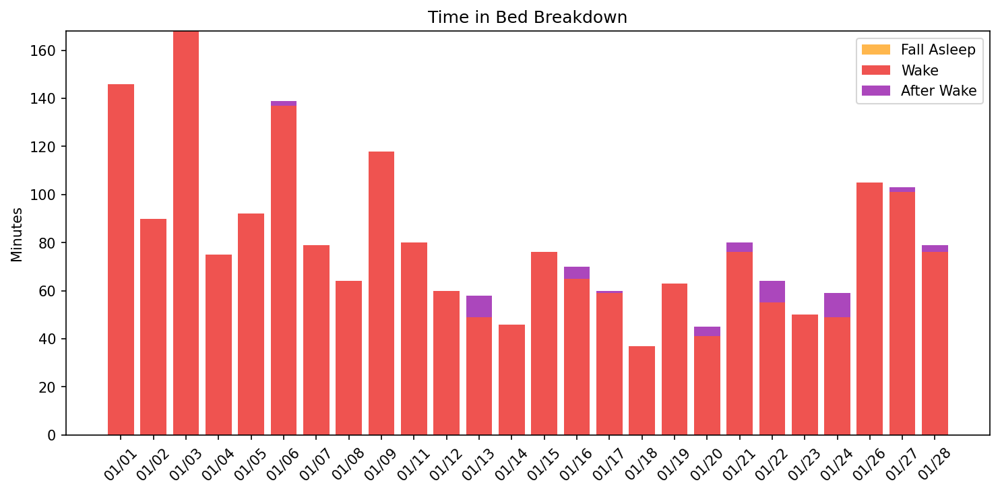
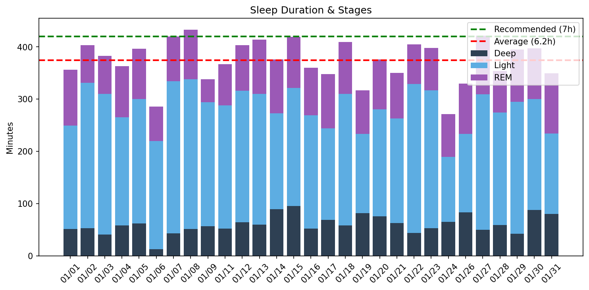
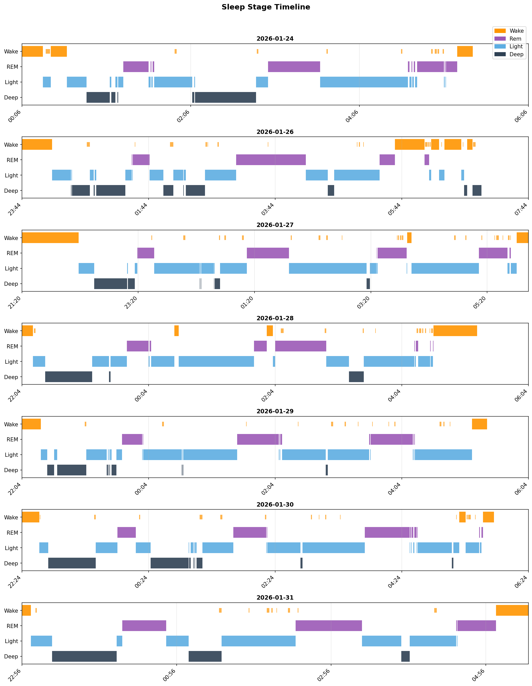
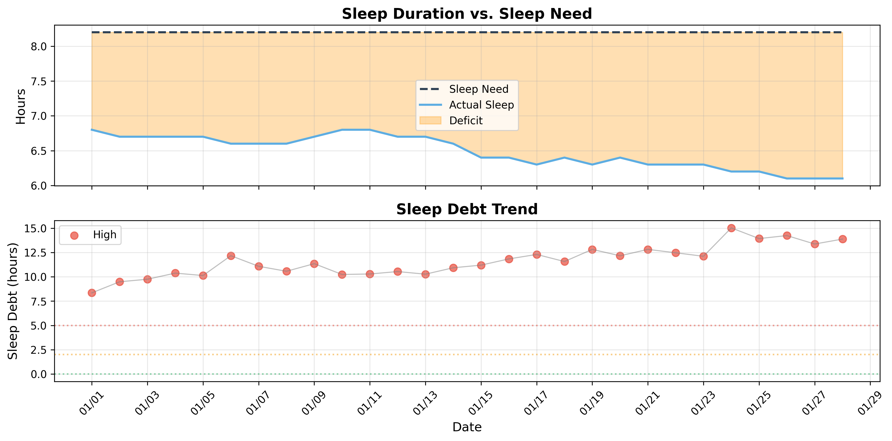

# 日次睡眠レポート

- **生成日時**: 2026-02-02 19:19:01
- **対象期間**: 2026-01-01 ～ 2026-01-31
- **データ日数**: 29日分

---

## 📊 サマリー

| 指標 | 値 |
|------|-----|
| ベッド時間合計 | 217.5時間 |
| 睡眠時間合計 | 180.9時間 |
| 平均睡眠時間 | 6.2時間/日 |

> 睡眠負債の詳細は下記の「睡眠負債分析」セクションを参照してください。
---

## 🛏️ Time in Bed分析

> ベッド時間の使い方を分析。効率 = 睡眠 / ベッド × 100。85%以上が良好。

| 指標 | 値 |
|------|-----|
| 平均効率 | **83.4%** |
| 最低〜最高 | 68% 〜 92% |
| 平均入眠 | 17分 |
| 平均起床後 | 12分 |

| 日付    | 効率   | 睡眠   | ベッド   | 入眠   | 起後   | 覚醒     | 回数    |
|:------|:-----|:-----|:------|:-----|:-----|:-------|:------|
| 01/01 | 71%  | 6.0h | 8.4h  | 16分  | 0分   | 146.0分 | 43.0回 |
| 01/02 | 82%  | 6.7h | 8.2h  | 16分  | 4分   | 90.0分  | 36.0回 |
| 01/03 | 70%  | 6.4h | 9.2h  | 15分  | 40分  | 168.0分 | 26.0回 |
| 01/04 | 83%  | 6.0h | 7.3h  | 57分  | 0分   | 75.0分  | 12.0回 |
| 01/05 | 81%  | 6.6h | 8.2h  | 16分  | 12分  | 92.0分  | 25.0回 |
| 01/06 | 68%  | 4.8h | 7.1h  | 66分  | 24分  | 137.0分 | 20.0回 |
| 01/07 | 84%  | 7.0h | 8.3h  | 6分   | 22分  | 79.0分  | 28.0回 |
| 01/08 | 87%  | 7.2h | 8.3h  | 12分  | 12分  | 64.0分  | 21.0回 |
| 01/09 | 74%  | 5.7h | 7.6h  | 16分  | 10分  | 118.0分 | 27.0回 |
| 01/11 | 82%  | 6.1h | 7.5h  | 29分  | 8分   | 80.0分  | 22.0回 |
| 01/12 | 87%  | 6.7h | 7.7h  | 6分   | 8分   | 60.0分  | 23.0回 |
| 01/13 | 89%  | 6.9h | 7.7h  | 9分   | 10分  | 49.0分  | 22.0回 |
| 01/14 | 89%  | 6.3h | 7.0h  | 10分  | 0分   | 46.0分  | 20.0回 |
| 01/15 | 84%  | 7.0h | 8.3h  | 17分  | 0分   | 76.0分  | 30.0回 |
| 01/16 | 85%  | 6.0h | 7.1h  | 8分   | 25分  | 65.0分  | 21.0回 |
| 01/17 | 86%  | 5.8h | 6.8h  | 14分  | 10分  | 59.0分  | 25.0回 |
| 01/18 | 92%  | 6.8h | 7.5h  | 0分   | 15分  | 37.0分  | 14.0回 |
| 01/19 | 83%  | 5.3h | 6.3h  | 0分   | 30分  | 63.0分  | 15.0回 |
| 01/20 | 90%  | 6.3h | 7.0h  | 12分  | 0分   | 41.0分  | 20.0回 |
| 01/21 | 82%  | 5.8h | 7.1h  | 0分   | 13分  | 76.0分  | 34.0回 |
| 01/22 | 88%  | 6.8h | 7.7h  | 6分   | 10分  | 55.0分  | 27.0回 |
| 01/23 | 89%  | 6.6h | 7.5h  | 12分  | 0分   | 50.0分  | 30.0回 |
| 01/24 | 85%  | 4.5h | 5.3h  | 15分  | 11分  | 49.0分  | 12.0回 |
| 01/26 | 76%  | 5.5h | 7.2h  | 28分  | 0分   | 105.0分 | 21.0回 |
| 01/27 | 81%  | 7.0h | 8.7h  | 58分  | 12分  | 101.0分 | 24.0回 |
| 01/28 | 82%  | 5.9h | 7.2h  | 10分  | 42分  | 76.0分  | 15.0回 |
| 01/29 | 90%  | 6.6h | 7.3h  | 18分  | 14分  | 45.0分  | 15.0回 |
| 01/30 | 89%  | 6.6h | 7.5h  | 16分  | 10分  | 49.0分  | 17.0回 |
| 01/31 | 89%  | 5.8h | 6.5h  | 7分   | 0分   | 43.0分  | 11.0回 |
---

## 😴 Total Sleep Time分析

> 睡眠時間の質を分析。各ステージのバランスを確認。

### 睡眠時間

| 指標 | 値 |
|------|-----|
| 平均 | **6.2時間** (374分) |
| 最短〜最長 | 4.5 〜 7.2時間 |
| 標準偏差 | 0.7時間 |

### 睡眠ステージ（平均）

| ステージ | 時間 | 割合 | 回数 | 推奨範囲 |
|----------|------|------|------|----------|
| 深い睡眠 | 60分 | 16.2% | 7回 | 13-23% |
| 浅い睡眠 | 223分 | 59.7% | 28回 | 45-55% |
| レム睡眠 | 90分 | 24.0% | 10回 | 20-25% |
| 覚醒 | 76分 | - | - | - |

| 日付    | 睡眠   | 深い    | 浅い     | レム     |
|:------|:-----|:------|:-------|:-------|
| 01/01 | 6.0h | 51.0分 | 198.0分 | 107.0分 |
| 01/02 | 6.7h | 53.0分 | 278.0分 | 72.0分  |
| 01/03 | 6.4h | 41.0分 | 269.0分 | 73.0分  |
| 01/04 | 6.0h | 58.0分 | 207.0分 | 98.0分  |
| 01/05 | 6.6h | 62.0分 | 238.0分 | 96.0分  |
| 01/06 | 4.8h | 13.0分 | 207.0分 | 66.0分  |
| 01/07 | 7.0h | 43.0分 | 291.0分 | 86.0分  |
| 01/08 | 7.2h | 51.0分 | 287.0分 | 95.0分  |
| 01/09 | 5.7h | 57.0分 | 237.0分 | 44.0分  |
| 01/11 | 6.1h | 52.0分 | 236.0分 | 79.0分  |
| 01/12 | 6.7h | 64.0分 | 252.0分 | 87.0分  |
| 01/13 | 6.9h | 60.0分 | 250.0分 | 104.0分 |
| 01/14 | 6.3h | 89.0分 | 184.0分 | 103.0分 |
| 01/15 | 7.0h | 95.0分 | 226.0分 | 98.0分  |
| 01/16 | 6.0h | 52.0分 | 217.0分 | 91.0分  |
| 01/17 | 5.8h | 69.0分 | 175.0分 | 104.0分 |
| 01/18 | 6.8h | 58.0分 | 252.0分 | 99.0分  |
| 01/19 | 5.3h | 82.0分 | 151.0分 | 84.0分  |
| 01/20 | 6.3h | 76.0分 | 204.0分 | 96.0分  |
| 01/21 | 5.8h | 63.0分 | 200.0分 | 87.0分  |
| 01/22 | 6.8h | 44.0分 | 285.0分 | 76.0分  |
| 01/23 | 6.6h | 53.0分 | 264.0分 | 81.0分  |
| 01/24 | 4.5h | 65.0分 | 124.0分 | 82.0分  |
| 01/26 | 5.5h | 83.0分 | 150.0分 | 97.0分  |
| 01/27 | 7.0h | 50.0分 | 259.0分 | 112.0分 |
| 01/28 | 5.9h | 59.0分 | 215.0分 | 80.0分  |
| 01/29 | 6.6h | 42.0分 | 253.0分 | 100.0分 |
| 01/30 | 6.6h | 88.0分 | 212.0分 | 97.0分  |
| 01/31 | 5.8h | 80.0分 | 154.0分 | 115.0分 |

### 睡眠ステージ タイムライン

- 🟠 覚醒 / 🟣 レム / 🔵 浅い / 🔷 深い
---

## ⏰ 就寝・起床時刻

> 睡眠リズムの規則性を分析。ばらつきが大きいと社会的時差ボケの原因に。

| 指標 | 就寝 | 入眠 | 起床 | 離床 | 最低HR | 日出 | 日入 |
|------|------|------|------|------|--------|------|------|
| 平均 | **22:32** | **22:44** | **05:45** | **06:02** | 04:16 | - | - |
| 最早 | 21:08 | 21:23 | 04:34 | 05:01 | 00:39 | - | - |
| 最遅 | 00:45 | 00:21 | 07:19 | 07:35 | 23:55 | - | - |
| ばらつき | ±50分 | ±46分 | ±36分 | ±38分 | ±250分 | - | - |

| 日付    | 就寝    | 入眠    | 起床    | 離床    | 最低HR   | 日出    | 日入    |
|:------|:------|:------|:------|:------|:-------|:------|:------|
| 01/01 | 23:12 | 23:28 | -     | 07:35 | 01:21  | -     | -     |
| 01/02 | 23:09 | 23:25 | 07:19 | 07:23 | 04:39  | -     | -     |
| 01/03 | 21:08 | 21:23 | 05:41 | 06:20 | 04:36  | -     | -     |
| 01/04 | 22:09 | 23:06 | -     | 05:28 | 04:38  | -     | -     |
| 01/05 | 21:26 | 21:42 | 05:23 | 05:35 | 04:38  | -     | -     |
| 01/06 | 23:05 | 00:10 | 05:45 | 06:09 | 02:57  | -     | -     |
| 01/07 | 22:15 | 22:20 | 06:14 | 06:35 | 06:11  | -     | -     |
| 01/08 | 22:29 | 22:40 | 06:35 | 06:47 | 04:27  | -     | -     |
| 01/09 | 22:46 | 23:03 | 06:13 | 06:23 | 01:29  | -     | -     |
| 01/11 | 22:06 | 22:35 | 05:26 | 05:34 | -      | -     | -     |
| 01/12 | 21:17 | 21:23 | 04:53 | 05:01 | 03:54  | -     | -     |
| 01/13 | 22:15 | 22:24 | 05:48 | 05:58 | 05:40  | -     | -     |
| 01/14 | 22:33 | 22:43 | -     | 05:36 | 04:48  | -     | -     |
| 01/15 | 21:38 | 21:55 | -     | 05:54 | 01:08  | -     | -     |
| 01/16 | 22:33 | 22:41 | 05:13 | 05:38 | 00:47  | 06:50 | 16:51 |
| 01/17 | 23:18 | 23:32 | 05:56 | 06:05 | 02:26  | 06:50 | 16:52 |
| 01/18 | 22:47 | -     | 06:00 | 06:15 | 01:19  | 06:49 | 16:53 |
| 01/19 | 00:45 | -     | 06:37 | 07:06 | 04:31  | 06:49 | 16:54 |
| 01/20 | 22:48 | 23:00 | -     | 05:46 | 04:17  | 06:49 | 16:55 |
| 01/21 | 22:53 | -     | 05:46 | 05:59 | 00:39  | 06:48 | 16:56 |
| 01/22 | 22:15 | 22:21 | 05:45 | 05:55 | 02:33  | 06:48 | 16:57 |
| 01/23 | 22:10 | 22:22 | -     | 05:39 | 23:55  | 06:47 | 16:58 |
| 01/24 | 00:06 | 00:21 | 05:15 | 05:26 | 03:33  | 06:47 | 16:59 |
| 01/26 | 23:44 | 00:12 | -     | 06:59 | -      | 06:46 | 17:01 |
| 01/27 | 21:20 | 22:18 | 05:50 | 06:02 | 05:01  | 06:45 | 17:02 |
| 01/28 | 22:04 | 22:14 | 04:34 | 05:15 | 03:43  | 06:44 | 17:04 |
| 01/29 | 22:04 | 22:22 | 05:11 | 05:25 | 02:25  | 06:44 | 17:05 |
| 01/30 | 22:24 | 22:40 | 05:41 | 05:51 | 05:33  | 06:43 | 17:06 |
| 01/31 | 22:56 | 23:03 | -     | 05:29 | 04:08  | 06:42 | 17:07 |
---

## ❤️ 睡眠中の心拍分析

| 日付 | 平均 | 最小 | 最大 | 安静時 | Baseline | Dip(%) | 最低HR | Daily RMSSD | Deep RMSSD |
|------|------|------|------|--------|----------|--------|--------|-------------|------------|
| 01/01 | 56 | 47 | 90 | 52 | 高40% / 低60% | 26.4 | 129 | 26.4 | 21.1 |
| 01/02 | 48 | 40 | 84 | 51 | 高3% / 低97% | 25.3 | 330 | 36.8 | 33.9 |
| 01/03 | 51 | 44 | 82 | 53 | 高11% / 低89% | 22.0 | 448 | 37.0 | 34.6 |
| 01/04 | 46 | 40 | 62 | 52 | 高3% / 低97% | 33.2 | 388 | 46.7 | 48.0 |
| 01/05 | 51 | 44 | 96 | 54 | 高10% / 低90% | 26.3 | 432 | 34.2 | 36.4 |
| 01/06 | 56 | 46 | 106 | 56 | 高42% / 低58% | 21.5 | 232 | 29.3 | 35.2 |
| 01/07 | 56 | 46 | 106 | 57 | 高40% / 低60% | 22.1 | 476 | 29.2 | 28.4 |
| 01/08 | 54 | 46 | 109 | 58 | 高26% / 低74% | 23.8 | 358 | 28.8 | 30.3 |
| 01/09 | 54 | 47 | 96 | 58 | 高22% / 低78% | 26.0 | 162 | 32.5 | 29.9 |
| 01/11 | 50 | 44 | 88 | 56 | 高8% / 低92% | - | - | 33.0 | 35.6 |
| 01/12 | 48 | 41 | 83 | 54 | 高5% / 低95% | 29.2 | 396 | 41.2 | 35.6 |
| 01/13 | 55 | 46 | 101 | 56 | 高30% / 低70% | 29.2 | 445 | 26.6 | 23.7 |
| 01/14 | 53 | 46 | 73 | 56 | 高20% / 低80% | 23.9 | 374 | 29.8 | 28.7 |
| 01/15 | 49 | 43 | 98 | 55 | 高7% / 低93% | 23.1 | 210 | 36.3 | 36.6 |
| 01/16 | 49 | 44 | 87 | 54 | 高6% / 低94% | 26.6 | 134 | 34.8 | 28.8 |
| 01/17 | 57 | 49 | 82 | 57 | 高59% / 低41% | 11.0 | 188 | 24.2 | 23.2 |
| 01/18 | 49 | 42 | 87 | 55 | 高7% / 低93% | 32.0 | 152 | 38.2 | 35.1 |
| 01/19 | 54 | 45 | 79 | 56 | 高33% / 低67% | 16.9 | 226 | 32.3 | 19.0 |
| 01/20 | 48 | 40 | 68 | 53 | 高5% / 低95% | 27.2 | 329 | 37.7 | 38.5 |
| 01/21 | 48 | 42 | 89 | 53 | 高6% / 低94% | 38.2 | 106 | 37.1 | 46.6 |
| 01/22 | 50 | 44 | 90 | 54 | 高7% / 低93% | 26.2 | 258 | 37.1 | 34.0 |
| 01/23 | 53 | 48 | 74 | 56 | 高17% / 低83% | 21.2 | 105 | 24.9 | 30.1 |
| 01/24 | 52 | 44 | 93 | 56 | 高10% / 低90% | 32.8 | 207 | - | - |
| 01/26 | 48 | 40 | 78 | 55 | 高8% / 低92% | - | - | 32.8 | 30.1 |
| 01/27 | 48 | 40 | 81 | 53 | 高9% / 低91% | 27.7 | 461 | 47.0 | 34.6 |
| 01/28 | 49 | 40 | 91 | 52 | 高6% / 低94% | 25.8 | 339 | 40.2 | 37.5 |
| 01/29 | 52 | 45 | 104 | 54 | 高14% / 低86% | 26.3 | 260 | 31.4 | 30.4 |
| 01/30 | 50 | 43 | 70 | 54 | 高6% / 低94% | 31.9 | 429 | 32.5 | 38.4 |
| 01/31 | 53 | 45 | 88 | 56 | 高20% / 低80% | 21.6 | 312 | 32.8 | 31.9 |

**ベースライン**: 過去7日間の平均安静時心拍数（55.0 bpm）

## 🍽️ 食事分析

栄養データの翌日の睡眠心拍数データを表示しています。

| 日付 | Carbs(g) | Fiber(g) | GL | 深い(分) | 効率(%) | 最低HR | 最低HR時刻 | Dip(%) |
|------|----------|----------|-----|----------|---------|--------|------------|--------|
| 01/03 | 176 | 23 | 30.7(高) | 58 | 83 | 40 | 04:38 | 33.2 |
| 01/04 | 201 | 19 | 36.3(高) | 62 | 81 | 44 | 04:38 | 26.3 |
| 01/05 | 152 | 16 | 27.2(高) | 13 | 68 | 46 | 02:57 | 21.5 |
| 01/07 | 112 | 14 | 19.7(中) | 51 | 87 | 46 | 04:27 | 23.8 |
| 01/08 | 146 | 14 | 26.5(高) | 57 | 74 | 47 | 01:29 | 26.0 |
| 01/11 | 149 | 19 | 26.0(高) | 64 | 87 | 41 | 03:54 | 29.2 |
| 01/12 | 161 | 21 | 28.1(高) | 60 | 89 | 46 | 05:40 | 29.2 |
| 01/13 | 279 | 11 | 53.6(高) | 89 | 89 | 46 | 04:48 | 23.9 |
| 01/15 | 131 | 18 | 22.7(高) | 52 | 85 | 44 | 00:47 | 26.6 |
| 01/16 | 220 | 16 | 40.7(高) | 69 | 86 | 49 | 02:26 | 11.0 |
| 01/17 | 107 | 15 | 18.3(中) | 58 | 92 | 42 | 01:19 | 32.0 |
| 01/20 | 114 | 15 | 19.8(中) | 63 | 82 | 42 | 00:39 | 38.2 |
| 01/23 | 212 | 18 | 38.8(高) | 65 | 85 | 44 | 03:33 | 32.8 |
| 01/26 | 178 | 19 | 32.0(高) | 50 | 81 | 40 | 05:01 | 27.7 |

**GL（グリセミック負荷）**: 低 (< 10)、中 (10-20)、高 (> 20)

---

## 🔄 睡眠サイクル分析

> 睡眠は約90分のサイクルで構成。深い睡眠は前半、REMは後半に集中するのが理想。

### サイクル構造の質

| 指標 | 平均値 | 正常範囲 |
|------|--------|----------|
| サイクル数 | 3.5回 | 3-5回 |
| サイクル長 | 109分 | 90分前後 |
| REM間隔 | 98分 | 90分前後 |
| 深い睡眠潜時 | 17分 | 15-30分 |
| REM潜時 | 74分 | 60-90分 |
| 前半の深い睡眠 | 87% | 70-80%以上 |

### 日別サイクル

| 日付    |   サイクル数 |   平均長 |   REM間隔 |   深い潜時 |   REM潜時 |   前半深い(%) |
|:------|--------:|------:|--------:|-------:|--------:|----------:|
| 01/01 |       4 |   100 |      99 |      2 |      77 |        55 |
| 01/02 |       4 |   109 |     117 |      5 |      70 |        99 |
| 01/03 |       3 |   140 |     185 |    122 |       0 |        74 |
| 01/04 |       3 |   113 |     106 |     10 |      80 |       100 |
| 01/05 |       4 |   110 |     114 |     32 |      95 |        76 |
| 01/06 |       3 |   103 |     114 |     29 |      74 |       100 |
| 01/07 |       4 |   108 |     114 |     22 |      75 |        97 |
| 01/08 |       4 |   106 |     103 |     10 |      89 |        79 |
| 01/09 |       3 |   147 |     102 |     12 |      53 |        98 |
| 01/11 |       5 |    82 |      63 |     16 |      78 |       100 |
| 01/12 |       4 |   113 |     107 |     14 |     112 |        82 |
| 01/13 |       4 |   103 |      98 |     18 |      78 |       100 |
| 01/14 |       4 |    97 |      80 |     14 |      62 |        62 |
| 01/15 |       4 |   102 |      48 |      8 |      87 |        69 |
| 01/16 |       3 |   115 |     126 |     25 |      71 |        61 |
| 01/17 |       4 |    87 |      83 |      8 |      64 |        83 |
| 01/18 |       3 |   121 |      89 |      0 |      71 |       100 |
| 01/19 |       3 |   110 |      75 |      6 |     103 |        75 |
| 01/20 |       3 |   121 |     126 |      8 |      72 |        88 |
| 01/21 |       2 |   146 |      32 |      0 |      62 |       100 |
| 01/22 |       3 |   122 |      82 |     14 |      86 |       100 |
| 01/23 |       4 |    93 |      94 |     14 |      75 |        53 |
| 01/24 |       4 |    74 |      76 |     31 |      57 |       100 |
| 01/26 |       3 |   108 |     118 |     18 |      76 |        92 |
| 01/27 |       4 |   111 |     118 |     16 |      60 |        93 |
| 01/28 |       3 |    93 |      70 |     12 |      89 |       100 |
| 01/29 |       3 |   118 |      74 |      6 |      77 |        95 |
| 01/30 |       4 |    90 |      92 |      8 |      74 |        98 |
| 01/31 |       3 |   120 |     130 |     16 |      71 |        92 |

## 💤 睡眠負債分析

### 最適睡眠時間

- **最適睡眠時間**: 8.2時間
- **習慣的睡眠時間**: 5.8時間
- **潜在的睡眠負債**: 2.4時間/日
- **サンプル数**: 10日（上位4.0%）

> 睡眠時間上位4.0%（10日）の平均。習慣的睡眠（5.8h）より2.4h長く、睡眠不足からの回復を示唆。

### 現在の睡眠負債

- **睡眠負債**: 13.5時間
- **平均睡眠時間（過去14日）**: 6.1時間
- **平均睡眠時間（昼寝込み）**: 6.4時間
- **推定回復日数**: 45日

### 日別推移

| 日付    | 実績   | 負債    | 増減    | 回復   |
|:------|:-----|:------|:------|:-----|
| 01/01 | 9.6h | 8.3h  | -     | 28日  |
| 01/02 | 6.7h | 9.5h  | +1.1h | 32日  |
| 01/03 | 6.4h | 9.8h  | +0.3h | 33日  |
| 01/04 | 6.0h | 10.4h | +0.6h | 35日  |
| 01/05 | 6.6h | 10.1h | -0.2h | 34日  |
| 01/06 | 4.8h | 12.2h | +2.0h | 41日  |
| 01/07 | 7.0h | 11.1h | -1.1h | 37日  |
| 01/08 | 7.2h | 10.6h | -0.5h | 36日  |
| 01/09 | 5.6h | 11.3h | +0.8h | 38日  |
| 01/10 | 0.0h | 10.2h | -1.1h | 35日  |
| 01/11 | 6.1h | 10.3h | +0.0h | 35日  |
| 01/12 | 6.7h | 10.5h | +0.2h | 36日  |
| 01/13 | 6.9h | 10.3h | -0.3h | 35日  |
| 01/14 | 6.3h | 10.9h | +0.7h | 37日  |
| 01/15 | 7.0h | 11.2h | +0.3h | 38日  |
| 01/16 | 6.0h | 11.8h | +0.6h | 40日  |
| 01/17 | 5.8h | 12.3h | +0.5h | 41日  |
| 01/18 | 6.8h | 11.6h | -0.7h | 39日  |
| 01/19 | 5.3h | 12.8h | +1.2h | 43日  |
| 01/20 | 6.3h | 12.2h | -0.7h | 41日  |
| 01/21 | 5.8h | 12.8h | +0.7h | 43日  |
| 01/22 | 6.8h | 12.5h | -0.3h | 42日  |
| 01/23 | 6.6h | 12.1h | -0.4h | 41日  |
| 01/24 | 4.5h | 15.0h | +2.9h | 51日  |
| 01/25 | 0.0h | 13.9h | -1.1h | 47日  |
| 01/26 | 5.5h | 14.2h | +0.3h | 48日  |
| 01/27 | 7.0h | 13.4h | -0.9h | 45日  |
| 01/28 | 5.9h | 13.9h | +0.5h | 47日  |
| 01/29 | 6.6h | 13.6h | -0.3h | 46日  |
| 01/30 | 6.6h | 13.2h | -0.4h | 44日  |
| 01/31 | 5.9h | 13.5h | +0.3h | 45日  |

---
