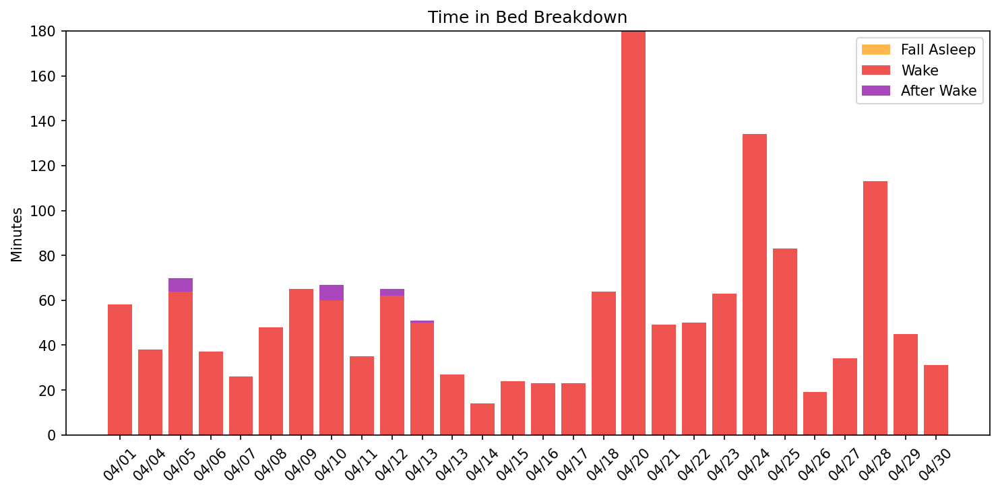
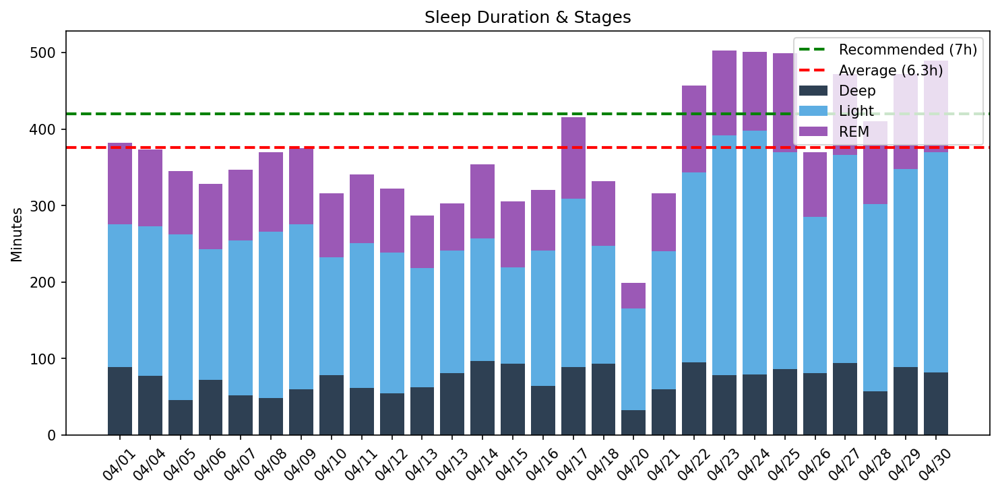
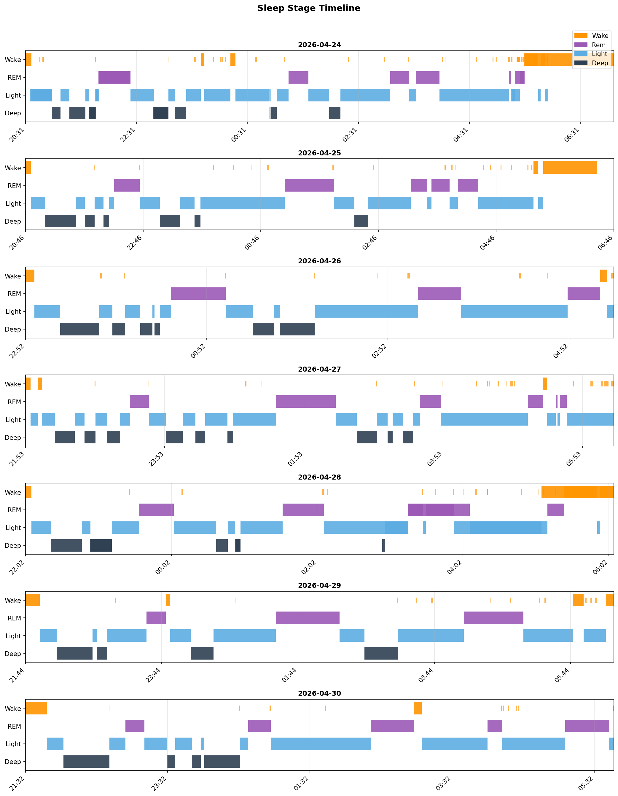
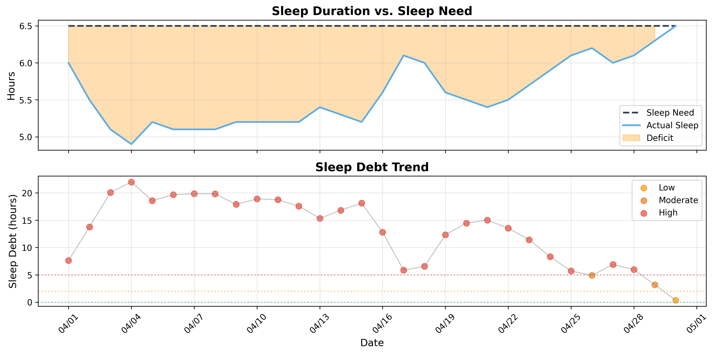

# 日次睡眠レポート

- **生成日時**: 2026-04-30 19:31:29
- **対象期間**: 2026-04-01 ～ 2026-04-30
- **データ日数**: 28日分

---

## 📊 サマリー

| 指標 | 値 |
|------|-----|
| ベッド時間合計 | 200.8時間 |
| 睡眠時間合計 | 175.2時間 |
| 平均睡眠時間 | 6.3時間/日 |

> 睡眠負債の詳細は下記の「睡眠負債分析」セクションを参照してください。
---

## 🛏️ Time in Bed分析

> ベッド時間の使い方を分析。効率 = 睡眠 / ベッド × 100。85%以上が良好。

| 指標 | 値 |
|------|-----|
| 平均効率 | **87.4%** |
| 最低〜最高 | 52% 〜 96% |
| 平均入眠 | 13分 |
| 平均起床後 | 15分 |

| 日付   | 効率   | 睡眠   | ベッド   | 入眠   | 起後   | 覚醒    | 回数   |
|:-------|:-------|:-------|:---------|:-------|:-------|:--------|:-------|
| 04/01  | 87%    | 6.4h   | 7.3h     | 16分   | 14分   | 58.0分  | 22.0回 |
| 04/04  | 91%    | 6.2h   | 6.8h     | 4分    | 15分   | 38.0分  | 16.0回 |
| 04/05  | 84%    | 5.8h   | 6.8h     | 16分   | 26分   | 64.0分  | 18.0回 |
| 04/06  | 90%    | 5.5h   | 6.1h     | 11分   | 10分   | 37.0分  | 13.0回 |
| 04/07  | 93%    | 5.8h   | 6.2h     | 0分    | 8分    | 26.0分  | 12.0回 |
| 04/08  | 89%    | 6.2h   | 7.0h     | 8分    | 8分    | 48.0分  | 21.0回 |
| 04/09  | 85%    | 6.2h   | 7.3h     | 16分   | 34分   | 65.0分  | 17.0回 |
| 04/10  | 84%    | 5.3h   | 6.3h     | 14分   | 19分   | 60.0分  | 19.0回 |
| 04/11  | 91%    | 5.7h   | 6.3h     | 11分   | 9分    | 35.0分  | 15.0回 |
| 04/12  | 84%    | 5.4h   | 6.4h     | 8分    | 42分   | 62.0分  | 10.0回 |
| 04/13  | 85%    | 4.8h   | 5.6h     | 13分   | 0分    | 50.0分  | 11.0回 |
| 04/13  | 92%    | 5.0h   | 5.5h     | 13分   | 0分    | 27.0分  | 14.0回 |
| 04/14  | 96%    | 5.9h   | 6.2h     | 4分    | 0分    | 14.0分  | 10.0回 |
| 04/15  | 92%    | 5.1h   | 5.5h     | 8分    | 8分    | 24.0分  | 11.0回 |
| 04/16  | 93%    | 5.3h   | 5.7h     | 7分    | 0分    | 23.0分  | 15.0回 |
| 04/17  | 95%    | 6.9h   | 7.3h     | 4分    | 0分    | 23.0分  | 16.0回 |
| 04/18  | 84%    | 5.5h   | 6.6h     | 6分    | 0分    | 64.0分  | 33.0回 |
| 04/20  | 52%    | 3.3h   | 6.3h     | 116分  | 18分   | 180.0分 | 20.0回 |
| 04/21  | 86%    | 5.3h   | 6.1h     | 12分   | 10分   | 49.0分  | 26.0回 |
| 04/22  | 90%    | 7.6h   | 8.5h     | 10分   | 24分   | 50.0分  | 17.0回 |
| 04/23  | 89%    | 8.4h   | 9.4h     | 4分    | 17分   | 63.0分  | 25.0回 |
| 04/24  | 79%    | 8.3h   | 10.6h    | 6分    | 71分   | 134.0分 | 34.0回 |
| 04/25  | 86%    | 8.3h   | 9.7h     | 6分    | 55分   | 83.0分  | 24.0回 |
| 04/26  | 95%    | 6.2h   | 6.5h     | 6分    | 0分    | 19.0分  | 11.0回 |
| 04/27  | 93%    | 7.9h   | 8.4h     | 4分    | 0分    | 34.0分  | 24.0回 |
| 04/28  | 78%    | 6.8h   | 8.7h     | 5分    | 12分   | 113.0分 | 15.0回 |
| 04/29  | 91%    | 7.9h   | 8.6h     | 12分   | 7分    | 45.0分  | 16.0回 |
| 04/30  | 94%    | 8.2h   | 8.7h     | 18分   | 0分    | 31.0分  | 12.0回 |
---

## 😴 Total Sleep Time分析

> 睡眠時間の質を分析。各ステージのバランスを確認。

### 睡眠時間

| 指標 | 値 |
|------|-----|
| 平均 | **6.3時間** (376分) |
| 最短〜最長 | 3.3 〜 8.4時間 |
| 標準偏差 | 1.3時間 |

### 睡眠ステージ（平均）

| ステージ | 時間 | 割合 | 回数 | 推奨範囲 |
|----------|------|------|------|----------|
| 深い睡眠 | 73分 | 19.5% | 6回 | 13-23% |
| 浅い睡眠 | 208分 | 55.5% | 23回 | 45-55% |
| レム睡眠 | 94分 | 24.9% | 7回 | 20-25% |
| 覚醒 | 54分 | - | - | - |

| 日付   | 睡眠   | 深い   | 浅い    | レム    |
|:-------|:-------|:-------|:--------|:--------|
| 04/01  | 6.4h   | 89.0分 | 186.0分 | 107.0分 |
| 04/04  | 6.2h   | 77.0分 | 196.0分 | 100.0分 |
| 04/05  | 5.8h   | 46.0分 | 216.0分 | 83.0分  |
| 04/06  | 5.5h   | 72.0分 | 171.0分 | 85.0分  |
| 04/07  | 5.8h   | 52.0分 | 202.0分 | 93.0分  |
| 04/08  | 6.2h   | 48.0分 | 218.0分 | 104.0分 |
| 04/09  | 6.2h   | 60.0分 | 215.0分 | 100.0分 |
| 04/10  | 5.3h   | 78.0分 | 154.0分 | 84.0分  |
| 04/11  | 5.7h   | 61.0分 | 190.0分 | 90.0分  |
| 04/12  | 5.4h   | 54.0分 | 184.0分 | 84.0分  |
| 04/13  | 4.8h   | 62.0分 | 156.0分 | 69.0分  |
| 04/13  | 5.0h   | 81.0分 | 160.0分 | 62.0分  |
| 04/14  | 5.9h   | 97.0分 | 160.0分 | 97.0分  |
| 04/15  | 5.1h   | 93.0分 | 126.0分 | 86.0分  |
| 04/16  | 5.3h   | 64.0分 | 177.0分 | 79.0分  |
| 04/17  | 6.9h   | 89.0分 | 220.0分 | 106.0分 |
| 04/18  | 5.5h   | 93.0分 | 154.0分 | 85.0分  |
| 04/20  | 3.3h   | 32.0分 | 133.0分 | 34.0分  |
| 04/21  | 5.3h   | 60.0分 | 180.0分 | 76.0分  |
| 04/22  | 7.6h   | 95.0分 | 248.0分 | 114.0分 |
| 04/23  | 8.4h   | 78.0分 | 314.0分 | 111.0分 |
| 04/24  | 8.3h   | 79.0分 | 319.0分 | 103.0分 |
| 04/25  | 8.3h   | 86.0分 | 284.0分 | 129.0分 |
| 04/26  | 6.2h   | 81.0分 | 204.0分 | 85.0分  |
| 04/27  | 7.9h   | 94.0分 | 272.0分 | 106.0分 |
| 04/28  | 6.8h   | 57.0分 | 245.0分 | 108.0分 |
| 04/29  | 7.9h   | 89.0分 | 259.0分 | 124.0分 |
| 04/30  | 8.2h   | 82.0分 | 288.0分 | 119.0分 |

### 睡眠ステージ タイムライン

- 🟠 覚醒 / 🟣 レム / 🔵 浅い / 🔷 深い
---

## ⏰ 就寝・起床時刻

> 睡眠リズムの規則性を分析。ばらつきが大きいと社会的時差ボケの原因に。

| 指標 | 就寝 | 入眠 | 起床 | 離床 | 最低HR | 日出 | 日入 |
|------|------|------|------|------|--------|------|------|
| 平均 | **22:30** | **22:42** | **05:25** | **05:40** | 02:54 | 05:28 | 18:02 |
| 最早 | 20:31 | 20:37 | 04:38 | 04:24 | 00:13 | - | - |
| 最遅 | 23:41 | 01:25 | 06:33 | 07:07 | 05:20 | - | - |
| ばらつき | ±51分 | ±59分 | ±35分 | ±42分 | ±84分 | - | - |

| 日付   | 就寝   | 入眠   | 起床   | 離床   | 最低HR   | 日出   | 日入   |
|:-------|:-------|:-------|:-------|:-------|:---------|:-------|:-------|
| 04/01  | 22:59  | 23:15  | 06:06  | 06:20  | 04:59    | 05:28  | 18:02  |
| 04/04  | 23:09  | 23:14  | 05:46  | 06:01  | -        | 05:24  | 18:04  |
| 04/05  | 22:29  | 22:45  | 04:53  | 05:19  | 01:48    | 05:23  | 18:05  |
| 04/06  | 22:57  | 23:08  | 04:53  | 05:03  | 02:04    | 05:21  | 18:06  |
| 04/07  | 22:49  | -      | 04:55  | 05:03  | 01:50    | 05:20  | 18:07  |
| 04/08  | 22:14  | 22:22  | 05:04  | 05:12  | 01:36    | 05:19  | 18:08  |
| 04/09  | 22:05  | 22:22  | 04:53  | 05:26  | 04:39    | 05:17  | 18:09  |
| 04/10  | 22:56  | 23:10  | 04:53  | 05:12  | 01:49    | 05:16  | 18:09  |
| 04/11  | 22:54  | 23:05  | 05:02  | 05:11  | 04:42    | 05:14  | 18:10  |
| 04/12  | 22:55  | 23:02  | 04:38  | 05:20  | 03:28    | 05:13  | 18:11  |
| 04/13  | 23:05  | 23:18  | -      | 04:43  | 01:55    | 05:12  | 18:12  |
| 04/13  | 23:08  | 23:21  | -      | 04:39  | 01:55    | 05:12  | 18:12  |
| 04/14  | 23:03  | 23:07  | -      | 05:12  | 02:01    | 05:10  | 18:13  |
| 04/15  | 23:20  | 23:28  | 04:42  | 04:50  | 04:28    | 05:09  | 18:14  |
| 04/16  | 22:41  | 22:48  | -      | 04:24  | 00:45    | 05:08  | 18:14  |
| 04/17  | 22:40  | 22:43  | -      | 06:00  | -        | 05:06  | 18:15  |
| 04/18  | 23:41  | 23:47  | -      | 06:18  | 05:20    | 05:05  | 18:16  |
| 04/20  | 23:29  | 01:25  | 05:31  | 05:49  | -        | 05:03  | 18:18  |
| 04/21  | 23:30  | 23:42  | 05:26  | 05:36  | 04:57    | 05:01  | 18:19  |
| 04/22  | 21:55  | 22:04  | 05:59  | 06:24  | 00:13    | 05:00  | 18:19  |
| 04/23  | 20:49  | 20:53  | 05:59  | 06:16  | 03:40    | 04:59  | 18:20  |
| 04/24  | 20:31  | 20:37  | 05:56  | 07:07  | 02:10    | 04:58  | 18:21  |
| 04/25  | 20:46  | 20:51  | 05:34  | 06:29  | 01:53    | 04:57  | 18:22  |
| 04/26  | 22:52  | 22:58  | -      | 05:22  | 04:22    | 04:55  | 18:23  |
| 04/27  | 21:53  | 21:57  | -      | 06:20  | 03:10    | 04:54  | 18:24  |
| 04/28  | 22:02  | 22:07  | 06:33  | 06:45  | 02:12    | 04:53  | 18:24  |
| 04/29  | 21:44  | 21:56  | 06:15  | 06:22  | 03:24    | 04:52  | 18:25  |
| 04/30  | 21:32  | 21:50  | -      | 06:14  | 03:14    | 04:51  | 18:26  |
---

## ❤️ 睡眠中の心拍分析

| 日付 | 平均 | 最小 | 最大 | 安静時 | Baseline | Dip(%) | 最低HR | Daily RMSSD | Deep RMSSD |
|------|------|------|------|--------|----------|--------|--------|-------------|------------|
| 04/01 | 49 | 43 | 92 | 54 | 高42% / 低58% | 26.5 | 360 | 36.1 | 32.1 |
| 04/04 | 51 | 44 | 87 | 54 | 高42% / 低58% | - | - | 35.5 | 32.0 |
| 04/05 | 47 | 41 | 96 | 53 | 高15% / 低85% | 34.5 | 199 | 46.2 | 41.5 |
| 04/06 | 47 | 41 | 70 | 52 | 高17% / 低83% | 34.7 | 187 | 38.5 | 33.6 |
| 04/07 | 52 | 44 | 86 | 54 | 高61% / 低39% | 21.7 | 181 | 31.8 | 24.4 |
| 04/08 | 51 | 43 | 71 | 55 | 高68% / 低32% | 23.3 | 202 | 32.6 | 24.8 |
| 04/09 | 50 | 39 | 89 | 54 | 高50% / 低50% | 25.3 | 394 | 33.8 | 24.7 |
| 04/10 | 51 | 42 | 90 | 54 | 高61% / 低39% | 22.4 | 173 | 30.8 | 28.9 |
| 04/11 | 55 | 47 | 81 | 56 | 高92% / 低8% | 17.8 | 348 | 25.9 | 27.2 |
| 04/12 | 53 | 44 | 100 | 57 | 高78% / 低22% | 24.6 | 273 | 27.7 | 25.3 |
| 04/13 | 49 | 42 | 75 | 55 | 高34% / 低66% | 29.2 | 167 | 34.2 | 38.6 |
| 04/14 | 48 | 41 | 73 | 54 | 高30% / 低70% | 38.9 | 178 | 32.9 | 34.3 |
| 04/15 | 48 | 42 | 67 | 53 | 高35% / 低65% | 31.2 | 308 | 28.2 | 50.8 |
| 04/16 | 45 | 40 | 60 | 52 | 高11% / 低89% | 34.5 | 124 | 42.3 | 36.5 |
| 04/17 | 48 | 42 | 99 | 52 | 高18% / 低82% | - | - | 40.8 | 35.8 |
| 04/18 | 55 | 43 | 103 | 54 | 高69% / 低31% | 22.5 | 339 | 31.2 | 27.8 |
| 04/20 | 53 | 42 | 100 | 52 | 高46% / 低54% | - | - | 34.2 | 36.3 |
| 04/21 | 52 | 47 | 71 | 55 | 高81% / 低19% | 46.1 | 327 | 31.3 | 27.7 |
| 04/22 | 48 | 42 | 85 | 54 | 高22% / 低78% | 37.6 | 138 | 35.8 | 39.6 |
| 04/23 | 47 | 41 | 81 | 53 | 高15% / 低85% | 33.8 | 411 | 42.4 | 70.4 |
| 04/24 | 44 | 40 | 99 | 52 | 高9% / 低91% | 30.5 | 339 | 51.8 | 89.0 |
| 04/25 | 44 | 39 | 95 | 50 | 高6% / 低94% | 36.0 | 307 | 43.2 | 39.8 |
| 04/26 | 43 | 39 | 62 | 50 | 高4% / 低96% | 44.0 | 330 | 47.5 | 49.0 |
| 04/27 | 45 | 39 | 62 | 49 | 高9% / 低91% | 40.3 | 317 | 48.5 | 39.6 |
| 04/28 | 44 | 39 | 74 | 49 | 高10% / 低90% | 31.7 | 250 | 39.5 | 58.7 |
| 04/29 | 44 | 39 | 100 | 49 | 高7% / 低93% | 41.5 | 340 | 52.4 | 45.9 |
| 04/30 | 45 | 40 | 98 | 49 | 高7% / 低93% | 32.7 | 342 | 37.0 | 41.5 |

**ベースライン**: 過去7日間の平均安静時心拍数（49.7 bpm）

## 🍽️ 食事分析

栄養データの翌日の睡眠心拍数データを表示しています。

| 日付 | Carbs(g) | Fiber(g) | GL | 深い(分) | 効率(%) | 最低HR | 最低HR時刻 | Dip(%) |
|------|----------|----------|-----|----------|---------|--------|------------|--------|
| 04/28 | 122 | 23 | 19.8(中) | 89 | 91 | 39 | 03:24 | 41.5 |
| 04/29 | 149 | 27 | 24.3(高) | 82 | 94 | 40 | 03:14 | 32.7 |

**GL（グリセミック負荷）**: 低 (< 10)、中 (10-20)、高 (> 20)

---

## 🔄 睡眠サイクル分析

> 睡眠は約90分のサイクルで構成。深い睡眠は前半、REMは後半に集中するのが理想。

### サイクル構造の質

| 指標 | 平均値 | 正常範囲 |
|------|--------|----------|
| サイクル数 | 4.1回 | 3-5回 |
| サイクル長 | 94分 | 90分前後 |
| REM間隔 | 96分 | 90分前後 |
| 深い睡眠潜時 | 13分 | 15-30分 |
| REM潜時 | 69分 | 60-90分 |
| 前半の深い睡眠 | 83% | 70-80%以上 |

### 日別サイクル

| 日付   |   サイクル数 |   平均長 |   REM間隔 |   深い潜時 |   REM潜時 |   前半深い(%) |
|:-------|-------------:|---------:|----------:|-----------:|----------:|--------------:|
| 04/01  |            4 |       99 |        94 |          6 |        68 |            77 |
| 04/04  |            4 |       84 |        87 |          7 |        67 |           100 |
| 04/05  |            4 |       92 |        96 |         12 |        65 |            87 |
| 04/06  |            3 |      114 |       129 |          6 |        63 |            83 |
| 04/07  |            3 |      109 |       122 |          0 |        56 |            73 |
| 04/08  |            5 |       74 |        78 |         16 |        52 |            98 |
| 04/09  |            3 |      114 |       120 |         14 |        62 |            83 |
| 04/10  |            4 |       77 |        77 |          8 |        66 |            83 |
| 04/11  |            4 |       79 |        69 |         16 |        65 |           100 |
| 04/12  |            4 |       75 |        76 |         10 |        65 |           100 |
| 04/13  |            6 |       50 |        40 |         14 |        76 |            54 |
| 04/13  |            6 |       50 |        40 |         14 |        76 |            54 |
| 04/14  |            3 |      113 |       122 |         14 |        74 |            80 |
| 04/15  |            3 |      104 |       126 |         12 |        50 |            80 |
| 04/16  |            3 |      105 |        69 |         12 |        72 |           100 |
| 04/17  |            5 |       84 |        88 |         11 |        56 |            83 |
| 04/18  |            3 |      100 |        94 |         14 |        80 |           100 |
| 04/20  |            2 |      116 |       164 |         13 |        48 |           100 |
| 04/21  |            3 |      102 |       118 |         10 |        48 |           100 |
| 04/22  |            6 |       79 |        81 |         12 |        68 |            71 |
| 04/23  |            5 |      102 |       104 |         15 |        65 |            52 |
| 04/24  |            6 |       89 |        89 |         24 |        74 |            39 |
| 04/25  |            5 |       91 |        88 |         14 |        85 |            84 |
| 04/26  |            3 |      125 |       131 |         17 |        90 |           100 |
| 04/27  |            5 |       92 |        92 |         21 |        86 |            68 |
| 04/28  |            6 |       73 |        67 |         16 |        88 |            97 |
| 04/29  |            3 |      142 |       140 |         15 |        94 |            67 |
| 04/30  |            5 |       95 |        93 |         14 |        66 |           100 |

## 💤 睡眠負債分析

### 最適睡眠時間

- **最適睡眠時間**: 8.6時間
- **習慣的睡眠時間**: 5.9時間
- **潜在的睡眠負債**: 2.7時間/日
- **サンプル数**: 11日（上位4.0%）

> 睡眠時間上位4.0%（11日）の平均。習慣的睡眠（5.9h）より2.7h長く、睡眠不足からの回復を示唆。

### 現在の睡眠負債

- **睡眠負債**: 0.3時間
- **平均睡眠時間（過去14日）**: 6.5時間
- **平均睡眠時間（昼寝込み）**: 6.5時間
- **推定回復日数**: 2日

### 日別推移

| 日付   | 実績   | 負債   | 増減   | 回復   |
|:-------|:-------|:-------|:-------|:-------|
| 04/01  | 6.4h   | 7.6h   | -      | 26日   |
| 04/02  | 0.0h   | 13.8h  | +6.2h  | 46日   |
| 04/03  | 0.0h   | 20.1h  | +6.3h  | 67日   |
| 04/04  | 6.2h   | 22.0h  | +1.9h  | 74日   |
| 04/05  | 5.8h   | 18.6h  | -3.4h  | 62日   |
| 04/06  | 5.5h   | 19.7h  | +1.1h  | 66日   |
| 04/07  | 5.8h   | 19.9h  | +0.2h  | 67日   |
| 04/08  | 6.2h   | 19.8h  | -0.1h  | 67日   |
| 04/09  | 6.2h   | 17.9h  | -1.9h  | 60日   |
| 04/10  | 5.3h   | 18.9h  | +1.0h  | 63日   |
| 04/11  | 5.7h   | 18.8h  | -0.1h  | 63日   |
| 04/12  | 5.4h   | 17.6h  | -1.2h  | 59日   |
| 04/13  | 9.8h   | 15.3h  | -2.2h  | 52日   |
| 04/14  | 5.9h   | 16.8h  | +1.5h  | 57日   |
| 04/15  | 5.1h   | 18.1h  | +1.3h  | 61日   |
| 04/16  | 5.3h   | 12.8h  | -5.3h  | 43日   |
| 04/17  | 6.9h   | 5.9h   | -6.9h  | 20日   |
| 04/18  | 5.5h   | 6.5h   | +0.7h  | 22日   |
| 04/19  | 0.0h   | 12.3h  | +5.8h  | 42日   |
| 04/20  | 3.3h   | 14.5h  | +2.2h  | 49日   |
| 04/21  | 5.3h   | 15.0h  | +0.5h  | 51日   |
| 04/22  | 7.6h   | 13.6h  | -1.5h  | 46日   |
| 04/23  | 8.4h   | 11.4h  | -2.1h  | 39日   |
| 04/24  | 8.4h   | 8.3h   | -3.1h  | 28日   |
| 04/25  | 8.3h   | 5.7h   | -2.6h  | 19日   |
| 04/26  | 6.2h   | 4.9h   | -0.8h  | 17日   |
| 04/27  | 7.9h   | 6.9h   | +2.0h  | 23日   |
| 04/28  | 6.8h   | 6.0h   | -0.9h  | 20日   |
| 04/29  | 7.9h   | 3.2h   | -2.8h  | 11日   |
| 04/30  | 8.2h   | 0.3h   | -2.8h  | 2日    |

---
