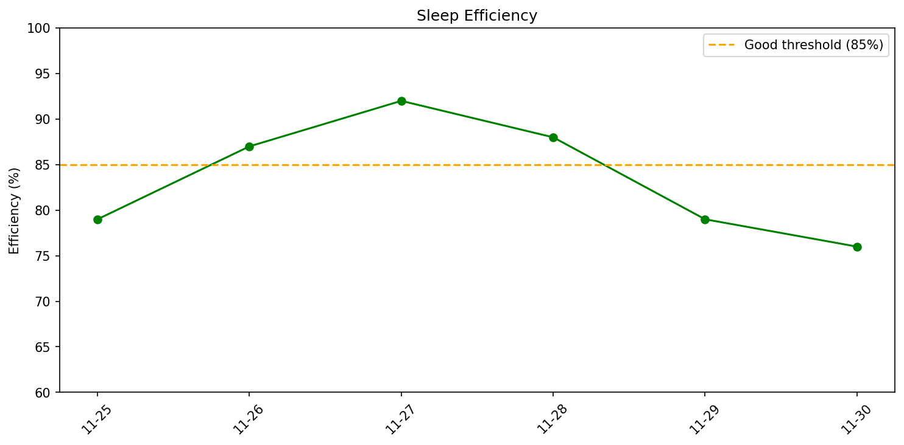
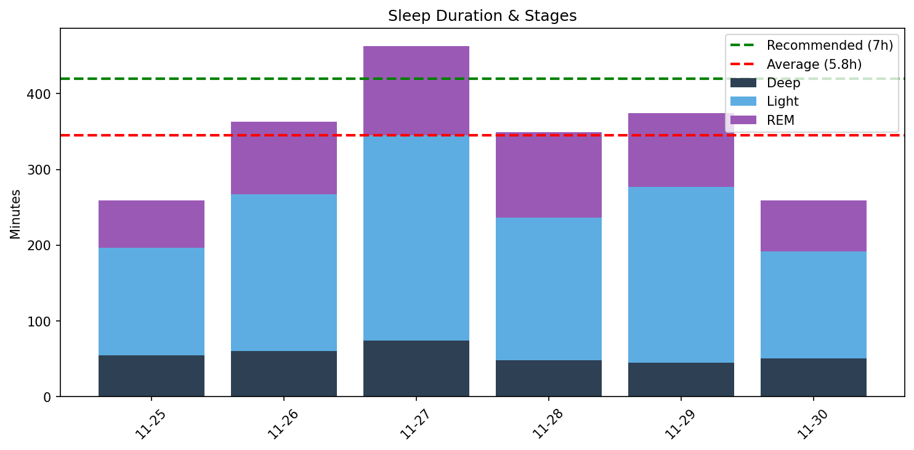

# 週次睡眠レポート

- **生成日時**: 2025-12-02 18:29:56
- **対象期間**: 2025-11-25 ～ 2025-11-30
- **データ日数**: 6日分

---

## 今週のサマリー

| 指標 | 値 |
|------|-----|
| ベッド時間合計 | 41.0時間 |
| 睡眠時間合計 | 34.5時間 |
| 睡眠負債 | **-7.5時間（不足）** |
| 目標達成 | 1/6日（7時間以上） |

> 睡眠負債は推奨7時間との差の累積です。

---

## 睡眠効率

| 指標 | 値 |
|------|-----|
| 平均効率 | **83.5%** |
| 最低 | 76% |
| 最高 | 92% |

> 85%以上が良好な睡眠効率とされています。

---

## 就寝・起床時刻

| 指標 | 就寝 | 起床 |
|------|------|------|
| 平均 | **23:15** | **06:05** |
| 最早 | 22:05 | 05:33 |
| 最遅 | 00:06 | 06:30 |
| ばらつき | ±48分 | ±23分 |
| 入眠/起床後 | 24分 | 18分 |

> 入眠潜時は就寝から眠りにつくまで、起床後は目覚めてからベッドを出るまでの時間。

---

## 睡眠時間・ステージ推移

- 緑の破線: 推奨睡眠時間（7時間）
- 赤の破線: 今週の平均睡眠時間

### 睡眠時間

| 指標 | 値 |
|------|-----|
| 平均 | **5.8時間** (345分) |
| 最短〜最長 | 4.3 〜 7.7時間 |
| 標準偏差 | 1.3時間 |

### 睡眠ステージ（平均）

| ステージ | 時間 | 割合 | 回数 | 推奨範囲 |
|----------|------|------|------|----------|
| 深い睡眠 | 56分 | 16.1% | 5回 | 13-23% |
| 浅い睡眠 | 197分 | 57.1% | 21回 | 45-55% |
| レム睡眠 | 92分 | 26.7% | 7回 | 20-25% |
| 覚醒 | 65分 | - | - | - |

---

## 日別サマリー

| 日付    | 就寝    | 入眠   | 起床    | 起後   | 睡眠   | 効率   | 深い   | 浅い   | レム   | 覚醒      |
|:------|:------|:-----|:------|:-----|:-----|:-----|:-----|:-----|:-----|:--------|
| 11-25 | 00:06 | 41分  | 05:33 | 4分   | 4.3h | 79%  | 55分  | 142分 | 62分  | 68分/14回 |
| 11-26 | 23:05 | 7分   | 06:04 | 16分  | 6.1h | 87%  | 60分  | 207分 | 96分  | 55分/18回 |
| 11-27 | 22:05 | 18分  | 06:30 | 4分   | 7.7h | 92%  | 74分  | 271分 | 118分 | 41分/16回 |
| 11-28 | 23:35 | 12分  | 06:11 | 21分  | 5.8h | 88%  | 48分  | 188分 | 113分 | 47分/15回 |
| 11-29 | 22:38 | 50分  | 06:30 | 36分  | 6.2h | 79%  | 45分  | 232分 | 97分  | 97分/12回 |
| 11-30 | 00:02 | 14分  | 05:45 | 28分  | 4.3h | 76%  | 51分  | 141分 | 67分  | 83分/20回 |

---

## 睡眠ステージ タイムライン

各日の睡眠ステージの推移を可視化しています。

**凡例**:
- 🟠 オレンジ: 覚醒（Wake）
- 🟣 紫: レム睡眠（REM）
- 🔵 水色: 浅い睡眠（Light）
- 🔷 濃紺: 深い睡眠（Deep）
