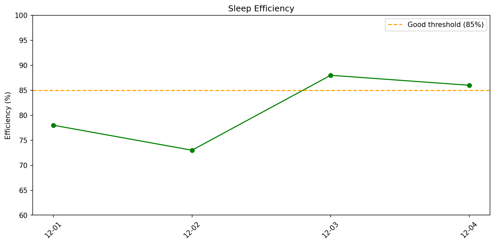

# 週次睡眠レポート

- **生成日時**: 2025-12-03 18:40:45
- **対象期間**: 2025-12-01 ～ 2025-12-03
- **データ日数**: 3日分

---

## 今週のサマリー

| 指標 | 値 |
|------|-----|
| ベッド時間合計 | 22.4時間 |
| 睡眠時間合計 | 17.9時間 |
| 睡眠負債 | **-3.1時間（不足）** |
| 目標達成 | 0/3日（7時間以上） |

> 睡眠負債は推奨7時間との差の累積です。

---

## 睡眠効率

| 指標 | 値 |
|------|-----|
| 平均効率 | **79.7%** |
| 最低 | 73% |
| 最高 | 88% |

> 85%以上が良好な睡眠効率とされています。

---

## 就寝・起床時刻

| 指標 | 就寝 | 起床 |
|------|------|------|
| 平均 | **23:02** | **06:31** |
| 最早 | 22:33 | 06:25 |
| 最遅 | 23:48 | 06:36 |
| ばらつき | ±40分 | ±6分 |
| 入眠/起床後 | 30分 | 20分 |

> 入眠潜時は就寝から眠りにつくまで、起床後は目覚めてからベッドを出るまでの時間。

---

## 睡眠時間・ステージ推移

- 緑の破線: 推奨睡眠時間（7時間）
- 赤の破線: 今週の平均睡眠時間

### 睡眠時間

| 指標 | 値 |
|------|-----|
| 平均 | **6.0時間** (357分) |
| 最短〜最長 | 5.3 〜 6.7時間 |
| 標準偏差 | 0.7時間 |

### 睡眠ステージ（平均）

| ステージ | 時間 | 割合 | 回数 | 推奨範囲 |
|----------|------|------|------|----------|
| 深い睡眠 | 53分 | 14.8% | 9回 | 13-23% |
| 浅い睡眠 | 215分 | 60.1% | 28回 | 45-55% |
| レム睡眠 | 89分 | 24.8% | 10回 | 20-25% |
| 覚醒 | 91分 | - | - | - |

---

## 日別サマリー

| 日付    | 就寝    | 入眠   | 起床    | 起後   | 睡眠   | 効率   | 深い   | 浅い   | レム   | 覚醒       |
|:------|:------|:-----|:------|:-----|:-----|:-----|:-----|:-----|:-----|:---------|
| 12-01 | 23:48 | 18分  | 06:36 | 18分  | 5.3h | 78%  | 61分  | 185分 | 70分  | 90分/21回  |
| 12-02 | 22:33 | 64分  | 06:33 | 25分  | 5.8h | 73%  | 35分  | 231分 | 84分  | 128分/22回 |
| 12-03 | 22:46 | 6分   | 06:25 | 18分  | 6.7h | 88%  | 62分  | 228分 | 112分 | 56分/18回  |

---

## 睡眠ステージ タイムライン

各日の睡眠ステージの推移を可視化しています。

**凡例**:
- 🟠 オレンジ: 覚醒（Wake）
- 🟣 紫: レム睡眠（REM）
- 🔵 水色: 浅い睡眠（Light）
- 🔷 濃紺: 深い睡眠（Deep）

