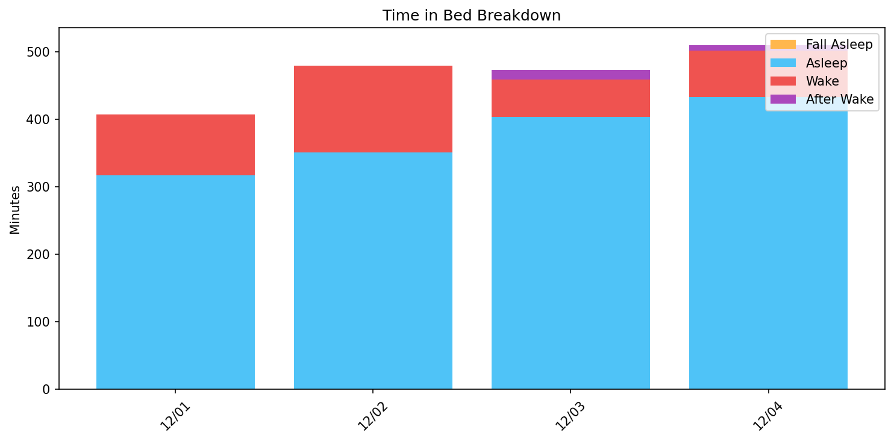
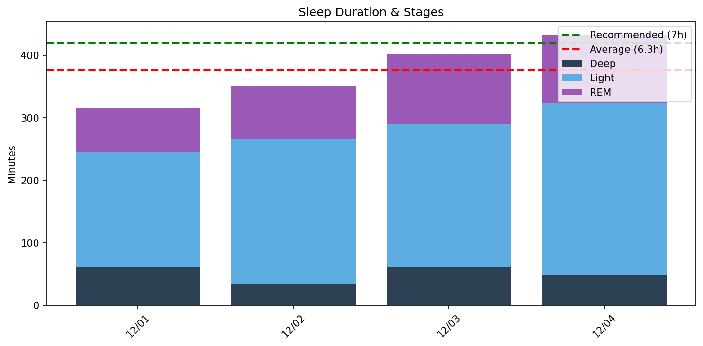
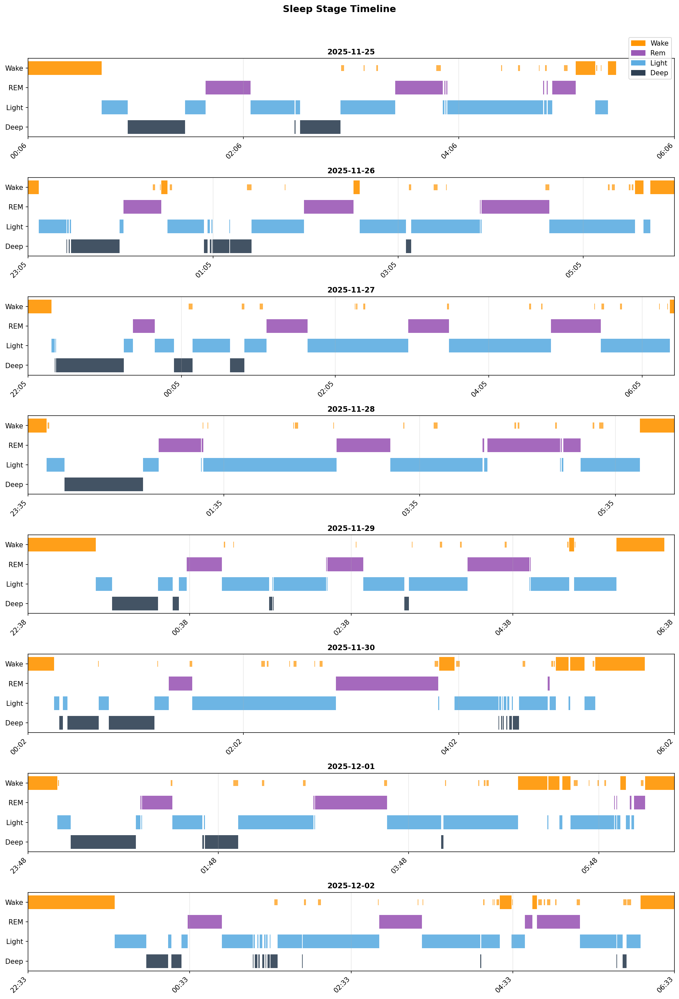

# 日次睡眠レポート

- **生成日時**: 2025-12-04 19:32:10
- **対象期間**: 2025-12-01 ～ 2025-12-04
- **データ日数**: 4日分

---

## サマリー

| 指標 | 値 |
|------|-----|
| ベッド時間合計 | 30.8時間 |
| 睡眠時間合計 | 25.1時間 |
| 睡眠負債 | **-2.9時間（不足）** |
| 目標達成 | 1/4日（7時間以上） |

> 睡眠負債は推奨7時間との差の累積です。

---

## Time in Bed分析

> ベッド時間の使い方を分析。効率 = 睡眠 / ベッド × 100。85%以上が良好。

| 指標 | 値 |
|------|-----|
| 平均効率 | **81.2%** |
| 最低〜最高 | 73% 〜 88% |
| 平均入眠 | 24分 |
| 平均起床後 | 18分 |

| 日付    | 効率   | 睡眠   | ベッド   | 入眠   | 起後   | 覚醒   | 回数   |
|:------|:-----|:-----|:------|:-----|:-----|:-----|:-----|
| 12/01 | 78%  | 5.3h | 6.8h  | 18分  | 18分  | 90分  | 21回  |
| 12/02 | 73%  | 5.8h | 8.0h  | 64分  | 25分  | 128分 | 22回  |
| 12/03 | 88%  | 6.7h | 7.7h  | 6分   | 18分  | 56分  | 18回  |
| 12/04 | 86%  | 7.2h | 8.4h  | 6分   | 12分  | 69分  | 22回  |

---

## Total Sleep Time分析

> 睡眠時間の質を分析。各ステージのバランスを確認。

### 睡眠時間

| 指標 | 値 |
|------|-----|
| 平均 | **6.3時間** (376分) |
| 最短〜最長 | 5.3 〜 7.2時間 |
| 標準偏差 | 0.9時間 |

### 睡眠ステージ（平均）

| ステージ | 時間 | 割合 | 回数 | 推奨範囲 |
|----------|------|------|------|----------|
| 深い睡眠 | 52分 | 13.8% | 7回 | 13-23% |
| 浅い睡眠 | 230分 | 61.1% | 28回 | 45-55% |
| レム睡眠 | 94分 | 24.9% | 10回 | 20-25% |
| 覚醒 | 86分 | - | - | - |

| 日付    | 睡眠   | 深い   | 浅い   | レム   |
|:------|:-----|:-----|:-----|:-----|
| 12/01 | 5.3h | 61分  | 185分 | 70分  |
| 12/02 | 5.8h | 35分  | 231分 | 84分  |
| 12/03 | 6.7h | 62分  | 228分 | 112分 |
| 12/04 | 7.2h | 49分  | 275分 | 108分 |

### 睡眠ステージ タイムライン

- 🟠 覚醒 / 🟣 レム / 🔵 浅い / 🔷 深い

---

## 就寝・起床時刻

> 睡眠リズムの規則性を分析。ばらつきが大きいと社会的時差ボケの原因に。

| 指標 | 就寝 | 起床 |
|------|------|------|
| 平均 | **22:49** | **06:31** |
| 最早 | 22:11 | 06:25 |
| 最遅 | 23:48 | 06:36 |
| ばらつき | ±42分 | ±5分 |

| 日付    | 就寝    | 起床    |
|:------|:------|:------|
| 12/01 | 23:48 | 06:36 |
| 12/02 | 22:33 | 06:33 |
| 12/03 | 22:46 | 06:25 |
| 12/04 | 22:11 | 06:33 |

---

## 睡眠サイクル分析

> 睡眠は約90分のサイクルで構成。深い睡眠は前半、REMは後半に集中するのが理想。

### サイクル構造の質

| 指標 | 平均値 | 正常範囲 |
|------|--------|----------|
| サイクル数 | 3.8回 | 3-5回 |
| サイクル長 | 107分 | 90分前後 |
| REM間隔 | 117分 | 90分前後 |
| 深い睡眠潜時 | 19分 | 15-30分 |
| REM潜時 | 54分 | 60-90分 |
| 前半の深い睡眠 | 89% | 70-80%以上 |

### 日別サイクル

| 日付    |   サイクル数 |   平均長 |   REM間隔 |   深い潜時 |   REM潜時 |   前半深い(%) |
|:------|--------:|------:|--------:|-------:|--------:|----------:|
| 12/01 |       3 |   124 |     149 |      8 |      52 |        98 |
| 12/02 |       4 |    86 |      86 |     24 |      54 |        99 |
| 12/03 |       4 |   102 |     110 |     25 |      50 |        60 |
| 12/04 |       4 |   116 |     123 |     18 |      62 |       100 |

### REM開始時刻（夢想起用）

> 入眠からの経過時間。夢を覚えて起きたい場合、REM中に起床すると夢想起率が高い。

| 日付    |   REM1 |   REM2 |   REM3 | REM4   | 就寝    | REM1時   | REM2時   | REM3時   | REM4時   |
|:------|-------:|-------:|-------:|:-------|:------|:--------|:--------|:--------|:--------|
| 12/01 |     71 |    180 |    369 | -      | 23:48 | 00:59   | 02:48   | 05:58   | -       |
| 12/02 |    118 |    261 |    369 | 378    | 22:33 | 00:32   | 02:54   | 04:42   | 04:51   |
| 12/03 |     56 |    169 |    307 | 387    | 22:46 | 23:42   | 01:35   | 03:53   | 05:13   |
| 12/04 |     67 |     96 |    309 | 435    | 22:11 | 23:18   | 23:47   | 03:20   | 05:26   |
